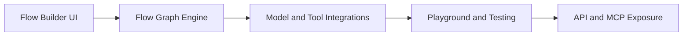
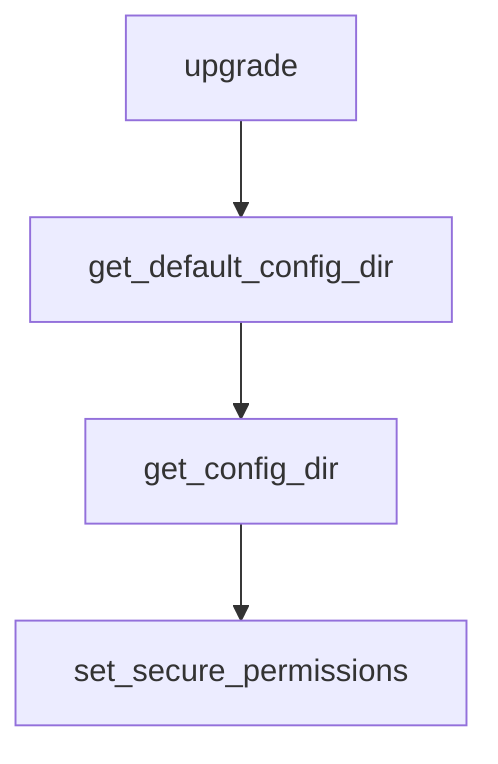

# Chapter 2: Platform Architecture

Welcome to **Chapter 2: Platform Architecture**. In this part of **Langflow Tutorial: Visual AI Agent and Workflow Platform**, you will build an intuitive mental model first, then move into concrete implementation details and practical production tradeoffs.


Langflow combines a visual editor, execution runtime, and deployment surfaces in one platform.

## Architecture View


```mermaid
flowchart LR
    A[Flow Builder UI] --> B[Flow Graph Engine]
    B --> C[Model and Tool Integrations]
    C --> D[Playground and Testing]
    D --> E[API and MCP Exposure]
```

## Core Layers

| Layer | Purpose |
|:------|:--------|
| visual authoring | rapid flow composition and iteration |
| flow runtime | executes node graph with state |
| integrations | models, vector stores, tool connectors |
| deployment surfaces | API endpoints and MCP server exposure |

## Source References

- [Langflow Docs](https://docs.langflow.org/)
- [Langflow Repository](https://github.com/langflow-ai/langflow)

## Summary

You now understand where to place design, logic, and deployment concerns in Langflow.

Next: [Chapter 3: Visual Flow Builder](03-visual-flow-builder.md)

## Depth Expansion Playbook

## Source Code Walkthrough

### `scripts/generate_migration.py`

The `upgrade` function in [`scripts/generate_migration.py`](https://github.com/langflow-ai/langflow/blob/HEAD/scripts/generate_migration.py) handles a key part of this chapter's functionality:

```py


def upgrade() -> None:
    """
    EXPAND PHASE: Add new schema elements (backward compatible)
    - All new columns must be nullable or have defaults
    - No breaking changes to existing schema
    - Services using old schema continue to work
    """
    bind = op.get_bind()
    inspector = inspect(bind)

    # Get existing columns for idempotency
        columns = [col['name'] for col in inspector.get_columns('{table_name}')]
    }

    # Add new nullable column (always check existence first)
    if '{column_name}' not in columns:
        op.add_column('{table_name}',
            sa.Column('{column_name}', sa.{column_type}(), nullable=True{default_value})
        )

        print(f"✅ Added column '{column_name}' to table '{table_name}'")

        # Optional: Add index for performance
        # op.create_index('ix_{table_name}_{column_name}', '{table_name}', ['{column_name}'])
    else:
        print(f"⏭️  Column '{column_name}' already exists in table '{table_name}'")

    # Verify the change
    result = bind.execute(text(
        "SELECT COUNT(*) as cnt FROM {table_name}"
```

This function is important because it defines how Langflow Tutorial: Visual AI Agent and Workflow Platform implements the patterns covered in this chapter.

### `scripts/migrate_secret_key.py`

The `get_default_config_dir` function in [`scripts/migrate_secret_key.py`](https://github.com/langflow-ai/langflow/blob/HEAD/scripts/migrate_secret_key.py) handles a key part of this chapter's functionality:

```py


def get_default_config_dir() -> Path:
    """Get the default Langflow config directory using platformdirs."""
    return Path(user_cache_dir("langflow", "langflow"))


def get_config_dir() -> Path:
    """Get the Langflow config directory from environment or default."""
    config_dir = os.environ.get("LANGFLOW_CONFIG_DIR")
    if config_dir:
        return Path(config_dir)
    return get_default_config_dir()


def set_secure_permissions(file_path: Path) -> None:
    """Set restrictive permissions on a file (600 on Unix)."""
    if platform.system() in {"Linux", "Darwin"}:
        file_path.chmod(0o600)
    elif platform.system() == "Windows":
        try:
            import win32api
            import win32con
            import win32security

            user, _, _ = win32security.LookupAccountName("", win32api.GetUserName())
            sd = win32security.GetFileSecurity(str(file_path), win32security.DACL_SECURITY_INFORMATION)
            dacl = win32security.ACL()
            dacl.AddAccessAllowedAce(
                win32security.ACL_REVISION,
                win32con.GENERIC_READ | win32con.GENERIC_WRITE,
                user,
```

This function is important because it defines how Langflow Tutorial: Visual AI Agent and Workflow Platform implements the patterns covered in this chapter.

### `scripts/migrate_secret_key.py`

The `get_config_dir` function in [`scripts/migrate_secret_key.py`](https://github.com/langflow-ai/langflow/blob/HEAD/scripts/migrate_secret_key.py) handles a key part of this chapter's functionality:

```py


def get_config_dir() -> Path:
    """Get the Langflow config directory from environment or default."""
    config_dir = os.environ.get("LANGFLOW_CONFIG_DIR")
    if config_dir:
        return Path(config_dir)
    return get_default_config_dir()


def set_secure_permissions(file_path: Path) -> None:
    """Set restrictive permissions on a file (600 on Unix)."""
    if platform.system() in {"Linux", "Darwin"}:
        file_path.chmod(0o600)
    elif platform.system() == "Windows":
        try:
            import win32api
            import win32con
            import win32security

            user, _, _ = win32security.LookupAccountName("", win32api.GetUserName())
            sd = win32security.GetFileSecurity(str(file_path), win32security.DACL_SECURITY_INFORMATION)
            dacl = win32security.ACL()
            dacl.AddAccessAllowedAce(
                win32security.ACL_REVISION,
                win32con.GENERIC_READ | win32con.GENERIC_WRITE,
                user,
            )
            sd.SetSecurityDescriptorDacl(1, dacl, 0)
            win32security.SetFileSecurity(str(file_path), win32security.DACL_SECURITY_INFORMATION, sd)
        except ImportError:
            print("Warning: Could not set secure permissions on Windows (pywin32 not installed)")
```

This function is important because it defines how Langflow Tutorial: Visual AI Agent and Workflow Platform implements the patterns covered in this chapter.

### `scripts/migrate_secret_key.py`

The `set_secure_permissions` function in [`scripts/migrate_secret_key.py`](https://github.com/langflow-ai/langflow/blob/HEAD/scripts/migrate_secret_key.py) handles a key part of this chapter's functionality:

```py


def set_secure_permissions(file_path: Path) -> None:
    """Set restrictive permissions on a file (600 on Unix)."""
    if platform.system() in {"Linux", "Darwin"}:
        file_path.chmod(0o600)
    elif platform.system() == "Windows":
        try:
            import win32api
            import win32con
            import win32security

            user, _, _ = win32security.LookupAccountName("", win32api.GetUserName())
            sd = win32security.GetFileSecurity(str(file_path), win32security.DACL_SECURITY_INFORMATION)
            dacl = win32security.ACL()
            dacl.AddAccessAllowedAce(
                win32security.ACL_REVISION,
                win32con.GENERIC_READ | win32con.GENERIC_WRITE,
                user,
            )
            sd.SetSecurityDescriptorDacl(1, dacl, 0)
            win32security.SetFileSecurity(str(file_path), win32security.DACL_SECURITY_INFORMATION, sd)
        except ImportError:
            print("Warning: Could not set secure permissions on Windows (pywin32 not installed)")


def read_secret_key_from_file(config_dir: Path) -> str | None:
    """Read the secret key from the config directory."""
    secret_file = config_dir / "secret_key"
    if secret_file.exists():
        return secret_file.read_text(encoding="utf-8").strip()
    return None
```

This function is important because it defines how Langflow Tutorial: Visual AI Agent and Workflow Platform implements the patterns covered in this chapter.


## How These Components Connect


```mermaid
flowchart TD
    A[upgrade]
    B[get_default_config_dir]
    C[get_config_dir]
    D[set_secure_permissions]
    A --> B
    B --> C
    C --> D
```
