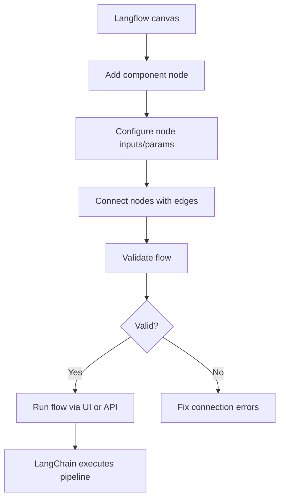

# Chapter 3: Visual Flow Builder

Welcome to **Chapter 3: Visual Flow Builder**. In this part of **Langflow Tutorial: Visual AI Agent and Workflow Platform**, you will build an intuitive mental model first, then move into concrete implementation details and practical production tradeoffs.

Visual composition is Langflow's primary productivity surface. Good graph discipline prevents long-term maintenance pain.

## Builder Practices

| Practice | Benefit |
|:---------|:--------|
| modular subflows | easier reuse and testing |
| clear node naming | faster debugging and onboarding |
| explicit input/output contracts | fewer hidden coupling bugs |
| small incremental edits | safer iteration cycles |

## Common Pitfalls

- overloading single graphs with too many concerns
- weak naming conventions for nodes and outputs
- no baseline test prompts for regression checks

## Source References

- [Langflow Docs](https://docs.langflow.org/)

## Summary

You now have practical rules for building maintainable visual flow graphs.

Next: [Chapter 4: Agent Workflows and Orchestration](04-agent-workflows-and-orchestration.md)

## How These Components Connect

