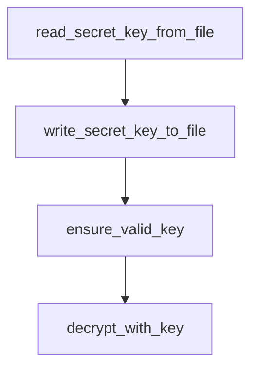

# Chapter 3: Visual Flow Builder

Welcome to **Chapter 3: Visual Flow Builder**. In this part of **Langflow Tutorial: Visual AI Agent and Workflow Platform**, you will build an intuitive mental model first, then move into concrete implementation details and practical production tradeoffs.


Visual composition is Langflow's primary productivity surface. Good graph discipline prevents long-term maintenance pain.

## Builder Practices

| Practice | Benefit |
|:---------|:--------|
| modular subflows | easier reuse and testing |
| clear node naming | faster debugging and onboarding |
| explicit input/output contracts | fewer hidden coupling bugs |
| small incremental edits | safer iteration cycles |

## Common Pitfalls

- overloading single graphs with too many concerns
- weak naming conventions for nodes and outputs
- no baseline test prompts for regression checks

## Source References

- [Langflow Docs](https://docs.langflow.org/)

## Summary

You now have practical rules for building maintainable visual flow graphs.

Next: [Chapter 4: Agent Workflows and Orchestration](04-agent-workflows-and-orchestration.md)

## Depth Expansion Playbook

## Source Code Walkthrough

### `scripts/migrate_secret_key.py`

The `read_secret_key_from_file` function in [`scripts/migrate_secret_key.py`](https://github.com/langflow-ai/langflow/blob/HEAD/scripts/migrate_secret_key.py) handles a key part of this chapter's functionality:

```py


def read_secret_key_from_file(config_dir: Path) -> str | None:
    """Read the secret key from the config directory."""
    secret_file = config_dir / "secret_key"
    if secret_file.exists():
        return secret_file.read_text(encoding="utf-8").strip()
    return None


def write_secret_key_to_file(config_dir: Path, key: str, filename: str = "secret_key") -> None:
    """Write a secret key to file with secure permissions."""
    config_dir.mkdir(parents=True, exist_ok=True)
    secret_file = config_dir / filename
    secret_file.write_text(key, encoding="utf-8")
    set_secure_permissions(secret_file)


def ensure_valid_key(s: str) -> bytes:
    """Convert a secret key string to valid Fernet key bytes.

    For keys shorter than MINIMUM_KEY_LENGTH (32), generates a deterministic
    key by seeding random with the input string. For longer keys, pads with
    '=' to ensure valid base64 encoding.

    NOTE: This function is duplicated from langflow.services.auth.utils.ensure_valid_key
    to keep the migration script self-contained (can run without full Langflow installation).
    Keep in sync if encryption logic changes.
    """
    if len(s) < MINIMUM_KEY_LENGTH:
        random.seed(s)
        key = bytes(random.getrandbits(8) for _ in range(32))
```

This function is important because it defines how Langflow Tutorial: Visual AI Agent and Workflow Platform implements the patterns covered in this chapter.

### `scripts/migrate_secret_key.py`

The `write_secret_key_to_file` function in [`scripts/migrate_secret_key.py`](https://github.com/langflow-ai/langflow/blob/HEAD/scripts/migrate_secret_key.py) handles a key part of this chapter's functionality:

```py


def write_secret_key_to_file(config_dir: Path, key: str, filename: str = "secret_key") -> None:
    """Write a secret key to file with secure permissions."""
    config_dir.mkdir(parents=True, exist_ok=True)
    secret_file = config_dir / filename
    secret_file.write_text(key, encoding="utf-8")
    set_secure_permissions(secret_file)


def ensure_valid_key(s: str) -> bytes:
    """Convert a secret key string to valid Fernet key bytes.

    For keys shorter than MINIMUM_KEY_LENGTH (32), generates a deterministic
    key by seeding random with the input string. For longer keys, pads with
    '=' to ensure valid base64 encoding.

    NOTE: This function is duplicated from langflow.services.auth.utils.ensure_valid_key
    to keep the migration script self-contained (can run without full Langflow installation).
    Keep in sync if encryption logic changes.
    """
    if len(s) < MINIMUM_KEY_LENGTH:
        random.seed(s)
        key = bytes(random.getrandbits(8) for _ in range(32))
        return base64.urlsafe_b64encode(key)
    padding_needed = 4 - len(s) % 4
    return (s + "=" * padding_needed).encode()


def decrypt_with_key(encrypted: str, key: str) -> str:
    """Decrypt data with the given key."""
    fernet = Fernet(ensure_valid_key(key))
```

This function is important because it defines how Langflow Tutorial: Visual AI Agent and Workflow Platform implements the patterns covered in this chapter.

### `scripts/migrate_secret_key.py`

The `ensure_valid_key` function in [`scripts/migrate_secret_key.py`](https://github.com/langflow-ai/langflow/blob/HEAD/scripts/migrate_secret_key.py) handles a key part of this chapter's functionality:

```py


def ensure_valid_key(s: str) -> bytes:
    """Convert a secret key string to valid Fernet key bytes.

    For keys shorter than MINIMUM_KEY_LENGTH (32), generates a deterministic
    key by seeding random with the input string. For longer keys, pads with
    '=' to ensure valid base64 encoding.

    NOTE: This function is duplicated from langflow.services.auth.utils.ensure_valid_key
    to keep the migration script self-contained (can run without full Langflow installation).
    Keep in sync if encryption logic changes.
    """
    if len(s) < MINIMUM_KEY_LENGTH:
        random.seed(s)
        key = bytes(random.getrandbits(8) for _ in range(32))
        return base64.urlsafe_b64encode(key)
    padding_needed = 4 - len(s) % 4
    return (s + "=" * padding_needed).encode()


def decrypt_with_key(encrypted: str, key: str) -> str:
    """Decrypt data with the given key."""
    fernet = Fernet(ensure_valid_key(key))
    return fernet.decrypt(encrypted.encode()).decode()


def encrypt_with_key(plaintext: str, key: str) -> str:
    """Encrypt data with the given key."""
    fernet = Fernet(ensure_valid_key(key))
    return fernet.encrypt(plaintext.encode()).decode()

```

This function is important because it defines how Langflow Tutorial: Visual AI Agent and Workflow Platform implements the patterns covered in this chapter.

### `scripts/migrate_secret_key.py`

The `decrypt_with_key` function in [`scripts/migrate_secret_key.py`](https://github.com/langflow-ai/langflow/blob/HEAD/scripts/migrate_secret_key.py) handles a key part of this chapter's functionality:

```py


def decrypt_with_key(encrypted: str, key: str) -> str:
    """Decrypt data with the given key."""
    fernet = Fernet(ensure_valid_key(key))
    return fernet.decrypt(encrypted.encode()).decode()


def encrypt_with_key(plaintext: str, key: str) -> str:
    """Encrypt data with the given key."""
    fernet = Fernet(ensure_valid_key(key))
    return fernet.encrypt(plaintext.encode()).decode()


def migrate_value(encrypted: str, old_key: str, new_key: str) -> str | None:
    """Decrypt with old key and re-encrypt with new key.

    Returns:
        The re-encrypted value, or None if decryption fails (invalid key or corrupted data).
    """
    try:
        plaintext = decrypt_with_key(encrypted, old_key)
        return encrypt_with_key(plaintext, new_key)
    except InvalidToken:
        return None


def migrate_auth_settings(auth_settings: dict, old_key: str, new_key: str) -> tuple[dict, list[str]]:
    """Re-encrypt sensitive fields in auth_settings dict.

    Returns:
        Tuple of (migrated_settings, failed_fields) where failed_fields contains
```

This function is important because it defines how Langflow Tutorial: Visual AI Agent and Workflow Platform implements the patterns covered in this chapter.


## How These Components Connect


