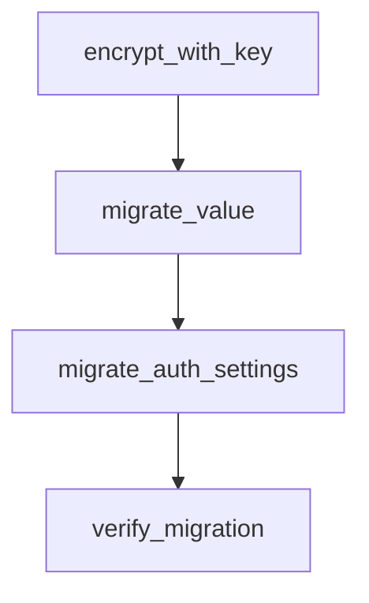

# Chapter 4: Agent Workflows and Orchestration

Welcome to **Chapter 4: Agent Workflows and Orchestration**. In this part of **Langflow Tutorial: Visual AI Agent and Workflow Platform**, you will build an intuitive mental model first, then move into concrete implementation details and practical production tradeoffs.


Langflow supports multi-step orchestration patterns for agentic systems that require tool usage, branching, and retrieval.

## Orchestration Model

1. capture user intent
2. route through model/tool/retrieval nodes
3. execute conditional branches
4. synthesize and validate result

## Pattern Guidance

- keep deterministic sections explicit
- isolate high-latency tool calls behind clear boundaries
- track failure and retry behavior at node level

## Source References

- [Langflow Feature Overview](https://github.com/langflow-ai/langflow)

## Summary

You now know how to structure robust Langflow orchestration beyond simple demo chains.

Next: [Chapter 5: API and MCP Deployment](05-api-and-mcp-deployment.md)

## Depth Expansion Playbook

## Source Code Walkthrough

### `scripts/migrate_secret_key.py`

The `encrypt_with_key` function in [`scripts/migrate_secret_key.py`](https://github.com/langflow-ai/langflow/blob/HEAD/scripts/migrate_secret_key.py) handles a key part of this chapter's functionality:

```py


def encrypt_with_key(plaintext: str, key: str) -> str:
    """Encrypt data with the given key."""
    fernet = Fernet(ensure_valid_key(key))
    return fernet.encrypt(plaintext.encode()).decode()


def migrate_value(encrypted: str, old_key: str, new_key: str) -> str | None:
    """Decrypt with old key and re-encrypt with new key.

    Returns:
        The re-encrypted value, or None if decryption fails (invalid key or corrupted data).
    """
    try:
        plaintext = decrypt_with_key(encrypted, old_key)
        return encrypt_with_key(plaintext, new_key)
    except InvalidToken:
        return None


def migrate_auth_settings(auth_settings: dict, old_key: str, new_key: str) -> tuple[dict, list[str]]:
    """Re-encrypt sensitive fields in auth_settings dict.

    Returns:
        Tuple of (migrated_settings, failed_fields) where failed_fields contains
        names of fields that could not be decrypted with the old key.
    """
    result = auth_settings.copy()
    failed_fields = []
    for field in SENSITIVE_AUTH_FIELDS:
        if result.get(field):
```

This function is important because it defines how Langflow Tutorial: Visual AI Agent and Workflow Platform implements the patterns covered in this chapter.

### `scripts/migrate_secret_key.py`

The `migrate_value` function in [`scripts/migrate_secret_key.py`](https://github.com/langflow-ai/langflow/blob/HEAD/scripts/migrate_secret_key.py) handles a key part of this chapter's functionality:

```py


def migrate_value(encrypted: str, old_key: str, new_key: str) -> str | None:
    """Decrypt with old key and re-encrypt with new key.

    Returns:
        The re-encrypted value, or None if decryption fails (invalid key or corrupted data).
    """
    try:
        plaintext = decrypt_with_key(encrypted, old_key)
        return encrypt_with_key(plaintext, new_key)
    except InvalidToken:
        return None


def migrate_auth_settings(auth_settings: dict, old_key: str, new_key: str) -> tuple[dict, list[str]]:
    """Re-encrypt sensitive fields in auth_settings dict.

    Returns:
        Tuple of (migrated_settings, failed_fields) where failed_fields contains
        names of fields that could not be decrypted with the old key.
    """
    result = auth_settings.copy()
    failed_fields = []
    for field in SENSITIVE_AUTH_FIELDS:
        if result.get(field):
            new_value = migrate_value(result[field], old_key, new_key)
            if new_value:
                result[field] = new_value
            else:
                failed_fields.append(field)
    return result, failed_fields
```

This function is important because it defines how Langflow Tutorial: Visual AI Agent and Workflow Platform implements the patterns covered in this chapter.

### `scripts/migrate_secret_key.py`

The `migrate_auth_settings` function in [`scripts/migrate_secret_key.py`](https://github.com/langflow-ai/langflow/blob/HEAD/scripts/migrate_secret_key.py) handles a key part of this chapter's functionality:

```py


def migrate_auth_settings(auth_settings: dict, old_key: str, new_key: str) -> tuple[dict, list[str]]:
    """Re-encrypt sensitive fields in auth_settings dict.

    Returns:
        Tuple of (migrated_settings, failed_fields) where failed_fields contains
        names of fields that could not be decrypted with the old key.
    """
    result = auth_settings.copy()
    failed_fields = []
    for field in SENSITIVE_AUTH_FIELDS:
        if result.get(field):
            new_value = migrate_value(result[field], old_key, new_key)
            if new_value:
                result[field] = new_value
            else:
                failed_fields.append(field)
    return result, failed_fields


def verify_migration(conn, new_key: str) -> tuple[int, int]:
    """Verify migrated data can be decrypted with the new key.

    Samples records from each table and attempts decryption.

    Returns:
        Tuple of (verified_count, failed_count).
    """
    verified, failed = 0, 0

    # Verify user.store_api_key (sample up to 3)
```

This function is important because it defines how Langflow Tutorial: Visual AI Agent and Workflow Platform implements the patterns covered in this chapter.

### `scripts/migrate_secret_key.py`

The `verify_migration` function in [`scripts/migrate_secret_key.py`](https://github.com/langflow-ai/langflow/blob/HEAD/scripts/migrate_secret_key.py) handles a key part of this chapter's functionality:

```py


def verify_migration(conn, new_key: str) -> tuple[int, int]:
    """Verify migrated data can be decrypted with the new key.

    Samples records from each table and attempts decryption.

    Returns:
        Tuple of (verified_count, failed_count).
    """
    verified, failed = 0, 0

    # Verify user.store_api_key (sample up to 3)
    users = conn.execute(
        text('SELECT id, store_api_key FROM "user" WHERE store_api_key IS NOT NULL LIMIT 3')
    ).fetchall()
    for _, encrypted_key in users:
        try:
            decrypt_with_key(encrypted_key, new_key)
            verified += 1
        except InvalidToken:
            failed += 1

    # Verify variable.value (sample up to 3)
    variables = conn.execute(
        text("SELECT id, value FROM variable WHERE type = :type AND value IS NOT NULL LIMIT 3"),
        {"type": CREDENTIAL_TYPE},
    ).fetchall()
    for _, encrypted_value in variables:
        try:
            decrypt_with_key(encrypted_value, new_key)
            verified += 1
```

This function is important because it defines how Langflow Tutorial: Visual AI Agent and Workflow Platform implements the patterns covered in this chapter.


## How These Components Connect


