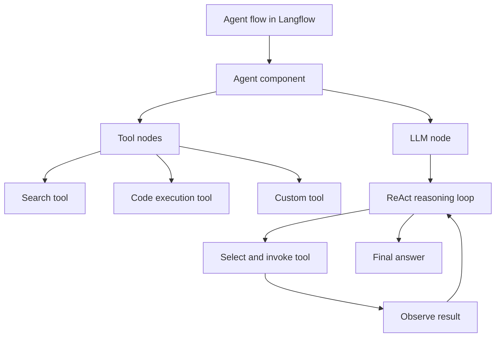

# Chapter 4: Agent Workflows and Orchestration

Welcome to **Chapter 4: Agent Workflows and Orchestration**. In this part of **Langflow Tutorial: Visual AI Agent and Workflow Platform**, you will build an intuitive mental model first, then move into concrete implementation details and practical production tradeoffs.

Langflow supports multi-step orchestration patterns for agentic systems that require tool usage, branching, and retrieval.

## Orchestration Model

1. capture user intent
2. route through model/tool/retrieval nodes
3. execute conditional branches
4. synthesize and validate result

## Pattern Guidance

- keep deterministic sections explicit
- isolate high-latency tool calls behind clear boundaries
- track failure and retry behavior at node level

## Source References

- [Langflow Feature Overview](https://github.com/langflow-ai/langflow)

## Summary

You now know how to structure robust Langflow orchestration beyond simple demo chains.

Next: [Chapter 5: API and MCP Deployment](05-api-and-mcp-deployment.md)

## How These Components Connect

