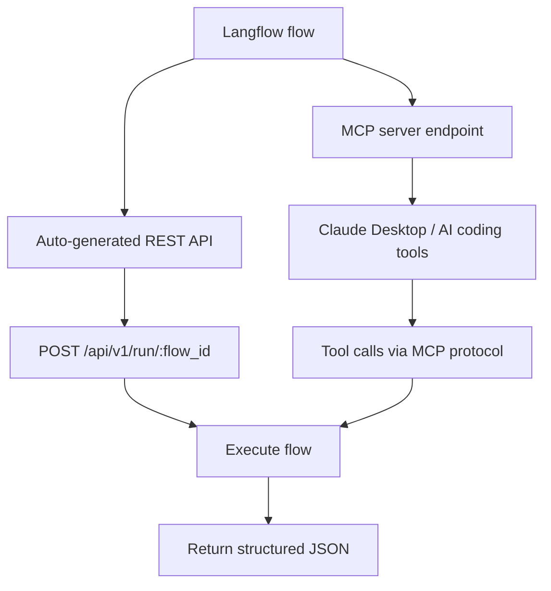

# Chapter 5: API and MCP Deployment

Welcome to **Chapter 5: API and MCP Deployment**. In this part of **Langflow Tutorial: Visual AI Agent and Workflow Platform**, you will build an intuitive mental model first, then move into concrete implementation details and practical production tradeoffs.

Langflow can expose workflows as APIs and MCP tools, making flows reusable across applications and agents.

## Deployment Surfaces

| Surface | Use Case |
|:--------|:---------|
| API endpoint | app/service integration |
| MCP server | tool interoperability for agent ecosystems |

## Deployment Checklist

- version flow definitions
- enforce auth and rate limits
- log invocation traces
- validate input/output schemas

## Source References

- [Langflow Deployment Overview](https://docs.langflow.org/deployment-overview)
- [Langflow README](https://github.com/langflow-ai/langflow)

## Summary

You now have a practical approach for publishing Langflow workflows as reusable runtime interfaces.

Next: [Chapter 6: Observability and Security](06-observability-and-security.md)

## How These Components Connect

