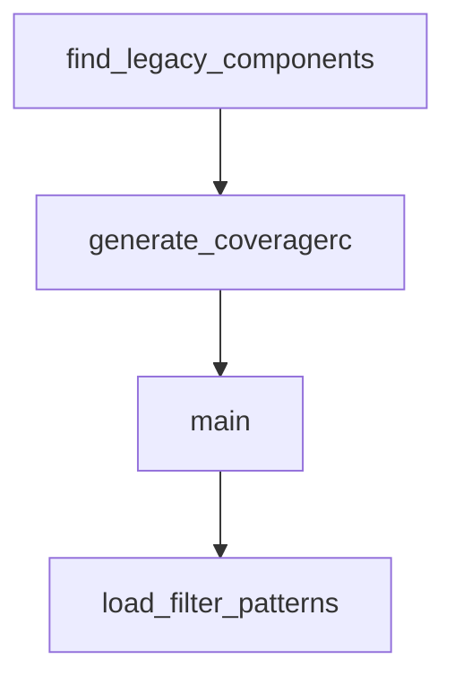

# Chapter 6: Observability and Security

Welcome to **Chapter 6: Observability and Security**. In this part of **Langflow Tutorial: Visual AI Agent and Workflow Platform**, you will build an intuitive mental model first, then move into concrete implementation details and practical production tradeoffs.


Langflow production usage requires strong observability and strict security boundaries.

## Security Baseline

- keep Langflow version current for advisory fixes
- use environment and secret segregation
- enforce endpoint auth for API/MCP surfaces
- restrict access to administrative control paths

## Observability Baseline

| Signal | Why It Matters |
|:-------|:---------------|
| flow success rate | quality and runtime stability |
| node latency | bottleneck diagnosis |
| tool error rate | integration health |
| auth failures | abuse and misconfiguration detection |

## Source References

- [Langflow Security Advisories](https://github.com/langflow-ai/langflow/security/advisories)
- [Langflow Security Policy](https://github.com/langflow-ai/langflow/blob/main/SECURITY.md)

## Summary

You now have a security and telemetry baseline for operating Langflow safely.

Next: [Chapter 7: Custom Components and Extensions](07-custom-components-and-extensions.md)

## Depth Expansion Playbook

## Source Code Walkthrough

### `scripts/generate_coverage_config.py`

The `find_legacy_components` function in [`scripts/generate_coverage_config.py`](https://github.com/langflow-ai/langflow/blob/HEAD/scripts/generate_coverage_config.py) handles a key part of this chapter's functionality:

```py


def find_legacy_components(backend_components_path: Path) -> set[str]:
    """Find Python files containing 'legacy = True'."""
    legacy_files = set()

    if not backend_components_path.exists():
        print(f"Warning: Backend components path not found: {backend_components_path}")
        return set()

    # Walk through all Python files in components directory
    for py_file in backend_components_path.rglob("*.py"):
        try:
            with py_file.open(encoding="utf-8") as f:
                content = f.read()

            # Check if file contains 'legacy = True'
            if re.search(r"\blegacy\s*=\s*True\b", content):
                # Get relative path from components directory
                rel_path = py_file.relative_to(backend_components_path)
                legacy_files.add(str(rel_path))

        except (UnicodeDecodeError, PermissionError) as e:
            print(f"Warning: Could not read {py_file}: {e}")
            continue

    print(f"Found {len(legacy_files)} legacy component files")
    return legacy_files


def generate_coveragerc(bundle_names: set[str], legacy_files: set[str], output_path: Path):
    """Generate .coveragerc file with omit patterns."""
```

This function is important because it defines how Langflow Tutorial: Visual AI Agent and Workflow Platform implements the patterns covered in this chapter.

### `scripts/generate_coverage_config.py`

The `generate_coveragerc` function in [`scripts/generate_coverage_config.py`](https://github.com/langflow-ai/langflow/blob/HEAD/scripts/generate_coverage_config.py) handles a key part of this chapter's functionality:

```py


def generate_coveragerc(bundle_names: set[str], legacy_files: set[str], output_path: Path):
    """Generate .coveragerc file with omit patterns."""
    # Base coveragerc content
    config_content = """# Auto-generated .coveragerc file
# Generated by scripts/generate_coverage_config.py
# Do not edit manually - changes will be overwritten

[run]
source = src/backend/base/langflow
omit =
    # Test files
    */tests/*
    */test_*
    */*test*

    # Migration files
    */alembic/*
    */migrations/*

    # Cache and build files
    */__pycache__/*
    */.*

    # Init files (typically just imports)
    */__init__.py

    # Deactivate Components
    */components/deactivated/*

"""
```

This function is important because it defines how Langflow Tutorial: Visual AI Agent and Workflow Platform implements the patterns covered in this chapter.

### `scripts/generate_coverage_config.py`

The `main` function in [`scripts/generate_coverage_config.py`](https://github.com/langflow-ai/langflow/blob/HEAD/scripts/generate_coverage_config.py) handles a key part of this chapter's functionality:

```py


def main():
    """Main function."""
    # Determine project root (script is in scripts/ directory)
    script_dir = Path(__file__).parent
    project_root = script_dir.parent

    # Paths
    frontend_path = project_root / "src" / "frontend"
    backend_components_path = project_root / "src" / "backend" / "base" / "langflow" / "components"
    output_path = project_root / "src" / "backend" / ".coveragerc"

    print(f"Project root: {project_root}")
    print(f"Frontend path: {frontend_path}")
    print(f"Backend components path: {backend_components_path}")
    print(f"Output path: {output_path}")
    print()

    # Extract bundled component names
    bundle_names = extract_sidebar_bundles(frontend_path)

    # Find legacy components
    legacy_files = find_legacy_components(backend_components_path)

    # Generate .coveragerc file
    generate_coveragerc(bundle_names, legacy_files, output_path)

    print("\nDone! You can now run backend tests with coverage using:")
    print("cd src/backend && python -m pytest --cov=src/backend/base/langflow --cov-config=.coveragerc")


```

This function is important because it defines how Langflow Tutorial: Visual AI Agent and Workflow Platform implements the patterns covered in this chapter.

### `scripts/check_changes_filter.py`

The `load_filter_patterns` function in [`scripts/check_changes_filter.py`](https://github.com/langflow-ai/langflow/blob/HEAD/scripts/check_changes_filter.py) handles a key part of this chapter's functionality:

```py


def load_filter_patterns(filter_file: Path) -> dict[str, list[str]]:
    """Load all patterns from the changes-filter.yaml file.

    Validates and normalizes the YAML structure to ensure it's a dict mapping
    str to list[str]. Handles top-level "filters" key if present.
    """
    with filter_file.open() as f:
        data = yaml.safe_load(f)

    # Handle empty or null file
    if data is None:
        return {}

    # If there's a top-level "filters" key, use that instead
    if isinstance(data, dict) and "filters" in data:
        data = data["filters"]

    # Ensure we have a dict
    if not isinstance(data, dict):
        msg = f"Expected dict at top level, got {type(data).__name__}"
        raise TypeError(msg)

    # Normalize and validate the structure
    result: dict[str, list[str]] = {}
    for key, value in data.items():
        # Validate key is a string
        if not isinstance(key, str):
            msg = f"Expected string key, got {type(key).__name__}: {key}"
            raise TypeError(msg)

```

This function is important because it defines how Langflow Tutorial: Visual AI Agent and Workflow Platform implements the patterns covered in this chapter.


## How These Components Connect


