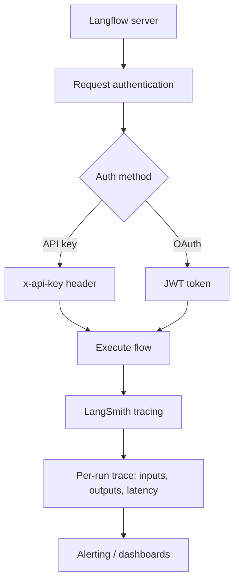

# Chapter 6: Observability and Security

Welcome to **Chapter 6: Observability and Security**. In this part of **Langflow Tutorial: Visual AI Agent and Workflow Platform**, you will build an intuitive mental model first, then move into concrete implementation details and practical production tradeoffs.

Langflow production usage requires strong observability and strict security boundaries.

## Security Baseline

- keep Langflow version current for advisory fixes
- use environment and secret segregation
- enforce endpoint auth for API/MCP surfaces
- restrict access to administrative control paths

## Observability Baseline

| Signal | Why It Matters |
|:-------|:---------------|
| flow success rate | quality and runtime stability |
| node latency | bottleneck diagnosis |
| tool error rate | integration health |
| auth failures | abuse and misconfiguration detection |

## Source References

- [Langflow Security Advisories](https://github.com/langflow-ai/langflow/security/advisories)
- [Langflow Security Policy](https://github.com/langflow-ai/langflow/blob/main/SECURITY.md)

## Summary

You now have a security and telemetry baseline for operating Langflow safely.

Next: [Chapter 7: Custom Components and Extensions](07-custom-components-and-extensions.md)

## How These Components Connect

