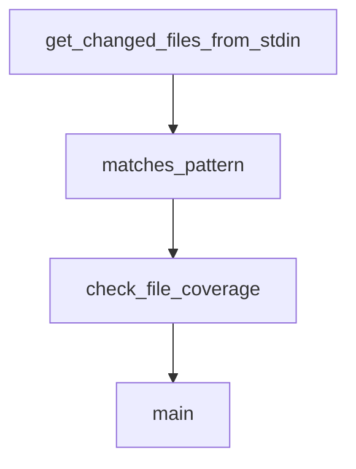

# Chapter 7: Custom Components and Extensions

Welcome to **Chapter 7: Custom Components and Extensions**. In this part of **Langflow Tutorial: Visual AI Agent and Workflow Platform**, you will build an intuitive mental model first, then move into concrete implementation details and practical production tradeoffs.


Langflow supports code-level extensibility so teams can encapsulate domain logic as reusable components.

## Extension Pattern

| Step | Outcome |
|:-----|:--------|
| define component contract | predictable integration |
| implement Python logic | domain-specific behavior |
| add tests | safer upgrades |
| document usage | team-level reuse |

## Quality Rules

- keep component inputs/outputs explicit
- avoid hidden global side effects
- version custom components for migration safety

## Source References

- [Langflow Repository](https://github.com/langflow-ai/langflow)
- [Langflow Docs](https://docs.langflow.org/)

## Summary

You now know how to extend Langflow without compromising maintainability.

Next: [Chapter 8: Production Operations](08-production-operations.md)

## Depth Expansion Playbook

## Source Code Walkthrough

### `scripts/check_changes_filter.py`

The `get_changed_files_from_stdin` function in [`scripts/check_changes_filter.py`](https://github.com/langflow-ai/langflow/blob/HEAD/scripts/check_changes_filter.py) handles a key part of this chapter's functionality:

```py


def get_changed_files_from_stdin() -> list[str]:
    """Get list of changed files from stdin (one per line), filtered to src/frontend only."""
    files = []
    for line in sys.stdin:
        stripped = line.strip()
        if stripped and stripped.startswith("src/frontend/"):
            files.append(stripped)
    return files


def matches_pattern(file_path: str, pattern: str) -> bool:
    """Check if a file matches a glob pattern using pathlib semantics.

    Supports ** and a simple one-level {a,b} brace expansion.
    """
    import re
    from pathlib import PurePosixPath

    # Normalize
    file_path = file_path.lstrip("./").replace("\\", "/")
    pattern = pattern.lstrip("./")

    # Simple one-level brace expansion: foo.{ts,tsx} -> [foo.ts, foo.tsx]
    patterns = [pattern]
    m = re.search(r"\{([^{}]+)\}", pattern)
    if m:
        opts = [opt.strip() for opt in m.group(1).split(",")]
        pre, post = pattern[: m.start()], pattern[m.end() :]
        patterns = [f"{pre}{opt}{post}" for opt in opts]

```

This function is important because it defines how Langflow Tutorial: Visual AI Agent and Workflow Platform implements the patterns covered in this chapter.

### `scripts/check_changes_filter.py`

The `matches_pattern` function in [`scripts/check_changes_filter.py`](https://github.com/langflow-ai/langflow/blob/HEAD/scripts/check_changes_filter.py) handles a key part of this chapter's functionality:

```py


def matches_pattern(file_path: str, pattern: str) -> bool:
    """Check if a file matches a glob pattern using pathlib semantics.

    Supports ** and a simple one-level {a,b} brace expansion.
    """
    import re
    from pathlib import PurePosixPath

    # Normalize
    file_path = file_path.lstrip("./").replace("\\", "/")
    pattern = pattern.lstrip("./")

    # Simple one-level brace expansion: foo.{ts,tsx} -> [foo.ts, foo.tsx]
    patterns = [pattern]
    m = re.search(r"\{([^{}]+)\}", pattern)
    if m:
        opts = [opt.strip() for opt in m.group(1).split(",")]
        pre, post = pattern[: m.start()], pattern[m.end() :]
        patterns = [f"{pre}{opt}{post}" for opt in opts]

    # PurePosixPath.match() only does relative matching from the right
    # For patterns with **, we need full path matching
    for pat in patterns:
        if "**" in pat:
            # Use fnmatch-style matching for ** patterns
            # Convert ** to match any depth
            import fnmatch

            regex_pattern = pat.replace("**", "*")
            if fnmatch.fnmatch(file_path, regex_pattern):
```

This function is important because it defines how Langflow Tutorial: Visual AI Agent and Workflow Platform implements the patterns covered in this chapter.

### `scripts/check_changes_filter.py`

The `check_file_coverage` function in [`scripts/check_changes_filter.py`](https://github.com/langflow-ai/langflow/blob/HEAD/scripts/check_changes_filter.py) handles a key part of this chapter's functionality:

```py


def check_file_coverage(changed_files: list[str], filter_patterns: dict[str, list[str]]) -> tuple[list[str], list[str]]:
    """Check which files are covered by at least one pattern.

    Returns: (covered_files, uncovered_files)
    """
    # Flatten all patterns from all categories
    all_patterns = []
    for category_patterns in filter_patterns.values():
        all_patterns.extend(category_patterns)

    covered = []
    uncovered = []

    for file_path in changed_files:
        is_covered = False
        for pattern in all_patterns:
            if matches_pattern(file_path, pattern):
                is_covered = True
                break

        if is_covered:
            covered.append(file_path)
        else:
            uncovered.append(file_path)

    return covered, uncovered


def main():
    """Main execution function."""
```

This function is important because it defines how Langflow Tutorial: Visual AI Agent and Workflow Platform implements the patterns covered in this chapter.

### `scripts/check_changes_filter.py`

The `main` function in [`scripts/check_changes_filter.py`](https://github.com/langflow-ai/langflow/blob/HEAD/scripts/check_changes_filter.py) handles a key part of this chapter's functionality:

```py

Usage:
    # Check files changed in current branch vs main
    git diff --name-only origin/main HEAD | python scripts/check_changes_filter.py

    # Check specific files
    echo -e "src/frontend/file1.tsx\nsrc/frontend/file2.ts" | python scripts/check_changes_filter.py

Note:
    Only files under src/frontend/ are checked. All other files are ignored.

Exit codes:
    0 - All frontend files are covered by patterns
    1 - Some frontend files are not covered (or error occurred)
"""

import sys
from pathlib import Path

import yaml


def load_filter_patterns(filter_file: Path) -> dict[str, list[str]]:
    """Load all patterns from the changes-filter.yaml file.

    Validates and normalizes the YAML structure to ensure it's a dict mapping
    str to list[str]. Handles top-level "filters" key if present.
    """
    with filter_file.open() as f:
        data = yaml.safe_load(f)

    # Handle empty or null file
```

This function is important because it defines how Langflow Tutorial: Visual AI Agent and Workflow Platform implements the patterns covered in this chapter.


## How These Components Connect


