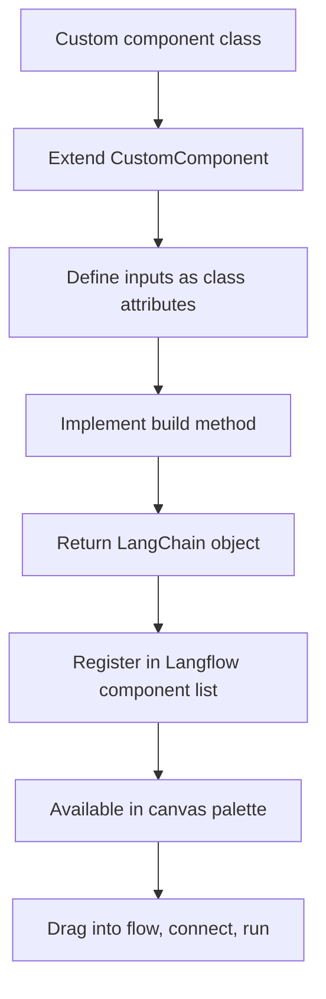

# Chapter 7: Custom Components and Extensions

Welcome to **Chapter 7: Custom Components and Extensions**. In this part of **Langflow Tutorial: Visual AI Agent and Workflow Platform**, you will build an intuitive mental model first, then move into concrete implementation details and practical production tradeoffs.

Langflow supports code-level extensibility so teams can encapsulate domain logic as reusable components.

## Extension Pattern

| Step | Outcome |
|:-----|:--------|
| define component contract | predictable integration |
| implement Python logic | domain-specific behavior |
| add tests | safer upgrades |
| document usage | team-level reuse |

## Quality Rules

- keep component inputs/outputs explicit
- avoid hidden global side effects
- version custom components for migration safety

## Source References

- [Langflow Repository](https://github.com/langflow-ai/langflow)
- [Langflow Docs](https://docs.langflow.org/)

## Summary

You now know how to extend Langflow without compromising maintainability.

Next: [Chapter 8: Production Operations](08-production-operations.md)

## How These Components Connect

