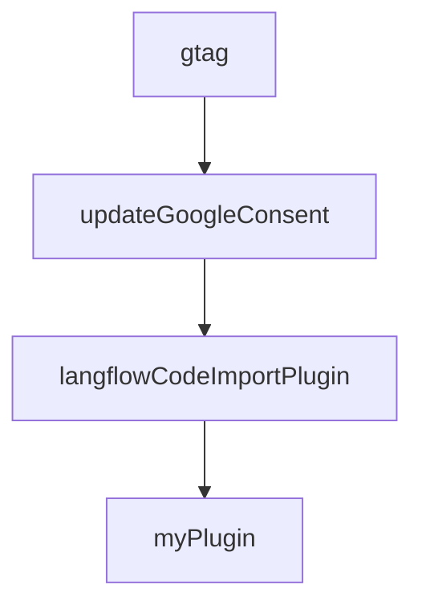

# Chapter 8: Production Operations

Welcome to **Chapter 8: Production Operations**. In this part of **Langflow Tutorial: Visual AI Agent and Workflow Platform**, you will build an intuitive mental model first, then move into concrete implementation details and practical production tradeoffs.


This chapter turns Langflow from a builder experience into a production platform practice.

## Operations Checklist

- release and rollback workflow for flows
- migration-safe data/config changes
- quota and concurrency controls
- incident runbooks for model/tool outages

## Core Metrics

| Area | Metrics |
|:-----|:--------|
| quality | successful flow runs, fallback frequency |
| latency | p50/p95 end-to-end runtime |
| reliability | timeout and retry rate |
| cost | model/tool spend per successful request |

## Source References

- [Langflow Deployment Docs](https://docs.langflow.org/deployment-overview)
- [Langflow Releases](https://github.com/langflow-ai/langflow/releases)

## Summary

You now have an operational baseline for running Langflow at production scale.

## Depth Expansion Playbook

## Source Code Walkthrough

### `docs/docusaurus.config.js`

The `gtag` function in [`docs/docusaurus.config.js`](https://github.com/langflow-ai/langflow/blob/HEAD/docs/docusaurus.config.js) handles a key part of this chapter's functionality:

```js
            innerHTML: `
              window.dataLayer = window.dataLayer || [];
              function gtag(){dataLayer.push(arguments);}

              // Set default consent to denied
              gtag('consent', 'default', {
                'ad_storage': 'denied',
                'ad_user_data': 'denied',
                'ad_personalization': 'denied',
                'analytics_storage': 'denied'
              });
            `,
          },
          // TrustArc Consent Update Listener
          {
            tagName: "script",
            attributes: {},
            innerHTML: `
              (function() {
                function updateGoogleConsent() {
                  if (typeof window.truste !== 'undefined' && window.truste.cma) {
                    var consent = window.truste.cma.callApi('getConsent', window.location.href) || {};

                    // Map TrustArc categories to Google consent types
                    // Category 0 = Required, 1 = Functional, 2 = Advertising, 3 = Analytics
                    var hasAdvertising = consent[2] === 1;
                    var hasAnalytics = consent[3] === 1;

                    gtag('consent', 'update', {
                      'ad_storage': hasAdvertising ? 'granted' : 'denied',
                      'ad_user_data': hasAdvertising ? 'granted' : 'denied',
                      'ad_personalization': hasAdvertising ? 'granted' : 'denied',
```

This function is important because it defines how Langflow Tutorial: Visual AI Agent and Workflow Platform implements the patterns covered in this chapter.

### `docs/docusaurus.config.js`

The `updateGoogleConsent` function in [`docs/docusaurus.config.js`](https://github.com/langflow-ai/langflow/blob/HEAD/docs/docusaurus.config.js) handles a key part of this chapter's functionality:

```js
            innerHTML: `
              (function() {
                function updateGoogleConsent() {
                  if (typeof window.truste !== 'undefined' && window.truste.cma) {
                    var consent = window.truste.cma.callApi('getConsent', window.location.href) || {};

                    // Map TrustArc categories to Google consent types
                    // Category 0 = Required, 1 = Functional, 2 = Advertising, 3 = Analytics
                    var hasAdvertising = consent[2] === 1;
                    var hasAnalytics = consent[3] === 1;

                    gtag('consent', 'update', {
                      'ad_storage': hasAdvertising ? 'granted' : 'denied',
                      'ad_user_data': hasAdvertising ? 'granted' : 'denied',
                      'ad_personalization': hasAdvertising ? 'granted' : 'denied',
                      'analytics_storage': hasAnalytics ? 'granted' : 'denied'
                    });
                  }
                }

                // Listen for consent changes
                if (window.addEventListener) {
                  window.addEventListener('cm_data_subject_consent_changed', updateGoogleConsent);
                  window.addEventListener('cm_consent_preferences_set', updateGoogleConsent);
                }

                // Initial check after TrustArc loads
                if (document.readyState === 'complete') {
                  updateGoogleConsent();
                } else {
                  window.addEventListener('load', updateGoogleConsent);
                }
```

This function is important because it defines how Langflow Tutorial: Visual AI Agent and Workflow Platform implements the patterns covered in this chapter.

### `docs/docusaurus.config.js`

The `langflowCodeImportPlugin` function in [`docs/docusaurus.config.js`](https://github.com/langflow-ai/langflow/blob/HEAD/docs/docusaurus.config.js) handles a key part of this chapter's functionality:

```js
  plugins: [
    // Alias so MDX can import code from the Langflow repo with !!raw-loader!@langflow/src/...
    function langflowCodeImportPlugin(context) {
      return {
        name: "langflow-code-import",
        configureWebpack() {
          return {
            resolve: {
              alias: {
                "@langflow": path.resolve(context.siteDir, ".."),
              },
            },
          };
        },
      };
    },
    ["docusaurus-node-polyfills", { excludeAliases: ["console"] }],
    "docusaurus-plugin-image-zoom",
    ["./src/plugins/segment", { segmentPublicWriteKey: process.env.SEGMENT_PUBLIC_WRITE_KEY, allowedInDev: true }],
    [
      "@docusaurus/plugin-client-redirects",
      {
        redirects: [
          {
            to: "/",
            from: [
              "/whats-new-a-new-chapter-langflow",
              "/👋 Welcome-to-Langflow",
              "/getting-started-welcome-to-langflow",
              "/guides-new-to-llms",
              "/about-langflow",
            ],
```

This function is important because it defines how Langflow Tutorial: Visual AI Agent and Workflow Platform implements the patterns covered in this chapter.

### `docs/docusaurus.config.js`

The `myPlugin` function in [`docs/docusaurus.config.js`](https://github.com/langflow-ai/langflow/blob/HEAD/docs/docusaurus.config.js) handles a key part of this chapter's functionality:

```js
    ],
    // ....
    async function myPlugin(context, options) {
      return {
        name: "docusaurus-tailwindcss",
        configurePostCss(postcssOptions) {
          // Appends TailwindCSS and AutoPrefixer.
          postcssOptions.plugins.push(require("tailwindcss"));
          postcssOptions.plugins.push(require("autoprefixer"));
          return postcssOptions;
        },
      };
    },
  ],
  themeConfig:
    /** @type {import('@docusaurus/preset-classic').ThemeConfig} */
    ({
      navbar: {
        hideOnScroll: true,
        logo: {
          alt: "Langflow",
          src: "img/lf-docs-light.svg",
          srcDark: "img/lf-docs-dark.svg",
        },
        items: [
          // right
          {
            position: "right",
            href: "https://github.com/langflow-ai/langflow",
            className: "header-github-link",
            target: "_blank",
            rel: null,
```

This function is important because it defines how Langflow Tutorial: Visual AI Agent and Workflow Platform implements the patterns covered in this chapter.


## How These Components Connect


