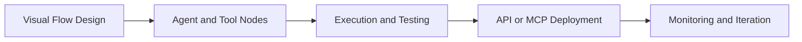

# Langflow Tutorial: Visual AI Agent and Workflow Platform

> Learn how to build, deploy, and operate agent workflows with `langflow-ai/langflow`, including visual flow composition, API/MCP deployment, and production reliability controls.

## Why This Track Matters

Langflow is one of the largest open-source AI application platforms. It lets teams move quickly with visual authoring while still supporting code-level customization and production deployment paths.

This track focuses on:

- visual flow composition for agents and pipelines
- API and MCP deployment surfaces for workflow reuse
- observability/security baselines for production usage
- extension patterns through custom components

## Current Snapshot (auto-updated)

- repository: [`langflow-ai/langflow`](https://github.com/langflow-ai/langflow)
- stars: about **144.7k**
- latest release: [`1.7.3`](https://github.com/langflow-ai/langflow/releases/tag/1.7.3)
- development activity: very active with same-day updates
- project positioning: visual + programmable platform for AI agents, flows, API endpoints, and MCP tooling

## Mental Model

## Chapter Guide

| Chapter | Key Question | Outcome |
|:--------|:-------------|:--------|
| [01 - Getting Started](01-getting-started.md) | How do I install and run Langflow quickly? | Working local baseline |
| [02 - Platform Architecture](02-platform-architecture.md) | How are flows, agents, and runtime layers organized? | Clear system model |
| [03 - Visual Flow Builder](03-visual-flow-builder.md) | How do I design maintainable flows in the UI? | Better flow design discipline |
| [04 - Agent Workflows and Orchestration](04-agent-workflows-and-orchestration.md) | How do I compose multi-step agent behavior? | Reliable orchestration patterns |
| [05 - API and MCP Deployment](05-api-and-mcp-deployment.md) | How do I expose flows as reusable interfaces? | Integration-ready deployment model |
| [06 - Observability and Security](06-observability-and-security.md) | How do I monitor and protect Langflow systems? | Production governance baseline |
| [07 - Custom Components and Extensions](07-custom-components-and-extensions.md) | How do I extend Langflow safely with Python code? | Extensibility strategy |
| [08 - Production Operations](08-production-operations.md) | How do I scale and operate Langflow in production? | Operations runbook baseline |

## What You Will Learn

- how to build robust agent workflows with Langflow's visual and code surfaces
- how to publish flows as API/MCP interfaces for broader system integration
- how to monitor, secure, and govern Langflow deployments
- how to extend the platform with custom component libraries

## Source References

- [Langflow Repository](https://github.com/langflow-ai/langflow)
- [Langflow Releases](https://github.com/langflow-ai/langflow/releases)
- [Langflow Docs](https://docs.langflow.org/)
- [Langflow Deployment Docs](https://docs.langflow.org/deployment-overview)

## Related Tutorials

- [Flowise Tutorial](../flowise-llm-orchestration/)
- [LangChain Tutorial](../langchain-tutorial/)
- [LangGraph Tutorial](../langgraph-tutorial/)
- [MCP Servers Tutorial](../mcp-servers-tutorial/)

---

Start with [Chapter 1: Getting Started](01-getting-started.md).

## Navigation & Backlinks

- [Start Here: Chapter 1: Getting Started](01-getting-started.md)
- [Back to Main Catalog](../../README.md#-tutorial-catalog)
- [Browse A-Z Tutorial Directory](../../discoverability/tutorial-directory.md)
- [Search by Intent](../../discoverability/query-hub.md)
- [Explore Category Hubs](../../README.md#category-hubs)

## Full Chapter Map

1. [Chapter 1: Getting Started](01-getting-started.md)
2. [Chapter 2: Platform Architecture](02-platform-architecture.md)
3. [Chapter 3: Visual Flow Builder](03-visual-flow-builder.md)
4. [Chapter 4: Agent Workflows and Orchestration](04-agent-workflows-and-orchestration.md)
5. [Chapter 5: API and MCP Deployment](05-api-and-mcp-deployment.md)
6. [Chapter 6: Observability and Security](06-observability-and-security.md)
7. [Chapter 7: Custom Components and Extensions](07-custom-components-and-extensions.md)
8. [Chapter 8: Production Operations](08-production-operations.md)

*Generated by [AI Codebase Knowledge Builder](https://github.com/The-Pocket/Tutorial-Codebase-Knowledge)*
