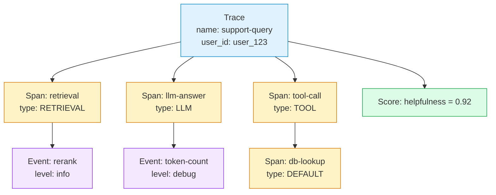

# Chapter 2: Tracing Fundamentals

Welcome to **Chapter 2: Tracing Fundamentals**. In this part of **Langfuse Tutorial: LLM Observability, Evaluation, and Prompt Operations**, you will build an intuitive mental model first, then move into concrete implementation details and practical production tradeoffs.


> Capture traces, spans, and events with rich metadata to debug LLM flows.

## Overview

Langfuse traces represent a user request; spans represent steps (LLM calls, tools, DB lookups). You can attach inputs, outputs, scores, tags, and user identifiers to make debugging straightforward. In this chapter you will:

- Learn the trace hierarchy and how pieces nest together.
- Instrument a multi-step flow manually.
- Use the `@observe` decorator for zero-boilerplate tracing.
- Trace asynchronous operations.
- Add custom attributes and metadata to spans.
- Filter and search traces in the Langfuse UI.
- Walk through a complete RAG tracing example.

## Trace Structure

Every request your application handles becomes a **Trace**. Inside that trace you create **Spans** for each meaningful step, and optionally attach **Events** for lightweight log entries. Here is the hierarchy:



### Core Concepts Recap

| Concept | Purpose | Key fields |
|---|---|---|
| **Trace** | Root of a request or conversation. | `name`, `user_id`, `session_id`, `metadata`, `tags` |
| **Span** | A step within the trace (LLM call, tool, retrieval). | `name`, `input`, `output`, `metadata`, `tags`, `usage` |
| **Event** | A lightweight log entry attached to a trace or span. | `name`, `level`, `data` |
| **Score** | A numeric or categorical quality signal. | `name`, `value`, `comment` |

Spans can nest inside other spans, giving you an arbitrarily deep tree. This is useful when a single "step" (like a tool call) has its own sub-steps (like a database query followed by a transformation).

## Instrument a Multi-Step Flow

Let's build on the hello-world example from Chapter 1 and trace a support-query pipeline with retrieval and LLM generation.

```python
from langfuse import Langfuse
from openai import OpenAI
import time

langfuse = Langfuse()  # reads keys from environment
client = OpenAI()

# Start a trace for this user request
trace = langfuse.trace(
    name="support-query",
    user_id="user_123",
    session_id="session_abc",
    metadata={"plan": "pro", "source": "web-chat"},
    tags=["support", "production"],
)

# -- Step 1: Retrieval --
retrieval = trace.span(
    name="retrieval",
    input={"query": "How do I reset my password?"},
    tags=["rag"],
)
# Simulate fetching documents
retrieval_output = [
    "Reset via Settings > Security > Change Password",
    "Send a password-reset email from the login page",
]
time.sleep(0.1)  # simulate latency
retrieval.end(output=retrieval_output)

# -- Step 2: LLM generation --
llm_span = trace.span(
    name="llm-answer",
    input={"context": retrieval_output, "question": "How do I reset my password?"},
)
resp = client.chat.completions.create(
    model="gpt-4o-mini",
    messages=[
        {"role": "system", "content": "Answer using only the provided context."},
        {"role": "user", "content": "How do I reset my password?"},
    ],
)
llm_span.end(
    output=resp.choices[0].message.content,
    usage={
        "input": resp.usage.prompt_tokens,
        "output": resp.usage.completion_tokens,
        "total": resp.usage.total_tokens,
    },
)

# -- Attach a score --
trace.score(name="helpfulness", value=0.92, comment="Answered correctly with context.")
trace.end()
langfuse.flush()
```

When you open this trace in the UI, you will see a timeline with two spans nested under the trace, each with its own timing, inputs, and outputs.

## The @observe Decorator

Manually creating spans is fine for simple flows, but as your codebase grows it becomes tedious. The `@observe` decorator automatically creates a span for every decorated function call and captures its arguments and return value.

### Basic Usage

```python
from langfuse.decorators import observe, langfuse_context

@observe()
def retrieve_documents(query: str) -> list[str]:
    """Simulate document retrieval."""
    # Your real retrieval logic here
    return [
        "Reset via Settings > Security > Change Password",
        "Send a password-reset email from the login page",
    ]

@observe()
def generate_answer(question: str, context: list[str]) -> str:
    """Call the LLM with retrieved context."""
    from openai import OpenAI
    client = OpenAI()
    resp = client.chat.completions.create(
        model="gpt-4o-mini",
        messages=[
            {"role": "system", "content": f"Context: {context}"},
            {"role": "user", "content": question},
        ],
    )
    return resp.choices[0].message.content

@observe()
def answer_support_question(question: str) -> str:
    """Top-level function traced as the root span."""
    docs = retrieve_documents(question)
    answer = generate_answer(question, docs)
    return answer
```

When you call `answer_support_question("How do I reset my password?")`, Langfuse automatically creates:

1. A trace named `answer_support_question`.
2. A child span named `retrieve_documents`.
3. A child span named `generate_answer`.

Each span records the function's arguments as `input` and the return value as `output`.

### Adding Metadata Inside Decorated Functions

Use `langfuse_context` to enrich the current span from inside a decorated function:

```python
from langfuse.decorators import observe, langfuse_context

@observe()
def generate_answer(question: str, context: list[str]) -> str:
    from openai import OpenAI
    client = OpenAI()
    resp = client.chat.completions.create(
        model="gpt-4o-mini",
        messages=[
            {"role": "system", "content": f"Context: {context}"},
            {"role": "user", "content": question},
        ],
    )

    # Enrich the current span
    langfuse_context.update_current_observation(
        usage={
            "input": resp.usage.prompt_tokens,
            "output": resp.usage.completion_tokens,
        },
        metadata={"model": "gpt-4o-mini"},
    )

    # Attach a score to the parent trace
    langfuse_context.score_current_trace(
        name="completeness",
        value=0.85,
    )

    return resp.choices[0].message.content
```

### Setting Trace-Level Fields

To set `user_id`, `session_id`, or tags on the root trace, call `langfuse_context.update_current_trace` inside the top-level decorated function:

```python
@observe()
def answer_support_question(question: str, user_id: str) -> str:
    langfuse_context.update_current_trace(
        user_id=user_id,
        session_id="session_abc",
        tags=["support", "production"],
    )
    docs = retrieve_documents(question)
    return generate_answer(question, docs)
```

## Tracing Async Operations

If your application uses `asyncio`, the `@observe` decorator works with async functions out of the box:

```python
import asyncio
from langfuse.decorators import observe

@observe()
async def fetch_documents(query: str) -> list[str]:
    # Simulate an async database or API call
    await asyncio.sleep(0.05)
    return ["Doc A", "Doc B", "Doc C"]

@observe()
async def call_llm(prompt: str) -> str:
    from openai import AsyncOpenAI
    client = AsyncOpenAI()
    resp = await client.chat.completions.create(
        model="gpt-4o-mini",
        messages=[{"role": "user", "content": prompt}],
    )
    return resp.choices[0].message.content

@observe()
async def async_rag_pipeline(question: str) -> str:
    docs = await fetch_documents(question)
    answer = await call_llm(f"Context: {docs}\n\nQuestion: {question}")
    return answer

# Run it
asyncio.run(async_rag_pipeline("What is Langfuse?"))
```

Langfuse correctly parents async spans even when multiple coroutines run concurrently, because it uses Python's `contextvars` under the hood.

### Tracing Parallel Async Calls

When you run tasks in parallel with `asyncio.gather`, each branch gets its own span:

```python
@observe()
async def parallel_retrieval(question: str) -> dict:
    vector_results, keyword_results = await asyncio.gather(
        vector_search(question),
        keyword_search(question),
    )
    return {"vector": vector_results, "keyword": keyword_results}
```

## Custom Span Attributes

Every span accepts a rich set of fields. Here is a comprehensive example showing the most useful ones:

```python
span = trace.span(
    name="tool-call",
    input={"cmd": "GET /users/123"},
    output={"status": 200, "body": {"name": "Alice"}},
    tags=["tool", "http", "users-api"],
    metadata={
        "service": "users-api",
        "region": "us-east-1",
        "latency_ms": 42,
    },
    level="DEFAULT",           # DEFAULT, DEBUG, WARNING, ERROR
    status_message="OK",
    version="1.2.0",           # your app version for filtering
)
```

### Tracking Token Usage and Cost

For LLM spans, always pass `usage` so Langfuse can compute cost automatically:

```python
llm_span.end(
    output=resp.choices[0].message.content,
    usage={
        "input": resp.usage.prompt_tokens,
        "output": resp.usage.completion_tokens,
        "total": resp.usage.total_tokens,
        "unit": "TOKENS",
    },
    model="gpt-4o-mini",  # helps Langfuse look up the price
)
```

Langfuse maintains an internal pricing table. When you set the `model` field, it calculates cost per trace automatically and displays it in the dashboard.

### Attaching Large Payloads

For large inputs or outputs (full documents, images, etc.), consider storing only a summary in the span and linking to the full payload externally:

```python
span = trace.span(
    name="document-processing",
    input={"document_id": "doc_456", "summary": "10-page contract PDF"},
    metadata={"full_document_url": "s3://my-bucket/docs/doc_456.pdf"},
)
```

This keeps your Langfuse database lean while still giving you enough context to debug.

## Logging Events

Events are lightweight log entries that do not have a duration. They are useful for recording intermediate steps, decisions, or metrics:

```python
# Log a reranking step
trace.event(
    name="rerank",
    level="info",
    data={"candidates_before": 10, "candidates_after": 3, "model": "cohere-rerank-v3"},
)

# Log a cache hit
trace.event(
    name="cache-hit",
    level="debug",
    data={"cache_key": "query_abc123", "ttl_seconds": 300},
)

# Log a warning
trace.event(
    name="rate-limit-warning",
    level="warning",
    data={"provider": "openai", "retry_after_seconds": 5},
)
```

## Error Handling

Always wrap risky operations in try/except and mark failed spans explicitly:

```python
try:
    db_span = trace.span(name="db-call", input={"query": "SELECT * FROM users"})
    # do work...
    result = run_query("SELECT * FROM users WHERE id = 123")
    db_span.end(output=result)
except Exception as e:
    db_span.end(
        output={"error": str(e)},
        level="ERROR",
        status_message=str(e),
    )
    trace.score(name="error", value=1, comment=str(e))
finally:
    trace.end()
    langfuse.flush()
```

Setting `level="ERROR"` highlights the failed span in red in the UI, making it easy to spot during debugging.

## Trace Filtering and Search

Once you have hundreds or thousands of traces, finding the right one matters. Langfuse gives you several ways to filter:

### Filter by Name and Tags

In the Traces view, use the search bar and the tag dropdown to narrow results. Good naming conventions pay off here -- use consistent, descriptive names like `support-query`, `onboarding-flow`, or `document-qa`.

### Filter by User or Session

If you set `user_id` and `session_id`, you can quickly pull up all traces for a single user or conversation. This is invaluable for debugging production issues.

### Filter by Score

You can filter traces by score name and range. For example, show only traces where `helpfulness < 0.5` to focus on low-quality responses.

### Filter by Metadata

Tags and metadata fields are searchable. Use them for environment (`production`, `staging`), feature flags, A/B test variants, or any dimension you care about.

### Tips for Effective Filtering

- Use short, consistent `name` values -- they become the primary filter dimension.
- Always set `user_id` to tie traces back to real users.
- Tag traces with the environment (`production`, `staging`, `development`).
- Add `session_id` for multi-turn conversations so you can replay the whole exchange.

## Complete Example: Tracing a RAG Pipeline

Let's put everything together in a realistic Retrieval-Augmented Generation pipeline:

```python
from langfuse.decorators import observe, langfuse_context
from openai import OpenAI
import numpy as np

client = OpenAI()

@observe()
def embed_query(query: str) -> list[float]:
    """Generate an embedding for the user query."""
    resp = client.embeddings.create(model="text-embedding-3-small", input=query)
    langfuse_context.update_current_observation(
        metadata={"model": "text-embedding-3-small", "dimensions": 1536},
    )
    return resp.data[0].embedding

@observe()
def vector_search(embedding: list[float], top_k: int = 5) -> list[dict]:
    """Search the vector store for relevant documents."""
    # Simulated results -- replace with your real vector DB call
    results = [
        {"id": "doc_1", "text": "To reset your password, go to Settings > Security.", "score": 0.95},
        {"id": "doc_2", "text": "Password requirements: 8+ chars, one uppercase.", "score": 0.87},
        {"id": "doc_3", "text": "Two-factor authentication adds extra security.", "score": 0.72},
    ]
    langfuse_context.update_current_observation(
        metadata={"top_k": top_k, "results_returned": len(results)},
    )
    return results[:top_k]

@observe()
def rerank_documents(query: str, documents: list[dict]) -> list[dict]:
    """Rerank documents by relevance."""
    # Simulated reranking -- replace with Cohere Rerank, cross-encoder, etc.
    reranked = sorted(documents, key=lambda d: d["score"], reverse=True)
    langfuse_context.update_current_observation(
        metadata={"input_count": len(documents), "output_count": len(reranked)},
    )
    return reranked[:3]

@observe()
def generate_response(question: str, context: list[dict]) -> str:
    """Generate the final answer using the LLM."""
    context_text = "\n".join(doc["text"] for doc in context)
    resp = client.chat.completions.create(
        model="gpt-4o-mini",
        messages=[
            {
                "role": "system",
                "content": (
                    "You are a helpful support agent. Answer the question using "
                    "only the provided context. If the context does not contain "
                    "the answer, say so.\n\n"
                    f"Context:\n{context_text}"
                ),
            },
            {"role": "user", "content": question},
        ],
    )
    langfuse_context.update_current_observation(
        usage={
            "input": resp.usage.prompt_tokens,
            "output": resp.usage.completion_tokens,
        },
        model="gpt-4o-mini",
    )
    return resp.choices[0].message.content

@observe()
def rag_pipeline(question: str, user_id: str) -> str:
    """Full RAG pipeline: embed -> search -> rerank -> generate."""
    langfuse_context.update_current_trace(
        user_id=user_id,
        tags=["rag", "support", "production"],
        metadata={"pipeline_version": "2.1"},
    )

    embedding = embed_query(question)
    raw_docs = vector_search(embedding, top_k=5)
    ranked_docs = rerank_documents(question, raw_docs)
    answer = generate_response(question, ranked_docs)

    # Score the trace
    langfuse_context.score_current_trace(
        name="context_relevance",
        value=0.91,
        comment="Top document directly answers the question.",
    )

    return answer


# Run the pipeline
result = rag_pipeline("How do I reset my password?", user_id="user_456")
print(result)
```

In the Langfuse UI this trace will display five nested spans (`rag_pipeline` > `embed_query`, `vector_search`, `rerank_documents`, `generate_response`), each with its own timing, inputs, outputs, and metadata. The score appears on the trace summary.

## What You Learned

- The Trace > Span > Event hierarchy and when to use each.
- How to instrument flows manually and with the `@observe` decorator.
- How to trace async and parallel operations.
- How to attach custom metadata, tags, and token usage.
- How to filter and search traces effectively in the UI.
- A complete RAG tracing example you can adapt to your own pipeline.

---

| [Previous: Chapter 1 -- Getting Started](./01-getting-started.md) | [Next: Chapter 3 -- Prompt Management](./03-prompts.md) |

## Depth Expansion Playbook

<!-- depth-expansion-v2 -->

This chapter is expanded to v1-style depth for production-grade learning and implementation quality.

### Strategic Context

- tutorial: **Langfuse Tutorial: LLM Observability, Evaluation, and Prompt Operations**
- tutorial slug: **langfuse-tutorial**
- chapter focus: **Chapter 2: Tracing Fundamentals**
- system context: **Langfuse Tutorial**
- objective: move from surface-level usage to repeatable engineering operation

### Architecture Decomposition

1. Define the runtime boundary for `Chapter 2: Tracing Fundamentals`.
2. Separate control-plane decisions from data-plane execution.
3. Capture input contracts, transformation points, and output contracts.
4. Trace state transitions across request lifecycle stages.
5. Identify extension hooks and policy interception points.
6. Map ownership boundaries for team and automation workflows.
7. Specify rollback and recovery paths for unsafe changes.
8. Track observability signals for correctness, latency, and cost.

### Operator Decision Matrix

| Decision Area | Low-Risk Path | High-Control Path | Tradeoff |
|:--------------|:--------------|:------------------|:---------|
| Runtime mode | managed defaults | explicit policy config | speed vs control |
| State handling | local ephemeral | durable persisted state | simplicity vs auditability |
| Tool integration | direct API use | mediated adapter layer | velocity vs governance |
| Rollout method | manual change | staged + canary rollout | effort vs safety |
| Incident response | best effort logs | runbooks + SLO alerts | cost vs reliability |

### Failure Modes and Countermeasures

| Failure Mode | Early Signal | Root Cause Pattern | Countermeasure |
|:-------------|:-------------|:-------------------|:---------------|
| stale context | inconsistent outputs | missing refresh window | enforce context TTL and refresh hooks |
| policy drift | unexpected execution | ad hoc overrides | centralize policy profiles |
| auth mismatch | 401/403 bursts | credential sprawl | rotation schedule + scope minimization |
| schema breakage | parser/validation errors | unmanaged upstream changes | contract tests per release |
| retry storms | queue congestion | no backoff controls | jittered backoff + circuit breakers |
| silent regressions | quality drop without alerts | weak baseline metrics | eval harness with thresholds |

### Implementation Runbook

1. Establish a reproducible baseline environment.
2. Capture chapter-specific success criteria before changes.
3. Implement minimal viable path with explicit interfaces.
4. Add observability before expanding feature scope.
5. Run deterministic tests for happy-path behavior.
6. Inject failure scenarios for negative-path validation.
7. Compare output quality against baseline snapshots.
8. Promote through staged environments with rollback gates.
9. Record operational lessons in release notes.

### Quality Gate Checklist

- [ ] chapter-level assumptions are explicit and testable
- [ ] API/tool boundaries are documented with input/output examples
- [ ] failure handling includes retry, timeout, and fallback policy
- [ ] security controls include auth scopes and secret rotation plans
- [ ] observability includes logs, metrics, traces, and alert thresholds
- [ ] deployment guidance includes canary and rollback paths
- [ ] docs include links to upstream sources and related tracks
- [ ] post-release verification confirms expected behavior under load

### Source Alignment

- [Langfuse Repository](https://github.com/langfuse/langfuse)
- [Langfuse Releases](https://github.com/langfuse/langfuse/releases)
- [Langfuse Docs](https://langfuse.com/docs)

### Cross-Tutorial Connection Map

- [LiteLLM Tutorial](../litellm-tutorial/)
- [LangChain Tutorial](../langchain-tutorial/)
- [LlamaIndex Tutorial](../llamaindex-tutorial/)
- [Vercel AI SDK Tutorial](../vercel-ai-tutorial/)
- [Chapter 1: Getting Started](01-getting-started.md)

### Advanced Practice Exercises

1. Build a minimal end-to-end implementation for `Chapter 2: Tracing Fundamentals`.
2. Add instrumentation and measure baseline latency and error rate.
3. Introduce one controlled failure and confirm graceful recovery.
4. Add policy constraints and verify they are enforced consistently.
5. Run a staged rollout and document rollback decision criteria.

### Review Questions

1. Which execution boundary matters most for this chapter and why?
2. What signal detects regressions earliest in your environment?
3. What tradeoff did you make between delivery speed and governance?
4. How would you recover from the highest-impact failure mode?
5. What must be automated before scaling to team-wide adoption?

## What Problem Does This Solve?

Most teams struggle here because the hard part is not writing more code, but deciding clear boundaries for `question`, `resp`, `observe` so behavior stays predictable as complexity grows.

In practical terms, this chapter helps you avoid three common failures:

- coupling core logic too tightly to one implementation path
- missing the handoff boundaries between setup, execution, and validation
- shipping changes without clear rollback or observability strategy

After working through this chapter, you should be able to reason about `Chapter 2: Tracing Fundamentals` as an operating subsystem inside **Langfuse Tutorial: LLM Observability, Evaluation, and Prompt Operations**, with explicit contracts for inputs, state transitions, and outputs.

Use the implementation notes around `trace`, `name`, `content` as your checklist when adapting these patterns to your own repository.

## How it Works Under the Hood

Under the hood, `Chapter 2: Tracing Fundamentals` usually follows a repeatable control path:

1. **Context bootstrap**: initialize runtime config and prerequisites for `question`.
2. **Input normalization**: shape incoming data so `resp` receives stable contracts.
3. **Core execution**: run the main logic branch and propagate intermediate state through `observe`.
4. **Policy and safety checks**: enforce limits, auth scopes, and failure boundaries.
5. **Output composition**: return canonical result payloads for downstream consumers.
6. **Operational telemetry**: emit logs/metrics needed for debugging and performance tuning.

When debugging, walk this sequence in order and confirm each stage has explicit success/failure conditions.

## Source Walkthrough

Use the following upstream sources to verify implementation details while reading this chapter:

- [Langfuse Repository](https://github.com/langfuse/langfuse)
  Why it matters: authoritative reference on `Langfuse Repository` (github.com).
- [Langfuse Releases](https://github.com/langfuse/langfuse/releases)
  Why it matters: authoritative reference on `Langfuse Releases` (github.com).
- [Langfuse Docs](https://langfuse.com/docs)
  Why it matters: authoritative reference on `Langfuse Docs` (langfuse.com).

Suggested trace strategy:
- search upstream code for `question` and `resp` to map concrete implementation paths
- compare docs claims against actual runtime/config code before reusing patterns in production

## Chapter Connections

- [Tutorial Index](index.md)
- [Previous Chapter: Chapter 1: Getting Started with Langfuse](01-getting-started.md)
- [Next Chapter: Chapter 3: Prompt Management](03-prompts.md)
- [Main Catalog](../../README.md#-tutorial-catalog)
- [A-Z Tutorial Directory](../../discoverability/tutorial-directory.md)
