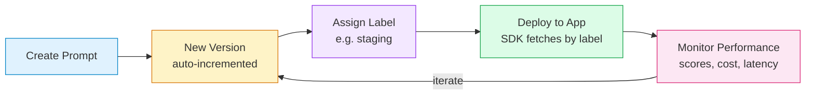

# Chapter 3: Prompt Management

Welcome to **Chapter 3: Prompt Management**. In this part of **Langfuse Tutorial: LLM Observability, Evaluation, and Prompt Operations**, you will build an intuitive mental model first, then move into concrete implementation details and practical production tradeoffs.


> Version, release, and A/B test prompts directly from Langfuse.

## Overview

Prompts are the most frequently changed part of any LLM application. A small wording tweak can dramatically affect quality, cost, and safety. Langfuse lets you store prompts centrally, version them automatically, attach labels for release management, and fetch them at runtime -- all without redeploying your application. In this chapter you will:

- Understand the prompt lifecycle from creation to monitoring.
- Work with both **Chat** and **Text** prompt types.
- Use variables and templates effectively.
- Fetch and cache prompts in your application.
- Monitor prompt performance across versions.
- Walk through a complete prompt iteration workflow.
- Learn prompt engineering best practices within Langfuse.

## The Prompt Lifecycle

A prompt in Langfuse goes through a clear lifecycle. Understanding these stages helps you manage changes safely:



1. **Create** -- Define a prompt in the Langfuse UI or via the API. Give it a descriptive name like `support_reply` or `summarizer_v2`.
2. **Version** -- Every edit creates a new, immutable version. Versions are auto-incremented integers (1, 2, 3, ...).
3. **Label** -- Assign labels like `production`, `staging`, or `beta` to specific versions. Labels are movable pointers -- you can relabel instantly to roll back.
4. **Deploy** -- Your application fetches the prompt by name and label at runtime. No redeploy needed.
5. **Monitor** -- Attach the `prompt_version` to your traces and use Langfuse analytics to compare quality, cost, and latency across versions.

## Chat vs Text Prompts

Langfuse supports two prompt types. Choosing the right one depends on how your LLM expects its input.

### Text Prompts

A text prompt is a single string with optional `{{variables}}`. It is ideal for completion-style models or when you build your own message array.

```
You are a helpful customer support agent for {{company_name}}.

The customer's name is {{customer_name}} and their issue is: {{issue}}.

Respond politely and provide a clear solution based on the following context:
{{context}}
```

When you call `prompt.compile(...)`, Langfuse returns the rendered string.

### Chat Prompts

A chat prompt is an array of messages, each with a `role` and `content`. This maps directly to the format expected by OpenAI, Anthropic, and most chat-based APIs.

```json
[
  {
    "role": "system",
    "content": "You are a support agent for {{company_name}}. Be concise and helpful."
  },
  {
    "role": "user",
    "content": "Hi, my name is {{customer_name}}. I have an issue with {{issue}}.\n\nContext: {{context}}"
  }
]
```

When you call `prompt.compile(...)` on a chat prompt, Langfuse returns a list of message dictionaries ready to pass to your LLM client.

### When to Use Which

| Use case | Prompt type |
|---|---|
| OpenAI / Anthropic chat completions | Chat |
| Single-prompt completions or embeddings | Text |
| Complex multi-turn templates | Chat |
| Simple string interpolation | Text |

## Creating Prompts in Langfuse

You can create prompts through the UI or the SDK.

### Via the UI

1. Navigate to **Prompts** in the sidebar.
2. Click **New Prompt**.
3. Choose **Chat** or **Text** type.
4. Enter a name (e.g., `support_reply`).
5. Write your template with `{{variable}}` placeholders.
6. Click **Save** -- this creates version 1.

### Via the SDK (Python)

```python
from langfuse import Langfuse

langfuse = Langfuse()

# Create a chat prompt
langfuse.create_prompt(
    name="support_reply",
    type="chat",
    prompt=[
        {
            "role": "system",
            "content": "You are a support agent for {{company_name}}. Be helpful and concise.",
        },
        {
            "role": "user",
            "content": "Customer {{customer_name}} asks: {{issue}}\n\nContext: {{context}}",
        },
    ],
    labels=["staging"],  # immediately label this version
    config={
        "model": "gpt-4o-mini",
        "temperature": 0.3,
        "max_tokens": 500,
    },
)
```

The optional `config` object lets you store model parameters alongside the prompt. Your application can read these at runtime to stay in sync.

## Prompt Variables and Templates

Variables are the bridge between your static prompt template and the dynamic data in each request. They use double-curly-brace syntax: `{{variable_name}}`.

### Defining Variables

When you write a prompt template, any `{{token}}` becomes a variable. Langfuse automatically detects them and lists them in the UI.

### Compiling Templates

The `compile` method replaces variables with the values you provide:

```python
prompt = langfuse.get_prompt("support_reply", label="production")

messages = prompt.compile(
    customer_name="Alex",
    issue="billing error on invoice #789",
    context="We refunded invoice #789 and updated the payment method on file.",
    company_name="Acme Corp",
)

# messages is now a list of dicts ready for your LLM client
```

### Variable Best Practices

- **Name variables descriptively**: `{{customer_name}}` is better than `{{name}}`.
- **Document expected types**: In the prompt description field, note whether a variable expects a string, a list, or structured data.
- **Provide defaults in your code**: If a variable might be missing, handle it gracefully before calling `compile`.
- **Avoid secrets**: Never pass API keys, passwords, or tokens as prompt variables. They would be stored in Langfuse.

### Using Config for Model Parameters

The `config` field on a prompt is a free-form dictionary. A common pattern is to store model settings there:

```python
prompt = langfuse.get_prompt("support_reply", label="production")

# Read model config from the prompt
model = prompt.config.get("model", "gpt-4o-mini")
temperature = prompt.config.get("temperature", 0.7)
max_tokens = prompt.config.get("max_tokens", 500)

messages = prompt.compile(customer_name="Alex", issue="billing", context="...", company_name="Acme")

resp = client.chat.completions.create(
    model=model,
    temperature=temperature,
    max_tokens=max_tokens,
    messages=messages,
)
```

This way, non-engineers on your team can adjust model parameters from the Langfuse UI without touching code.

## Versioning and Releases

### How Versions Work

Every time you save a prompt (in the UI or via `create_prompt`), Langfuse creates a new immutable version. Versions are integers that increment automatically. You can never edit an existing version -- only create a new one.

### Labels as Release Pointers

Labels are movable pointers to versions. Think of them like Git tags that you can reassign:

- `production` -- the version your live application uses.
- `staging` -- the version being tested before promotion.
- `beta` -- an experimental version for a subset of users.
- `latest` -- Langfuse automatically assigns this to the newest version.

To promote a staging prompt to production, simply move the `production` label to the staging version. Instant rollout, instant rollback.

### Linking Prompt Versions to Traces

Always record which prompt version generated each response. This makes performance comparison possible:

```python
prompt = langfuse.get_prompt("support_reply", label="production")
messages = prompt.compile(customer_name="Alex", issue="billing", context="...", company_name="Acme")

trace = langfuse.trace(name="support-query", user_id="user_123")
span = trace.span(
    name="support-llm",
    input=messages,
    metadata={
        "prompt_name": prompt.name,
        "prompt_version": prompt.version,
        "prompt_label": "production",
    },
)
```

## A/B Testing Prompts

Want to test two prompt versions head-to-head? Assign different labels and split traffic in your code:

```python
import hashlib

def get_prompt_label(user_id: str) -> str:
    """Deterministic split: same user always gets the same variant."""
    hash_val = int(hashlib.md5(user_id.encode()).hexdigest(), 16)
    return "production" if hash_val % 2 == 0 else "beta"

label = get_prompt_label(user_id)
prompt = langfuse.get_prompt("support_reply", label=label)

# Tag the trace so you can filter by variant later
trace = langfuse.trace(
    name="support-query",
    user_id=user_id,
    tags=[f"prompt-variant:{label}"],
)
```

Then in the Langfuse dashboard, filter traces by the `prompt-variant:production` and `prompt-variant:beta` tags to compare scores, latency, and cost side by side.

## Prompt Caching

Fetching prompts from Langfuse on every request adds a network call. The SDK includes built-in caching to minimize this overhead.

### Default Caching Behavior

The Python SDK caches prompts in memory with a default TTL (time-to-live). When you call `get_prompt`, it returns the cached version if the TTL has not expired.

### Controlling the Cache

```python
# Cache for 5 minutes (300 seconds)
prompt = langfuse.get_prompt("support_reply", label="production", cache_ttl_seconds=300)

# Force a fresh fetch (bypass cache)
prompt = langfuse.get_prompt("support_reply", label="production", cache_ttl_seconds=0)
```

### Caching Strategy Recommendations

| Environment | Recommended TTL | Reason |
|---|---|---|
| Development | 0 (no cache) | See prompt changes immediately. |
| Staging | 30-60 seconds | Quick iteration, but reduce API calls. |
| Production | 300-600 seconds | Stable prompts; minimize latency. |

### Warming the Cache at Startup

For latency-sensitive applications, fetch your prompts during initialization:

```python
# At application startup
prompts = {
    "support_reply": langfuse.get_prompt("support_reply", label="production"),
    "summarizer": langfuse.get_prompt("summarizer", label="production"),
}

# During request handling -- already cached
messages = prompts["support_reply"].compile(...)
```

## Prompt Performance Monitoring

Connecting prompts to evaluation (covered in detail in Chapter 4) closes the feedback loop. Here is the pattern:

1. **Tag traces with prompt metadata** -- name, version, label.
2. **Score traces** -- either with LLM-as-judge or human feedback.
3. **Filter by prompt version** in the Langfuse dashboard to compare.

This lets you answer questions like:
- Did version 5 of `support_reply` improve helpfulness scores compared to version 4?
- Which prompt variant has lower cost per successful response?
- Are there regressions in safety scores after the latest prompt edit?

## Complete Example: Prompt Iteration Workflow

Let's walk through a realistic workflow where you iterate on a prompt, test it, and promote it to production.

### Step 1 -- Create the Initial Prompt

```python
langfuse.create_prompt(
    name="ticket_classifier",
    type="chat",
    prompt=[
        {
            "role": "system",
            "content": (
                "Classify the support ticket into one of these categories: "
                "billing, technical, account, other.\n"
                "Respond with only the category name."
            ),
        },
        {"role": "user", "content": "{{ticket_text}}"},
    ],
    labels=["production"],
    config={"model": "gpt-4o-mini", "temperature": 0},
)
```

### Step 2 -- Discover a Problem

After monitoring, you notice that tickets about refunds are being classified as `other` instead of `billing`. Time to iterate.

### Step 3 -- Create an Improved Version

```python
langfuse.create_prompt(
    name="ticket_classifier",
    type="chat",
    prompt=[
        {
            "role": "system",
            "content": (
                "Classify the support ticket into one of these categories: "
                "billing (includes refunds, invoices, payments), "
                "technical (includes bugs, errors, integrations), "
                "account (includes login, password, profile), "
                "other.\n"
                "Respond with only the category name in lowercase."
            ),
        },
        {"role": "user", "content": "{{ticket_text}}"},
    ],
    labels=["staging"],
    config={"model": "gpt-4o-mini", "temperature": 0},
)
```

This creates version 2 with the `staging` label. Version 1 still has `production`.

### Step 4 -- Test the Staging Version

```python
prompt = langfuse.get_prompt("ticket_classifier", label="staging")

test_tickets = [
    "I need a refund for my last invoice",
    "The API returns a 500 error",
    "I cannot log into my account",
    "I want to request a feature",
]

for ticket in test_tickets:
    messages = prompt.compile(ticket_text=ticket)
    resp = client.chat.completions.create(model="gpt-4o-mini", messages=messages, temperature=0)
    category = resp.choices[0].message.content.strip()

    trace = langfuse.trace(name="classifier-test", tags=["staging-test"])
    trace.span(
        name="classify",
        input=ticket,
        output=category,
        metadata={"prompt_version": prompt.version},
    )
    print(f"Ticket: {ticket} -> {category}")

langfuse.flush()
```

### Step 5 -- Promote to Production

If the staging results look good, promote by moving the `production` label:

```python
# In the Langfuse UI: go to Prompts > ticket_classifier > Version 2 > Add label "production"
# Or via SDK:
langfuse.create_prompt(
    name="ticket_classifier",
    type="chat",
    prompt=[...],          # same content as version 2
    labels=["production"], # this version now gets the production label
    config={"model": "gpt-4o-mini", "temperature": 0},
)
```

Your live application immediately picks up the new version on the next cache refresh -- no redeploy required.

## Prompt Engineering Best Practices

These tips will help you get the most out of Langfuse prompt management:

### Structure Your Prompts Clearly

- Put instructions in the `system` message.
- Put user input in the `user` message.
- Use numbered lists or bullet points for multi-step instructions.
- Separate concerns: one prompt per task (classify, summarize, generate).

### Use Descriptive Naming

- Name prompts by function: `ticket_classifier`, `support_reply`, `doc_summarizer`.
- Avoid generic names like `prompt_1` or `test`.
- Use the description field to document what the prompt does and what variables it expects.

### Keep Variables Minimal

- Only parameterize what actually changes between requests.
- Hard-code instructions, formatting rules, and output schemas in the template itself.
- The fewer variables, the less room for injection or misuse.

### Test Before Promoting

- Always test new prompt versions on a sample of real inputs before moving the `production` label.
- Use Langfuse evaluation (Chapter 4) to compare scores between versions.
- Keep at least one known-good version labeled `production` at all times.

### Version Hygiene

- Write a brief note in the prompt description when you create a new version explaining what changed and why.
- Clean up old labels that are no longer in use.
- Review prompt performance weekly to catch regressions early.

## What You Learned

- The prompt lifecycle: Create, Version, Label, Deploy, Monitor.
- The difference between Chat and Text prompt types.
- How to use variables, templates, and the config object.
- How to cache prompts for performance.
- How to link prompt versions to traces for performance monitoring.
- A complete prompt iteration workflow from creation through production promotion.
- Prompt engineering best practices within Langfuse.

---

| [Previous: Chapter 2 -- Tracing Fundamentals](./02-tracing.md) | [Next: Chapter 4 -- Evaluation](./04-evaluation.md) |

## Depth Expansion Playbook

<!-- depth-expansion-v2 -->

This chapter is expanded to v1-style depth for production-grade learning and implementation quality.

### Strategic Context

- tutorial: **Langfuse Tutorial: LLM Observability, Evaluation, and Prompt Operations**
- tutorial slug: **langfuse-tutorial**
- chapter focus: **Chapter 3: Prompt Management**
- system context: **Langfuse Tutorial**
- objective: move from surface-level usage to repeatable engineering operation

### Architecture Decomposition

1. Define the runtime boundary for `Chapter 3: Prompt Management`.
2. Separate control-plane decisions from data-plane execution.
3. Capture input contracts, transformation points, and output contracts.
4. Trace state transitions across request lifecycle stages.
5. Identify extension hooks and policy interception points.
6. Map ownership boundaries for team and automation workflows.
7. Specify rollback and recovery paths for unsafe changes.
8. Track observability signals for correctness, latency, and cost.

### Operator Decision Matrix

| Decision Area | Low-Risk Path | High-Control Path | Tradeoff |
|:--------------|:--------------|:------------------|:---------|
| Runtime mode | managed defaults | explicit policy config | speed vs control |
| State handling | local ephemeral | durable persisted state | simplicity vs auditability |
| Tool integration | direct API use | mediated adapter layer | velocity vs governance |
| Rollout method | manual change | staged + canary rollout | effort vs safety |
| Incident response | best effort logs | runbooks + SLO alerts | cost vs reliability |

### Failure Modes and Countermeasures

| Failure Mode | Early Signal | Root Cause Pattern | Countermeasure |
|:-------------|:-------------|:-------------------|:---------------|
| stale context | inconsistent outputs | missing refresh window | enforce context TTL and refresh hooks |
| policy drift | unexpected execution | ad hoc overrides | centralize policy profiles |
| auth mismatch | 401/403 bursts | credential sprawl | rotation schedule + scope minimization |
| schema breakage | parser/validation errors | unmanaged upstream changes | contract tests per release |
| retry storms | queue congestion | no backoff controls | jittered backoff + circuit breakers |
| silent regressions | quality drop without alerts | weak baseline metrics | eval harness with thresholds |

### Implementation Runbook

1. Establish a reproducible baseline environment.
2. Capture chapter-specific success criteria before changes.
3. Implement minimal viable path with explicit interfaces.
4. Add observability before expanding feature scope.
5. Run deterministic tests for happy-path behavior.
6. Inject failure scenarios for negative-path validation.
7. Compare output quality against baseline snapshots.
8. Promote through staged environments with rollback gates.
9. Record operational lessons in release notes.

### Quality Gate Checklist

- [ ] chapter-level assumptions are explicit and testable
- [ ] API/tool boundaries are documented with input/output examples
- [ ] failure handling includes retry, timeout, and fallback policy
- [ ] security controls include auth scopes and secret rotation plans
- [ ] observability includes logs, metrics, traces, and alert thresholds
- [ ] deployment guidance includes canary and rollback paths
- [ ] docs include links to upstream sources and related tracks
- [ ] post-release verification confirms expected behavior under load

### Source Alignment

- [Langfuse Repository](https://github.com/langfuse/langfuse)
- [Langfuse Releases](https://github.com/langfuse/langfuse/releases)
- [Langfuse Docs](https://langfuse.com/docs)

### Cross-Tutorial Connection Map

- [LiteLLM Tutorial](../litellm-tutorial/)
- [LangChain Tutorial](../langchain-tutorial/)
- [LlamaIndex Tutorial](../llamaindex-tutorial/)
- [Vercel AI SDK Tutorial](../vercel-ai-tutorial/)
- [Chapter 1: Getting Started](01-getting-started.md)

### Advanced Practice Exercises

1. Build a minimal end-to-end implementation for `Chapter 3: Prompt Management`.
2. Add instrumentation and measure baseline latency and error rate.
3. Introduce one controlled failure and confirm graceful recovery.
4. Add policy constraints and verify they are enforced consistently.
5. Run a staged rollout and document rollback decision criteria.

### Review Questions

1. Which execution boundary matters most for this chapter and why?
2. What signal detects regressions earliest in your environment?
3. What tradeoff did you make between delivery speed and governance?
4. How would you recover from the highest-impact failure mode?
5. What must be automated before scaling to team-wide adoption?

### Scenario Playbook 1: Chapter 3: Prompt Management

- tutorial context: **Langfuse Tutorial: LLM Observability, Evaluation, and Prompt Operations**
- trigger condition: incoming request volume spikes after release
- initial hypothesis: identify the smallest reproducible failure boundary
- immediate action: protect user-facing stability before optimization work
- engineering control: introduce adaptive concurrency limits and queue bounds
- verification target: latency p95 and p99 stay within defined SLO windows
- rollback trigger: pre-defined quality gate fails for two consecutive checks
- communication step: publish incident status with owner and ETA
- learning capture: add postmortem and convert findings into automated tests

### Scenario Playbook 2: Chapter 3: Prompt Management

- tutorial context: **Langfuse Tutorial: LLM Observability, Evaluation, and Prompt Operations**
- trigger condition: tool dependency latency increases under concurrency
- initial hypothesis: identify the smallest reproducible failure boundary
- immediate action: protect user-facing stability before optimization work
- engineering control: enable staged retries with jitter and circuit breaker fallback
- verification target: error budget burn rate remains below escalation threshold
- rollback trigger: pre-defined quality gate fails for two consecutive checks
- communication step: publish incident status with owner and ETA
- learning capture: add postmortem and convert findings into automated tests

## What Problem Does This Solve?

Most teams struggle here because the hard part is not writing more code, but deciding clear boundaries for `prompt`, `langfuse`, `label` so behavior stays predictable as complexity grows.

In practical terms, this chapter helps you avoid three common failures:

- coupling core logic too tightly to one implementation path
- missing the handoff boundaries between setup, execution, and validation
- shipping changes without clear rollback or observability strategy

After working through this chapter, you should be able to reason about `Chapter 3: Prompt Management` as an operating subsystem inside **Langfuse Tutorial: LLM Observability, Evaluation, and Prompt Operations**, with explicit contracts for inputs, state transitions, and outputs.

Use the implementation notes around `name`, `production`, `messages` as your checklist when adapting these patterns to your own repository.

## How it Works Under the Hood

Under the hood, `Chapter 3: Prompt Management` usually follows a repeatable control path:

1. **Context bootstrap**: initialize runtime config and prerequisites for `prompt`.
2. **Input normalization**: shape incoming data so `langfuse` receives stable contracts.
3. **Core execution**: run the main logic branch and propagate intermediate state through `label`.
4. **Policy and safety checks**: enforce limits, auth scopes, and failure boundaries.
5. **Output composition**: return canonical result payloads for downstream consumers.
6. **Operational telemetry**: emit logs/metrics needed for debugging and performance tuning.

When debugging, walk this sequence in order and confirm each stage has explicit success/failure conditions.

## Source Walkthrough

Use the following upstream sources to verify implementation details while reading this chapter:

- [Langfuse Repository](https://github.com/langfuse/langfuse)
  Why it matters: authoritative reference on `Langfuse Repository` (github.com).
- [Langfuse Releases](https://github.com/langfuse/langfuse/releases)
  Why it matters: authoritative reference on `Langfuse Releases` (github.com).
- [Langfuse Docs](https://langfuse.com/docs)
  Why it matters: authoritative reference on `Langfuse Docs` (langfuse.com).

Suggested trace strategy:
- search upstream code for `prompt` and `langfuse` to map concrete implementation paths
- compare docs claims against actual runtime/config code before reusing patterns in production

## Chapter Connections

- [Tutorial Index](index.md)
- [Previous Chapter: Chapter 2: Tracing Fundamentals](02-tracing.md)
- [Next Chapter: Chapter 4: Evaluation](04-evaluation.md)
- [Main Catalog](../../README.md#-tutorial-catalog)
- [A-Z Tutorial Directory](../../discoverability/tutorial-directory.md)
