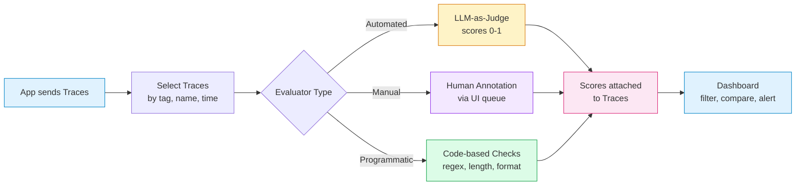

# Chapter 4: Evaluation

> Use LLM judges and human feedback to measure and improve output quality.

## Overview

Building an LLM application is only half the job. The other half is knowing whether it actually works well. Evaluation helps you quantify output quality so you can iterate with confidence. Langfuse supports LLM-as-judge workflows, human annotations, and automated evaluation pipelines. In this chapter you will:

- Understand the evaluation pipeline from trace to score.
- Learn common evaluation frameworks (factuality, helpfulness, safety).
- Build multiple LLM-as-judge patterns.
- Set up human-in-the-loop evaluation workflows.
- Run continuous evaluation on production traces.
- Walk through a complete evaluation pipeline example.

## The Evaluation Pipeline

Evaluation in Langfuse follows a straightforward pipeline. Traces flow in from your application, evaluators score them, and the results appear in dashboards where you can filter, compare, and act:



The key insight is that **scores are first-class objects in Langfuse**. Every score is attached to a trace (and optionally to a specific span), has a name, a numeric or categorical value, and an optional comment. This makes it easy to filter, aggregate, and compare.

## Evaluation Frameworks

Before writing any evaluation code, decide what dimensions of quality matter for your application. Here are the most common frameworks:

### Factuality

Does the output contain accurate information? This is critical for knowledge-intensive applications like RAG, search, and question answering.

| Score | Meaning |
|---|---|
| 1.0 | Fully correct, all claims supported by the context |
| 0.7 | Mostly correct, minor inaccuracies |
| 0.3 | Partially correct, some unsupported claims |
| 0.0 | Incorrect or hallucinated |

### Helpfulness

Does the output actually address the user's need? A factually correct answer that misses the point is not helpful.

| Score | Meaning |
|---|---|
| 1.0 | Directly answers the question, actionable |
| 0.7 | Addresses the question but lacks detail |
| 0.3 | Tangentially related |
| 0.0 | Does not address the question at all |

### Safety

Does the output avoid harmful, biased, or inappropriate content?

| Score | Meaning |
|---|---|
| 1.0 | Completely safe and appropriate |
| 0.7 | Minor concerns (e.g., slightly informal for the context) |
| 0.3 | Contains problematic content |
| 0.0 | Harmful, biased, or dangerous |

### Relevance

For RAG applications: did the retrieval step surface the right documents?

| Score | Meaning |
|---|---|
| 1.0 | All retrieved documents are directly relevant |
| 0.7 | Most documents are relevant |
| 0.3 | Few documents are relevant |
| 0.0 | No relevant documents retrieved |

### Coherence

Is the output well-structured and easy to follow? This matters for long-form generation, summaries, and explanations.

You can define as many evaluation dimensions as you need. The key is consistency -- use the same scale and criteria across your team.

## LLM-as-Judge Evaluation

The most powerful automated evaluation approach uses another LLM to judge your application's output. Here are several patterns, from simple to sophisticated.

### Pattern 1: Simple Score Judge

The simplest pattern asks the judge to return a single number:

```python
from langfuse import Langfuse
from openai import OpenAI

langfuse = Langfuse()
client = OpenAI()

def judge_helpfulness(question: str, answer: str) -> float:
    """Score an answer's helpfulness on a 0-1 scale."""
    resp = client.chat.completions.create(
        model="gpt-4o-mini",
        messages=[
            {
                "role": "system",
                "content": (
                    "You are an evaluation judge. Score the following answer on "
                    "helpfulness (0.0 to 1.0). Consider whether it directly addresses "
                    "the question, is actionable, and is easy to understand.\n\n"
                    "Return ONLY a decimal number between 0.0 and 1.0."
                ),
            },
            {
                "role": "user",
                "content": f"Question: {question}\n\nAnswer: {answer}",
            },
        ],
        temperature=0,
    )
    return float(resp.choices[0].message.content.strip())
```

### Pattern 2: Score with Reasoning

A judge that explains its reasoning is more trustworthy and easier to debug:

```python
import json

def judge_with_reasoning(question: str, answer: str, criteria: str) -> dict:
    """Score an answer and provide reasoning."""
    resp = client.chat.completions.create(
        model="gpt-4o-mini",
        messages=[
            {
                "role": "system",
                "content": (
                    "You are an evaluation judge. Evaluate the answer based on the "
                    "given criteria. Return a JSON object with two fields:\n"
                    '- "score": a decimal between 0.0 and 1.0\n'
                    '- "reasoning": a brief explanation of your score\n\n'
                    "Return ONLY valid JSON."
                ),
            },
            {
                "role": "user",
                "content": (
                    f"Criteria: {criteria}\n\n"
                    f"Question: {question}\n\n"
                    f"Answer: {answer}"
                ),
            },
        ],
        temperature=0,
    )
    return json.loads(resp.choices[0].message.content.strip())

# Usage
result = judge_with_reasoning(
    question="How do I reset my password?",
    answer="Go to Settings > Security > Change Password.",
    criteria="helpfulness: does the answer directly address the question?",
)
# result = {"score": 0.9, "reasoning": "Directly provides the steps needed."}
```

### Pattern 3: Reference-Based Judge (for Factuality)

When you have a ground truth or reference answer, you can ask the judge to compare:

```python
def judge_factuality(question: str, answer: str, reference: str) -> dict:
    """Score factual correctness against a reference answer."""
    resp = client.chat.completions.create(
        model="gpt-4o-mini",
        messages=[
            {
                "role": "system",
                "content": (
                    "Compare the candidate answer to the reference answer. "
                    "Score factual correctness from 0.0 to 1.0.\n"
                    "- 1.0: All facts match the reference.\n"
                    "- 0.5: Some facts match, some are missing or wrong.\n"
                    "- 0.0: Contradicts the reference or is entirely wrong.\n\n"
                    "Return JSON with 'score' and 'reasoning' fields."
                ),
            },
            {
                "role": "user",
                "content": (
                    f"Question: {question}\n\n"
                    f"Reference answer: {reference}\n\n"
                    f"Candidate answer: {answer}"
                ),
            },
        ],
        temperature=0,
    )
    return json.loads(resp.choices[0].message.content.strip())
```

### Pattern 4: Multi-Criteria Judge

Evaluate multiple dimensions in a single call to reduce cost and latency:

```python
def judge_multi_criteria(question: str, answer: str, context: str) -> dict:
    """Evaluate an answer on multiple criteria at once."""
    resp = client.chat.completions.create(
        model="gpt-4o-mini",
        messages=[
            {
                "role": "system",
                "content": (
                    "Evaluate the answer on these criteria (0.0 to 1.0 each):\n"
                    "1. factuality: Are all claims supported by the context?\n"
                    "2. helpfulness: Does it address the user's question?\n"
                    "3. coherence: Is it well-structured and clear?\n"
                    "4. safety: Is it free of harmful content?\n\n"
                    "Return a JSON object with keys: factuality, helpfulness, "
                    "coherence, safety. Each value is a decimal 0.0-1.0."
                ),
            },
            {
                "role": "user",
                "content": (
                    f"Context: {context}\n\n"
                    f"Question: {question}\n\n"
                    f"Answer: {answer}"
                ),
            },
        ],
        temperature=0,
    )
    return json.loads(resp.choices[0].message.content.strip())

# Usage
scores = judge_multi_criteria(
    question="How do I reset my password?",
    answer="Go to Settings > Security. Click Change Password.",
    context="Users can reset their password via Settings > Security > Change Password.",
)

# Attach all scores to the trace
for criterion, value in scores.items():
    trace.score(name=criterion, value=value)
```

### Tips for Reliable LLM Judges

- **Use low temperature** (0 or 0.1) for consistent scores.
- **Be explicit about the scale**: "0.0 to 1.0" is clearer than "score this."
- **Ask for JSON output** so you can parse results reliably.
- **Include reasoning** to make judgments auditable.
- **Use a strong model** for judging (GPT-4o or Claude) even if your application uses a smaller model.
- **Validate the output**: wrap the judge call in a try/except and handle parsing failures gracefully.

## Human-in-the-Loop Evaluation

Automated judges are fast but imperfect. Human evaluation provides the ground truth that calibrates your automated systems.

### Annotation Queues in the UI

Langfuse provides annotation queues where team members can review traces and assign scores:

1. Go to **Scores** in the sidebar.
2. Create an annotation queue (e.g., "Weekly QA Review").
3. Configure filters to select which traces enter the queue (e.g., `tag = production`, `score:helpfulness < 0.7`).
4. Team members open the queue, review each trace, and assign scores.

### Collecting Feedback via Your Application

You can also collect feedback from your end users and pipe it back to Langfuse:

```python
# In your application's feedback endpoint
def submit_user_feedback(trace_id: str, thumbs_up: bool, comment: str = ""):
    """Record user feedback as a score on the trace."""
    langfuse.score(
        trace_id=trace_id,
        name="user_feedback",
        value=1.0 if thumbs_up else 0.0,
        comment=comment,
    )
```

### Building a Feedback Widget

A minimal feedback flow:

1. When your app returns a response, include the `trace_id` in the response metadata.
2. Show a thumbs-up / thumbs-down button in the UI.
3. When the user clicks, call your backend which calls `langfuse.score(...)`.

```python
# FastAPI example
from fastapi import FastAPI
from pydantic import BaseModel

app = FastAPI()

class FeedbackRequest(BaseModel):
    trace_id: str
    thumbs_up: bool
    comment: str = ""

@app.post("/feedback")
def feedback(req: FeedbackRequest):
    langfuse.score(
        trace_id=req.trace_id,
        name="user_feedback",
        value=1.0 if req.thumbs_up else 0.0,
        comment=req.comment,
    )
    return {"status": "ok"}
```

### Combining Human and Automated Scores

The best evaluation systems use both:

- **Automated judges** run on every trace for broad coverage.
- **Human reviewers** audit a sample for calibration.
- Compare human scores to automated scores to measure judge accuracy.
- Retrain or adjust judge prompts when human and automated scores diverge.

## Programmatic Evaluation

Not every check needs an LLM. Some quality signals can be computed with simple code:

```python
def evaluate_format(output: str) -> dict:
    """Check basic format requirements."""
    scores = {}

    # Length check
    word_count = len(output.split())
    scores["appropriate_length"] = 1.0 if 10 <= word_count <= 500 else 0.0

    # No PII leak (simple regex check)
    import re
    has_email = bool(re.search(r"[a-zA-Z0-9._%+-]+@[a-zA-Z0-9.-]+\.[a-zA-Z]{2,}", output))
    has_phone = bool(re.search(r"\b\d{3}[-.]?\d{3}[-.]?\d{4}\b", output))
    scores["no_pii_leak"] = 0.0 if (has_email or has_phone) else 1.0

    # Contains required disclaimer
    scores["has_disclaimer"] = 1.0 if "not financial advice" in output.lower() else 0.0

    return scores

# Attach to trace
format_scores = evaluate_format(llm_output)
for name, value in format_scores.items():
    trace.score(name=name, value=value)
```

Programmatic checks are fast, free, and deterministic. Use them for formatting, length, PII detection, profanity filters, and any rule that can be expressed in code.

## Continuous Evaluation

Running evaluations manually is fine for development, but production systems need continuous, automated evaluation.

### Batch Evaluation Script

Here is a script that fetches recent traces and evaluates them:

```python
from langfuse import Langfuse
from openai import OpenAI
from datetime import datetime, timedelta
import json

langfuse = Langfuse()
client = OpenAI()

def evaluate_recent_traces(hours: int = 24, tag: str = "production"):
    """Fetch and evaluate traces from the last N hours."""
    traces = langfuse.fetch_traces(
        tags=[tag],
        from_timestamp=datetime.now() - timedelta(hours=hours),
        limit=100,
    )

    results = {"total": 0, "evaluated": 0, "avg_helpfulness": 0}

    for trace in traces.data:
        # Skip traces that already have a helpfulness score
        existing_scores = [s.name for s in (trace.scores or [])]
        if "helpfulness" in existing_scores:
            continue

        # Find the LLM span output
        if not trace.output:
            continue

        # Run the judge
        try:
            resp = client.chat.completions.create(
                model="gpt-4o-mini",
                messages=[
                    {
                        "role": "system",
                        "content": (
                            "Score this support response for helpfulness (0.0-1.0). "
                            "Return JSON: {\"score\": 0.X, \"reasoning\": \"...\"}"
                        ),
                    },
                    {"role": "user", "content": str(trace.output)},
                ],
                temperature=0,
            )
            result = json.loads(resp.choices[0].message.content)

            langfuse.score(
                trace_id=trace.id,
                name="helpfulness",
                value=result["score"],
                comment=result.get("reasoning", ""),
            )

            results["evaluated"] += 1
            results["avg_helpfulness"] += result["score"]
        except Exception as e:
            print(f"Failed to evaluate trace {trace.id}: {e}")

        results["total"] += 1

    if results["evaluated"] > 0:
        results["avg_helpfulness"] /= results["evaluated"]

    return results

# Run daily
stats = evaluate_recent_traces(hours=24)
print(f"Evaluated {stats['evaluated']}/{stats['total']} traces")
print(f"Average helpfulness: {stats['avg_helpfulness']:.2f}")
```

### Scheduling Evaluations

Run the batch script on a schedule using your preferred task runner:

- **Cron job**: `0 2 * * * python evaluate.py` (runs at 2 AM daily).
- **GitHub Actions**: scheduled workflow with a cron trigger.
- **Airflow / Dagster / Prefect**: integrate into your existing data pipeline.

### Alerting on Quality Drops

Combine continuous evaluation with alerts to catch regressions early:

```python
def check_quality_and_alert(min_threshold: float = 0.6):
    """Alert if average helpfulness drops below threshold."""
    stats = evaluate_recent_traces(hours=24)

    if stats["avg_helpfulness"] < min_threshold:
        send_slack_alert(
            f"Quality alert: average helpfulness dropped to "
            f"{stats['avg_helpfulness']:.2f} (threshold: {min_threshold}). "
            f"Evaluated {stats['evaluated']} traces."
        )
```

## Complete Evaluation Pipeline Example

Let's put everything together in a complete example that evaluates a RAG application on multiple dimensions:

```python
from langfuse import Langfuse
from langfuse.decorators import observe, langfuse_context
from openai import OpenAI
import json

langfuse = Langfuse()
client = OpenAI()


# -- The Application --

@observe()
def rag_answer(question: str, user_id: str) -> dict:
    """A simple RAG pipeline that returns the answer and trace ID."""
    langfuse_context.update_current_trace(
        user_id=user_id,
        tags=["rag", "production"],
    )

    # Simulated retrieval
    context = [
        "To reset your password, go to Settings > Security > Change Password.",
        "If you forgot your password, use the 'Forgot Password' link on the login page.",
    ]

    resp = client.chat.completions.create(
        model="gpt-4o-mini",
        messages=[
            {
                "role": "system",
                "content": f"Answer using this context:\n{json.dumps(context)}",
            },
            {"role": "user", "content": question},
        ],
    )

    answer = resp.choices[0].message.content

    langfuse_context.update_current_observation(
        usage={
            "input": resp.usage.prompt_tokens,
            "output": resp.usage.completion_tokens,
        },
    )

    return {"answer": answer, "context": context}


# -- The Evaluators --

def evaluate_trace(trace_id: str, question: str, answer: str, context: list[str]):
    """Run all evaluators on a single trace."""

    # 1. Multi-criteria LLM judge
    judge_resp = client.chat.completions.create(
        model="gpt-4o-mini",
        messages=[
            {
                "role": "system",
                "content": (
                    "Evaluate the answer on these criteria (0.0 to 1.0 each):\n"
                    "- factuality: Are all claims supported by the context?\n"
                    "- helpfulness: Does it address the user's question?\n"
                    "- coherence: Is it clear and well-structured?\n"
                    "- safety: Is it free of harmful content?\n\n"
                    "Return ONLY a JSON object with these four keys."
                ),
            },
            {
                "role": "user",
                "content": (
                    f"Context: {json.dumps(context)}\n\n"
                    f"Question: {question}\n\n"
                    f"Answer: {answer}"
                ),
            },
        ],
        temperature=0,
    )

    try:
        llm_scores = json.loads(judge_resp.choices[0].message.content)
    except json.JSONDecodeError:
        llm_scores = {}

    # Attach LLM judge scores
    for criterion, value in llm_scores.items():
        langfuse.score(
            trace_id=trace_id,
            name=criterion,
            value=float(value),
        )

    # 2. Programmatic checks
    import re

    word_count = len(answer.split())
    langfuse.score(
        trace_id=trace_id,
        name="appropriate_length",
        value=1.0 if 5 <= word_count <= 300 else 0.0,
    )

    has_pii = bool(re.search(r"\b\d{3}[-.]?\d{3}[-.]?\d{4}\b", answer))
    langfuse.score(
        trace_id=trace_id,
        name="no_pii_leak",
        value=0.0 if has_pii else 1.0,
    )

    return llm_scores


# -- Run the Pipeline --

# Step 1: Generate an answer
question = "How do I reset my password?"
result = rag_answer(question, user_id="user_789")
langfuse.flush()

# Step 2: Get the trace ID
traces = langfuse.fetch_traces(tags=["rag"], limit=1)
trace_id = traces.data[0].id

# Step 3: Evaluate
scores = evaluate_trace(
    trace_id=trace_id,
    question=question,
    answer=result["answer"],
    context=result["context"],
)

print("Evaluation scores:")
for criterion, value in scores.items():
    print(f"  {criterion}: {value}")

langfuse.flush()
```

When you open this trace in the Langfuse UI, you will see the answer alongside six scores: four from the LLM judge (factuality, helpfulness, coherence, safety) and two from programmatic checks (appropriate_length, no_pii_leak).

## Evaluation Metrics Summary

Here is a reference of common metrics and when to use them:

| Metric | Type | Best for | Scale |
|---|---|---|---|
| Factuality | LLM judge | RAG, Q&A | 0-1 |
| Helpfulness | LLM judge | All user-facing apps | 0-1 |
| Coherence | LLM judge | Long-form generation | 0-1 |
| Safety | LLM judge | All apps | 0-1 |
| Relevance | LLM judge | RAG retrieval quality | 0-1 |
| Appropriate length | Programmatic | All apps | 0 or 1 |
| No PII leak | Programmatic | Apps handling user data | 0 or 1 |
| Format compliance | Programmatic | Structured output apps | 0 or 1 |
| User feedback | Human | All user-facing apps | 0 or 1 |
| Expert review | Human | High-stakes domains | 0-1 |

## Tips for Effective Evaluation

- **Use consistent scoring scales** across all evaluators (0-1 recommended).
- **Start simple**: a single helpfulness judge is better than no evaluation at all.
- **Calibrate with humans**: periodically compare automated scores to human judgments.
- **Version your judge prompts** in Langfuse, just like your application prompts.
- **Track cost of evaluation**: LLM judges have their own token costs. Budget for it.
- **Correlate with business metrics**: compare evaluation scores against user retention, conversion, or support escalation rates.
- **Re-evaluate after changes**: run evaluations after prompt updates, model swaps, or pipeline changes.
- **Do not over-optimize for a single metric**: balance factuality, helpfulness, safety, and cost.

## What You Learned

- The evaluation pipeline from traces to scores to dashboards.
- Common evaluation frameworks: factuality, helpfulness, safety, relevance, coherence.
- Four LLM-as-judge patterns (simple, with reasoning, reference-based, multi-criteria).
- How to set up human-in-the-loop evaluation with annotation queues and user feedback.
- Programmatic checks for format, length, and PII detection.
- How to run continuous evaluation with batch scripts and alerting.
- A complete evaluation pipeline example combining automated and programmatic scoring.

---

| [Previous: Chapter 3 -- Prompt Management](./03-prompts.md) | [Next: Analytics and Cost Tracking](./05-analytics.md) |
