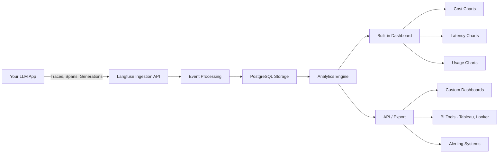

# Chapter 5: Analytics & Metrics

Welcome to **Chapter 5: Analytics & Metrics**. In this part of **Langfuse Tutorial: LLM Observability, Evaluation, and Prompt Operations**, you will build an intuitive mental model first, then move into concrete implementation details and practical production tradeoffs.


> Track costs, latency, usage patterns, and ROI of your LLM applications.

Previous: [Chapter 4: Evaluation](04-evaluation.md)

## Overview

Once your LLM application is running and traces are flowing into Langfuse, the next question is: how well is it actually performing? Analytics and metrics give you the answers. Langfuse provides a rich dashboard for monitoring costs, latency, error rates, and usage patterns -- all in real time. In this chapter, you will learn how to use those built-in tools, build custom dashboards on top of the data, set up alerts, and run cost optimization strategies that can save you real money.

## Analytics Data Flow

Before diving in, it helps to understand how analytics data moves through Langfuse:



Every trace, span, and generation that your application sends is ingested, processed, and stored. The analytics engine then aggregates this data and makes it available through the UI dashboard and the API. You can consume the data directly in Langfuse, export it for external analysis, or pipe it into alerting systems.

## Cost Tracking

Monitoring spending is one of the most immediately useful features of Langfuse. Costs are automatically captured whenever your traces include usage metadata:

```python
# Costs are automatically captured from usage metadata
trace = langfuse.trace(name="customer-query", user_id="user_42")

generation = trace.generation(
    name="llm-call",
    model="gpt-4o-mini",
    usage={
        "input": 150,        # input tokens
        "output": 50,         # output tokens
        "total": 200,         # total tokens
        "input_cost": 0.0001, # cost in USD for input
        "output_cost": 0.0002,# cost in USD for output
        "total_cost": 0.0003, # total cost in USD
    }
)
```

If you are using a supported integration (OpenAI SDK wrapper, LangChain callback, etc.), token counts and costs are captured automatically -- you do not need to compute them yourself.

### Aggregating Costs by Model

A common first step is understanding which models are eating up your budget:

```python
from collections import defaultdict
from langfuse import Langfuse

langfuse = Langfuse()

traces = langfuse.get_traces(
    limit=1000,
    filters={"tags": ["production"]}
)

cost_by_model = defaultdict(float)
for trace in traces:
    for observation in trace.observations:
        if observation.type == "GENERATION" and observation.usage:
            model = observation.model or "unknown"
            cost_by_model[model] += observation.usage.get("total_cost", 0)

for model, cost in sorted(cost_by_model.items(), key=lambda x: -x[1]):
    print(f"{model}: ${cost:.4f}")
```

This gives you a clear picture of which models to focus on when optimizing.

## Key Metrics Dashboard

The Langfuse UI provides a built-in dashboard with the most important metrics at a glance:

- **Total Traces**: Request volume over time, shown as a time-series chart
- **Latency**: P50, P90, and P95 response times broken down by span type
- **Cost**: Daily and weekly spending with breakdowns by model and user
- **Token Usage**: Input versus output tokens, helping you spot verbose prompts
- **Error Rate**: Percentage of traces that ended in failure
- **User Activity**: Active users, session counts, and engagement trends
- **Score Distribution**: How your evaluation scores are distributed over time

You can filter the dashboard by date range, tags, user segments, and more. This makes it easy to compare different time periods or isolate a specific feature for analysis.

## Latency Analysis

Latency is often the most visible metric to your end users. A slow response can ruin the experience, no matter how accurate the answer is.

### Understanding Percentiles

Langfuse reports latency using percentiles rather than simple averages, because averages can hide problems. Here is what each percentile tells you:

- **P50 (median)**: Half of all requests complete faster than this. This represents the "typical" user experience.
- **P90**: 90% of requests complete faster than this. This catches the slower tail that affects a meaningful chunk of users.
- **P95**: 95% of requests complete faster than this. This is the standard SLA metric for most production systems.
- **P99**: 99% of requests complete faster than this. This reveals extreme outliers that might indicate infrastructure problems.

For example, if your P50 is 1.2 seconds but your P95 is 8.5 seconds, that tells you most users are happy but a significant minority is having a terrible experience. Investigating those slow requests often reveals issues like cold starts, model congestion, or unnecessarily long prompts.

### Tracking Latency by Span

You can break down latency by span type to find bottlenecks:

```python
traces = langfuse.get_traces(
    limit=500,
    filters={"tags": ["production"]}
)

latencies_by_span = defaultdict(list)
for trace in traces:
    for observation in trace.observations:
        if observation.start_time and observation.end_time:
            duration = (observation.end_time - observation.start_time).total_seconds()
            latencies_by_span[observation.name].append(duration)

# Calculate percentiles
import numpy as np

for span_name, durations in latencies_by_span.items():
    p50 = np.percentile(durations, 50)
    p90 = np.percentile(durations, 90)
    p95 = np.percentile(durations, 95)
    print(f"{span_name}: P50={p50:.2f}s  P90={p90:.2f}s  P95={p95:.2f}s")
```

This helps you answer questions like: "Is it the retrieval step or the generation step that is slow?"

## Building Custom Dashboards

While the built-in dashboard covers the basics, you may want custom views tailored to your application. Langfuse's API makes this straightforward.

### Querying Traces for Custom Metrics

```python
from datetime import datetime, timedelta

langfuse = Langfuse()

# Get traces from the last 7 days
one_week_ago = (datetime.now() - timedelta(days=7)).isoformat()

traces = langfuse.get_traces(
    limit=2000,
    filters={
        "tags": ["production"],
        "date_range": {"gte": one_week_ago},
    }
)

# Calculate daily cost breakdown
daily_costs = defaultdict(float)
for trace in traces:
    day = trace.timestamp.strftime("%Y-%m-%d")
    daily_costs[day] += trace.total_cost or 0

for day in sorted(daily_costs.keys()):
    print(f"{day}: ${daily_costs[day]:.2f}")
```

### Building a Streamlit Dashboard

If you want a quick interactive dashboard, Streamlit works well:

```python
import streamlit as st
import pandas as pd
from langfuse import Langfuse

langfuse = Langfuse()

st.title("LLM Application Dashboard")

# Date range selector
days = st.slider("Days to analyze", 1, 30, 7)
traces = langfuse.get_traces(limit=5000, filters={
    "date_range": {"gte": (datetime.now() - timedelta(days=days)).isoformat()}
})

# Cost over time
df = pd.DataFrame([{
    "date": t.timestamp.date(),
    "cost": t.total_cost or 0,
    "latency": t.latency or 0,
} for t in traces])

st.subheader("Daily Cost")
st.line_chart(df.groupby("date")["cost"].sum())

st.subheader("Latency Distribution")
st.bar_chart(df["latency"].describe())

st.subheader("Top Users by Cost")
user_costs = defaultdict(float)
for t in traces:
    user_costs[t.user_id or "anonymous"] += t.total_cost or 0
st.table(sorted(user_costs.items(), key=lambda x: -x[1])[:10])
```

### Connecting to BI Tools

For larger organizations, you may want to export data into a data warehouse and use BI tools like Tableau, Looker, or Metabase. Langfuse supports data export:

```python
# Export traces to a pandas DataFrame for further analysis
import pandas as pd

traces = langfuse.get_traces(limit=10000, filters={"tags": ["production"]})

df = pd.DataFrame([{
    "trace_id": t.id,
    "user_id": t.user_id,
    "timestamp": t.timestamp,
    "latency": t.latency,
    "cost": t.total_cost,
    "model": t.metadata.get("model", "unknown") if t.metadata else "unknown",
    "tags": ",".join(t.tags or []),
} for t in traces])

# Export to CSV for BI tools
df.to_csv("langfuse_export.csv", index=False)

# Or push directly to a data warehouse
# df.to_sql("langfuse_traces", engine, if_exists="append")
```

## Cost Optimization Strategies

LLM costs can grow quickly, especially at scale. Here are practical strategies to bring them down, along with concrete examples.

### Strategy 1: Model Tiering

Not every request needs your most expensive model. Route simple queries to cheaper models:

```python
def route_to_model(query: str, complexity_score: float) -> str:
    """Route queries to appropriate models based on complexity."""
    if complexity_score < 0.3:
        return "gpt-4o-mini"      # ~$0.15 per 1M input tokens
    elif complexity_score < 0.7:
        return "gpt-4o"           # ~$2.50 per 1M input tokens
    else:
        return "gpt-4o"           # Use the best model for hard queries

# Track the routing decision in your trace
trace = langfuse.trace(name="routed-query", metadata={
    "complexity_score": complexity_score,
    "selected_model": model,
    "routing_reason": "complexity-based"
})
```

### Strategy 2: Prompt Optimization

Shorter prompts cost less. Analyze your token usage to find bloated prompts:

```python
# Find traces with high input-to-output token ratios
traces = langfuse.get_traces(limit=1000, filters={"tags": ["production"]})

bloated_prompts = []
for trace in traces:
    for obs in trace.observations:
        if obs.type == "GENERATION" and obs.usage:
            input_tokens = obs.usage.get("input", 0)
            output_tokens = obs.usage.get("output", 0)
            if input_tokens > 0 and output_tokens > 0:
                ratio = input_tokens / output_tokens
                if ratio > 10:  # Input is 10x the output -- likely bloated
                    bloated_prompts.append({
                        "trace_id": trace.id,
                        "ratio": ratio,
                        "input_tokens": input_tokens,
                    })

print(f"Found {len(bloated_prompts)} traces with bloated prompts")
```

### Strategy 3: Caching Repeated Queries

If users frequently ask similar questions, cache the responses:

```python
import hashlib

def get_cached_or_generate(query: str, cache: dict) -> str:
    cache_key = hashlib.sha256(query.strip().lower().encode()).hexdigest()

    if cache_key in cache:
        # Log cache hit in Langfuse
        trace = langfuse.trace(name="cached-response", metadata={"cache_hit": True})
        return cache[cache_key]

    # Generate and cache
    response = generate_response(query)
    cache[cache_key] = response

    trace = langfuse.trace(name="generated-response", metadata={"cache_hit": False})
    return response
```

### Strategy 4: Token Budget Limits

Set hard limits on token usage to prevent runaway costs:

```python
MAX_TOKENS_PER_USER_PER_DAY = 50000

def check_budget(user_id: str) -> bool:
    """Check if user is within their daily token budget."""
    today = datetime.now().strftime("%Y-%m-%d")
    traces = langfuse.get_traces(
        limit=500,
        filters={
            "user_id": user_id,
            "date_range": {"gte": today},
        }
    )
    total_tokens = sum(t.total_tokens or 0 for t in traces)
    return total_tokens < MAX_TOKENS_PER_USER_PER_DAY
```

## ROI Analysis

Beyond cost tracking, you want to understand the return on your LLM investment. Here are practical formulas you can implement.

### Cost Per Successful Interaction

```python
# Cost per successful interaction
traces = langfuse.get_traces(limit=1000, filters={"tags": ["production"]})

total_cost = sum(t.total_cost or 0 for t in traces)
successful = sum(1 for t in traces if t.scores and t.scores.get("success", 0) >= 0.8)
total_traces = len(traces)

cost_per_success = total_cost / successful if successful > 0 else float("inf")
success_rate = successful / total_traces if total_traces > 0 else 0

print(f"Total cost: ${total_cost:.2f}")
print(f"Success rate: {success_rate:.1%}")
print(f"Cost per successful interaction: ${cost_per_success:.4f}")
```

### Value Generated Per Dollar Spent

If you can quantify the value of each successful interaction (for example, a resolved support ticket saves $15 in human agent time), you can compute ROI:

```python
# ROI calculation
VALUE_PER_SUCCESS = 15.00  # dollars saved per successful AI resolution

total_value = successful * VALUE_PER_SUCCESS
roi = (total_value - total_cost) / total_cost * 100 if total_cost > 0 else 0

print(f"Value generated: ${total_value:.2f}")
print(f"LLM cost: ${total_cost:.2f}")
print(f"Net value: ${total_value - total_cost:.2f}")
print(f"ROI: {roi:.0f}%")
```

### Tracking ROI Over Time

Attach business metadata to your traces so you can correlate LLM performance with business outcomes:

```python
trace = langfuse.trace(
    name="customer-support",
    user_id="user_42",
    metadata={
        "ticket_id": "12345",
        "resolution_time_minutes": 15,
        "customer_satisfaction": 4.5,
        "was_escalated": False,
        "estimated_value_saved": 15.00,
    }
)
```

Over time, you can aggregate this data to show stakeholders exactly how much value the LLM application is delivering.

## Alert Configuration

Setting up alerts ensures that you catch problems before your users do. Here are recommended thresholds for common metrics, along with how to implement them.

### Recommended Alert Thresholds

| Metric | Warning Threshold | Critical Threshold | Why It Matters |
|--------|-------------------|-------------------|----------------|
| Daily cost | 120% of 7-day average | 200% of 7-day average | Catches unexpected cost spikes |
| P95 latency | > 5 seconds | > 10 seconds | Users abandon slow responses |
| Error rate | > 3% | > 10% | Indicates model or API issues |
| Token usage | > 150% of baseline | > 300% of baseline | May signal prompt injection or loops |
| Success score | < 0.75 average | < 0.5 average | Quality is degrading |

### Implementing Alerts with the API

You can build a simple alerting script that runs on a schedule:

```python
import smtplib
from datetime import datetime, timedelta

def check_alerts():
    """Check key metrics and send alerts if thresholds are exceeded."""
    yesterday = (datetime.now() - timedelta(days=1)).isoformat()
    traces = langfuse.get_traces(
        limit=5000,
        filters={"date_range": {"gte": yesterday}, "tags": ["production"]}
    )

    if not traces:
        return

    # Cost alert
    daily_cost = sum(t.total_cost or 0 for t in traces)
    if daily_cost > 100:  # $100/day threshold
        send_alert(f"High daily cost: ${daily_cost:.2f}")

    # Latency alert
    latencies = [t.latency for t in traces if t.latency]
    if latencies:
        p95 = sorted(latencies)[int(len(latencies) * 0.95)]
        if p95 > 5.0:
            send_alert(f"High P95 latency: {p95:.1f}s")

    # Error rate alert
    errors = sum(1 for t in traces if t.status == "ERROR")
    error_rate = errors / len(traces)
    if error_rate > 0.05:
        send_alert(f"High error rate: {error_rate:.1%}")

def send_alert(message: str):
    """Send alert via email, Slack, PagerDuty, etc."""
    print(f"ALERT: {message}")
    # In production, integrate with your alerting system:
    # - Slack webhook
    # - PagerDuty API
    # - Email via SMTP
    # - Opsgenie, etc.
```

### Integrating with Slack

For quick Slack alerts:

```python
import requests

def send_slack_alert(message: str, webhook_url: str):
    requests.post(webhook_url, json={
        "text": f":warning: Langfuse Alert: {message}",
        "channel": "#llm-alerts",
    })
```

## Exporting Data

Export metrics for external analysis, archival, or compliance:

```python
# Export to CSV/JSON for archival
import json

traces = langfuse.get_traces(
    limit=10000,
    filters={"date_range": {"gte": "2024-12-01"}}
)

# JSON export
export_data = [{
    "id": t.id,
    "timestamp": t.timestamp.isoformat(),
    "user_id": t.user_id,
    "cost": t.total_cost,
    "latency": t.latency,
    "status": t.status,
    "tags": t.tags,
} for t in traces]

with open("langfuse_export.json", "w") as f:
    json.dump(export_data, f, indent=2)
```

## Tips

- **Set budgets and alerts early.** It is much easier to prevent cost overruns than to explain them after the fact.
- **Track cost per user and per feature** to identify which parts of your application are the most expensive.
- **Compare A/B test variants by cost and quality** -- a slightly cheaper model that performs nearly as well may be the better choice.
- **Archive old traces** to control storage costs. Langfuse supports data retention policies.
- **Review latency percentiles weekly.** Averages hide problems; percentiles reveal them.
- **Automate ROI reporting** so stakeholders can see the value of your LLM investment without asking.

## Summary

Analytics and metrics are not just nice-to-have -- they are essential for running an LLM application responsibly. In this chapter, you learned how to track costs across models, analyze latency with percentiles, build custom dashboards, implement cost optimization strategies, calculate ROI with real formulas, and set up alerts to catch problems early. With these tools in place, you can confidently scale your application while keeping costs under control.

Next: [Chapter 6: Datasets & Testing](06-datasets.md) -- create test datasets from production traces and run regression tests.

## Depth Expansion Playbook

<!-- depth-expansion-v2 -->

This chapter is expanded to v1-style depth for production-grade learning and implementation quality.

### Strategic Context

- tutorial: **Langfuse Tutorial: LLM Observability, Evaluation, and Prompt Operations**
- tutorial slug: **langfuse-tutorial**
- chapter focus: **Chapter 5: Analytics & Metrics**
- system context: **Langfuse Tutorial**
- objective: move from surface-level usage to repeatable engineering operation

### Architecture Decomposition

1. Define the runtime boundary for `Chapter 5: Analytics & Metrics`.
2. Separate control-plane decisions from data-plane execution.
3. Capture input contracts, transformation points, and output contracts.
4. Trace state transitions across request lifecycle stages.
5. Identify extension hooks and policy interception points.
6. Map ownership boundaries for team and automation workflows.
7. Specify rollback and recovery paths for unsafe changes.
8. Track observability signals for correctness, latency, and cost.

### Operator Decision Matrix

| Decision Area | Low-Risk Path | High-Control Path | Tradeoff |
|:--------------|:--------------|:------------------|:---------|
| Runtime mode | managed defaults | explicit policy config | speed vs control |
| State handling | local ephemeral | durable persisted state | simplicity vs auditability |
| Tool integration | direct API use | mediated adapter layer | velocity vs governance |
| Rollout method | manual change | staged + canary rollout | effort vs safety |
| Incident response | best effort logs | runbooks + SLO alerts | cost vs reliability |

### Failure Modes and Countermeasures

| Failure Mode | Early Signal | Root Cause Pattern | Countermeasure |
|:-------------|:-------------|:-------------------|:---------------|
| stale context | inconsistent outputs | missing refresh window | enforce context TTL and refresh hooks |
| policy drift | unexpected execution | ad hoc overrides | centralize policy profiles |
| auth mismatch | 401/403 bursts | credential sprawl | rotation schedule + scope minimization |
| schema breakage | parser/validation errors | unmanaged upstream changes | contract tests per release |
| retry storms | queue congestion | no backoff controls | jittered backoff + circuit breakers |
| silent regressions | quality drop without alerts | weak baseline metrics | eval harness with thresholds |

### Implementation Runbook

1. Establish a reproducible baseline environment.
2. Capture chapter-specific success criteria before changes.
3. Implement minimal viable path with explicit interfaces.
4. Add observability before expanding feature scope.
5. Run deterministic tests for happy-path behavior.
6. Inject failure scenarios for negative-path validation.
7. Compare output quality against baseline snapshots.
8. Promote through staged environments with rollback gates.
9. Record operational lessons in release notes.

### Quality Gate Checklist

- [ ] chapter-level assumptions are explicit and testable
- [ ] API/tool boundaries are documented with input/output examples
- [ ] failure handling includes retry, timeout, and fallback policy
- [ ] security controls include auth scopes and secret rotation plans
- [ ] observability includes logs, metrics, traces, and alert thresholds
- [ ] deployment guidance includes canary and rollback paths
- [ ] docs include links to upstream sources and related tracks
- [ ] post-release verification confirms expected behavior under load

### Source Alignment

- [Langfuse Repository](https://github.com/langfuse/langfuse)
- [Langfuse Releases](https://github.com/langfuse/langfuse/releases)
- [Langfuse Docs](https://langfuse.com/docs)

### Cross-Tutorial Connection Map

- [LiteLLM Tutorial](../litellm-tutorial/)
- [LangChain Tutorial](../langchain-tutorial/)
- [LlamaIndex Tutorial](../llamaindex-tutorial/)
- [Vercel AI SDK Tutorial](../vercel-ai-tutorial/)
- [Chapter 1: Getting Started](01-getting-started.md)

### Advanced Practice Exercises

1. Build a minimal end-to-end implementation for `Chapter 5: Analytics & Metrics`.
2. Add instrumentation and measure baseline latency and error rate.
3. Introduce one controlled failure and confirm graceful recovery.
4. Add policy constraints and verify they are enforced consistently.
5. Run a staged rollout and document rollback decision criteria.

### Review Questions

1. Which execution boundary matters most for this chapter and why?
2. What signal detects regressions earliest in your environment?
3. What tradeoff did you make between delivery speed and governance?
4. How would you recover from the highest-impact failure mode?
5. What must be automated before scaling to team-wide adoption?

## What Problem Does This Solve?

Most teams struggle here because the hard part is not writing more code, but deciding clear boundaries for `traces`, `trace`, `langfuse` so behavior stays predictable as complexity grows.

In practical terms, this chapter helps you avoid three common failures:

- coupling core logic too tightly to one implementation path
- missing the handoff boundaries between setup, execution, and validation
- shipping changes without clear rollback or observability strategy

After working through this chapter, you should be able to reason about `Chapter 5: Analytics & Metrics` as an operating subsystem inside **Langfuse Tutorial: LLM Observability, Evaluation, and Prompt Operations**, with explicit contracts for inputs, state transitions, and outputs.

Use the implementation notes around `total_cost`, `cost`, `print` as your checklist when adapting these patterns to your own repository.

## How it Works Under the Hood

Under the hood, `Chapter 5: Analytics & Metrics` usually follows a repeatable control path:

1. **Context bootstrap**: initialize runtime config and prerequisites for `traces`.
2. **Input normalization**: shape incoming data so `trace` receives stable contracts.
3. **Core execution**: run the main logic branch and propagate intermediate state through `langfuse`.
4. **Policy and safety checks**: enforce limits, auth scopes, and failure boundaries.
5. **Output composition**: return canonical result payloads for downstream consumers.
6. **Operational telemetry**: emit logs/metrics needed for debugging and performance tuning.

When debugging, walk this sequence in order and confirm each stage has explicit success/failure conditions.

## Source Walkthrough

Use the following upstream sources to verify implementation details while reading this chapter:

- [Langfuse Repository](https://github.com/langfuse/langfuse)
  Why it matters: authoritative reference on `Langfuse Repository` (github.com).
- [Langfuse Releases](https://github.com/langfuse/langfuse/releases)
  Why it matters: authoritative reference on `Langfuse Releases` (github.com).
- [Langfuse Docs](https://langfuse.com/docs)
  Why it matters: authoritative reference on `Langfuse Docs` (langfuse.com).

Suggested trace strategy:
- search upstream code for `traces` and `trace` to map concrete implementation paths
- compare docs claims against actual runtime/config code before reusing patterns in production

## Chapter Connections

- [Tutorial Index](index.md)
- [Previous Chapter: Chapter 4: Evaluation](04-evaluation.md)
- [Next Chapter: Chapter 6: Datasets & Testing](06-datasets.md)
- [Main Catalog](../../README.md#-tutorial-catalog)
- [A-Z Tutorial Directory](../../discoverability/tutorial-directory.md)
