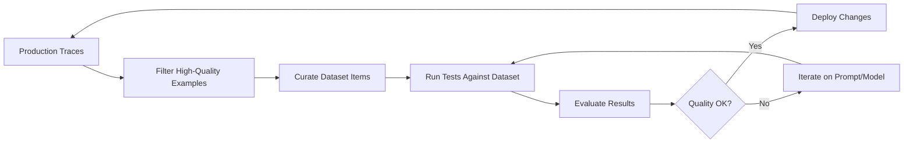

# Chapter 6: Datasets & Testing

Welcome to **Chapter 6: Datasets & Testing**. In this part of **Langfuse Tutorial: LLM Observability, Evaluation, and Prompt Operations**, you will build an intuitive mental model first, then move into concrete implementation details and practical production tradeoffs.


> Create test suites from production traces and run regression tests.

Previous: [Chapter 5: Analytics & Metrics](05-analytics.md)

## Overview

When you update a prompt, swap a model, or change your retrieval logic, how do you know things did not get worse? The answer is datasets. Langfuse lets you extract real examples from production traces, curate them into test datasets, and run automated regression tests. This gives you confidence that changes improve quality -- or at least do not degrade it.

In this chapter, you will learn how to create datasets from traces, design effective test suites, run evaluations against them, set up CI/CD pipelines for automated testing, manage dataset versions, and compare model performance systematically.

## Dataset Workflow

Here is the high-level workflow for using datasets in Langfuse:



The cycle is continuous: production traces feed new dataset items, which you use to test changes, which then go back into production and generate more traces. Over time, your test suite grows stronger and more representative.

## Dataset Design Principles

Before creating your first dataset, it helps to think about what makes a good one. A poorly designed dataset will give you false confidence, while a well-designed one will catch real regressions.

### Principle 1: Representativeness

Your dataset should reflect the actual distribution of queries your application receives. If 60% of your traffic is simple FAQ questions and 10% is complex multi-step reasoning, your dataset should roughly mirror that ratio. Otherwise, you will optimize for edge cases while ignoring the common case.

### Principle 2: Diversity

Include examples that cover different categories of input:

- **Different user intents**: questions, commands, clarifications, complaints
- **Different input lengths**: short queries, long documents, multi-turn conversations
- **Different languages**: if your app serves multiple locales
- **Different difficulty levels**: easy questions your model always gets right, hard ones it sometimes misses

### Principle 3: Include Failure Cases

Do not only include examples where your model succeeded. Include cases where it failed, hallucinated, or gave a mediocre response. These are the most valuable test cases because they tell you whether a change actually fixes known problems.

### Principle 4: Manageable Size

Start small. A dataset of 50-100 well-chosen examples is far more useful than 10,000 random traces. You can always expand later, but a small, curated dataset is faster to iterate on and easier to review manually.

## Creating Datasets from Traces

The most natural way to build a dataset is to extract examples from production:

```python
from langfuse import Langfuse

langfuse = Langfuse()

# Create a new dataset
dataset = langfuse.create_dataset(
    name="support-qa-v1",
    description="Real customer support conversations, curated for testing",
)

# Fetch high-quality production traces
traces = langfuse.get_traces(
    limit=200,
    filters={
        "tags": ["production"],
        "scores": {"helpfulness": {"gte": 0.9}},
    }
)

# Add selected traces as dataset items
for trace in traces[:50]:  # Start with 50 examples
    langfuse.create_dataset_item(
        dataset_name="support-qa-v1",
        input=trace.input,
        expected_output=trace.output,
        metadata={
            "source_trace_id": trace.id,
            "original_scores": trace.scores,
            "tags": trace.tags,
        }
    )
```

### Dataset Item Structure

Each dataset item has a clear structure:

```python
{
    "input": {
        "messages": [
            {"role": "user", "content": "How do I reset my password?"}
        ],
        "context": "User is on the settings page.",
    },
    "expected_output": "To reset your password, go to Settings > Security > Change Password.",
    "metadata": {
        "tags": ["production", "high-quality"],
        "scores": {"helpfulness": 0.95, "accuracy": 1.0},
        "source_trace_id": "trace_abc123",
        "category": "faq",
        "difficulty": "easy",
    }
}
```

The `metadata` field is flexible -- use it to tag items by category, difficulty, language, or anything else useful for filtering and analysis.

## Running Tests Against Datasets

Once you have a dataset, you can run your pipeline against it and compare the results:

```python
from datetime import datetime

def run_dataset_test(
    dataset_name: str,
    run_name: str,
    model: str = "gpt-4o-mini",
    prompt_version: str = "v1",
):
    """Run a test against a dataset and log results to Langfuse."""
    dataset = langfuse.get_dataset(dataset_name)
    results = []
    scores = []

    for item in dataset.items:
        # Run your pipeline with the current configuration
        trace = langfuse.trace(
            name="dataset-test",
            metadata={"dataset": dataset_name, "model": model, "prompt_version": prompt_version}
        )

        actual_output = generate_response(
            item.input,
            model=model,
            prompt_version=prompt_version,
        )

        # Evaluate the result
        score = evaluate_similarity(actual_output, item.expected_output)
        scores.append(score)

        # Link the trace to the dataset item
        item.link(trace, run_name=run_name)

        # Score the trace
        trace.score(name="accuracy", value=score)

        results.append({
            "item_id": item.id,
            "expected": item.expected_output,
            "actual": actual_output,
            "score": score,
        })

    # Summary statistics
    avg_score = sum(scores) / len(scores) if scores else 0
    min_score = min(scores) if scores else 0
    pass_rate = sum(1 for s in scores if s >= 0.8) / len(scores) if scores else 0

    print(f"Run: {run_name}")
    print(f"Average score: {avg_score:.3f}")
    print(f"Min score: {min_score:.3f}")
    print(f"Pass rate (>= 0.8): {pass_rate:.1%}")

    return {"avg_score": avg_score, "min_score": min_score, "pass_rate": pass_rate, "results": results}
```

### Interpreting Results

When reviewing test results, look at more than just the average score:

- **Average score**: The overall quality level. Should stay stable or improve.
- **Minimum score**: The worst-case result. A single terrible answer can damage user trust.
- **Pass rate**: The percentage of items that meet your quality threshold. This is often the most actionable metric.
- **Score distribution**: Are scores clustered around 0.9, or spread between 0.5 and 1.0? A tight distribution means consistent quality.

## Golden Dataset Creation

A "golden dataset" is a curated set of examples with expert-verified expected outputs. These are your highest-confidence test cases.

```python
def create_golden_dataset():
    """Create a golden dataset from manually reviewed traces."""
    # Step 1: Filter traces with high scores
    traces = langfuse.get_traces(
        limit=500,
        filters={"scores": {"helpfulness": {"gte": 0.95}, "accuracy": {"gte": 0.95}}}
    )

    # Step 2: Create the dataset
    dataset = langfuse.create_dataset(
        name="golden-support-v1",
        description="Expert-verified examples for regression testing",
    )

    # Step 3: Add items with manual review flag
    for trace in traces[:30]:  # Start with 30 golden examples
        langfuse.create_dataset_item(
            dataset_name="golden-support-v1",
            input=trace.input,
            expected_output=trace.output,
            metadata={
                "reviewed_by": "human-expert",
                "review_date": datetime.now().isoformat(),
                "confidence": "high",
            }
        )

    return dataset
```

The golden dataset should be small (30-50 items), carefully reviewed, and updated only when you are certain about the expected outputs.

## Benchmark Datasets

Beyond testing your own application, you may want benchmark datasets that let you compare models and configurations objectively. Benchmarks differ from golden datasets in that they focus on standardized tasks rather than your specific use case.

### Creating a Benchmark Suite

```python
def create_benchmark_dataset():
    """Create a benchmark dataset for comparing models."""
    benchmarks = [
        {
            "input": {"messages": [{"role": "user", "content": "Summarize this in one sentence: [article text]"}]},
            "expected_output": "A concise one-sentence summary.",
            "metadata": {"category": "summarization", "difficulty": "medium"},
        },
        {
            "input": {"messages": [{"role": "user", "content": "Translate to French: Hello, how are you?"}]},
            "expected_output": "Bonjour, comment allez-vous ?",
            "metadata": {"category": "translation", "difficulty": "easy"},
        },
        {
            "input": {"messages": [{"role": "user", "content": "What is 15% of 240?"}]},
            "expected_output": "36",
            "metadata": {"category": "math", "difficulty": "easy"},
        },
        # Add more benchmark items covering different capabilities
    ]

    dataset = langfuse.create_dataset(
        name="model-benchmark-v1",
        description="Standardized benchmark for comparing model performance",
    )

    for item in benchmarks:
        langfuse.create_dataset_item(
            dataset_name="model-benchmark-v1",
            input=item["input"],
            expected_output=item["expected_output"],
            metadata=item["metadata"],
        )
```

### Running Benchmarks Across Models

```python
models_to_test = ["gpt-4o-mini", "gpt-4o", "claude-3-haiku-20240307"]

benchmark_results = {}
for model in models_to_test:
    result = run_dataset_test(
        dataset_name="model-benchmark-v1",
        run_name=f"benchmark-{model}-{datetime.now().strftime('%Y%m%d')}",
        model=model,
    )
    benchmark_results[model] = result

# Print comparison table
print(f"\n{'Model':<30} {'Avg Score':<12} {'Pass Rate':<12} {'Min Score':<12}")
print("-" * 66)
for model, result in benchmark_results.items():
    print(f"{model:<30} {result['avg_score']:<12.3f} {result['pass_rate']:<12.1%} {result['min_score']:<12.3f}")
```

## Comparing Model Performance

When you are deciding between models (or between prompt versions), you need a systematic approach to comparison.

### Head-to-Head Comparison

```python
def compare_models(dataset_name: str, model_a: str, model_b: str):
    """Run the same dataset against two models and compare results."""
    result_a = run_dataset_test(dataset_name, f"compare-{model_a}", model=model_a)
    result_b = run_dataset_test(dataset_name, f"compare-{model_b}", model=model_b)

    print(f"\nComparison: {model_a} vs {model_b}")
    print(f"{'Metric':<20} {model_a:<20} {model_b:<20}")
    print("-" * 60)
    print(f"{'Avg Score':<20} {result_a['avg_score']:<20.3f} {result_b['avg_score']:<20.3f}")
    print(f"{'Pass Rate':<20} {result_a['pass_rate']:<20.1%} {result_b['pass_rate']:<20.1%}")
    print(f"{'Min Score':<20} {result_a['min_score']:<20.3f} {result_b['min_score']:<20.3f}")

    # Per-item comparison to find where models differ
    wins_a, wins_b, ties = 0, 0, 0
    for ra, rb in zip(result_a["results"], result_b["results"]):
        if ra["score"] > rb["score"] + 0.05:
            wins_a += 1
        elif rb["score"] > ra["score"] + 0.05:
            wins_b += 1
        else:
            ties += 1

    print(f"\n{model_a} wins: {wins_a}  |  {model_b} wins: {wins_b}  |  Ties: {ties}")
```

This gives you a clear picture of which model is better overall and where each model has strengths and weaknesses.

## Dataset Versioning Strategy

As your application evolves, your datasets need to evolve too. Here is a practical versioning approach.

### Naming Convention

Use a clear naming scheme: `{purpose}-{version}`, for example `support-qa-v2` or `golden-support-v3`. Include a description that explains what changed.

### Versioning Workflow

```python
def create_new_dataset_version(
    source_name: str,
    new_version: str,
    add_items: list = None,
    remove_item_ids: list = None,
):
    """Create a new version of a dataset with modifications."""
    source = langfuse.get_dataset(source_name)
    new_name = f"{source_name.rsplit('-v', 1)[0]}-v{new_version}"

    new_dataset = langfuse.create_dataset(
        name=new_name,
        description=f"Version {new_version}. Based on {source_name}.",
    )

    # Copy existing items (minus removals)
    remove_ids = set(remove_item_ids or [])
    for item in source.items:
        if item.id not in remove_ids:
            langfuse.create_dataset_item(
                dataset_name=new_name,
                input=item.input,
                expected_output=item.expected_output,
                metadata={**item.metadata, "copied_from": source_name},
            )

    # Add new items
    for new_item in (add_items or []):
        langfuse.create_dataset_item(
            dataset_name=new_name,
            input=new_item["input"],
            expected_output=new_item["expected_output"],
            metadata=new_item.get("metadata", {}),
        )

    print(f"Created {new_name} with {len(new_dataset.items)} items")
    return new_dataset
```

### When to Create a New Version

- **Adding examples**: You found new edge cases in production that should be tested.
- **Fixing labels**: The expected output for some items was wrong and has been corrected.
- **Removing stale items**: Your application changed and some test cases are no longer relevant.
- **Major prompt changes**: A significant prompt rewrite may require updated expected outputs.

## Automated Regression Testing in CI/CD

Integrating dataset tests into your CI/CD pipeline ensures that every code change is tested before it reaches production.

### GitHub Actions Workflow

```yaml
# .github/workflows/llm-regression.yml
name: LLM Regression Tests

on:
  pull_request:
    paths:
      - 'prompts/**'
      - 'src/llm/**'
      - 'config/models.yaml'

jobs:
  regression-test:
    runs-on: ubuntu-latest
    timeout-minutes: 30

    steps:
      - uses: actions/checkout@v4

      - name: Setup Python
        uses: actions/setup-python@v5
        with:
          python-version: '3.11'

      - name: Install dependencies
        run: |
          pip install langfuse openai numpy

      - name: Run golden dataset tests
        env:
          LANGFUSE_PUBLIC_KEY: ${{ secrets.LANGFUSE_PUBLIC_KEY }}
          LANGFUSE_SECRET_KEY: ${{ secrets.LANGFUSE_SECRET_KEY }}
          LANGFUSE_HOST: ${{ secrets.LANGFUSE_HOST }}
          OPENAI_API_KEY: ${{ secrets.OPENAI_API_KEY }}
        run: python tests/test_llm_regression.py

      - name: Check results
        run: |
          python -c "
          import json
          with open('test_results.json') as f:
              results = json.load(f)
          if results['pass_rate'] < 0.85:
              print(f'FAIL: Pass rate {results[\"pass_rate\"]:.1%} is below 85% threshold')
              exit(1)
          if results['avg_score'] < 0.80:
              print(f'FAIL: Average score {results[\"avg_score\"]:.3f} is below 0.80 threshold')
              exit(1)
          print(f'PASS: Score={results[\"avg_score\"]:.3f}, Pass rate={results[\"pass_rate\"]:.1%}')
          "
```

### The Test Script

```python
# tests/test_llm_regression.py
import json
from langfuse import Langfuse

langfuse = Langfuse()

def test_golden_dataset():
    dataset = langfuse.get_dataset("golden-support-v1")
    scores = []

    for item in dataset.items:
        trace = langfuse.trace(name="regression-test")
        output = generate_response(item.input)
        score = evaluate_similarity(output, item.expected_output)
        scores.append(score)
        item.link(trace, run_name=f"ci-{os.environ.get('GITHUB_SHA', 'local')[:8]}")
        trace.score(name="accuracy", value=score)

    results = {
        "avg_score": sum(scores) / len(scores),
        "min_score": min(scores),
        "pass_rate": sum(1 for s in scores if s >= 0.8) / len(scores),
        "total_items": len(scores),
    }

    with open("test_results.json", "w") as f:
        json.dump(results, f)

    langfuse.flush()
    return results

if __name__ == "__main__":
    results = test_golden_dataset()
    print(f"Results: {json.dumps(results, indent=2)}")
```

## Test Coverage

Ensure comprehensive coverage across multiple dimensions:

- **Edge Cases**: Error scenarios, unusual inputs, empty strings, very long inputs
- **Diversity**: Different user types, languages, conversation contexts
- **Scale**: Various input lengths and complexity levels
- **Time Sensitivity**: Questions about current events or time-dependent information
- **Adversarial**: Prompt injection attempts, off-topic questions, ambiguous queries

A good rule of thumb: if a bug could appear in production and your dataset would not catch it, add a test case for it.

## Tips

- **Start with 50-100 examples** and expand as you discover new failure modes.
- **Include both positive and negative examples.** You need to know that good inputs still produce good outputs and that tricky inputs are handled gracefully.
- **Run tests before every production deployment.** Make it a gate in your CI/CD pipeline.
- **Review test failures manually.** Sometimes a low score means the expected output is wrong, not the model.
- **Keep datasets up to date.** Stale expected outputs lead to false failures and erode trust in the test suite.
- **Tag dataset items by category** so you can analyze performance per category, not just overall.

## Summary

Datasets and testing are the foundation of reliable LLM development. In this chapter, you learned how to create datasets from production traces, design them with the right principles, run tests and interpret results, set up CI/CD regression testing, manage dataset versions, and compare models systematically. With a solid test suite in place, you can iterate on your prompts and models with confidence.

Next: [Chapter 7: Integrations](07-integrations.md) -- connect Langfuse with LangChain, LlamaIndex, OpenAI SDK, and other frameworks.

## Depth Expansion Playbook

<!-- depth-expansion-v2 -->

This chapter is expanded to v1-style depth for production-grade learning and implementation quality.

### Strategic Context

- tutorial: **Langfuse Tutorial: LLM Observability, Evaluation, and Prompt Operations**
- tutorial slug: **langfuse-tutorial**
- chapter focus: **Chapter 6: Datasets & Testing**
- system context: **Langfuse Tutorial**
- objective: move from surface-level usage to repeatable engineering operation

### Architecture Decomposition

1. Define the runtime boundary for `Chapter 6: Datasets & Testing`.
2. Separate control-plane decisions from data-plane execution.
3. Capture input contracts, transformation points, and output contracts.
4. Trace state transitions across request lifecycle stages.
5. Identify extension hooks and policy interception points.
6. Map ownership boundaries for team and automation workflows.
7. Specify rollback and recovery paths for unsafe changes.
8. Track observability signals for correctness, latency, and cost.

### Operator Decision Matrix

| Decision Area | Low-Risk Path | High-Control Path | Tradeoff |
|:--------------|:--------------|:------------------|:---------|
| Runtime mode | managed defaults | explicit policy config | speed vs control |
| State handling | local ephemeral | durable persisted state | simplicity vs auditability |
| Tool integration | direct API use | mediated adapter layer | velocity vs governance |
| Rollout method | manual change | staged + canary rollout | effort vs safety |
| Incident response | best effort logs | runbooks + SLO alerts | cost vs reliability |

### Failure Modes and Countermeasures

| Failure Mode | Early Signal | Root Cause Pattern | Countermeasure |
|:-------------|:-------------|:-------------------|:---------------|
| stale context | inconsistent outputs | missing refresh window | enforce context TTL and refresh hooks |
| policy drift | unexpected execution | ad hoc overrides | centralize policy profiles |
| auth mismatch | 401/403 bursts | credential sprawl | rotation schedule + scope minimization |
| schema breakage | parser/validation errors | unmanaged upstream changes | contract tests per release |
| retry storms | queue congestion | no backoff controls | jittered backoff + circuit breakers |
| silent regressions | quality drop without alerts | weak baseline metrics | eval harness with thresholds |

### Implementation Runbook

1. Establish a reproducible baseline environment.
2. Capture chapter-specific success criteria before changes.
3. Implement minimal viable path with explicit interfaces.
4. Add observability before expanding feature scope.
5. Run deterministic tests for happy-path behavior.
6. Inject failure scenarios for negative-path validation.
7. Compare output quality against baseline snapshots.
8. Promote through staged environments with rollback gates.
9. Record operational lessons in release notes.

### Quality Gate Checklist

- [ ] chapter-level assumptions are explicit and testable
- [ ] API/tool boundaries are documented with input/output examples
- [ ] failure handling includes retry, timeout, and fallback policy
- [ ] security controls include auth scopes and secret rotation plans
- [ ] observability includes logs, metrics, traces, and alert thresholds
- [ ] deployment guidance includes canary and rollback paths
- [ ] docs include links to upstream sources and related tracks
- [ ] post-release verification confirms expected behavior under load

### Source Alignment

- [Langfuse Repository](https://github.com/langfuse/langfuse)
- [Langfuse Releases](https://github.com/langfuse/langfuse/releases)
- [Langfuse Docs](https://langfuse.com/docs)

### Cross-Tutorial Connection Map

- [LiteLLM Tutorial](../litellm-tutorial/)
- [LangChain Tutorial](../langchain-tutorial/)
- [LlamaIndex Tutorial](../llamaindex-tutorial/)
- [Vercel AI SDK Tutorial](../vercel-ai-tutorial/)
- [Chapter 1: Getting Started](01-getting-started.md)

### Advanced Practice Exercises

1. Build a minimal end-to-end implementation for `Chapter 6: Datasets & Testing`.
2. Add instrumentation and measure baseline latency and error rate.
3. Introduce one controlled failure and confirm graceful recovery.
4. Add policy constraints and verify they are enforced consistently.
5. Run a staged rollout and document rollback decision criteria.

### Review Questions

1. Which execution boundary matters most for this chapter and why?
2. What signal detects regressions earliest in your environment?
3. What tradeoff did you make between delivery speed and governance?
4. How would you recover from the highest-impact failure mode?
5. What must be automated before scaling to team-wide adoption?

## What Problem Does This Solve?

Most teams struggle here because the hard part is not writing more code, but deciding clear boundaries for `scores`, `langfuse`, `results` so behavior stays predictable as complexity grows.

In practical terms, this chapter helps you avoid three common failures:

- coupling core logic too tightly to one implementation path
- missing the handoff boundaries between setup, execution, and validation
- shipping changes without clear rollback or observability strategy

After working through this chapter, you should be able to reason about `Chapter 6: Datasets & Testing` as an operating subsystem inside **Langfuse Tutorial: LLM Observability, Evaluation, and Prompt Operations**, with explicit contracts for inputs, state transitions, and outputs.

Use the implementation notes around `item`, `dataset`, `trace` as your checklist when adapting these patterns to your own repository.

## How it Works Under the Hood

Under the hood, `Chapter 6: Datasets & Testing` usually follows a repeatable control path:

1. **Context bootstrap**: initialize runtime config and prerequisites for `scores`.
2. **Input normalization**: shape incoming data so `langfuse` receives stable contracts.
3. **Core execution**: run the main logic branch and propagate intermediate state through `results`.
4. **Policy and safety checks**: enforce limits, auth scopes, and failure boundaries.
5. **Output composition**: return canonical result payloads for downstream consumers.
6. **Operational telemetry**: emit logs/metrics needed for debugging and performance tuning.

When debugging, walk this sequence in order and confirm each stage has explicit success/failure conditions.

## Source Walkthrough

Use the following upstream sources to verify implementation details while reading this chapter:

- [Langfuse Repository](https://github.com/langfuse/langfuse)
  Why it matters: authoritative reference on `Langfuse Repository` (github.com).
- [Langfuse Releases](https://github.com/langfuse/langfuse/releases)
  Why it matters: authoritative reference on `Langfuse Releases` (github.com).
- [Langfuse Docs](https://langfuse.com/docs)
  Why it matters: authoritative reference on `Langfuse Docs` (langfuse.com).

Suggested trace strategy:
- search upstream code for `scores` and `langfuse` to map concrete implementation paths
- compare docs claims against actual runtime/config code before reusing patterns in production

## Chapter Connections

- [Tutorial Index](index.md)
- [Previous Chapter: Chapter 5: Analytics & Metrics](05-analytics.md)
- [Next Chapter: Chapter 7: Integrations](07-integrations.md)
- [Main Catalog](../../README.md#-tutorial-catalog)
- [A-Z Tutorial Directory](../../discoverability/tutorial-directory.md)
