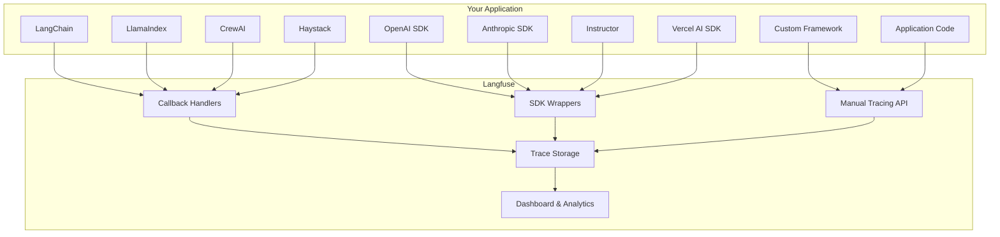

# Chapter 7: Integrations

Welcome to **Chapter 7: Integrations**. In this part of **Langfuse Tutorial: LLM Observability, Evaluation, and Prompt Operations**, you will build an intuitive mental model first, then move into concrete implementation details and practical production tradeoffs.


> Connect Langfuse with LangChain, LlamaIndex, OpenAI SDK, and other frameworks.

Previous: [Chapter 6: Datasets & Testing](06-datasets.md)

## Overview

One of Langfuse's biggest strengths is how easily it integrates with the tools you are already using. Whether you are building with LangChain, LlamaIndex, the OpenAI SDK, Anthropic, or a custom framework, Langfuse can plug in with minimal code changes. In most cases, it takes a single callback handler or a one-line wrapper to get full observability.

This chapter walks through each major integration, shows you how to set it up, and covers common patterns for combining multiple frameworks in a single application.

## Integration Architecture

Here is how Langfuse fits into the broader LLM application stack:



Framework-specific integrations (LangChain, LlamaIndex, CrewAI, Haystack) use callback handlers that capture events automatically. SDK wrappers (OpenAI, Anthropic, Instructor) wrap the client object to intercept calls. For anything else, the manual tracing API gives you full control.

## LangChain Integration

LangChain is one of the most popular frameworks for building LLM applications. Langfuse provides a callback handler that captures every chain invocation, tool call, and LLM generation automatically.

```python
from langchain_openai import ChatOpenAI
from langchain_core.prompts import ChatPromptTemplate
from langchain_core.output_parsers import StrOutputParser
from langfuse.callback import CallbackHandler

# Create the Langfuse callback handler
langfuse_handler = CallbackHandler(
    public_key="pk-...",
    secret_key="sk-...",
    host="https://cloud.langfuse.com",
)

# Build a LangChain chain
prompt = ChatPromptTemplate.from_messages([
    ("system", "You are a helpful assistant."),
    ("user", "{input}"),
])
llm = ChatOpenAI(model="gpt-4o-mini")
output_parser = StrOutputParser()

chain = prompt | llm | output_parser

# Pass the handler to capture the full trace
result = chain.invoke(
    {"input": "What is observability for LLM apps?"},
    config={"callbacks": [langfuse_handler]},
)
print(result)
```

The callback handler captures the entire chain execution, including prompt rendering, LLM calls, token usage, and output parsing. Each step appears as a span in your Langfuse trace.

### LangChain with Retrieval (RAG)

For RAG applications, the callback handler also captures retrieval steps:

```python
from langchain_community.vectorstores import FAISS
from langchain_openai import OpenAIEmbeddings
from langchain.chains import RetrievalQA

# Set up vector store and retriever
vectorstore = FAISS.from_documents(documents, OpenAIEmbeddings())
retriever = vectorstore.as_retriever(search_kwargs={"k": 3})

# Create RAG chain with Langfuse tracing
qa_chain = RetrievalQA.from_chain_type(
    llm=ChatOpenAI(model="gpt-4o-mini"),
    retriever=retriever,
    return_source_documents=True,
)

result = qa_chain.invoke(
    {"query": "How does Langfuse handle tracing?"},
    config={"callbacks": [langfuse_handler]},
)
```

In the Langfuse UI, you will see the retrieval step (including which documents were fetched), the prompt construction, and the LLM generation -- all linked together in a single trace.

## LlamaIndex Integration

LlamaIndex provides its own callback system that Langfuse hooks into:

```python
from llama_index.core import VectorStoreIndex, SimpleDirectoryReader, Settings
from llama_index.core.callbacks import CallbackManager
from llama_index.llms.openai import OpenAI
from langfuse.llama_index import LlamaIndexCallbackHandler

# Set up the Langfuse callback handler
langfuse_callback = LlamaIndexCallbackHandler(
    public_key="pk-...",
    secret_key="sk-...",
    host="https://cloud.langfuse.com",
)
callback_manager = CallbackManager([langfuse_callback])

# Configure LlamaIndex to use the callback manager
Settings.callback_manager = callback_manager
Settings.llm = OpenAI(model="gpt-4o-mini")

# Build and query an index
documents = SimpleDirectoryReader("./data").load_data()
index = VectorStoreIndex.from_documents(documents)

query_engine = index.as_query_engine()
response = query_engine.query("What is Langfuse?")
print(response)
```

LlamaIndex traces include indexing operations, query planning, retrieval, synthesis, and LLM calls. This makes it easy to debug complex RAG pipelines.

## OpenAI SDK Integration

For applications that use the OpenAI SDK directly, Langfuse provides a wrapper that patches the client:

```python
from langfuse.openai import openai
from langfuse import Langfuse

langfuse = Langfuse()

# Wrap the OpenAI client
client = langfuse.wrap_openai(openai.OpenAI())

# All calls are now automatically traced
response = client.chat.completions.create(
    model="gpt-4o-mini",
    messages=[{"role": "user", "content": "Hello, how are you?"}],
    langfuse_prompt="greeting",  # Optional: link to a managed prompt
)
print(response.choices[0].message.content)
```

### Async OpenAI Usage

If your application uses async calls (common in web frameworks like FastAPI), the wrapper works the same way:

```python
import asyncio
from langfuse.openai import openai
from langfuse import Langfuse

langfuse = Langfuse()

# Wrap the async client
async_client = langfuse.wrap_openai(openai.AsyncOpenAI())

async def generate_response(user_message: str) -> str:
    response = await async_client.chat.completions.create(
        model="gpt-4o-mini",
        messages=[
            {"role": "system", "content": "You are a helpful assistant."},
            {"role": "user", "content": user_message},
        ],
    )
    return response.choices[0].message.content

# Use in an async context
async def main():
    result = await generate_response("Explain async programming in Python.")
    print(result)

asyncio.run(main())
```

### Streaming with OpenAI

Streaming responses are also fully traced:

```python
stream = client.chat.completions.create(
    model="gpt-4o-mini",
    messages=[{"role": "user", "content": "Tell me a short story."}],
    stream=True,
)

for chunk in stream:
    if chunk.choices[0].delta.content:
        print(chunk.choices[0].delta.content, end="")

# The complete trace (including token counts) is captured after the stream finishes
```

## Anthropic Integration

Langfuse wraps the Anthropic SDK in the same way as OpenAI:

```python
import anthropic
from langfuse import Langfuse

langfuse = Langfuse()

# Wrap the Anthropic client
client = langfuse.wrap_anthropic(anthropic.Anthropic())

response = client.messages.create(
    model="claude-3-haiku-20240307",
    max_tokens=1000,
    messages=[{"role": "user", "content": "Explain quantum computing in simple terms."}],
)
print(response.content[0].text)
```

Token usage, costs, and latency are all captured automatically.

## Instructor Integration

Instructor is a popular library for getting structured outputs from LLMs using Pydantic models. It works on top of the OpenAI SDK, so you can combine it with Langfuse's OpenAI wrapper:

```python
import instructor
from pydantic import BaseModel
from langfuse.openai import openai
from langfuse import Langfuse

langfuse = Langfuse()

# Wrap OpenAI, then patch with Instructor
wrapped_client = langfuse.wrap_openai(openai.OpenAI())
client = instructor.from_openai(wrapped_client)

class UserInfo(BaseModel):
    name: str
    age: int
    occupation: str

# Extract structured data -- fully traced in Langfuse
user = client.chat.completions.create(
    model="gpt-4o-mini",
    response_model=UserInfo,
    messages=[
        {"role": "user", "content": "John is a 30-year-old software engineer."}
    ],
)

print(f"Name: {user.name}, Age: {user.age}, Occupation: {user.occupation}")
```

Because Instructor uses the OpenAI client under the hood, the Langfuse wrapper captures the full request and response, including any retry attempts if the structured output validation fails.

### Instructor with Retries

Instructor often retries when the LLM output does not match the Pydantic schema. Langfuse captures each retry as a separate generation within the same trace:

```python
user = client.chat.completions.create(
    model="gpt-4o-mini",
    response_model=UserInfo,
    max_retries=3,  # Retry up to 3 times if validation fails
    messages=[
        {"role": "user", "content": "Extract: Alice, mid-twenties, works in marketing"}
    ],
)
# In Langfuse, you can see each retry attempt, making it easy to debug schema issues
```

## Haystack Integration

Haystack is a framework for building search and RAG pipelines. Langfuse integrates via a content tracing mechanism:

```python
from haystack import Pipeline
from haystack.components.generators import OpenAIGenerator
from haystack.components.builders import PromptBuilder
from langfuse.haystack import LangfuseConnector

# Add Langfuse tracing to the pipeline
tracer = LangfuseConnector(
    public_key="pk-...",
    secret_key="sk-...",
    host="https://cloud.langfuse.com",
)

# Build a Haystack pipeline
pipe = Pipeline()
pipe.add_component("prompt_builder", PromptBuilder(template="Answer: {{query}}"))
pipe.add_component("llm", OpenAIGenerator(model="gpt-4o-mini"))
pipe.connect("prompt_builder", "llm")

# Run with tracing enabled
result = pipe.run(
    {"prompt_builder": {"query": "What is Langfuse?"}},
    include_outputs_from={"llm"},
)
print(result["llm"]["replies"][0])
```

The Haystack integration captures each component in the pipeline as a span, giving you visibility into the entire pipeline execution.

## Vercel AI SDK

For TypeScript/JavaScript applications using the Vercel AI SDK:

```typescript
import { openai } from '@ai-sdk/openai';
import { generateText } from 'ai';
import { observe } from '@langfuse/vercel-ai';

// Wrap the model with Langfuse observability
const model = observe(openai('gpt-4o-mini'));

const result = await generateText({
  model,
  prompt: 'What is the capital of France?',
});

console.log(result.text);
```

### Streaming with Vercel AI SDK

```typescript
import { streamText } from 'ai';

const result = await streamText({
  model: observe(openai('gpt-4o-mini')),
  prompt: 'Write a haiku about programming.',
});

for await (const textPart of result.textStream) {
  process.stdout.write(textPart);
}
```

## CrewAI Integration

CrewAI lets you build multi-agent systems. Langfuse traces each agent's actions and inter-agent communication:

```python
from crewai import Agent, Task, Crew
from langfuse.callback import CallbackHandler

langfuse_handler = CallbackHandler(
    public_key="pk-...",
    secret_key="sk-...",
    host="https://cloud.langfuse.com",
)

# Define agents
researcher = Agent(
    role="Researcher",
    goal="Find accurate information about the topic",
    backstory="You are an expert researcher.",
    llm="gpt-4o-mini",
)

writer = Agent(
    role="Writer",
    goal="Write a clear and concise summary",
    backstory="You are a skilled technical writer.",
    llm="gpt-4o-mini",
)

# Define tasks
research_task = Task(description="Research Langfuse observability", agent=researcher)
write_task = Task(description="Write a summary of findings", agent=writer)

# Create crew with Langfuse callback
crew = Crew(
    agents=[researcher, writer],
    tasks=[research_task, write_task],
    callbacks=[langfuse_handler],
)

result = crew.kickoff()
```

In Langfuse, you will see each agent's LLM calls, tool usage, and the flow of information between agents -- all in one connected trace.

## Multi-Framework Applications

Real-world applications often combine multiple frameworks. For example, you might use LangChain for retrieval and OpenAI directly for generation. Langfuse can tie everything together in a single trace.

```python
from langfuse import Langfuse

langfuse = Langfuse()

# Create a parent trace for the entire workflow
trace = langfuse.trace(name="hybrid-rag-pipeline", user_id="user_42")

# Step 1: LangChain retrieval
langfuse_handler = CallbackHandler(trace_id=trace.id)
retriever = vectorstore.as_retriever()
docs = retriever.invoke(
    "What is Langfuse?",
    config={"callbacks": [langfuse_handler]},
)

# Step 2: OpenAI generation with the retrieved context
context = "\n".join([doc.page_content for doc in docs])
wrapped_client = langfuse.wrap_openai(openai.OpenAI())

response = wrapped_client.chat.completions.create(
    model="gpt-4o-mini",
    messages=[
        {"role": "system", "content": f"Answer based on this context:\n{context}"},
        {"role": "user", "content": "What is Langfuse?"},
    ],
    langfuse_trace_id=trace.id,
)

print(response.choices[0].message.content)
```

The key is passing the same `trace_id` to both the callback handler and the SDK wrapper. This links all the spans together into a single trace in the Langfuse UI.

## Custom Framework Integration

If you are using a framework that Langfuse does not have a built-in integration for, the manual tracing API gives you full control. Here is a detailed guide for instrumenting a custom pipeline.

### Basic Structure

```python
from langfuse import Langfuse
import time

langfuse = Langfuse()

def run_custom_pipeline(query: str, user_id: str) -> str:
    """A custom pipeline with full Langfuse tracing."""
    # Create the top-level trace
    trace = langfuse.trace(
        name="custom-pipeline",
        user_id=user_id,
        input={"query": query},
        tags=["custom", "production"],
    )

    # Step 1: Preprocessing
    preprocess_span = trace.span(
        name="preprocessing",
        input={"raw_query": query},
    )
    processed_query = preprocess(query)
    preprocess_span.end(output={"processed_query": processed_query})

    # Step 2: Retrieval
    retrieval_span = trace.span(
        name="retrieval",
        input={"query": processed_query},
    )
    documents = retrieve_documents(processed_query)
    retrieval_span.end(output={"num_documents": len(documents)})

    # Step 3: LLM Generation
    generation = trace.generation(
        name="llm-generation",
        model="gpt-4o-mini",
        input={"query": processed_query, "context": documents},
    )

    start_time = time.time()
    response = call_your_llm(processed_query, documents)
    duration = time.time() - start_time

    generation.end(
        output=response,
        usage={
            "input": count_tokens(processed_query + str(documents)),
            "output": count_tokens(response),
            "total_cost": calculate_cost(processed_query, response),
        },
    )

    # Step 4: Postprocessing
    postprocess_span = trace.span(
        name="postprocessing",
        input={"raw_response": response},
    )
    final_response = postprocess(response)
    postprocess_span.end(output={"final_response": final_response})

    # Close the trace
    trace.update(output={"response": final_response})
    langfuse.flush()

    return final_response
```

### Adding Scores to Custom Traces

You can score your custom traces for later analysis:

```python
# Score the trace after getting user feedback
trace.score(name="user_satisfaction", value=0.9, comment="User gave thumbs up")
trace.score(name="accuracy", value=1.0, comment="Verified correct answer")
```

### Nested Spans for Complex Workflows

For pipelines with nested steps, use child spans:

```python
parent_span = trace.span(name="complex-step")

child_1 = parent_span.span(name="sub-step-1")
result_1 = do_something()
child_1.end(output=result_1)

child_2 = parent_span.span(name="sub-step-2")
result_2 = do_something_else(result_1)
child_2.end(output=result_2)

parent_span.end(output=result_2)
```

This creates a tree structure in the Langfuse UI, making it easy to drill down into specific parts of a complex workflow.

## Integration Troubleshooting

Here are solutions to common problems you may encounter when setting up integrations.

### Traces Not Appearing in the Dashboard

This is the most common issue. Check these things in order:

1. **Flush the client.** Langfuse batches events and sends them asynchronously. Call `langfuse.flush()` at the end of your script (or before your application exits) to ensure all events are sent.

```python
# Always flush before your process exits
langfuse.flush()
```

2. **Check your API keys.** Make sure `LANGFUSE_PUBLIC_KEY` and `LANGFUSE_SECRET_KEY` are set correctly. A common mistake is swapping the public and secret keys.

3. **Check the host URL.** If you are self-hosting, make sure `LANGFUSE_HOST` points to your instance, not `https://cloud.langfuse.com`.

4. **Enable debug logging** to see what is happening under the hood:

```python
import logging
logging.basicConfig(level=logging.DEBUG)

langfuse = Langfuse()  # Will now print debug information
```

### Missing Token Counts or Costs

- **OpenAI wrapper**: Token counts are captured automatically. If they are missing, make sure you are using `langfuse.wrap_openai()` and not just the raw `openai.OpenAI()` client.
- **LangChain**: Token counts depend on the LLM provider returning usage metadata. Most OpenAI models do; some other providers may not.
- **Custom integration**: You need to provide usage data manually in the `usage` parameter.

### High Memory Usage

If you are processing many traces in a loop, the Langfuse client batches them in memory. You can control this:

```python
langfuse = Langfuse(
    flush_at=50,       # Flush after 50 events (default: 15)
    flush_interval=5,  # Flush every 5 seconds (default: 10)
)
```

For very high-throughput applications, flush more frequently and keep the batch size small.

### Callback Handler Not Capturing All Events

With LangChain, make sure you pass the callback in the `config` parameter, not as a constructor argument:

```python
# Correct: pass in config
result = chain.invoke({"input": "hello"}, config={"callbacks": [langfuse_handler]})

# Also works: set as default on the LLM
llm = ChatOpenAI(model="gpt-4o-mini", callbacks=[langfuse_handler])
```

### Timeout or Connection Errors

If you are behind a firewall or proxy, you may need to configure the HTTP client:

```python
langfuse = Langfuse(
    public_key="pk-...",
    secret_key="sk-...",
    host="https://cloud.langfuse.com",
    timeout=30,  # Increase timeout for slow connections
)
```

## Tips

- **Use framework-specific handlers whenever available.** They capture more detail with less effort than manual tracing.
- **Set consistent `user_id` and `session_id` across frameworks** so you can trace a user's journey through your entire application.
- **Tag spans by framework** for easy filtering: `tags=["langchain", "retrieval"]` or `tags=["openai", "generation"]`.
- **Combine manual and automatic tracing.** Use callback handlers for framework calls and manual spans for your custom business logic.
- **Always call `langfuse.flush()`** before your process exits to avoid losing events.
- **Start with one integration and expand.** Get LangChain or OpenAI working first, then add more frameworks as needed.

## Summary

Langfuse integrates with the most popular LLM frameworks through callback handlers, SDK wrappers, and a flexible manual tracing API. In this chapter, you learned how to set up integrations for LangChain, LlamaIndex, OpenAI, Anthropic, Instructor, Haystack, Vercel AI SDK, and CrewAI. You also learned how to build custom integrations, combine multiple frameworks in a single trace, and troubleshoot common issues. With these integrations in place, you get full observability across your entire LLM stack.

Next: [Chapter 8: Production Deployment](08-production.md) -- self-host Langfuse, secure your setup, and scale for high-traffic applications.

## What Problem Does This Solve?

Most teams struggle here because the hard part is not writing more code, but deciding clear boundaries for `langfuse`, `Langfuse`, `trace` so behavior stays predictable as complexity grows.

In practical terms, this chapter helps you avoid three common failures:

- coupling core logic too tightly to one implementation path
- missing the handoff boundaries between setup, execution, and validation
- shipping changes without clear rollback or observability strategy

After working through this chapter, you should be able to reason about `Chapter 7: Integrations` as an operating subsystem inside **Langfuse Tutorial: LLM Observability, Evaluation, and Prompt Operations**, with explicit contracts for inputs, state transitions, and outputs.

Use the implementation notes around `model`, `response`, `mini` as your checklist when adapting these patterns to your own repository.

## How it Works Under the Hood

Under the hood, `Chapter 7: Integrations` usually follows a repeatable control path:

1. **Context bootstrap**: initialize runtime config and prerequisites for `langfuse`.
2. **Input normalization**: shape incoming data so `Langfuse` receives stable contracts.
3. **Core execution**: run the main logic branch and propagate intermediate state through `trace`.
4. **Policy and safety checks**: enforce limits, auth scopes, and failure boundaries.
5. **Output composition**: return canonical result payloads for downstream consumers.
6. **Operational telemetry**: emit logs/metrics needed for debugging and performance tuning.

When debugging, walk this sequence in order and confirm each stage has explicit success/failure conditions.

## Source Walkthrough

Use the following upstream sources to verify implementation details while reading this chapter:

- [Langfuse Repository](https://github.com/langfuse/langfuse)
  Why it matters: authoritative reference on `Langfuse Repository` (github.com).
- [Langfuse Releases](https://github.com/langfuse/langfuse/releases)
  Why it matters: authoritative reference on `Langfuse Releases` (github.com).
- [Langfuse Docs](https://langfuse.com/docs)
  Why it matters: authoritative reference on `Langfuse Docs` (langfuse.com).

Suggested trace strategy:
- search upstream code for `langfuse` and `Langfuse` to map concrete implementation paths
- compare docs claims against actual runtime/config code before reusing patterns in production

## Chapter Connections

- [Tutorial Index](index.md)
- [Previous Chapter: Chapter 6: Datasets & Testing](06-datasets.md)
- [Next Chapter: Chapter 8: Production Deployment](08-production.md)
- [Main Catalog](../../README.md#-tutorial-catalog)
- [A-Z Tutorial Directory](../../discoverability/tutorial-directory.md)
