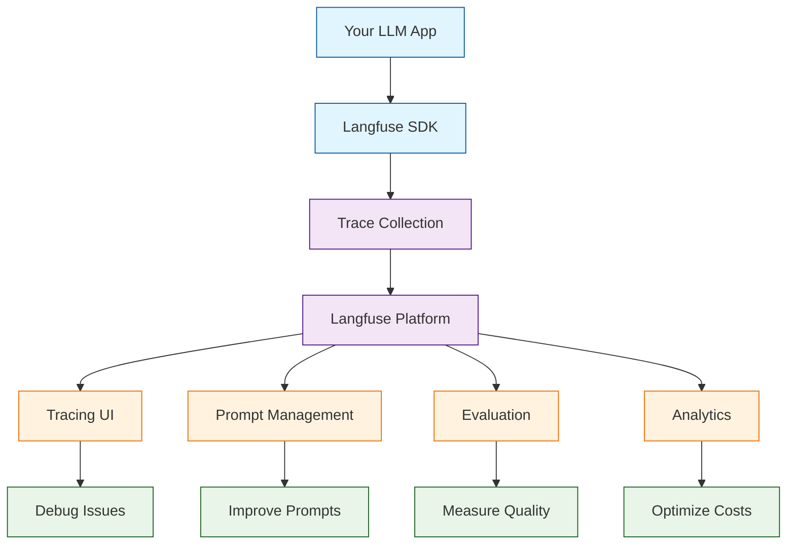

# Langfuse Tutorial: LLM Observability & Analytics

> Debug, analyze, and improve your LLM applications with production-grade observability.

<div align="center">

**📊 Open Source LLM Engineering Platform**

[](https://github.com/langfuse/langfuse)

</div>

---

## 🎯 What is Langfuse?

**Langfuse**<sup>[View Repo](https://github.com/langfuse/langfuse)</sup> is an open-source LLM engineering platform that helps you debug, analyze, and iterate on your LLM applications. It provides tracing, prompt management, evaluation, and analytics for production AI systems.

### Key Features

| Feature | Description |
|:--------|:------------|
| **Tracing** | Full observability into LLM chains and agents |
| **Prompt Management** | Version control and A/B testing for prompts |
| **Evaluation** | LLM-as-judge and human evaluation workflows |
| **Analytics** | Cost tracking, latency analysis, and usage metrics |
| **Datasets** | Create test datasets from production traces |
| **Integrations** | Works with LangChain, LlamaIndex, OpenAI SDK, and more |



## Tutorial Chapters

1. **[Chapter 1: Getting Started](01-getting-started.md)** - Installation, setup, and first traces
2. **[Chapter 2: Tracing Fundamentals](02-tracing.md)** - Capturing LLM interactions
3. **[Chapter 3: Prompt Management](03-prompts.md)** - Version control and deployment
4. **[Chapter 4: Evaluation](04-evaluation.md)** - LLM-as-judge and human feedback
5. **[Chapter 5: Analytics & Metrics](05-analytics.md)** - Cost, latency, and usage analysis
6. **[Chapter 6: Datasets & Testing](06-datasets.md)** - Creating test suites from traces
7. **[Chapter 7: Integrations](07-integrations.md)** - LangChain, LlamaIndex, and more
8. **[Chapter 8: Production Deployment](08-production.md)** - Self-hosting and scaling

## What You'll Learn

- **Trace LLM Applications** end-to-end
- **Debug Complex Chains** with full visibility
- **Manage Prompts** with version control
- **Evaluate Quality** systematically
- **Track Costs** across providers
- **Build Test Datasets** from production
- **Integrate Seamlessly** with popular frameworks
- **Deploy Self-Hosted** for data privacy

## Prerequisites

- Python 3.8+ (or TypeScript/JS)
- An LLM application to observe
- Langfuse account or self-hosted instance

## Quick Start

### Cloud Setup

```bash
# Install the SDK
pip install langfuse

# Set environment variables
export LANGFUSE_PUBLIC_KEY="pk-..."
export LANGFUSE_SECRET_KEY="sk-..."
export LANGFUSE_HOST="https://cloud.langfuse.com"  # or your self-hosted URL
```

### Self-Hosted Setup

```bash
# Clone and run with Docker
git clone https://github.com/langfuse/langfuse.git
cd langfuse
docker compose up -d
```

## Basic Tracing

```python
from langfuse import Langfuse
from langfuse.decorators import observe
import openai

# Initialize Langfuse
langfuse = Langfuse()

# Trace a function with the decorator
@observe()
def generate_response(user_input: str) -> str:
    response = openai.chat.completions.create(
        model="gpt-4o",
        messages=[
            {"role": "system", "content": "You are a helpful assistant."},
            {"role": "user", "content": user_input}
        ]
    )
    return response.choices[0].message.content

# Use it normally - traces are captured automatically
result = generate_response("What is observability?")
print(result)

# Flush to ensure traces are sent
langfuse.flush()
```

## Tracing Complex Chains

```python
from langfuse.decorators import observe, langfuse_context

@observe()
def research_assistant(query: str) -> dict:
    # Each sub-function creates a span in the trace
    context = retrieve_context(query)
    analysis = analyze_context(context, query)
    response = generate_response(analysis, query)
    
    return {
        "context": context,
        "analysis": analysis,
        "response": response
    }

@observe()
def retrieve_context(query: str) -> list:
    # Simulate retrieval
    langfuse_context.update_current_observation(
        metadata={"source": "vector_db", "k": 5}
    )
    return ["doc1", "doc2", "doc3"]

@observe()
def analyze_context(context: list, query: str) -> str:
    # Simulate analysis
    return f"Analysis of {len(context)} documents for: {query}"

@observe()
def generate_response(analysis: str, query: str) -> str:
    response = openai.chat.completions.create(
        model="gpt-4o",
        messages=[{"role": "user", "content": f"{analysis}\n\nQuery: {query}"}]
    )
    return response.choices[0].message.content
```

## Prompt Management

```python
from langfuse import Langfuse

langfuse = Langfuse()

# Fetch a managed prompt
prompt = langfuse.get_prompt("customer-support-v2")

# Use the prompt with variables
formatted = prompt.compile(
    customer_name="Alice",
    issue="billing question"
)

# The prompt usage is automatically tracked
response = openai.chat.completions.create(
    model="gpt-4o",
    messages=[{"role": "user", "content": formatted}]
)
```

## Evaluation with Scores

```python
from langfuse.decorators import observe, langfuse_context

@observe()
def chatbot(user_message: str) -> str:
    response = generate_response(user_message)
    
    # Add evaluation scores
    langfuse_context.score_current_trace(
        name="user_feedback",
        value=1,  # Thumbs up
        comment="User marked as helpful"
    )
    
    # LLM-as-judge evaluation
    quality_score = evaluate_response_quality(response)
    langfuse_context.score_current_trace(
        name="quality",
        value=quality_score,
        comment="Automated quality assessment"
    )
    
    return response
```

## LangChain Integration

```python
from langchain_openai import ChatOpenAI
from langchain.prompts import ChatPromptTemplate
from langfuse.callback import CallbackHandler

# Create Langfuse callback handler
langfuse_handler = CallbackHandler()

# Use with LangChain
llm = ChatOpenAI(model="gpt-4o")
prompt = ChatPromptTemplate.from_template("Tell me about {topic}")
chain = prompt | llm

# Traces are captured automatically
result = chain.invoke(
    {"topic": "AI observability"},
    config={"callbacks": [langfuse_handler]}
)
```

## Analytics Dashboard

Langfuse provides rich analytics:

| Metric | Description |
|:-------|:------------|
| **Cost per trace** | Total spend breakdown by model |
| **Latency percentiles** | P50, P95, P99 response times |
| **Token usage** | Input/output token distribution |
| **Error rates** | Failed requests and error types |
| **Model comparison** | Performance across different models |
| **User analytics** | Usage patterns by user/session |

## Deployment Options

| Option | Best For |
|:-------|:---------|
| **Langfuse Cloud** | Quick start, managed infrastructure |
| **Self-Hosted (Docker)** | Data privacy, full control |
| **Self-Hosted (Kubernetes)** | Enterprise scale, HA |

## Learning Path

### 🟢 Beginner Track
1. Chapters 1-3: Setup, basic tracing, and prompts
2. Add observability to a simple LLM app

### 🟡 Intermediate Track
1. Chapters 4-6: Evaluation, analytics, and datasets
2. Build quality assurance workflows

### 🔴 Advanced Track
1. Chapters 7-8: Deep integrations and production deployment
2. Run enterprise-grade LLM observability

---

**Ready to observe your LLM applications? Let's begin with [Chapter 1: Getting Started](01-getting-started.md)!**

*Generated for [Awesome Code Docs](https://github.com/johnxie/awesome-code-docs)*
