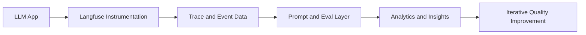

# Langfuse Tutorial: LLM Observability, Evaluation, and Prompt Operations

> Learn how to use `langfuse/langfuse` to trace, evaluate, and improve production LLM systems with structured observability workflows.

## Why This Track Matters

Teams shipping LLM features need visibility into quality, latency, and cost. Langfuse provides the feedback loop for prompt and pipeline improvement.

This track focuses on:

- end-to-end tracing for LLM chains/agents
- prompt lifecycle and versioning discipline
- evaluation workflows (LLM-as-judge + human)
- production analytics and deployment operations

## Current Snapshot (Verified February 11, 2026)

- repository: [`langfuse/langfuse`](https://github.com/langfuse/langfuse)
- stars: about **21.8k**
- latest release: [`v3.152.0`](https://github.com/langfuse/langfuse/releases/tag/v3.152.0)
- integration surface includes OpenTelemetry, LangChain, OpenAI SDK, LiteLLM, and more
- supports cloud and self-hosted deployment models

## Mental Model

## Chapter Guide

| Chapter | Key Question | Outcome |
|:--------|:-------------|:--------|
| [01 - Getting Started](01-getting-started.md) | How do I install and capture first traces? | Working Langfuse baseline |
| [02 - Tracing Fundamentals](02-tracing.md) | How should traces be structured for debugging? | Reliable observability model |
| [03 - Prompt Management](03-prompts.md) | How do I version and ship prompts safely? | Prompt ops playbook |
| [04 - Evaluation](04-evaluation.md) | How do I measure quality systematically? | Repeatable eval framework |
| [05 - Analytics and Metrics](05-analytics.md) | How do I track cost, latency, and usage? | Production monitoring baseline |
| [06 - Datasets and Testing](06-datasets.md) | How do I build regression datasets from real traffic? | Better offline/online testing loops |
| [07 - Integrations](07-integrations.md) | How does Langfuse fit existing stacks? | Framework and SDK integration patterns |
| [08 - Production Deployment](08-production.md) | How do I run Langfuse reliably in production? | Deployment and scaling guidance |

## What You Will Learn

- how to instrument LLM workflows for high-signal debugging
- how to connect traces to prompt and evaluation loops
- how to monitor quality/cost/latency with actionable metrics
- how to operate Langfuse in production environments

## Source References

- [Langfuse Repository](https://github.com/langfuse/langfuse)
- [Langfuse Releases](https://github.com/langfuse/langfuse/releases)
- [Langfuse Docs](https://langfuse.com/docs)

## Related Tutorials

- [LiteLLM Tutorial](../litellm-tutorial/)
- [LangChain Tutorial](../langchain-tutorial/)
- [LlamaIndex Tutorial](../llamaindex-tutorial/)
- [Vercel AI SDK Tutorial](../vercel-ai-tutorial/)

---

Start with [Chapter 1: Getting Started](01-getting-started.md).
