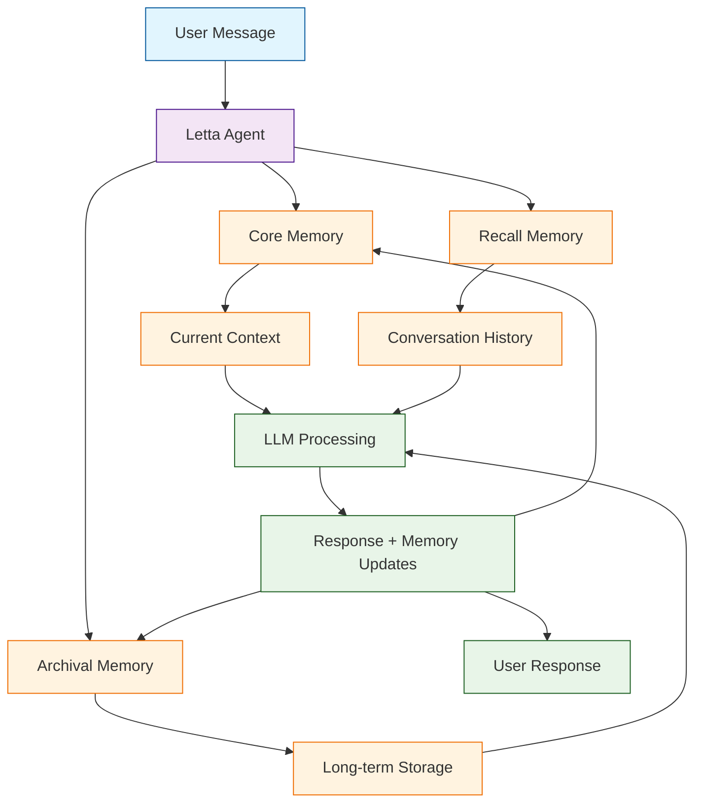

# Letta Tutorial: Stateful LLM Agents

> Build AI agents with persistent memory using the framework formerly known as MemGPT.

<div align="center">

**🧠 AI Agents That Remember Everything**

[](https://github.com/letta-ai/letta)

</div>

---

## 🎯 What is Letta?

**Letta**<sup>[View Repo](https://github.com/letta-ai/letta)</sup> (formerly MemGPT) is a framework for building stateful LLM agents with persistent memory. Unlike traditional chatbots that forget context, Letta agents maintain long-term memory across conversations.

### Key Features

| Feature | Description |
|:--------|:------------|
| **Persistent Memory** | Agents remember across sessions |
| **Self-Editing Memory** | Agents can update their own memory |
| **Infinite Context** | Virtual context through memory hierarchy |
| **Tool Use** | Agents can call external tools |
| **Multi-Agent** | Coordinate multiple agents |
| **REST API** | Deploy agents as services |



## Tutorial Chapters

1. **[Chapter 1: Getting Started](01-getting-started.md)** - Installation, setup, and first agent
2. **[Chapter 2: Memory Architecture](02-memory.md)** - Core, archival, and recall memory
3. **[Chapter 3: Agent Configuration](03-configuration.md)** - Personas, system prompts, and models
4. **[Chapter 4: Tool Integration](04-tools.md)** - Adding custom tools and functions
5. **[Chapter 5: Conversation Management](05-conversations.md)** - Managing long-running dialogues
6. **[Chapter 6: Multi-Agent Systems](06-multi-agent.md)** - Agent coordination and messaging
7. **[Chapter 7: REST API](07-api.md)** - Deploying agents as services
8. **[Chapter 8: Production Deployment](08-production.md)** - Scaling and best practices

## What You'll Learn

- **Build Stateful Agents** that remember everything
- **Manage Memory Hierarchies** for infinite context
- **Create Custom Tools** for agent capabilities
- **Deploy Agent APIs** for production use
- **Coordinate Multi-Agent** systems
- **Persist Conversations** across sessions
- **Scale Agent Systems** for enterprise use

## Prerequisites

- Python 3.10+
- API key for your LLM provider
- Understanding of LLM basics
- (Optional) PostgreSQL for persistent storage

## Quick Start

```bash
# Install Letta
pip install letta

# Start the Letta server
letta server
```

## Creating Your First Agent

```python
from letta import create_client

# Connect to Letta server
client = create_client()

# Create an agent with memory
agent = client.create_agent(
    name="assistant",
    memory_blocks=[
        {
            "label": "persona",
            "value": "You are a helpful AI assistant with perfect memory."
        },
        {
            "label": "human",
            "value": "The user is a software developer interested in AI."
        }
    ],
    llm_config={
        "model": "gpt-4o",
        "context_window": 8192
    }
)

# Chat with the agent
response = client.send_message(
    agent_id=agent.id,
    message="Hi! My name is Alice and I'm working on a machine learning project."
)

print(response.messages[-1].content)
# "Hello Alice! It's great to meet you. I'd love to hear more about 
# your machine learning project..."

# Later session - agent remembers!
response = client.send_message(
    agent_id=agent.id,
    message="What was I working on?"
)

print(response.messages[-1].content)
# "You mentioned you're working on a machine learning project, Alice!"
```

## Memory Architecture

### Core Memory
Fast-access memory in the LLM context window:
- **Persona Block** - Agent's identity and behavior
- **Human Block** - Information about the user

### Archival Memory
Long-term storage for facts and knowledge:
```python
# Agent automatically archives important information
client.send_message(
    agent_id=agent.id,
    message="I live in San Francisco and work at a startup called TechCo."
)

# Search archival memory
results = client.search_archival_memory(
    agent_id=agent.id,
    query="Where does the user work?"
)
```

### Recall Memory
Searchable conversation history:
```python
# Search past conversations
results = client.search_recall_memory(
    agent_id=agent.id,
    query="machine learning",
    limit=10
)
```

## Adding Custom Tools

```python
from letta import tool

@tool
def get_weather(city: str) -> str:
    """Get the current weather for a city.
    
    Args:
        city: Name of the city
        
    Returns:
        Current weather description
    """
    # Implement weather lookup
    return f"Sunny and 72°F in {city}"

@tool
def search_documents(query: str) -> list:
    """Search internal documents.
    
    Args:
        query: Search query
        
    Returns:
        List of relevant documents
    """
    # Implement document search
    return ["doc1.pdf", "doc2.pdf"]

# Create agent with tools
agent = client.create_agent(
    name="research_assistant",
    tools=[get_weather, search_documents]
)
```

## REST API Usage

```bash
# Start server
letta server --port 8283

# Create agent via API
curl -X POST http://localhost:8283/v1/agents \
    -H "Content-Type: application/json" \
    -d '{
        "name": "api_agent",
        "memory_blocks": [
            {"label": "persona", "value": "You are a helpful assistant."}
        ]
    }'

# Send message
curl -X POST http://localhost:8283/v1/agents/{agent_id}/messages \
    -H "Content-Type: application/json" \
    -d '{"message": "Hello!"}'
```

## Use Cases

| Use Case | Description |
|:---------|:------------|
| **Personal Assistant** | Long-term memory of user preferences |
| **Customer Support** | Remember customer history and context |
| **Research Agent** | Accumulate knowledge over time |
| **Tutoring** | Track student progress and adapt |
| **Healthcare** | Maintain patient context safely |

## Learning Path

### 🟢 Beginner Track
1. Chapters 1-3: Setup, memory basics, and configuration
2. Build a simple stateful assistant

### 🟡 Intermediate Track
1. Chapters 4-6: Tools, conversations, and multi-agent
2. Create sophisticated memory-enhanced agents

### 🔴 Advanced Track
1. Chapters 7-8: API deployment and production
2. Scale stateful agents for enterprise

---

**Ready to build agents with persistent memory? Let's begin with [Chapter 1: Getting Started](01-getting-started.md)!**

*Generated for [Awesome Code Docs](https://github.com/johnxie/awesome-code-docs)*

## Navigation & Backlinks

- [Start Here: Chapter 1: Getting Started with Letta](01-getting-started.md)
- [Back to Main Catalog](../../README.md#-tutorial-catalog)
- [Browse A-Z Tutorial Directory](../../discoverability/tutorial-directory.md)
- [Search by Intent](../../discoverability/query-hub.md)
- [Explore Category Hubs](../../README.md#category-hubs)

## Full Chapter Map

1. [Chapter 1: Getting Started with Letta](01-getting-started.md)
2. [Chapter 2: Memory Architecture in Letta](02-memory.md)
3. [Chapter 3: Agent Configuration](03-configuration.md)
4. [Chapter 4: Tool Integration](04-tools.md)
5. [Chapter 5: Conversation Management](05-conversations.md)
6. [Chapter 6: Multi-Agent Systems](06-multi-agent.md)
7. [Chapter 7: REST API](07-api.md)
8. [Chapter 8: Production Deployment](08-production.md)

## Source References

- [View Repo](https://github.com/letta-ai/letta)
- [Awesome Code Docs](https://github.com/johnxie/awesome-code-docs)

*Generated by [AI Codebase Knowledge Builder](https://github.com/The-Pocket/Tutorial-Codebase-Knowledge)*
