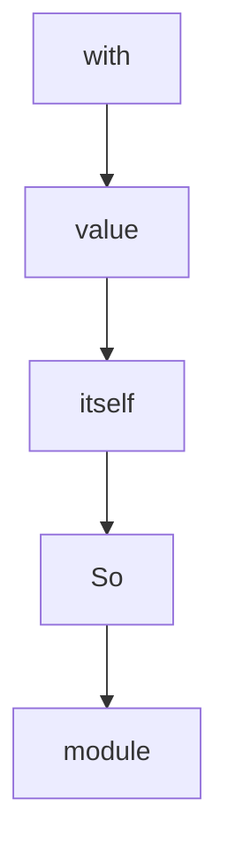

# Chapter 1: Getting Started with LiteLLM

Welcome to **Chapter 1: Getting Started with LiteLLM**. In this part of **LiteLLM Tutorial: Unified LLM Gateway and Routing Layer**, you will build an intuitive mental model first, then move into concrete implementation details and practical production tradeoffs.


> Install LiteLLM, configure your first provider, and make your initial LLM call with a unified interface.

## Overview

LiteLLM provides a single interface to call 100+ LLM providers. This chapter covers installation, basic setup, and your first cross-provider LLM call.

## Prerequisites

- Python 3.8+
- API keys for at least one LLM provider (OpenAI recommended for starters)
- Basic command line knowledge

## Installation

Install LiteLLM via pip:

```bash
pip install litellm
```

For development or to use the proxy server:

```bash
pip install litellm[proxy]
```

## Basic Setup

Set up environment variables for your LLM providers:

```bash
# OpenAI (recommended for getting started)
export OPENAI_API_KEY="sk-your-openai-key"

# Optional: Other providers
export ANTHROPIC_API_KEY="sk-ant-your-anthropic-key"
export COHERE_API_KEY="your-cohere-key"
```

## Your First LiteLLM Call

Use the OpenAI-compatible interface that works with any provider:

```python
import litellm

# Set your API key
litellm.openai_key = "sk-your-openai-key"

# Make a call (defaults to GPT-3.5-turbo)
response = litellm.completion(
    model="gpt-3.5-turbo",
    messages=[
        {"role": "user", "content": "Hello! How are you?"}
    ]
)

print(response.choices[0].message.content)
```

## Understanding the Response

LiteLLM returns responses in OpenAI format:

```python
{
    "choices": [
        {
            "finish_reason": "stop",
            "index": 0,
            "message": {
                "content": "Hello! I'm doing well, thank you for asking. How can I help you today?",
                "role": "assistant"
            }
        }
    ],
    "created": 1677652288,
    "id": "chatcmpl-7QyqpwdfhqwajicIEznoc6Q47XAyW",
    "model": "gpt-3.5-turbo-0613",
    "object": "chat.completion",
    "usage": {
        "completion_tokens": 23,
        "prompt_tokens": 13,
        "total_tokens": 36
    }
}
```

## Using Different Models

Call different models with the same interface:

```python
# GPT-4
response = litellm.completion(
    model="gpt-4",
    messages=[{"role": "user", "content": "Explain quantum computing simply"}]
)

# GPT-3.5 Turbo (cheaper/faster)
response = litellm.completion(
    model="gpt-3.5-turbo",
    messages=[{"role": "user", "content": "Write a haiku about programming"}]
)

# Claude via Anthropic
response = litellm.completion(
    model="claude-3-opus-20240229",
    messages=[{"role": "user", "content": "What are the benefits of renewable energy?"}]
)
```

## Model Naming Convention

LiteLLM uses consistent model naming:

```
# OpenAI models
"gpt-4", "gpt-4-turbo", "gpt-3.5-turbo"

# Anthropic models
"claude-3-opus-20240229", "claude-3-sonnet-20240229", "claude-3-haiku-20240307"

# Google Vertex AI
"chat-bison", "chat-bison-32k", "codechat-bison"

# Cohere
"command", "command-light", "command-nightly"

# Azure OpenAI
"azure/gpt-4", "azure/gpt-3.5-turbo"

# Local models (Ollama)
"ollama/llama2", "ollama/codellama"
```

## Configuration Options

Customize your calls:

```python
response = litellm.completion(
    model="gpt-4",
    messages=[
        {"role": "system", "content": "You are a helpful coding assistant."},
        {"role": "user", "content": "Write a Python function to reverse a string"}
    ],
    max_tokens=150,           # Limit response length
    temperature=0.7,          # Control randomness (0.0-1.0)
    top_p=1.0,               # Nucleus sampling
    frequency_penalty=0.0,    # Reduce repetition
    presence_penalty=0.0,     # Encourage topic diversity
    stop=["\n\n", "###"]      # Stop sequences
)
```

## Error Handling

Handle API errors gracefully:

```python
import litellm

try:
    response = litellm.completion(
        model="gpt-4",
        messages=[{"role": "user", "content": "Hello"}]
    )
    print(response.choices[0].message.content)

except litellm.AuthenticationError:
    print("Invalid API key")

except litellm.RateLimitError:
    print("Rate limit exceeded, please try again later")

except litellm.APIError as e:
    print(f"API error: {e}")

except Exception as e:
    print(f"Unexpected error: {e}")
```

## Logging and Debugging

Enable verbose logging:

```python
import litellm

# Enable debug logging
litellm.set_verbose = True

# Or use logging
import logging
logging.basicConfig(level=logging.DEBUG)

response = litellm.completion(
    model="gpt-3.5-turbo",
    messages=[{"role": "user", "content": "Test message"}]
)
```

## CLI Usage

Use LiteLLM from the command line:

```bash
# Set API key
export OPENAI_API_KEY="sk-your-key"

# Make a completion
litellm --model gpt-3.5-turbo --message "Explain recursion in simple terms"

# Interactive chat
litellm --model gpt-4 --interactive
```

## Environment Variables

Set all configuration via environment variables:

```bash
# Provider API keys
OPENAI_API_KEY="sk-..."
ANTHROPIC_API_KEY="sk-ant-..."
COHERE_API_KEY="..."
GOOGLE_API_KEY="..."

# LiteLLM settings
LITELLM_LOG="INFO"  # DEBUG, INFO, WARNING, ERROR
LITELLM_DROPPED_PARAMS="true"  # Log dropped parameters
```

## Testing Your Setup

Create a simple test script:

```python
#!/usr/bin/env python3
"""Test LiteLLM setup with multiple providers."""

import litellm

def test_provider(model_name, test_message="Hello, world!"):
    """Test a specific model/provider."""
    try:
        response = litellm.completion(
            model=model_name,
            messages=[{"role": "user", "content": test_message}],
            max_tokens=50
        )
        print(f"✅ {model_name}: {response.choices[0].message.content.strip()}")
        return True
    except Exception as e:
        print(f"❌ {model_name}: {str(e)}")
        return False

if __name__ == "__main__":
    # Test different models
    models_to_test = [
        "gpt-3.5-turbo",
        "claude-3-haiku-20240307",  # if you have Anthropic key
        "command",  # if you have Cohere key
    ]

    for model in models_to_test:
        test_provider(model)
```

## Best Practices

1. **Start Simple**: Begin with OpenAI models to learn the interface
2. **Environment Variables**: Never hardcode API keys in your code
3. **Error Handling**: Always wrap API calls in try-catch blocks
4. **Cost Awareness**: Monitor token usage (covered in later chapters)
5. **Model Selection**: Choose appropriate models for your use case

## Troubleshooting

Common issues and solutions:

- **AuthenticationError**: Check your API key is correct and has proper permissions
- **RateLimitError**: You exceeded the provider's rate limits
- **NotFoundError**: The model name doesn't exist or isn't available
- **APIConnectionError**: Network issues or provider downtime

## Next Steps

Now that you can make basic LLM calls, let's explore how to configure multiple providers and switch between them seamlessly.

Run this to confirm everything works:

```bash
python -c "
import litellm
response = litellm.completion(
    model='gpt-3.5-turbo',
    messages=[{'role': 'user', 'content': 'Say hello to LiteLLM!'}]
)
print('Response:', response.choices[0].message.content)
"
```

## Depth Expansion Playbook

## Source Code Walkthrough

### `pyproject.toml`

The `with` interface in [`pyproject.toml`](https://github.com/BerriAI/litellm/blob/HEAD/pyproject.toml) handles a key part of this chapter's functionality:

```toml
name = "litellm"
version = "1.83.2"
description = "Library to easily interface with LLM API providers"
authors = ["BerriAI"]
license = "MIT"
readme = "README.md"
packages = [
    { include = "litellm" },
    { include = "litellm/py.typed"},
]

[tool.poetry.urls]
homepage = "https://litellm.ai"
Homepage = "https://litellm.ai"
repository = "https://github.com/BerriAI/litellm"
Repository = "https://github.com/BerriAI/litellm"
documentation = "https://docs.litellm.ai"
Documentation = "https://docs.litellm.ai"

# Dependencies pinned from `pip install litellm[proxy]==1.83.0` PyPI resolution.
# Docker builds use requirements.txt (different pins). These two paths are independent.
[tool.poetry.dependencies]
python = ">=3.9,<4.0"
fastuuid = "0.14.0"
httpx = "0.28.1"
openai = "2.30.0"
python-dotenv = "1.0.1"
tiktoken = "0.12.0"
importlib-metadata = "8.5.0"
tokenizers = "0.22.2"
click = "8.1.8"
jinja2 = "3.1.6"
```

This interface is important because it defines how LiteLLM Tutorial: Unified LLM Gateway and Routing Layer implements the patterns covered in this chapter.

### `litellm/_lazy_imports.py`

The `value` class in [`litellm/_lazy_imports.py`](https://github.com/BerriAI/litellm/blob/HEAD/litellm/_lazy_imports.py) handles a key part of this chapter's functionality:

```py
    Steps:
    1. Check if the name exists in the import map (if not, raise error)
    2. Check if we've already imported it (if yes, return cached value)
    3. Look up where to find it (module_path and attr_name from the map)
    4. Import the module (Python caches this automatically)
    5. Get the attribute from the module
    6. Cache it in _globals so we don't import again
    7. Return it

    Args:
        name: The attribute name someone is trying to access (e.g., "ModelResponse")
        import_map: Dictionary telling us where to find each attribute
                   Format: {"ModelResponse": (".utils", "ModelResponse")}
        category: Just for error messages (e.g., "Utils", "Cost calculator")
    """
    # Step 1: Make sure this attribute exists in our map
    if name not in import_map:
        raise AttributeError(f"{category} lazy import: unknown attribute {name!r}")

    # Step 2: Get the cache (where we store imported things)
    _globals = _get_litellm_globals()

    # Step 3: If we've already imported it, just return the cached version
    if name in _globals:
        return _globals[name]

    # Step 4: Look up where to find this attribute
    # The map tells us: (module_path, attribute_name)
    # Example: (".utils", "ModelResponse") means "look in .utils module, get ModelResponse"
    module_path, attr_name = import_map[name]

    # Step 5: Import the module
```

This class is important because it defines how LiteLLM Tutorial: Unified LLM Gateway and Routing Layer implements the patterns covered in this chapter.

### `litellm/_lazy_imports.py`

The `itself` class in [`litellm/_lazy_imports.py`](https://github.com/BerriAI/litellm/blob/HEAD/litellm/_lazy_imports.py) handles a key part of this chapter's functionality:

```py

    This one is different because:
    - "LLMClientCache" is the class itself
    - "in_memory_llm_clients_cache" is a singleton instance of that class
    So we need custom logic to handle both cases.
    """
    _globals = _get_litellm_globals()

    # If already cached, return it
    if name in _globals:
        return _globals[name]

    # Import the class
    module = importlib.import_module("litellm.caching.llm_caching_handler")
    LLMClientCache = getattr(module, "LLMClientCache")

    # If they want the class itself, return it
    if name == "LLMClientCache":
        _globals["LLMClientCache"] = LLMClientCache
        return LLMClientCache

    # If they want the singleton instance, create it (only once)
    if name == "in_memory_llm_clients_cache":
        instance = LLMClientCache()
        _globals["in_memory_llm_clients_cache"] = instance
        return instance

    raise AttributeError(f"LLM client cache lazy import: unknown attribute {name!r}")


def _lazy_import_http_handlers(name: str) -> Any:
    """
```

This class is important because it defines how LiteLLM Tutorial: Unified LLM Gateway and Routing Layer implements the patterns covered in this chapter.

### `litellm/_lazy_imports.py`

The `So` class in [`litellm/_lazy_imports.py`](https://github.com/BerriAI/litellm/blob/HEAD/litellm/_lazy_imports.py) handles a key part of this chapter's functionality:

```py
    - "LLMClientCache" is the class itself
    - "in_memory_llm_clients_cache" is a singleton instance of that class
    So we need custom logic to handle both cases.
    """
    _globals = _get_litellm_globals()

    # If already cached, return it
    if name in _globals:
        return _globals[name]

    # Import the class
    module = importlib.import_module("litellm.caching.llm_caching_handler")
    LLMClientCache = getattr(module, "LLMClientCache")

    # If they want the class itself, return it
    if name == "LLMClientCache":
        _globals["LLMClientCache"] = LLMClientCache
        return LLMClientCache

    # If they want the singleton instance, create it (only once)
    if name == "in_memory_llm_clients_cache":
        instance = LLMClientCache()
        _globals["in_memory_llm_clients_cache"] = instance
        return instance

    raise AttributeError(f"LLM client cache lazy import: unknown attribute {name!r}")


def _lazy_import_http_handlers(name: str) -> Any:
    """
    Handler for HTTP clients - has special logic for creating client instances.

```

This class is important because it defines how LiteLLM Tutorial: Unified LLM Gateway and Routing Layer implements the patterns covered in this chapter.


## How These Components Connect


