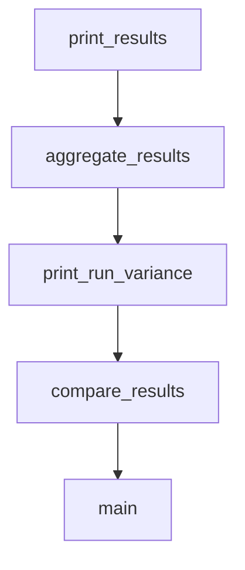

# Chapter 4: Streaming & Async

Welcome to **Chapter 4: Streaming & Async**. In this part of **LiteLLM Tutorial: Unified LLM Gateway and Routing Layer**, you will build an intuitive mental model first, then move into concrete implementation details and practical production tradeoffs.


> Implement real-time streaming responses and asynchronous processing for better user experience and performance.

## Overview

Streaming allows you to receive responses in real-time as they're generated, while async processing enables concurrent requests. This chapter covers both patterns and how to implement them with LiteLLM.

## Basic Streaming

Receive responses token by token:

```python
import litellm

response = litellm.completion(
    model="gpt-4",
    messages=[{"role": "user", "content": "Write a short story about AI"}],
    stream=True  # Enable streaming
)

for chunk in response:
    if chunk.choices[0].delta.content:
        print(chunk.choices[0].delta.content, end="", flush=True)

print()  # New line at end
```

## Understanding Stream Chunks

Stream responses contain partial content:

```python
response = litellm.completion(
    model="gpt-4",
    messages=[{"role": "user", "content": "Count to 10 slowly"}],
    stream=True
)

for i, chunk in enumerate(response):
    print(f"Chunk {i}:")
    print(f"  Content: {chunk.choices[0].delta.content}")
    print(f"  Finish reason: {chunk.choices[0].finish_reason}")
    print(f"  Usage: {chunk.usage}")
    print()
```

## Building a Streaming Chat Interface

Create an interactive chat with real-time responses:

```python
import litellm
import time

class StreamingChat:
    def __init__(self, model="gpt-4"):
        self.model = model
        self.conversation = []

    def send_message(self, user_message):
        """Send a message and stream the response."""
        self.conversation.append({"role": "user", "content": user_message})

        response = litellm.completion(
            model=self.model,
            messages=self.conversation,
            stream=True,
            max_tokens=500
        )

        full_response = ""
        print("Assistant: ", end="", flush=True)

        for chunk in response:
            if chunk.choices[0].delta.content:
                content = chunk.choices[0].delta.content
                print(content, end="", flush=True)
                full_response += content
                time.sleep(0.01)  # Small delay for readability

        print()  # New line
        self.conversation.append({"role": "assistant", "content": full_response})
        return full_response

# Usage
chat = StreamingChat()

while True:
    user_input = input("You: ")
    if user_input.lower() in ['quit', 'exit']:
        break

    chat.send_message(user_input)
```

## Async Streaming

Handle multiple streaming requests concurrently:

```python
import asyncio
import litellm

async def stream_completion_async(model, messages):
    """Async streaming completion."""
    response = await litellm.acompletion(
        model=model,
        messages=messages,
        stream=True,
        max_tokens=300
    )

    full_content = ""
    async for chunk in response:
        if chunk.choices[0].delta.content:
            content = chunk.choices[0].delta.content
            print(content, end="", flush=True)
            full_content += content

    return full_content

async def main():
    messages = [{"role": "user", "content": "Explain async programming"}]

    print("Streaming response:")
    content = await stream_completion_async("gpt-4", messages)
    print(f"\n\nFull content length: {len(content)} characters")

# Run async function
asyncio.run(main())
```

## Concurrent Requests

Process multiple requests simultaneously:

```python
async def process_multiple_requests():
    """Process multiple LLM requests concurrently."""

    tasks = [
        litellm.acompletion(
            model="gpt-4",
            messages=[{"role": "user", "content": f"Tell me a fact about topic {i}"}],
            max_tokens=100
        )
        for i in range(5)
    ]

    # Wait for all to complete
    responses = await asyncio.gather(*tasks)

    for i, response in enumerate(responses):
        content = response.choices[0].message.content
        print(f"Topic {i}: {content[:50]}...")

# Run concurrent requests
asyncio.run(process_multiple_requests())
```

## Streaming with Error Handling

Robust streaming with fallbacks:

```python
async def streaming_with_fallback(messages, primary_model="gpt-4", fallback_model="gpt-3.5-turbo"):
    """Stream with automatic fallback."""

    try:
        response = await litellm.acompletion(
            model=primary_model,
            messages=messages,
            stream=True,
            timeout=30
        )

        full_content = ""
        async for chunk in response:
            if chunk.choices[0].delta.content:
                content = chunk.choices[0].delta.content
                print(content, end="", flush=True)
                full_content += content

        return full_content, primary_model

    except Exception as e:
        print(f"\nPrimary model failed ({primary_model}), trying fallback ({fallback_model})...")
        print("Fallback: ", end="", flush=True)

        # Fallback to non-streaming for simplicity
        response = await litellm.acompletion(
            model=fallback_model,
            messages=messages,
            max_tokens=300
        )

        content = response.choices[0].message.content
        print(content)
        return content, fallback_model

async def main():
    messages = [{"role": "user", "content": "Write a haiku about programming"}]

    content, model_used = await streaming_with_fallback(messages)
    print(f"\nUsed model: {model_used}")

asyncio.run(main())
```

## WebSocket Streaming

Implement WebSocket-based streaming for web applications:

```python
# server.py (using FastAPI)
from fastapi import FastAPI, WebSocket
import litellm
import json

app = FastAPI()

@app.websocket("/chat")
async def chat_websocket(websocket: WebSocket):
    await websocket.accept()

    # Initialize conversation
    conversation = [{"role": "system", "content": "You are a helpful assistant."}]

    try:
        while True:
            # Receive user message
            user_message = await websocket.receive_text()
            conversation.append({"role": "user", "content": user_message})

            # Stream response
            response = await litellm.acompletion(
                model="gpt-4",
                messages=conversation,
                stream=True
            )

            full_response = ""
            async for chunk in response:
                if chunk.choices[0].delta.content:
                    content = chunk.choices[0].delta.content
                    full_response += content

                    # Send chunk to client
                    await websocket.send_text(json.dumps({
                        "type": "chunk",
                        "content": content
                    }))

            # Send completion signal
            await websocket.send_text(json.dumps({
                "type": "done",
                "full_content": full_response
            }))

            # Add to conversation history
            conversation.append({"role": "assistant", "content": full_response})

    except Exception as e:
        await websocket.send_text(json.dumps({
            "type": "error",
            "message": str(e)
        }))

# client.js (frontend)
const ws = new WebSocket('ws://localhost:8000/chat');

ws.onmessage = function(event) {
    const data = JSON.parse(event.data);

    if (data.type === 'chunk') {
        // Append chunk to response area
        responseDiv.textContent += data.content;
    } else if (data.type === 'done') {
        // Handle completion
        console.log('Response complete');
    } else if (data.type === 'error') {
        // Handle error
        console.error('Error:', data.message);
    }
};

// Send message
function sendMessage(message) {
    ws.send(message);
}
```

## Progress Indicators

Show progress during long generations:

```python
import threading
import time

def show_progress_indicator():
    """Show a simple progress indicator."""
    symbols = ["⠋", "⠙", "⠹", "⠸", "⠼", "⠴", "⠦", "⠧", "⠇", "⠏"]
    i = 0
    while not hasattr(show_progress_indicator, 'stop'):
        print(f"\r{symbols[i % len(symbols)]} Generating response...", end="", flush=True)
        time.sleep(0.1)
        i += 1
    print("\r✓ Response complete!     ")

def stream_with_progress(model, messages):
    """Stream with progress indicator."""

    # Start progress indicator in background
    progress_thread = threading.Thread(target=show_progress_indicator)
    progress_thread.start()

    try:
        response = litellm.completion(
            model=model,
            messages=messages,
            stream=True,
            max_tokens=1000
        )

        full_content = ""
        print("\r", end="", flush=True)  # Clear progress indicator

        for chunk in response:
            if chunk.choices[0].delta.content:
                content = chunk.choices[0].delta.content
                print(content, end="", flush=True)
                full_content += content

        print()  # New line
        return full_content

    finally:
        # Stop progress indicator
        show_progress_indicator.stop = True
        progress_thread.join()

# Usage
messages = [{"role": "user", "content": "Write a 500-word essay about artificial intelligence"}]
content = stream_with_progress("gpt-4", messages)
```

## Rate Limiting with Async

Implement rate limiting for concurrent requests:

```python
import asyncio
from collections import deque
import time

class RateLimiter:
    def __init__(self, requests_per_minute=60):
        self.requests_per_minute = requests_per_minute
        self.requests = deque()
        self.lock = asyncio.Lock()

    async def acquire(self):
        """Acquire permission to make a request."""
        async with self.lock:
            now = time.time()

            # Remove old requests outside the time window
            while self.requests and now - self.requests[0] > 60:
                self.requests.popleft()

            # Check if we can make another request
            if len(self.requests) >= self.requests_per_minute:
                # Wait until oldest request expires
                wait_time = 60 - (now - self.requests[0])
                if wait_time > 0:
                    await asyncio.sleep(wait_time)

            self.requests.append(now)

rate_limiter = RateLimiter(requests_per_minute=50)

async def rate_limited_completion(model, messages):
    """Completion with rate limiting."""
    await rate_limiter.acquire()

    return await litellm.acompletion(
        model=model,
        messages=messages
    )

async def batch_with_rate_limit():
    """Process batch with rate limiting."""
    tasks = []
    for i in range(10):
        messages = [{"role": "user", "content": f"Generate idea {i}"}]
        tasks.append(rate_limited_completion("gpt-3.5-turbo", messages))

    results = await asyncio.gather(*tasks)

    for i, response in enumerate(results):
        print(f"Idea {i}: {response.choices[0].message.content[:50]}...")

asyncio.run(batch_with_rate_limit())
```

## Streaming File Processing

Process large files with streaming:

```python
async def stream_file_processing(file_path, model="gpt-4"):
    """Process a large file with streaming."""

    # Read file in chunks
    with open(file_path, 'r') as f:
        content = f.read()

    # Split into manageable chunks
    chunk_size = 4000  # characters
    chunks = [content[i:i + chunk_size] for i in range(0, len(content), chunk_size)]

    full_analysis = ""

    for i, chunk in enumerate(chunks):
        print(f"Processing chunk {i + 1}/{len(chunks)}...")

        messages = [
            {"role": "system", "content": "You are analyzing a large document. Provide insights for this section."},
            {"role": "user", "content": f"Analyze this section of the document:\n\n{chunk}"}
        ]

        response = await litellm.acompletion(
            model=model,
            messages=messages,
            stream=True,
            max_tokens=500
        )

        chunk_analysis = ""
        async for chunk_response in response:
            if chunk_response.choices[0].delta.content:
                content_piece = chunk_response.choices[0].delta.content
                print(content_piece, end="", flush=True)
                chunk_analysis += content_piece

        full_analysis += f"\n\n--- Section {i + 1} ---\n{chunk_analysis}"
        print("\n")  # Section separator

    return full_analysis

# Usage
analysis = await stream_file_processing("large_document.txt")
```

## Performance Optimization

Tips for streaming performance:

1. **Chunk Processing**: Process responses in chunks rather than individual tokens for UI updates
2. **Connection Pooling**: Reuse connections for multiple requests
3. **Concurrent Limits**: Limit concurrent streaming requests to avoid overwhelming the API
4. **Error Recovery**: Implement automatic retry logic for failed chunks
5. **Buffering**: Buffer chunks before displaying to reduce UI flicker

## Best Practices

1. **User Feedback**: Always show users that streaming is in progress
2. **Error Handling**: Handle streaming errors gracefully (connection drops, timeouts)
3. **Rate Limiting**: Respect API rate limits, especially with concurrent requests
4. **Resource Management**: Clean up resources properly in async code
5. **UI Responsiveness**: Update UI efficiently to avoid blocking the main thread
6. **Fallback Strategies**: Have non-streaming fallbacks for when streaming fails
7. **Progress Indication**: Show meaningful progress indicators for long operations

Streaming and async processing enable responsive, scalable AI applications. These patterns work across all LiteLLM-supported providers, giving you consistent real-time capabilities regardless of the underlying model.

## Depth Expansion Playbook

## Source Code Walkthrough

### `scripts/benchmark_proxy_vs_provider.py`

The `print_results` function in [`scripts/benchmark_proxy_vs_provider.py`](https://github.com/BerriAI/litellm/blob/HEAD/scripts/benchmark_proxy_vs_provider.py) handles a key part of this chapter's functionality:

```py


def print_results(name: str, results: BenchmarkResults):
    """Print formatted benchmark results"""
    stats = results.calculate_stats()
    
    print(f"\n{'='*60}")
    print(f"Results for {name}")
    print(f"{'='*60}")
    print(f"Total Requests:        {stats['total_requests']}")
    print(f"Successful Requests:   {stats['successful_requests']}")
    print(f"Failed Requests:       {stats['failed_requests']}")
    print(f"Success Rate:          {stats['success_rate']:.2f}%")
    print(f"Error Rate:            {stats['error_rate']:.2f}%")
    print(f"Total Time:            {stats['total_time']:.2f}s")
    print(f"Requests/Second:       {stats['requests_per_second']:.2f}")
    
    if 'latency_stats' in stats:
        latency = stats['latency_stats']
        print(f"\nLatency Statistics (seconds):")
        print(f"   Mean:               {latency['mean']:.4f}s")
        print(f"   Median (p50):       {latency['median']:.4f}s")
        print(f"   Min:                {latency['min']:.4f}s")
        print(f"   Max:                {latency['max']:.4f}s")
        print(f"   Std Dev:            {latency['std_dev']:.4f}s")
        print(f"   p95:                {latency['p95']:.4f}s")
        print(f"   p99:                {latency['p99']:.4f}s")
    
    if stats['status_codes']:
        print(f"\nStatus Codes:")
        for code, count in sorted(stats['status_codes'].items()):
            print(f"   {code}: {count}")
```

This function is important because it defines how LiteLLM Tutorial: Unified LLM Gateway and Routing Layer implements the patterns covered in this chapter.

### `scripts/benchmark_proxy_vs_provider.py`

The `aggregate_results` function in [`scripts/benchmark_proxy_vs_provider.py`](https://github.com/BerriAI/litellm/blob/HEAD/scripts/benchmark_proxy_vs_provider.py) handles a key part of this chapter's functionality:

```py


def aggregate_results(results_list: List[BenchmarkResults]) -> BenchmarkResults:
    """Aggregate results from multiple runs"""
    if not results_list:
        return BenchmarkResults()
    
    aggregated = BenchmarkResults()
    
    # Aggregate all latencies
    all_latencies = []
    all_errors = []
    total_requests = 0
    total_successful = 0
    total_failed = 0
    total_time_sum = 0.0
    status_codes_combined = {}
    
    for result in results_list:
        all_latencies.extend(result.latencies)
        all_errors.extend(result.errors)
        total_requests += result.total_requests
        total_successful += result.successful_requests
        total_failed += result.failed_requests
        total_time_sum += result.total_time
        
        for code, count in result.status_codes.items():
            status_codes_combined[code] = status_codes_combined.get(code, 0) + count
    
    aggregated.latencies = all_latencies
    aggregated.errors = all_errors
    aggregated.total_requests = total_requests
```

This function is important because it defines how LiteLLM Tutorial: Unified LLM Gateway and Routing Layer implements the patterns covered in this chapter.

### `scripts/benchmark_proxy_vs_provider.py`

The `print_run_variance` function in [`scripts/benchmark_proxy_vs_provider.py`](https://github.com/BerriAI/litellm/blob/HEAD/scripts/benchmark_proxy_vs_provider.py) handles a key part of this chapter's functionality:

```py


def print_run_variance(name: str, results_list: List[BenchmarkResults]):
    """Print variance statistics across multiple runs"""
    if len(results_list) <= 1:
        return
    
    print(f"\n{'='*60}")
    print(f"Run-to-Run Variance: {name}")
    print(f"{'='*60}")
    
    # Collect mean latencies from each run
    mean_latencies = []
    throughputs = []
    
    for result in results_list:
        stats = result.calculate_stats()
        if 'latency_stats' in stats:
            mean_latencies.append(stats['latency_stats']['mean'])
        throughputs.append(stats['requests_per_second'])
    
    if mean_latencies:
        print(f"\nMean Latency Variance:")
        print(f"   Runs:           {len(mean_latencies)}")
        print(f"   Mean:           {mean(mean_latencies):.4f}s")
        print(f"   Min:            {min(mean_latencies):.4f}s")
        print(f"   Max:            {max(mean_latencies):.4f}s")
        print(f"   Std Dev:        {stdev(mean_latencies):.4f}s" if len(mean_latencies) > 1 else "   Std Dev:        N/A")
        print(f"   Coefficient of Variation: {(stdev(mean_latencies) / mean(mean_latencies) * 100):.2f}%" if len(mean_latencies) > 1 else "   Coefficient of Variation: N/A")
    
    if throughputs:
        print(f"\nThroughput Variance:")
```

This function is important because it defines how LiteLLM Tutorial: Unified LLM Gateway and Routing Layer implements the patterns covered in this chapter.

### `scripts/benchmark_proxy_vs_provider.py`

The `compare_results` function in [`scripts/benchmark_proxy_vs_provider.py`](https://github.com/BerriAI/litellm/blob/HEAD/scripts/benchmark_proxy_vs_provider.py) handles a key part of this chapter's functionality:

```py


def compare_results(proxy_results: BenchmarkResults, provider_results: BenchmarkResults):
    """Compare and print differences between proxy and provider results"""
    proxy_stats = proxy_results.calculate_stats()
    provider_stats = provider_results.calculate_stats()
    
    print(f"\n{'='*60}")
    print(f"Comparison: LiteLLM Proxy vs Direct Provider")
    print(f"{'='*60}")
    
    # Success Rate Comparison
    print(f"\nSuccess Rate:")
    print(f"   Proxy:   {proxy_stats['success_rate']:.2f}%")
    print(f"   Provider: {provider_stats['success_rate']:.2f}%")
    diff = proxy_stats['success_rate'] - provider_stats['success_rate']
    print(f"   Difference: {diff:+.2f}%")
    
    # Throughput Comparison
    print(f"\nThroughput (requests/second):")
    print(f"   Proxy:   {proxy_stats['requests_per_second']:.2f}")
    print(f"   Provider: {provider_stats['requests_per_second']:.2f}")
    diff = proxy_stats['requests_per_second'] - provider_stats['requests_per_second']
    print(f"   Difference: {diff:+.2f} req/s")
    
    # Latency Comparison
    if 'latency_stats' in proxy_stats and 'latency_stats' in provider_stats:
        print(f"\nLatency Comparison (seconds):")
        proxy_latency = proxy_stats['latency_stats']
        provider_latency = provider_stats['latency_stats']
        
        metrics = ['mean', 'median', 'p95', 'p99']
```

This function is important because it defines how LiteLLM Tutorial: Unified LLM Gateway and Routing Layer implements the patterns covered in this chapter.


## How These Components Connect


