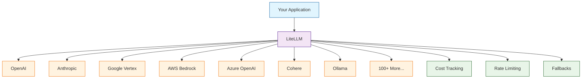

# LiteLLM Tutorial: Unified LLM API Gateway

> Call 100+ LLM providers with a single, consistent interface.

<div align="center">

**🔀 One API to Rule Them All**

[](https://github.com/BerriAI/litellm)

</div>

---

## 🎯 What is LiteLLM?

**LiteLLM**<sup>[View Repo](https://github.com/BerriAI/litellm)</sup> is a unified interface for calling 100+ LLM providers using the OpenAI API format. It handles authentication, retries, fallbacks, and cost tracking—making it easy to switch between or combine multiple LLM providers.

### Why LiteLLM?

| Feature | Description |
|:--------|:------------|
| **Unified Interface** | Same code works with any LLM provider |
| **OpenAI Format** | Use familiar OpenAI SDK syntax everywhere |
| **100+ Providers** | OpenAI, Anthropic, Cohere, Bedrock, Vertex AI, and more |
| **Built-in Fallbacks** | Automatic failover between providers |
| **Cost Tracking** | Monitor spend across all providers |
| **Rate Limiting** | Built-in rate limit handling and retries |
| **Proxy Server** | Optional OpenAI-compatible proxy server |



## Tutorial Chapters

1. **[Chapter 1: Getting Started](01-getting-started.md)** - Installation, setup, and your first LiteLLM call
2. **[Chapter 2: Provider Configuration](02-providers.md)** - Setting up different LLM providers
3. **[Chapter 3: Completion API](03-completion.md)** - Text and chat completions across providers
4. **[Chapter 4: Streaming & Async](04-streaming.md)** - Streaming responses and async support
5. **[Chapter 5: Fallbacks & Retries](05-fallbacks.md)** - Building resilient LLM applications
6. **[Chapter 6: Cost Tracking](06-cost-tracking.md)** - Monitoring spend and usage
7. **[Chapter 7: LiteLLM Proxy](07-proxy.md)** - Running an OpenAI-compatible proxy server
8. **[Chapter 8: Production Deployment](08-production.md)** - Scaling, security, and best practices

## What You'll Learn

- **Unify LLM Calls** across all providers with one interface
- **Configure Multiple Providers** with proper authentication
- **Handle Streaming** responses consistently
- **Implement Fallbacks** for high availability
- **Track Costs** and monitor usage
- **Run a Proxy Server** for team access control
- **Deploy at Scale** with proper caching and load balancing

## Prerequisites

- Python 3.8+
- API keys for your chosen providers
- Basic understanding of LLM APIs

## Quick Start

```bash
# Install LiteLLM
pip install litellm

# Set environment variables for your providers
export OPENAI_API_KEY="sk-..."
export ANTHROPIC_API_KEY="sk-ant-..."
```

## Your First LiteLLM Call

```python
from litellm import completion

# Call OpenAI
response = completion(
    model="gpt-4o",
    messages=[{"role": "user", "content": "Hello!"}]
)
print(response.choices[0].message.content)

# Same code, different provider - just change the model!
response = completion(
    model="claude-3-5-sonnet-20241022",
    messages=[{"role": "user", "content": "Hello!"}]
)
print(response.choices[0].message.content)
```

## Provider Examples

### OpenAI
```python
response = completion(
    model="gpt-4o",
    messages=[{"role": "user", "content": "What is AI?"}]
)
```

### Anthropic Claude
```python
response = completion(
    model="claude-3-5-sonnet-20241022",
    messages=[{"role": "user", "content": "What is AI?"}]
)
```

### Google Gemini
```python
response = completion(
    model="gemini/gemini-1.5-pro",
    messages=[{"role": "user", "content": "What is AI?"}]
)
```

### AWS Bedrock
```python
response = completion(
    model="bedrock/anthropic.claude-3-sonnet-20240229-v1:0",
    messages=[{"role": "user", "content": "What is AI?"}]
)
```

### Azure OpenAI
```python
response = completion(
    model="azure/my-deployment-name",
    messages=[{"role": "user", "content": "What is AI?"}],
    api_base="https://my-resource.openai.azure.com",
    api_key="your-azure-key",
    api_version="2024-02-15-preview"
)
```

### Local Models (Ollama)
```python
response = completion(
    model="ollama/llama3",
    messages=[{"role": "user", "content": "What is AI?"}],
    api_base="http://localhost:11434"
)
```

## Streaming Responses

```python
from litellm import completion

response = completion(
    model="gpt-4o",
    messages=[{"role": "user", "content": "Write a story"}],
    stream=True
)

for chunk in response:
    if chunk.choices[0].delta.content:
        print(chunk.choices[0].delta.content, end="", flush=True)
```

## Async Support

```python
import asyncio
from litellm import acompletion

async def main():
    response = await acompletion(
        model="claude-3-5-sonnet-20241022",
        messages=[{"role": "user", "content": "Hello!"}]
    )
    print(response.choices[0].message.content)

asyncio.run(main())
```

## Fallbacks for Reliability

```python
from litellm import completion

response = completion(
    model="gpt-4o",
    messages=[{"role": "user", "content": "Hello!"}],
    fallbacks=["claude-3-5-sonnet-20241022", "gemini/gemini-1.5-pro"],
    num_retries=3
)
# Automatically tries fallback models if primary fails
```

## Cost Tracking

```python
from litellm import completion

response = completion(
    model="gpt-4o",
    messages=[{"role": "user", "content": "Hello!"}]
)

# Access cost information
print(f"Cost: ${response._hidden_params['response_cost']:.6f}")
print(f"Input tokens: {response.usage.prompt_tokens}")
print(f"Output tokens: {response.usage.completion_tokens}")
```

## LiteLLM Proxy Server

Run an OpenAI-compatible API server:

```bash
# Start the proxy
litellm --model gpt-4o --port 8000

# Or with config file
litellm --config config.yaml
```

```yaml
# config.yaml
model_list:
  - model_name: gpt-4
    litellm_params:
      model: gpt-4o
      api_key: sk-...
  - model_name: claude
    litellm_params:
      model: claude-3-5-sonnet-20241022
      api_key: sk-ant-...

general_settings:
  master_key: sk-1234  # API key for your proxy
```

```python
# Call your proxy like OpenAI
from openai import OpenAI

client = OpenAI(
    base_url="http://localhost:8000",
    api_key="sk-1234"
)

response = client.chat.completions.create(
    model="gpt-4",  # Routes to gpt-4o via proxy
    messages=[{"role": "user", "content": "Hello!"}]
)
```

## Supported Providers (100+)

| Category | Providers |
|:---------|:----------|
| **Commercial** | OpenAI, Anthropic, Google, Cohere, Mistral |
| **Cloud** | AWS Bedrock, Azure OpenAI, Google Vertex AI |
| **Open Source** | Ollama, vLLM, Hugging Face TGI |
| **Specialized** | Replicate, Together AI, Anyscale, Groq |

## Learning Path

### 🟢 Beginner Track
1. Chapters 1-3: Setup and basic completion calls
2. Call different providers with unified code

### 🟡 Intermediate Track
1. Chapters 4-6: Streaming, fallbacks, and cost tracking
2. Build reliable, cost-efficient applications

### 🔴 Advanced Track
1. Chapters 7-8: Proxy server and production deployment
2. Run enterprise-grade LLM infrastructure

---

**Ready to unify your LLM calls? Let's begin with [Chapter 1: Getting Started](01-getting-started.md)!**

*Generated for [Awesome Code Docs](https://github.com/johnxie/awesome-code-docs)*
