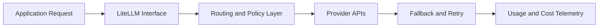

# LiteLLM Tutorial: Unified LLM Gateway and Routing Layer

> Build provider-agnostic LLM applications with `BerriAI/litellm`, including routing, fallbacks, proxy deployment, and cost-aware operations.

## Why This Track Matters

As teams add more models/providers, integration and reliability complexity grows quickly. LiteLLM is often used as the control plane for that complexity.

This track focuses on:

- one interface across many model providers
- resilient fallback and retry strategies
- cost and latency observability
- proxy-mode operations for team and production usage

## Current Snapshot (auto-updated)

- repository: [`BerriAI/litellm`](https://github.com/BerriAI/litellm)
- stars: about **35.8k**
- latest published release tag: `v1.81.10-nightly`
- latest stable-tagged line in recent releases: `1.78.5-stable-patch-1`
- project scope includes Python SDK + proxy server + routing/guardrail/cost tooling

## Mental Model

## Chapter Guide

| Chapter | Key Question | Outcome |
|:--------|:-------------|:--------|
| [01 - Getting Started](01-getting-started.md) | How do I install and make first cross-provider calls? | Working baseline integration |
| [02 - Provider Configuration](02-providers.md) | How do I configure multiple providers safely? | Unified provider setup strategy |
| [03 - Completion API](03-completion.md) | How do I keep completion code portable? | Provider-agnostic request patterns |
| [04 - Streaming and Async](04-streaming.md) | How do I handle real-time and async workloads? | Streaming-ready service behavior |
| [05 - Fallbacks and Retries](05-fallbacks.md) | How do I make LLM calls resilient? | Reliability playbook |
| [06 - Cost Tracking](06-cost-tracking.md) | How do I monitor and control spend? | Cost governance model |
| [07 - LiteLLM Proxy](07-proxy.md) | How do I run LiteLLM as a shared gateway? | Team-ready proxy operations |
| [08 - Production Deployment](08-production.md) | How do I scale and secure deployments? | Production operations baseline |

## What You Will Learn

- how to use LiteLLM as a provider abstraction layer in real applications
- how to design fallback/routing patterns that reduce outage impact
- how to implement usage and spend observability across providers
- how to run LiteLLM proxy mode in production environments

## Source References

- [LiteLLM Repository](https://github.com/BerriAI/litellm)
- [LiteLLM Releases](https://github.com/BerriAI/litellm/releases)
- [LiteLLM Docs](https://docs.litellm.ai/)

## Related Tutorials

- [Langfuse Tutorial](../langfuse-tutorial/)
- [Vercel AI SDK Tutorial](../vercel-ai-tutorial/)
- [OpenAI Python SDK Tutorial](../openai-python-sdk-tutorial/)
- [Aider Tutorial](../aider-tutorial/)

---

Start with [Chapter 1: Getting Started](01-getting-started.md).

## Navigation & Backlinks

- [Start Here: Chapter 1: Getting Started with LiteLLM](01-getting-started.md)
- [Back to Main Catalog](../../README.md#-tutorial-catalog)
- [Browse A-Z Tutorial Directory](../../discoverability/tutorial-directory.md)
- [Search by Intent](../../discoverability/query-hub.md)
- [Explore Category Hubs](../../README.md#category-hubs)

## Full Chapter Map

1. [Chapter 1: Getting Started with LiteLLM](01-getting-started.md)
2. [Chapter 2: Provider Configuration](02-providers.md)
3. [Chapter 3: Completion API](03-completion.md)
4. [Chapter 4: Streaming & Async](04-streaming.md)
5. [Chapter 5: Fallbacks & Retries](05-fallbacks.md)
6. [Chapter 6: Cost Tracking](06-cost-tracking.md)
7. [Chapter 7: LiteLLM Proxy](07-proxy.md)
8. [Chapter 8: Production Deployment](08-production.md)

*Generated by [AI Codebase Knowledge Builder](https://github.com/The-Pocket/Tutorial-Codebase-Knowledge)*
