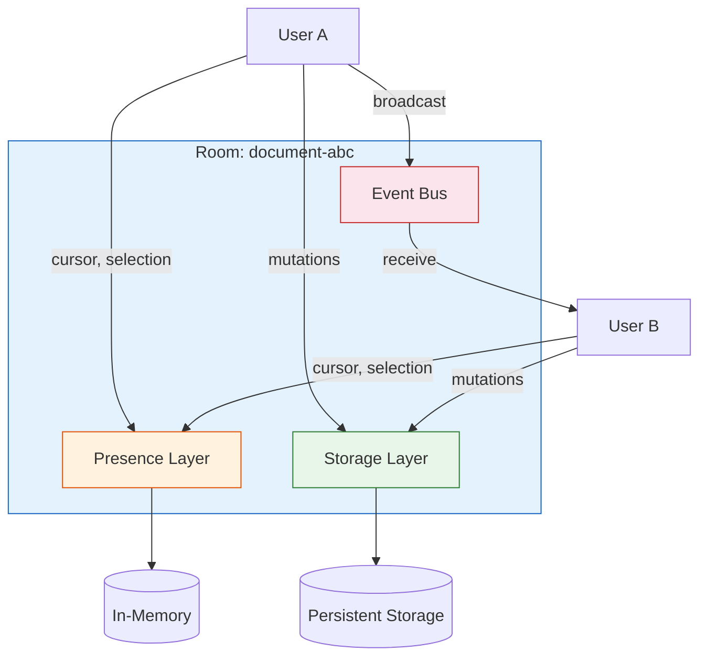
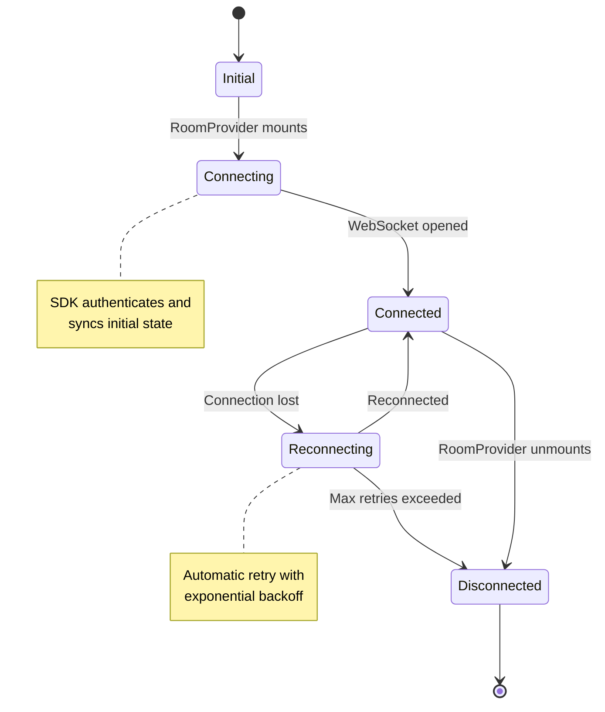

# Chapter 1: Getting Started

Welcome to **Chapter 1: Getting Started**. In this part of **Liveblocks - Real-Time Collaboration Deep Dive**, you will build an intuitive mental model first, then move into concrete implementation details and practical production tradeoffs.


## Introduction

Real-time collaboration has become a table-stakes feature for modern applications. Users expect to see each other's cursors, edits, and presence in real time -- the experience pioneered by Google Docs and refined by Figma and Notion. Building this from scratch requires deep expertise in WebSockets, conflict resolution algorithms, and distributed systems. Liveblocks abstracts all of that complexity into a developer-friendly SDK.

This chapter walks you through installing Liveblocks, creating your first "room" (the core collaboration primitive), and connecting multiple users to a shared real-time session.

## How Liveblocks Works

Before writing code, it helps to understand the mental model. Liveblocks is organized around **rooms**. A room is a shared context where multiple users can collaborate. Every room has:

- **Presence** -- ephemeral state about each connected user (cursor position, selected element, etc.)
- **Storage** -- persistent, conflict-free shared data (documents, lists, maps)
- **Events** -- one-shot messages broadcast to all users in the room



## Installation

### Step 1: Create a Liveblocks Account

Sign up at [liveblocks.io](https://liveblocks.io) and create a new project. You will receive two keys:

| Key Type | Format | Usage |
|----------|--------|-------|
| **Public Key** | `pk_live_xxx` or `pk_dev_xxx` | Client-side, safe to expose |
| **Secret Key** | `sk_live_xxx` or `sk_dev_xxx` | Server-side only, never expose |

The `_dev_` variants connect to a development environment with relaxed rate limits and no billing.

### Step 2: Install Packages

Liveblocks is modular. Install only what you need:

```bash
# Core client (framework-agnostic)
npm install @liveblocks/client

# React bindings (if using React)
npm install @liveblocks/react

# React UI components (pre-built collaboration UI)
npm install @liveblocks/react-ui

# Node.js server utilities (for authentication)
npm install @liveblocks/node
```

For a typical React or Next.js project, install everything at once:

```bash
npm install @liveblocks/client @liveblocks/react @liveblocks/react-ui @liveblocks/node
```

### Step 3: Initialize the Liveblocks CLI (Optional)

Liveblocks provides a CLI for project scaffolding and schema management:

```bash
npx create-liveblocks-app@latest --init
```

This generates a `liveblocks.config.ts` file with type-safe configuration.

## Project Setup

### Creating the Client

The Liveblocks client is the entry point to all functionality. It manages WebSocket connections and provides access to rooms.

```typescript
// liveblocks.config.ts
import { createClient } from "@liveblocks/client";
import { createRoomContext } from "@liveblocks/react";

// Option 1: Public key authentication (development)
const client = createClient({
  publicApiKey: "pk_dev_your_key_here",
});

// Option 2: Token-based authentication (production)
const client = createClient({
  authEndpoint: "/api/liveblocks-auth",
});
```

### Defining Types

Liveblocks is fully type-safe. Define your presence and storage types upfront:

```typescript
// liveblocks.config.ts
import { createClient } from "@liveblocks/client";
import { createRoomContext } from "@liveblocks/react";
import { LiveList, LiveObject, LiveMap } from "@liveblocks/client";

// What each user broadcasts about themselves
type Presence = {
  cursor: { x: number; y: number } | null;
  selectedId: string | null;
  name: string;
  color: string;
};

// Shared persistent state
type Storage = {
  shapes: LiveMap<string, LiveObject<{
    x: number;
    y: number;
    width: number;
    height: number;
    fill: string;
  }>>;
  layers: LiveList<string>;
};

// Custom broadcast events
type RoomEvent =
  | { type: "EMOJI_REACTION"; emoji: string; x: number; y: number }
  | { type: "POINTER_MOVE"; x: number; y: number };

// User metadata (from your auth system)
type UserMeta = {
  id: string;
  info: {
    name: string;
    avatar: string;
    color: string;
  };
};

// Thread metadata for comments
type ThreadMetadata = {
  resolved: boolean;
  x: number;
  y: number;
};

const client = createClient({
  publicApiKey: "pk_dev_your_key_here",
});

export const {
  suspense: {
    RoomProvider,
    useRoom,
    useMyPresence,
    useSelf,
    useOthers,
    useOthersMapped,
    useOthersConnectionIds,
    useOther,
    useBroadcastEvent,
    useEventListener,
    useStorage,
    useMutation,
    useHistory,
    useUndo,
    useRedo,
    useCanUndo,
    useCanRedo,
    useBatch,
    useStatus,
    useThreads,
    useCreateThread,
    useCreateComment,
  },
} = createRoomContext<Presence, Storage, UserMeta, RoomEvent, ThreadMetadata>(client);
```

### The Liveblocks Configuration File

Starting with Liveblocks 1.x, you can also use a global configuration approach with `liveblocks.config.ts`:

```typescript
// liveblocks.config.ts (global approach)
declare global {
  interface Liveblocks {
    Presence: {
      cursor: { x: number; y: number } | null;
      name: string;
    };
    Storage: {
      todos: LiveList<LiveObject<{
        text: string;
        completed: boolean;
        author: string;
      }>>;
    };
    UserMeta: {
      id: string;
      info: {
        name: string;
        avatar: string;
      };
    };
    RoomEvent: {
      type: "NOTIFICATION";
      message: string;
    };
    ThreadMetadata: {
      resolved: boolean;
      x: number;
      y: number;
    };
  }
}

export {};
```

## Your First Collaborative Room

### Setting Up the Provider

Every collaborative feature lives inside a `RoomProvider`. This component establishes a WebSocket connection to a specific room:

```tsx
// app/page.tsx (Next.js App Router)
"use client";

import { RoomProvider } from "../liveblocks.config";
import { LiveList } from "@liveblocks/client";
import { ClientSideSuspense } from "@liveblocks/react";
import { CollaborativeEditor } from "./CollaborativeEditor";

export default function Page() {
  return (
    <RoomProvider
      id="my-first-room"
      initialPresence={{
        cursor: null,
        selectedId: null,
        name: "Anonymous",
        color: "#FF0000",
      }}
      initialStorage={{
        shapes: new LiveMap(),
        layers: new LiveList([]),
      }}
    >
      <ClientSideSuspense fallback={<div>Connecting...</div>}>
        {() => <CollaborativeEditor />}
      </ClientSideSuspense>
    </RoomProvider>
  );
}
```

### Understanding Room IDs

Room IDs are strings that identify a collaboration session. Common patterns include:

| Pattern | Example | Use Case |
|---------|---------|----------|
| Static | `"main-canvas"` | Single shared workspace |
| Document-based | `"doc:${documentId}"` | Per-document collaboration |
| User-scoped | `"user:${userId}:drafts"` | Personal spaces |
| Hierarchical | `"org:${orgId}:project:${projectId}"` | Multi-tenant apps |

```typescript
// Dynamic room IDs based on URL
function DocumentPage({ params }: { params: { docId: string } }) {
  return (
    <RoomProvider
      id={`document-${params.docId}`}
      initialPresence={{ cursor: null, name: "User" }}
    >
      <Editor />
    </RoomProvider>
  );
}
```

### Building a Simple Collaborative Component

Let us build a minimal component that shows connected users and tracks cursor positions:

```tsx
// CollaborativeEditor.tsx
"use client";

import { useMyPresence, useOthers, useSelf } from "../liveblocks.config";
import { useCallback } from "react";

export function CollaborativeEditor() {
  const [myPresence, updateMyPresence] = useMyPresence();
  const others = useOthers();
  const self = useSelf();

  const handlePointerMove = useCallback(
    (event: React.PointerEvent) => {
      const rect = event.currentTarget.getBoundingClientRect();
      updateMyPresence({
        cursor: {
          x: event.clientX - rect.left,
          y: event.clientY - rect.top,
        },
      });
    },
    [updateMyPresence]
  );

  const handlePointerLeave = useCallback(() => {
    updateMyPresence({ cursor: null });
  }, [updateMyPresence]);

  return (
    <div
      onPointerMove={handlePointerMove}
      onPointerLeave={handlePointerLeave}
      style={{
        position: "relative",
        width: "100%",
        height: "100vh",
        background: "#fafafa",
      }}
    >
      {/* Show connection status */}
      <div style={{ padding: 16 }}>
        <p>Connected as: {self?.info?.name ?? "Anonymous"}</p>
        <p>Users in room: {others.length + 1}</p>
      </div>

      {/* Render other users' cursors */}
      {others.map(({ connectionId, presence, info }) => {
        if (!presence.cursor) return null;
        return (
          <Cursor
            key={connectionId}
            x={presence.cursor.x}
            y={presence.cursor.y}
            name={info?.name ?? `User ${connectionId}`}
            color={info?.color ?? "#000"}
          />
        );
      })}
    </div>
  );
}

function Cursor({ x, y, name, color }: {
  x: number;
  y: number;
  name: string;
  color: string;
}) {
  return (
    <div
      style={{
        position: "absolute",
        left: x,
        top: y,
        pointerEvents: "none",
        transform: "translate(-4px, -4px)",
      }}
    >
      <svg width="24" height="36" viewBox="0 0 24 36" fill="none">
        <path
          d="M5.65 0L0 31.56L8.85 22.95L18.82 36L23.15 33.27L13.15 20.27L24.65 18.78L5.65 0Z"
          fill={color}
        />
      </svg>
      <span
        style={{
          position: "absolute",
          top: 24,
          left: 8,
          background: color,
          color: "white",
          padding: "2px 6px",
          borderRadius: 4,
          fontSize: 12,
          whiteSpace: "nowrap",
        }}
      >
        {name}
      </span>
    </div>
  );
}
```

## Connection Lifecycle

Understanding how connections work is important for building robust apps:



You can monitor connection status in your components:

```tsx
import { useStatus } from "../liveblocks.config";

function ConnectionIndicator() {
  const status = useStatus();

  const statusConfig = {
    initial: { color: "gray", label: "Initializing" },
    connecting: { color: "yellow", label: "Connecting..." },
    connected: { color: "green", label: "Connected" },
    reconnecting: { color: "orange", label: "Reconnecting..." },
    disconnected: { color: "red", label: "Disconnected" },
  };

  const { color, label } = statusConfig[status];

  return (
    <div style={{ display: "flex", alignItems: "center", gap: 8 }}>
      <div
        style={{
          width: 8,
          height: 8,
          borderRadius: "50%",
          backgroundColor: color,
        }}
      />
      <span>{label}</span>
    </div>
  );
}
```

## Environment Configuration

### Development vs Production

| Aspect | Development | Production |
|--------|-------------|------------|
| **API Key** | `pk_dev_xxx` | `pk_live_xxx` |
| **Auth** | Public key (no server) | Token-based (server required) |
| **Rate Limits** | Relaxed | Standard plan limits |
| **Data** | Ephemeral (cleared periodically) | Persistent |
| **Dashboard** | Dev project | Live project |

### Environment Variables

```bash
# .env.local
NEXT_PUBLIC_LIVEBLOCKS_PUBLIC_KEY=pk_dev_xxx
LIVEBLOCKS_SECRET_KEY=sk_dev_xxx
```

```typescript
// liveblocks.config.ts
const client = createClient({
  publicApiKey: process.env.NEXT_PUBLIC_LIVEBLOCKS_PUBLIC_KEY!,
});
```

### Setting Up Authentication (Server-Side)

For production, you need a server endpoint that issues access tokens:

```typescript
// app/api/liveblocks-auth/route.ts (Next.js App Router)
import { Liveblocks } from "@liveblocks/node";
import { NextRequest } from "next/server";

const liveblocks = new Liveblocks({
  secret: process.env.LIVEBLOCKS_SECRET_KEY!,
});

export async function POST(request: NextRequest) {
  // Get user from your session/auth system
  const user = await getUserFromSession(request);

  if (!user) {
    return new Response("Unauthorized", { status: 401 });
  }

  const session = liveblocks.prepareSession(user.id, {
    userInfo: {
      name: user.name,
      avatar: user.avatarUrl,
      color: user.color,
    },
  });

  // Grant access to specific rooms
  session.allow(`document-*`, session.FULL_ACCESS);
  session.allow(`org:${user.orgId}:*`, session.FULL_ACCESS);

  const { status, body } = await session.authorize();
  return new Response(body, { status });
}
```

Then update your client to use the auth endpoint:

```typescript
const client = createClient({
  authEndpoint: "/api/liveblocks-auth",
});
```

## Project Structure

A well-organized Liveblocks project typically looks like this:

```
src/
  liveblocks.config.ts       # Client + type definitions
  app/
    api/
      liveblocks-auth/
        route.ts              # Auth endpoint
    rooms/
      [roomId]/
        page.tsx              # Room page with RoomProvider
    components/
      collaboration/
        Cursors.tsx           # Cursor rendering
        AvatarStack.tsx       # Who's online
        ConnectionStatus.tsx  # Connection indicator
      editor/
        Canvas.tsx            # Main editor
        Toolbar.tsx           # Editor toolbar
```

## Testing Your Setup

Open two browser tabs pointing to the same room. You should see:

1. Both tabs connect to the same room
2. Moving the cursor in one tab shows it in the other
3. The user count updates in real time
4. Closing one tab removes that user's cursor

```typescript
// Quick smoke test
import { createClient } from "@liveblocks/client";

async function testConnection() {
  const client = createClient({
    publicApiKey: "pk_dev_your_key_here",
  });

  const { room, leave } = client.enterRoom("test-room", {
    initialPresence: { cursor: null },
  });

  room.subscribe("status", (status) => {
    console.log("Connection status:", status);
    if (status === "connected") {
      console.log("Successfully connected to Liveblocks!");
      leave();
    }
  });
}

testConnection();
```

## Summary

In this chapter you learned:

- **Liveblocks architecture**: rooms, presence, storage, and events form the core primitives
- **Installation**: modular packages let you install only what you need
- **Type safety**: defining Presence, Storage, UserMeta, and RoomEvent types gives you full IntelliSense
- **RoomProvider**: the gateway component that establishes WebSocket connections
- **Connection lifecycle**: Liveblocks handles reconnection automatically with exponential backoff
- **Authentication**: public keys for development, token-based auth for production

## Key Takeaways

1. Everything in Liveblocks revolves around **rooms** -- isolated collaboration contexts identified by string IDs.
2. The SDK is **fully type-safe** -- define your types once and get autocomplete everywhere.
3. Start with **public key auth** for development, switch to **token-based auth** before going to production.
4. The **RoomProvider** component handles connection management, including automatic reconnection.
5. Liveblocks is **framework-agnostic** at the core, with first-class React bindings on top.

## Next Steps

In the next chapter, we will dive deep into **[Presence & Awareness](./02-presence-awareness.md)** -- learning how to build rich "who's online" experiences, live cursors, and real-time broadcasting.

---
*Built with insights from the [Liveblocks](https://liveblocks.io) platform.*

## What Problem Does This Solve?

Most teams struggle here because the hard part is not writing more code, but deciding clear boundaries for `liveblocks`, `color`, `client` so behavior stays predictable as complexity grows.

In practical terms, this chapter helps you avoid three common failures:

- coupling core logic too tightly to one implementation path
- missing the handoff boundaries between setup, execution, and validation
- shipping changes without clear rollback or observability strategy

After working through this chapter, you should be able to reason about `Chapter 1: Getting Started` as an operating subsystem inside **Liveblocks - Real-Time Collaboration Deep Dive**, with explicit contracts for inputs, state transitions, and outputs.

Use the implementation notes around `name`, `cursor`, `status` as your checklist when adapting these patterns to your own repository.

## How it Works Under the Hood

Under the hood, `Chapter 1: Getting Started` usually follows a repeatable control path:

1. **Context bootstrap**: initialize runtime config and prerequisites for `liveblocks`.
2. **Input normalization**: shape incoming data so `color` receives stable contracts.
3. **Core execution**: run the main logic branch and propagate intermediate state through `client`.
4. **Policy and safety checks**: enforce limits, auth scopes, and failure boundaries.
5. **Output composition**: return canonical result payloads for downstream consumers.
6. **Operational telemetry**: emit logs/metrics needed for debugging and performance tuning.

When debugging, walk this sequence in order and confirm each stage has explicit success/failure conditions.

## Source Walkthrough

Use the following upstream sources to verify implementation details while reading this chapter:

- [Liveblocks GitHub Repository](https://github.com/liveblocks/liveblocks)
  Why it matters: authoritative reference on `Liveblocks GitHub Repository` (github.com).
- [Liveblocks Product Site](https://liveblocks.io)
  Why it matters: authoritative reference on `Liveblocks Product Site` (liveblocks.io).
- [Liveblocks Documentation](https://liveblocks.io/docs)
  Why it matters: authoritative reference on `Liveblocks Documentation` (liveblocks.io).

Suggested trace strategy:
- search upstream code for `liveblocks` and `color` to map concrete implementation paths
- compare docs claims against actual runtime/config code before reusing patterns in production

## Chapter Connections

- [Tutorial Index](index.md)
- [Next Chapter: Chapter 2: Presence & Awareness](02-presence-awareness.md)
- [Main Catalog](../../README.md#-tutorial-catalog)
- [A-Z Tutorial Directory](../../discoverability/tutorial-directory.md)
