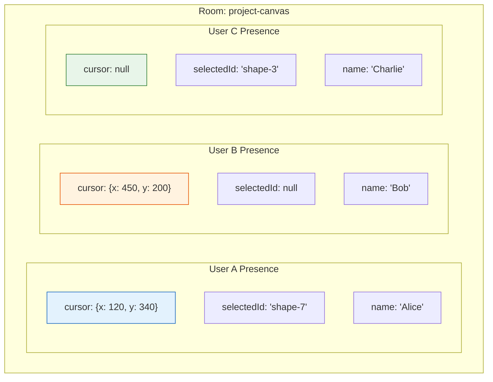
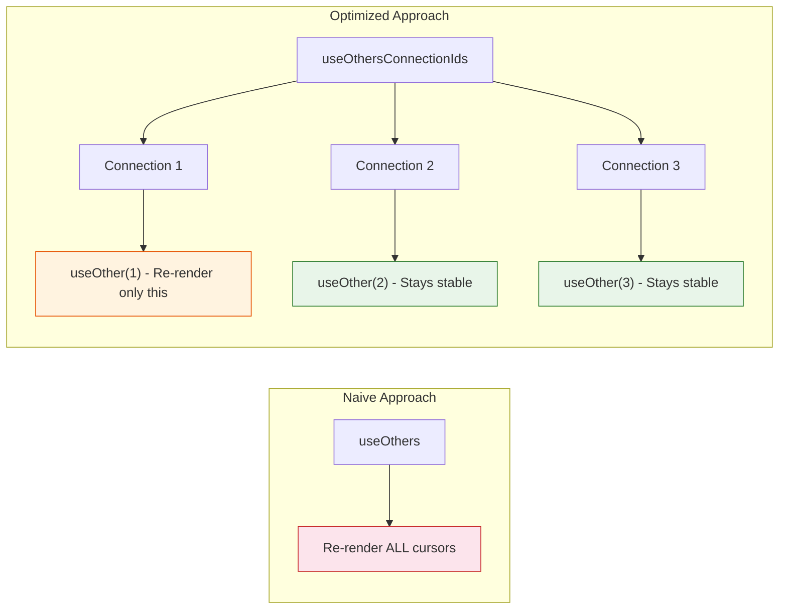
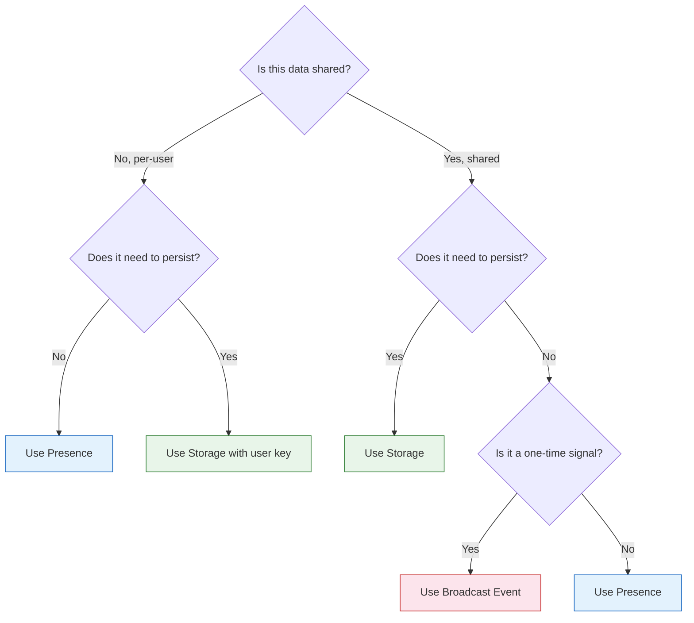

# Chapter 2: Presence & Awareness

Welcome to **Chapter 2: Presence & Awareness**. In this part of **Liveblocks - Real-Time Collaboration Deep Dive**, you will build an intuitive mental model first, then move into concrete implementation details and practical production tradeoffs.


## Introduction

Presence is the foundation of every collaborative experience. It answers the fundamental question: "Who else is here, and what are they doing?" When you see live cursors gliding across a Figma canvas or a list of active users in a Google Doc, you are seeing presence in action.

Unlike storage (which is persistent), presence is **ephemeral**. It exists only while a user is connected. When they disconnect, their presence vanishes. This makes it perfect for transient state like cursor positions, selections, typing indicators, and viewport focus.

## The Presence Model



Each user in a room has their own presence object. You define its shape through TypeScript types:

```typescript
type Presence = {
  // Cursor position (null when outside the canvas)
  cursor: { x: number; y: number } | null;

  // Currently selected element
  selectedId: string | null;

  // Display name
  name: string;

  // User's assigned color
  color: string;

  // Whether the user is currently typing
  isTyping: boolean;

  // Current viewport/scroll position
  viewport: { x: number; y: number; zoom: number } | null;
};
```

## Reading and Writing Presence

### useMyPresence

The `useMyPresence` hook gives you read/write access to your own presence:

```tsx
import { useMyPresence } from "../liveblocks.config";

function Canvas() {
  const [myPresence, updateMyPresence] = useMyPresence();

  return (
    <div
      onPointerMove={(e) => {
        updateMyPresence({
          cursor: { x: e.clientX, y: e.clientY },
        });
      }}
      onPointerLeave={() => {
        updateMyPresence({ cursor: null });
      }}
      onClick={(e) => {
        const elementId = getElementAtPoint(e.clientX, e.clientY);
        updateMyPresence({ selectedId: elementId });
      }}
    >
      <p>My cursor: {JSON.stringify(myPresence.cursor)}</p>
      <p>Selected: {myPresence.selectedId ?? "nothing"}</p>
    </div>
  );
}
```

### useSelf

The `useSelf` hook returns your full user object, including presence, connection ID, and user metadata:

```tsx
import { useSelf } from "../liveblocks.config";

function UserBadge() {
  const me = useSelf();

  if (!me) return null;

  return (
    <div className="user-badge">
      
      <span>{me.info.name}</span>
      <span className="connection-id">#{me.connectionId}</span>
    </div>
  );
}

// With a selector for performance
function MyCursorPosition() {
  const cursor = useSelf((me) => me.presence.cursor);
  return cursor ? <span>{cursor.x}, {cursor.y}</span> : <span>Outside</span>;
}
```

### useOthers

The `useOthers` hook returns all other connected users:

```tsx
import { useOthers } from "../liveblocks.config";

function OnlineUsers() {
  const others = useOthers();

  return (
    <div className="online-users">
      <h3>Online ({others.length})</h3>
      <ul>
        {others.map((user) => (
          <li key={user.connectionId}>
            <span
              style={{
                width: 8,
                height: 8,
                borderRadius: "50%",
                backgroundColor: user.info?.color ?? "#999",
                display: "inline-block",
                marginRight: 8,
              }}
            />
            {user.info?.name ?? `User ${user.connectionId}`}
            {user.presence.isTyping && <span> (typing...)</span>}
          </li>
        ))}
      </ul>
    </div>
  );
}
```

## Performance Optimization with Selectors

The `useOthers` hook re-renders on every presence change from any user. For large rooms, this can cause performance issues. Liveblocks provides several optimization patterns:

### useOthersMapped

Maps each user to a derived value, re-rendering only when that value changes:

```tsx
import { useOthersMapped } from "../liveblocks.config";

function CursorOverlay() {
  // Only re-renders when cursors actually change
  const cursors = useOthersMapped((user) => ({
    cursor: user.presence.cursor,
    info: user.info,
  }));

  return (
    <>
      {cursors.map(([connectionId, { cursor, info }]) => {
        if (!cursor) return null;
        return (
          <Cursor
            key={connectionId}
            x={cursor.x}
            y={cursor.y}
            name={info?.name ?? "Anonymous"}
            color={info?.color ?? "#000"}
          />
        );
      })}
    </>
  );
}
```

### useOthersConnectionIds + useOther

For maximum performance, render each user in a separate component:

```tsx
import { useOthersConnectionIds, useOther } from "../liveblocks.config";
import { memo } from "react";

function Cursors() {
  const connectionIds = useOthersConnectionIds();
  return (
    <>
      {connectionIds.map((id) => (
        <SingleCursor key={id} connectionId={id} />
      ))}
    </>
  );
}

const SingleCursor = memo(({ connectionId }: { connectionId: number }) => {
  const cursor = useOther(connectionId, (user) => user.presence.cursor);
  const info = useOther(connectionId, (user) => user.info);

  if (!cursor) return null;

  return (
    <Cursor
      x={cursor.x}
      y={cursor.y}
      name={info?.name ?? "Anonymous"}
      color={info?.color ?? "#000"}
    />
  );
});
```

This pattern ensures that when User A moves their cursor, only User A's cursor component re-renders -- not all cursors.



## Building Collaborative Awareness Features

### Live Cursors

A complete live cursor implementation with smooth interpolation:

```tsx
import { useOthersMapped } from "../liveblocks.config";
import { AnimatePresence, motion } from "framer-motion";

function LiveCursors() {
  const cursors = useOthersMapped((user) => ({
    cursor: user.presence.cursor,
    name: user.info?.name ?? "Anonymous",
    color: user.info?.color ?? "#000",
  }));

  return (
    <AnimatePresence>
      {cursors.map(([connectionId, { cursor, name, color }]) => {
        if (!cursor) return null;
        return (
          <motion.div
            key={connectionId}
            initial={{ opacity: 0, scale: 0.5 }}
            animate={{
              opacity: 1,
              scale: 1,
              x: cursor.x,
              y: cursor.y,
            }}
            exit={{ opacity: 0, scale: 0.5 }}
            transition={{
              type: "spring",
              damping: 30,
              stiffness: 200,
              mass: 0.5,
            }}
            style={{ position: "absolute", top: 0, left: 0, pointerEvents: "none" }}
          >
            <CursorSVG color={color} />
            <div
              style={{
                backgroundColor: color,
                color: "white",
                padding: "2px 8px",
                borderRadius: 4,
                fontSize: 12,
                marginLeft: 16,
                marginTop: -4,
                whiteSpace: "nowrap",
              }}
            >
              {name}
            </div>
          </motion.div>
        );
      })}
    </AnimatePresence>
  );
}

function CursorSVG({ color }: { color: string }) {
  return (
    <svg width="16" height="20" viewBox="0 0 16 20" fill="none">
      <path
        d="M0.928955 0.278809L14.2929 12.4398H6.37485L0.928955 18.5568V0.278809Z"
        fill={color}
        stroke="white"
        strokeWidth="1.5"
      />
    </svg>
  );
}
```

### Avatar Stack ("Who's Online")

```tsx
import { useOthers, useSelf } from "../liveblocks.config";

const MAX_VISIBLE_USERS = 5;

function AvatarStack() {
  const self = useSelf();
  const others = useOthers();

  const visibleUsers = others.slice(0, MAX_VISIBLE_USERS);
  const remainingCount = Math.max(0, others.length - MAX_VISIBLE_USERS);

  return (
    <div style={{ display: "flex", alignItems: "center", gap: -8 }}>
      {/* Other users */}
      {visibleUsers.map((user) => (
        <Avatar
          key={user.connectionId}
          src={user.info?.avatar}
          name={user.info?.name ?? "Anonymous"}
          color={user.info?.color ?? "#999"}
        />
      ))}

      {/* Overflow indicator */}
      {remainingCount > 0 && (
        <div
          style={{
            width: 36,
            height: 36,
            borderRadius: "50%",
            backgroundColor: "#e0e0e0",
            display: "flex",
            alignItems: "center",
            justifyContent: "center",
            fontSize: 12,
            fontWeight: "bold",
            border: "2px solid white",
          }}
        >
          +{remainingCount}
        </div>
      )}

      {/* Self */}
      {self && (
        <Avatar
          src={self.info?.avatar}
          name={`${self.info?.name} (You)`}
          color={self.info?.color ?? "#999"}
          isSelf
        />
      )}
    </div>
  );
}

function Avatar({ src, name, color, isSelf = false }: {
  src?: string;
  name: string;
  color: string;
  isSelf?: boolean;
}) {
  return (
    <div
      title={name}
      style={{
        width: 36,
        height: 36,
        borderRadius: "50%",
        border: `2px solid ${isSelf ? "#1565c0" : "white"}`,
        marginLeft: -8,
        overflow: "hidden",
        backgroundColor: color,
        display: "flex",
        alignItems: "center",
        justifyContent: "center",
        color: "white",
        fontSize: 14,
        fontWeight: "bold",
      }}
    >
      {src ? (
        
      ) : (
        name.charAt(0).toUpperCase()
      )}
    </div>
  );
}
```

### Typing Indicator

```tsx
import { useOthers, useMyPresence } from "../liveblocks.config";
import { useCallback, useEffect, useRef } from "react";

function TypingIndicator() {
  const others = useOthers();
  const typingUsers = others.filter((user) => user.presence.isTyping);

  if (typingUsers.length === 0) return null;

  const names = typingUsers.map(
    (u) => u.info?.name ?? `User ${u.connectionId}`
  );

  let text: string;
  if (names.length === 1) {
    text = `${names[0]} is typing...`;
  } else if (names.length === 2) {
    text = `${names[0]} and ${names[1]} are typing...`;
  } else {
    text = `${names[0]} and ${names.length - 1} others are typing...`;
  }

  return (
    <div style={{ fontSize: 12, color: "#666", padding: "4px 0" }}>
      {text}
    </div>
  );
}

// Hook to manage typing state with auto-reset
function useTypingPresence(debounceMs = 1000) {
  const [, updateMyPresence] = useMyPresence();
  const timeoutRef = useRef<NodeJS.Timeout | null>(null);

  const startTyping = useCallback(() => {
    updateMyPresence({ isTyping: true });

    if (timeoutRef.current) {
      clearTimeout(timeoutRef.current);
    }

    timeoutRef.current = setTimeout(() => {
      updateMyPresence({ isTyping: false });
    }, debounceMs);
  }, [updateMyPresence, debounceMs]);

  const stopTyping = useCallback(() => {
    if (timeoutRef.current) {
      clearTimeout(timeoutRef.current);
    }
    updateMyPresence({ isTyping: false });
  }, [updateMyPresence]);

  useEffect(() => {
    return () => {
      if (timeoutRef.current) {
        clearTimeout(timeoutRef.current);
      }
    };
  }, []);

  return { startTyping, stopTyping };
}
```

### Selection Highlighting

Show which elements other users have selected:

```tsx
import { useOthersMapped } from "../liveblocks.config";

function SelectionHighlights() {
  const selections = useOthersMapped((user) => ({
    selectedId: user.presence.selectedId,
    color: user.info?.color ?? "#999",
    name: user.info?.name ?? "Anonymous",
  }));

  return (
    <>
      {selections.map(([connectionId, { selectedId, color, name }]) => {
        if (!selectedId) return null;

        const element = document.getElementById(selectedId);
        if (!element) return null;

        const rect = element.getBoundingClientRect();

        return (
          <div
            key={connectionId}
            style={{
              position: "absolute",
              left: rect.left - 2,
              top: rect.top - 2,
              width: rect.width + 4,
              height: rect.height + 4,
              border: `2px solid ${color}`,
              borderRadius: 4,
              pointerEvents: "none",
            }}
          >
            <span
              style={{
                position: "absolute",
                top: -20,
                left: 0,
                backgroundColor: color,
                color: "white",
                padding: "1px 6px",
                borderRadius: 3,
                fontSize: 11,
              }}
            >
              {name}
            </span>
          </div>
        );
      })}
    </>
  );
}
```

## Broadcasting Events

Sometimes you need to send one-off messages to all users without updating presence or storage. Liveblocks provides a broadcast mechanism for this.

### Sending Events

```tsx
import { useBroadcastEvent } from "../liveblocks.config";

function EmojiReactionButton() {
  const broadcast = useBroadcastEvent();

  return (
    <div className="emoji-bar">
      {["🎉", "👍", "❤️", "😂", "🔥"].map((emoji) => (
        <button
          key={emoji}
          onClick={() => {
            broadcast({
              type: "EMOJI_REACTION",
              emoji,
              x: window.innerWidth / 2,
              y: window.innerHeight / 2,
            });
          }}
        >
          {emoji}
        </button>
      ))}
    </div>
  );
}
```

### Receiving Events

```tsx
import { useEventListener } from "../liveblocks.config";
import { useState } from "react";

function EmojiReactionOverlay() {
  const [reactions, setReactions] = useState<
    { id: string; emoji: string; x: number; y: number }[]
  >([]);

  useEventListener(({ event, connectionId }) => {
    if (event.type === "EMOJI_REACTION") {
      const id = `${connectionId}-${Date.now()}`;
      setReactions((prev) => [
        ...prev,
        { id, emoji: event.emoji, x: event.x, y: event.y },
      ]);

      // Remove after animation
      setTimeout(() => {
        setReactions((prev) => prev.filter((r) => r.id !== id));
      }, 2000);
    }
  });

  return (
    <div style={{ position: "fixed", inset: 0, pointerEvents: "none" }}>
      {reactions.map((r) => (
        <div
          key={r.id}
          style={{
            position: "absolute",
            left: r.x,
            top: r.y,
            fontSize: 32,
            animation: "floatUp 2s ease-out forwards",
          }}
        >
          {r.emoji}
        </div>
      ))}
    </div>
  );
}
```

## Presence vs Storage vs Events

Understanding when to use each is critical:

| Aspect | Presence | Storage | Events |
|--------|----------|---------|--------|
| **Persistence** | Ephemeral (connection lifetime) | Persistent (survives disconnects) | Fire-and-forget |
| **Scope** | Per-user | Shared by all users | Broadcast to all |
| **Conflict Resolution** | Last-write-wins | CRDT-based | N/A |
| **Use Cases** | Cursors, selections, typing | Documents, lists, shared state | Reactions, notifications |
| **Performance** | High frequency OK | Batched mutations | Occasional |
| **Data Model** | Flat JSON object | Nested Live structures | Typed event objects |



## Presence Throttling

Liveblocks automatically throttles presence updates to avoid overwhelming the network. By default, updates are batched and sent every ~50ms. You can observe this behavior:

```typescript
// These rapid updates are automatically batched
element.addEventListener("pointermove", (e) => {
  // Even if this fires 60 times per second,
  // Liveblocks sends updates at a controlled rate
  updateMyPresence({
    cursor: { x: e.clientX, y: e.clientY },
  });
});
```

For custom throttling, you can debounce on your side:

```typescript
import { useMemo } from "react";
import throttle from "lodash/throttle";

function useThrottledPresence(ms = 100) {
  const [, updateMyPresence] = useMyPresence();

  const throttledUpdate = useMemo(
    () => throttle(updateMyPresence, ms),
    [updateMyPresence, ms]
  );

  return throttledUpdate;
}
```

## Summary

Presence and awareness are the building blocks of any collaborative experience. In this chapter you learned:

- **Presence model**: each user has an ephemeral presence object scoped to their connection
- **Reading presence**: `useMyPresence`, `useSelf`, `useOthers`, and their optimized variants
- **Performance patterns**: `useOthersMapped` and `useOthersConnectionIds` + `useOther` prevent unnecessary re-renders
- **Awareness features**: live cursors, avatar stacks, typing indicators, and selection highlighting
- **Broadcasting events**: fire-and-forget messages for reactions, pings, and one-time signals
- **Decision framework**: when to choose presence vs storage vs events

## Key Takeaways

1. **Presence is ephemeral** -- it disappears when a user disconnects. Do not put persistent data in presence.
2. **Optimize renders** by using selectors and per-connection-ID components instead of `useOthers` directly.
3. **Broadcast events** are for one-time signals that do not need to persist. Late joiners will not receive past events.
4. **Throttling is automatic** -- Liveblocks batches presence updates so you do not need to worry about flooding the network.
5. **TypeScript types** for presence are enforced at compile time, catching errors before runtime.

## Next Steps

Now that users can see each other, it is time to let them collaborate on shared data. In **[Chapter 3: Storage & Conflict Resolution](./03-storage-conflict-resolution.md)**, we will explore LiveObject, LiveList, LiveMap, and the CRDT-based system that keeps everyone in sync.

---
*Built with insights from the [Liveblocks](https://liveblocks.io) platform.*

## What Problem Does This Solve?

Most teams struggle here because the hard part is not writing more code, but deciding clear boundaries for `color`, `user`, `cursor` so behavior stays predictable as complexity grows.

In practical terms, this chapter helps you avoid three common failures:

- coupling core logic too tightly to one implementation path
- missing the handoff boundaries between setup, execution, and validation
- shipping changes without clear rollback or observability strategy

After working through this chapter, you should be able to reason about `Chapter 2: Presence & Awareness` as an operating subsystem inside **Liveblocks - Real-Time Collaboration Deep Dive**, with explicit contracts for inputs, state transitions, and outputs.

Use the implementation notes around `name`, `info`, `style` as your checklist when adapting these patterns to your own repository.

## How it Works Under the Hood

Under the hood, `Chapter 2: Presence & Awareness` usually follows a repeatable control path:

1. **Context bootstrap**: initialize runtime config and prerequisites for `color`.
2. **Input normalization**: shape incoming data so `user` receives stable contracts.
3. **Core execution**: run the main logic branch and propagate intermediate state through `cursor`.
4. **Policy and safety checks**: enforce limits, auth scopes, and failure boundaries.
5. **Output composition**: return canonical result payloads for downstream consumers.
6. **Operational telemetry**: emit logs/metrics needed for debugging and performance tuning.

When debugging, walk this sequence in order and confirm each stage has explicit success/failure conditions.

## Source Walkthrough

Use the following upstream sources to verify implementation details while reading this chapter:

- [Liveblocks GitHub Repository](https://github.com/liveblocks/liveblocks)
  Why it matters: authoritative reference on `Liveblocks GitHub Repository` (github.com).
- [Liveblocks Product Site](https://liveblocks.io)
  Why it matters: authoritative reference on `Liveblocks Product Site` (liveblocks.io).
- [Liveblocks Documentation](https://liveblocks.io/docs)
  Why it matters: authoritative reference on `Liveblocks Documentation` (liveblocks.io).

Suggested trace strategy:
- search upstream code for `color` and `user` to map concrete implementation paths
- compare docs claims against actual runtime/config code before reusing patterns in production

## Chapter Connections

- [Tutorial Index](index.md)
- [Previous Chapter: Chapter 1: Getting Started](01-getting-started.md)
- [Next Chapter: Chapter 3: Storage & Conflict Resolution](03-storage-conflict-resolution.md)
- [Main Catalog](../../README.md#-tutorial-catalog)
- [A-Z Tutorial Directory](../../discoverability/tutorial-directory.md)
