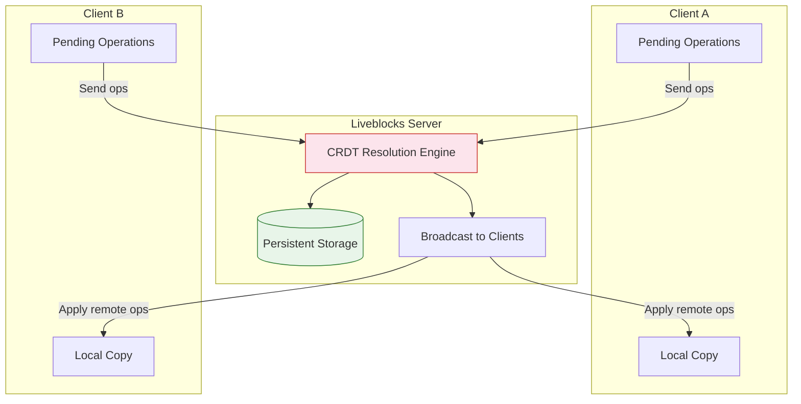
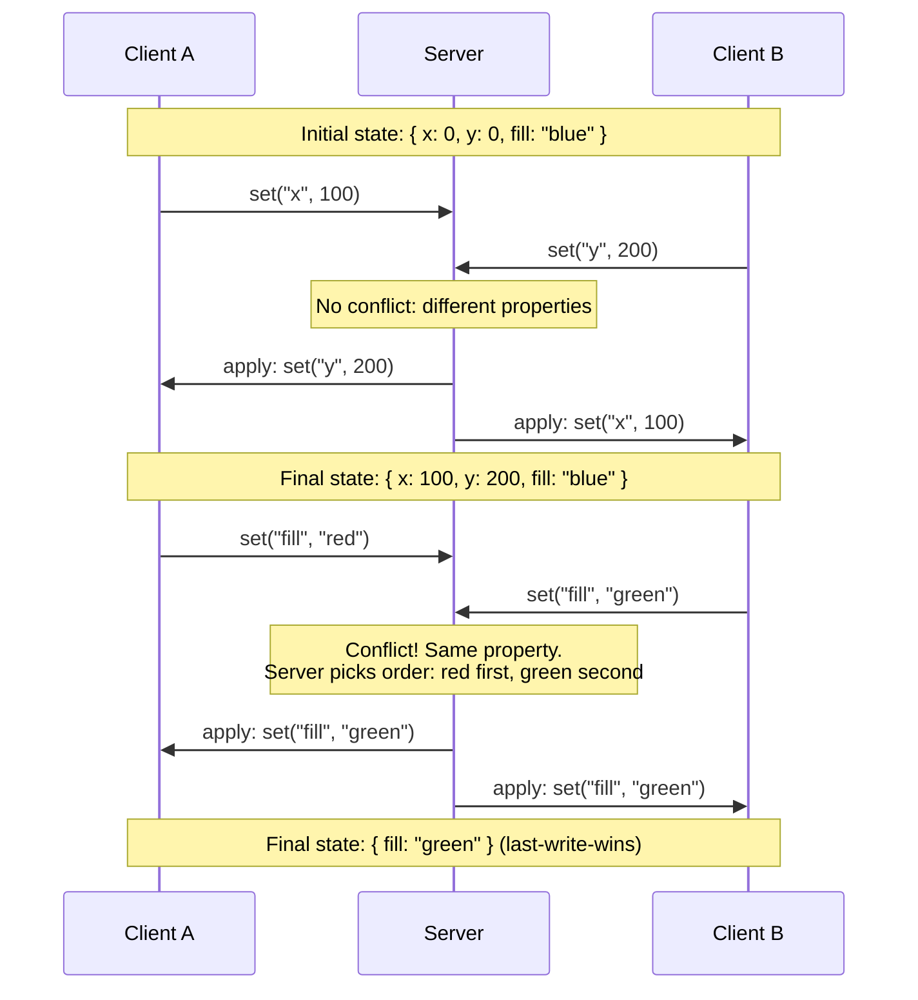
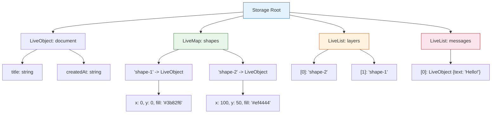
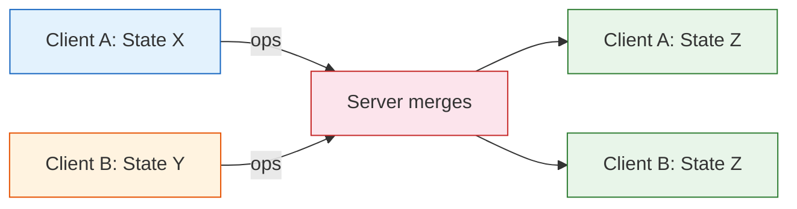

# Chapter 3: Storage & Conflict Resolution

## Introduction

Presence tells you who is here. Storage tells you what they are working on together. Liveblocks Storage is a persistent, real-time data layer that automatically resolves conflicts when multiple users edit the same data simultaneously. It is powered by CRDTs (Conflict-free Replicated Data Types), the same class of algorithms used by Figma, Apple Notes, and other world-class collaborative tools.

This chapter covers the three core storage primitives -- `LiveObject`, `LiveList`, and `LiveMap` -- how conflicts are resolved under the hood, and how to structure your data for optimal collaboration.

## Storage Architecture



Storage uses an **operation-based CRDT** model:

1. Each client maintains a local copy of the data
2. Mutations generate operations (ops) that are sent to the server
3. The server applies ops deterministically and broadcasts them to all clients
4. All clients converge to the same state regardless of operation order

## The Three Storage Primitives

### LiveObject

`LiveObject` is a mutable JSON-like object. It supports nested properties and conflict resolution at the property level.

```typescript
import { LiveObject } from "@liveblocks/client";

// Define the shape
type Shape = {
  x: number;
  y: number;
  width: number;
  height: number;
  fill: string;
  rotation: number;
};

// Create an instance
const shape = new LiveObject<Shape>({
  x: 0,
  y: 0,
  width: 100,
  height: 100,
  fill: "#3b82f6",
  rotation: 0,
});

// Reading values
const x = shape.get("x"); // 0
const fill = shape.get("fill"); // "#3b82f6"

// Updating values
shape.set("x", 50);
shape.set("fill", "#ef4444");

// Updating multiple properties at once
shape.update({
  x: 100,
  y: 200,
  rotation: 45,
});

// Converting to plain JSON
const json = shape.toImmutable();
// { x: 100, y: 200, width: 100, height: 100, fill: "#ef4444", rotation: 45 }
```

**Conflict resolution for LiveObject**: When two users update different properties simultaneously, both changes are preserved. When they update the same property, the last write wins (determined by server-received order).



### LiveList

`LiveList` is an ordered, mutable list. It supports insertions, deletions, moves, and updates at any position. Unlike arrays, concurrent insertions at different positions never conflict.

```typescript
import { LiveList, LiveObject } from "@liveblocks/client";

type Todo = {
  id: string;
  text: string;
  completed: boolean;
  author: string;
};

// Create a list of LiveObjects
const todos = new LiveList<LiveObject<Todo>>([
  new LiveObject({
    id: "todo-1",
    text: "Design the schema",
    completed: true,
    author: "Alice",
  }),
  new LiveObject({
    id: "todo-2",
    text: "Implement storage",
    completed: false,
    author: "Bob",
  }),
]);

// Reading
const length = todos.length; // 2
const first = todos.get(0); // LiveObject<Todo>
const firstText = first?.get("text"); // "Design the schema"

// Adding items
todos.push(
  new LiveObject({
    id: "todo-3",
    text: "Write tests",
    completed: false,
    author: "Charlie",
  })
);

todos.insert(
  new LiveObject({
    id: "todo-4",
    text: "Review PR",
    completed: false,
    author: "Alice",
  }),
  1 // Insert at index 1
);

// Removing items
todos.delete(0); // Remove first item

// Moving items
todos.move(0, 2); // Move item from index 0 to index 2

// Iterating
todos.forEach((todo, index) => {
  console.log(`${index}: ${todo.get("text")}`);
});

// Converting to plain array
const plainTodos = todos.toImmutable();
```

**Conflict resolution for LiveList**: Liveblocks uses a positional CRDT for lists. Concurrent insertions at the same position both succeed and appear in a deterministic order. Deletions and moves are also resolved without conflicts.

| Operation by A | Operation by B | Result |
|----------------|----------------|--------|
| Insert "X" at 0 | Insert "Y" at 0 | Both inserted, deterministic order |
| Delete index 2 | Update index 2 | Item deleted (delete wins) |
| Move 0 to 3 | Move 0 to 1 | Last-processed move wins |
| Insert "X" at end | Insert "Y" at end | Both appended |

### LiveMap

`LiveMap` is a key-value map with string keys. It is ideal for collections where items have natural IDs (shapes on a canvas, users in a session, etc.).

```typescript
import { LiveMap, LiveObject } from "@liveblocks/client";

type Shape = {
  x: number;
  y: number;
  width: number;
  height: number;
  fill: string;
  type: "rectangle" | "ellipse" | "triangle";
};

// Create a map of shapes
const shapes = new LiveMap<string, LiveObject<Shape>>();

// Adding entries
shapes.set(
  "shape-1",
  new LiveObject<Shape>({
    x: 0,
    y: 0,
    width: 100,
    height: 100,
    fill: "#3b82f6",
    type: "rectangle",
  })
);

// Reading
const shape = shapes.get("shape-1"); // LiveObject<Shape> | undefined
const size = shapes.size; // 1
const hasShape = shapes.has("shape-1"); // true

// Updating a nested LiveObject
shape?.update({ x: 50, y: 75 });

// Deleting
shapes.delete("shape-1");

// Iterating
shapes.forEach((shape, key) => {
  console.log(key, shape.toImmutable());
});

// Converting to plain object
const plainShapes = Object.fromEntries(
  Array.from(shapes.entries()).map(([key, value]) => [key, value.toImmutable()])
);
```

**Conflict resolution for LiveMap**: Adding or updating the same key follows last-write-wins semantics. Adding different keys never conflicts. Deleting a key that another user is updating results in the delete winning.

## Nesting Storage Structures

Storage primitives can be nested to model complex data:

```typescript
import { LiveObject, LiveList, LiveMap } from "@liveblocks/client";

// A collaborative whiteboard
type Storage = {
  // Document metadata
  document: LiveObject<{
    title: string;
    createdAt: string;
    lastEditedBy: string;
  }>;

  // Shapes on the canvas (keyed by ID)
  shapes: LiveMap<
    string,
    LiveObject<{
      type: "rectangle" | "ellipse" | "text";
      x: number;
      y: number;
      width: number;
      height: number;
      fill: string;
      content?: string;
    }>
  >;

  // Layer ordering (front to back)
  layers: LiveList<string>;

  // Chat messages
  messages: LiveList<
    LiveObject<{
      id: string;
      author: string;
      text: string;
      timestamp: number;
    }>
  >;
};
```



## Using Storage with React Hooks

### useStorage

The `useStorage` hook reads from storage with a selector:

```tsx
import { useStorage } from "../liveblocks.config";

function DocumentTitle() {
  const title = useStorage((root) => root.document.title);
  return <h1>{title}</h1>;
}

function ShapeCount() {
  const count = useStorage((root) => root.shapes.size);
  return <span>{count} shapes</span>;
}

function TodoList() {
  const todos = useStorage((root) =>
    root.todos.map((todo) => ({
      id: todo.id,
      text: todo.text,
      completed: todo.completed,
    }))
  );

  return (
    <ul>
      {todos?.map((todo) => (
        <li key={todo.id}>
          <span style={{
            textDecoration: todo.completed ? "line-through" : "none"
          }}>
            {todo.text}
          </span>
        </li>
      ))}
    </ul>
  );
}
```

### useMutation

The `useMutation` hook provides write access to storage. All mutations run inside a callback that receives the mutable storage root:

```tsx
import { useMutation } from "../liveblocks.config";
import { LiveObject } from "@liveblocks/client";
import { nanoid } from "nanoid";

function TodoApp() {
  const todos = useStorage((root) =>
    root.todos.toImmutable()
  );

  const addTodo = useMutation(({ storage }, text: string) => {
    const todos = storage.get("todos");
    todos.push(
      new LiveObject({
        id: nanoid(),
        text,
        completed: false,
        author: "current-user",
      })
    );
  }, []);

  const toggleTodo = useMutation(({ storage }, index: number) => {
    const todos = storage.get("todos");
    const todo = todos.get(index);
    if (todo) {
      todo.set("completed", !todo.get("completed"));
    }
  }, []);

  const deleteTodo = useMutation(({ storage }, index: number) => {
    const todos = storage.get("todos");
    todos.delete(index);
  }, []);

  const moveTodo = useMutation(
    ({ storage }, fromIndex: number, toIndex: number) => {
      const todos = storage.get("todos");
      todos.move(fromIndex, toIndex);
    },
    []
  );

  return (
    <div>
      <AddTodoForm onAdd={addTodo} />
      <ul>
        {todos?.map((todo, index) => (
          <li key={todo.id}>
            <input
              type="checkbox"
              checked={todo.completed}
              onChange={() => toggleTodo(index)}
            />
            <span>{todo.text}</span>
            <button onClick={() => deleteTodo(index)}>Delete</button>
          </li>
        ))}
      </ul>
    </div>
  );
}
```

### Batching Mutations

When you need to perform multiple mutations atomically, use `useBatch`:

```tsx
import { useMutation } from "../liveblocks.config";
import { LiveObject } from "@liveblocks/client";
import { nanoid } from "nanoid";

function Canvas() {
  // Multiple operations batched into a single undo step
  const duplicateShape = useMutation(({ storage }, shapeId: string) => {
    const shapes = storage.get("shapes");
    const layers = storage.get("layers");

    const original = shapes.get(shapeId);
    if (!original) return;

    const newId = nanoid();
    const clone = new LiveObject({
      ...original.toImmutable(),
      x: original.get("x") + 20,
      y: original.get("y") + 20,
    });

    // Both ops are batched: single network message, single undo step
    shapes.set(newId, clone);
    layers.push(newId);
  }, []);

  const deleteShape = useMutation(({ storage }, shapeId: string) => {
    const shapes = storage.get("shapes");
    const layers = storage.get("layers");

    // Remove from both structures atomically
    shapes.delete(shapeId);

    const layerIndex = layers
      .toImmutable()
      .findIndex((id) => id === shapeId);
    if (layerIndex !== -1) {
      layers.delete(layerIndex);
    }
  }, []);

  // ...
}
```

## Data Modeling Best Practices

### Denormalize for Performance

Unlike relational databases, Liveblocks storage benefits from denormalization. Store data close to where it is rendered:

```typescript
// Avoid: deeply nested access requiring multiple lookups
type StorageBad = {
  projects: LiveMap<string, LiveObject<{
    tasks: LiveList<LiveObject<{
      assignees: LiveList<LiveObject<{
        userId: string;
        role: string;
      }>>;
    }>>;
  }>>;
};

// Prefer: flatter structure with ID references
type StorageGood = {
  tasks: LiveMap<string, LiveObject<{
    id: string;
    projectId: string;
    title: string;
    assigneeIds: string[];
    status: "todo" | "doing" | "done";
  }>>;
  taskOrder: LiveList<string>;
};
```

### Use LiveMap for Collections

When items have natural IDs, prefer `LiveMap` over `LiveList`:

```typescript
// Use LiveMap when:
// - Items have unique IDs
// - You need O(1) lookups by ID
// - Order is tracked separately
shapes: LiveMap<string, LiveObject<ShapeData>>;
layerOrder: LiveList<string>; // Just the IDs, in order

// Use LiveList when:
// - Order is the primary concern
// - Items don't have natural IDs
// - You need index-based access
chatMessages: LiveList<LiveObject<MessageData>>;
```

### Minimize Storage Size

Each property in a LiveObject generates overhead. Keep your storage lean:

```typescript
// Instead of storing derived data:
type ShapeBad = {
  x: number;
  y: number;
  width: number;
  height: number;
  area: number;      // Derived! Don't store this.
  perimeter: number; // Derived! Don't store this.
};

// Store only source-of-truth data:
type ShapeGood = {
  x: number;
  y: number;
  width: number;
  height: number;
};

// Compute derived values in your component:
function ShapeInfo({ shapeId }: { shapeId: string }) {
  const shape = useStorage((root) => root.shapes.get(shapeId)?.toImmutable());
  if (!shape) return null;

  const area = shape.width * shape.height;
  const perimeter = 2 * (shape.width + shape.height);

  return <p>Area: {area}, Perimeter: {perimeter}</p>;
}
```

## Understanding CRDT Behavior

### Convergence Guarantee

The fundamental guarantee of Liveblocks storage is **eventual consistency**: all clients will converge to the same state, regardless of network delays or operation ordering.



### Conflict Resolution Summary

| Structure | Operation | Concurrent Conflict | Resolution |
|-----------|-----------|---------------------|------------|
| LiveObject | `set` same property | Two values for same key | Last-write-wins (server order) |
| LiveObject | `set` different properties | No conflict | Both preserved |
| LiveList | `push` / `insert` | Two items at same position | Both inserted, deterministic order |
| LiveList | `delete` same index | Double delete | Second delete is no-op |
| LiveList | `move` same item | Conflicting destinations | Last-processed move wins |
| LiveMap | `set` same key | Two values for same key | Last-write-wins (server order) |
| LiveMap | `set` different keys | No conflict | Both preserved |
| LiveMap | `delete` + `set` same key | Delete vs update | Delete wins |

## Initializing Storage

Storage is initialized when the first user enters a room. Subsequent users receive the existing state:

```tsx
<RoomProvider
  id="my-room"
  initialPresence={{ cursor: null }}
  initialStorage={{
    document: new LiveObject({
      title: "Untitled",
      createdAt: new Date().toISOString(),
      lastEditedBy: "",
    }),
    shapes: new LiveMap(),
    layers: new LiveList([]),
    messages: new LiveList([]),
  }}
>
  {children}
</RoomProvider>
```

You can also initialize storage from a server-side API:

```typescript
import { Liveblocks } from "@liveblocks/node";

const liveblocks = new Liveblocks({
  secret: process.env.LIVEBLOCKS_SECRET_KEY!,
});

// Initialize room storage via the REST API
await liveblocks.initializeStorageDocument("my-room", {
  liveblocksType: "LiveObject",
  data: {
    document: {
      liveblocksType: "LiveObject",
      data: {
        title: "My Document",
        createdAt: new Date().toISOString(),
      },
    },
    shapes: {
      liveblocksType: "LiveMap",
      data: {},
    },
    layers: {
      liveblocksType: "LiveList",
      data: [],
    },
  },
});
```

## Summary

In this chapter you learned:

- **Three storage primitives**: `LiveObject` for structured data, `LiveList` for ordered collections, `LiveMap` for keyed collections
- **CRDT-based conflict resolution**: automatic, deterministic merging of concurrent edits
- **React hooks**: `useStorage` for reading, `useMutation` for writing, batching for atomic operations
- **Data modeling**: denormalize, use LiveMap for collections with IDs, minimize stored data
- **Convergence guarantee**: all clients always converge to the same final state

## Key Takeaways

1. **Storage is persistent** -- it survives disconnections and is the source of truth for shared data.
2. **LiveObject** resolves conflicts at the property level; different properties never conflict.
3. **LiveList** allows concurrent insertions without conflicts using positional CRDTs.
4. **LiveMap** is ideal for ID-keyed collections and provides O(1) lookups.
5. **useMutation** is the only way to write to storage -- all mutations inside a single callback are batched into one operation.
6. **Denormalize your data** -- prefer flat structures over deeply nested ones for better performance and simpler conflict resolution.

## Next Steps

With shared data synchronized, it is time to add discussion capabilities. In **[Chapter 4: Comments & Threads](./04-comments-threads.md)**, we will build thread-based commenting, inline annotations, and mention support.

---
*Built with insights from the [Liveblocks](https://liveblocks.io) platform.*
