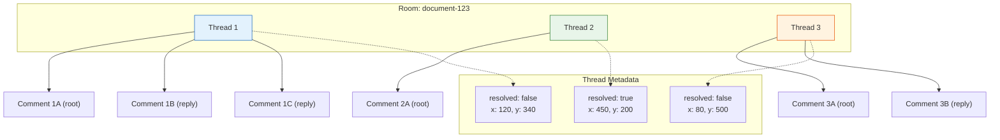
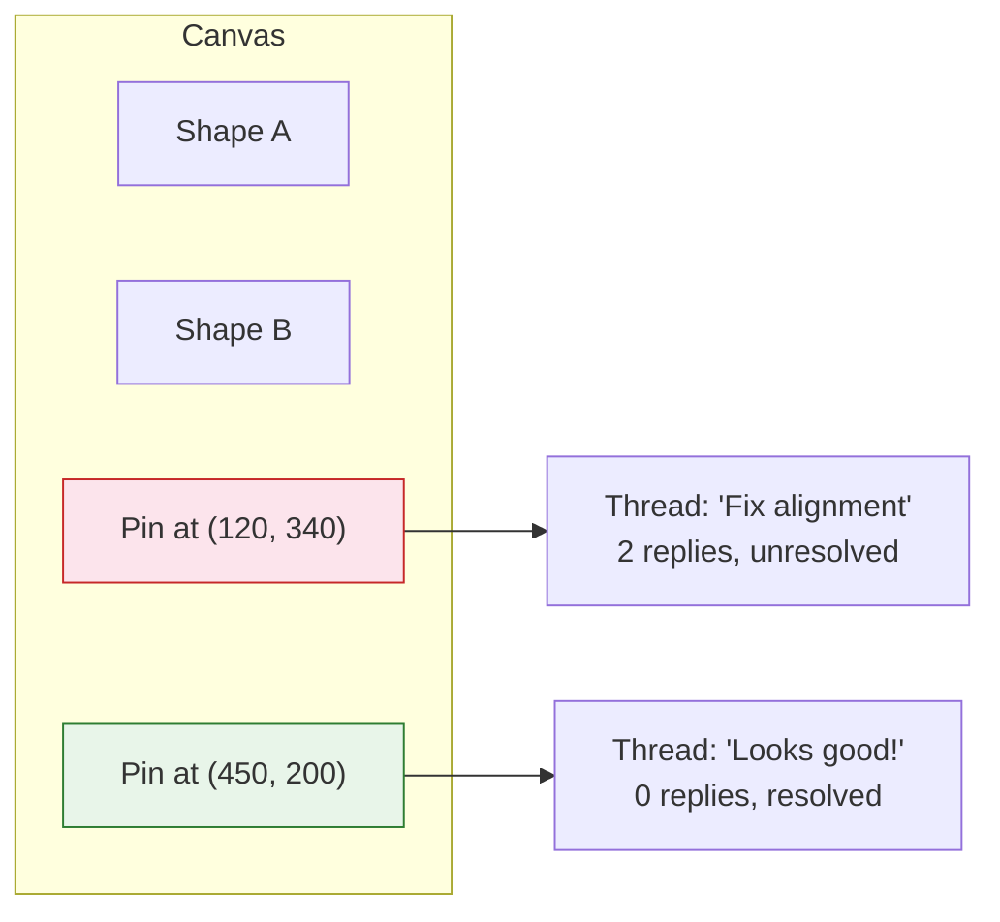
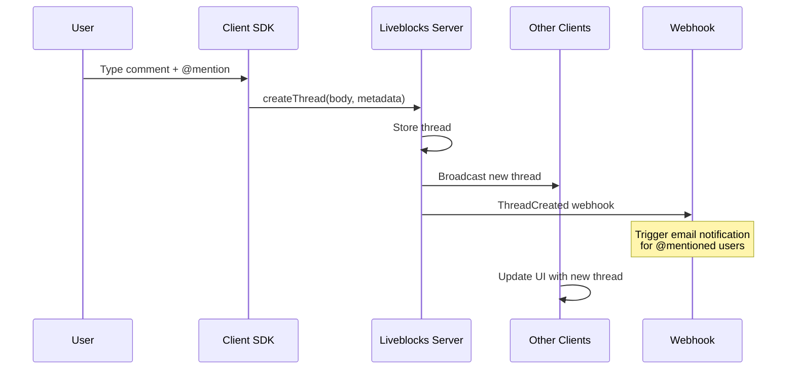

# Chapter 4: Comments & Threads

Welcome to **Chapter 4: Comments & Threads**. In this part of **Liveblocks - Real-Time Collaboration Deep Dive**, you will build an intuitive mental model first, then move into concrete implementation details and practical production tradeoffs.


## Introduction

Modern collaborative applications do more than let users edit together -- they let users discuss their work in context. Think of comments pinned to a specific location in a Figma design, threaded discussions in a Google Doc, or inline code review comments on GitHub. Liveblocks provides a complete commenting system with threads, replies, mentions, and rich-text support out of the box.

This chapter covers how to add thread-based commenting to your application, attach comments to specific UI elements, implement mentions, and use the pre-built comment components.

## Comments Architecture



Each thread belongs to a room and contains:
- A unique thread ID
- Custom metadata (position, resolved status, etc.)
- One or more comments (the first is the "root" comment)
- Each comment has an author, body (rich text), creation time, and optional reactions

## Setting Up Comments

### Type Definitions

Define your thread metadata type to attach contextual information to threads:

```typescript
// liveblocks.config.ts
type ThreadMetadata = {
  resolved: boolean;
  // For pinned comments on a canvas
  x: number;
  y: number;
  // For comments on specific elements
  elementId?: string;
  // For comments on text ranges
  highlightStart?: number;
  highlightEnd?: number;
};
```

### Pre-Built Comment Components

Liveblocks provides ready-to-use React components in `@liveblocks/react-ui`:

```tsx
import { Thread, Composer } from "@liveblocks/react-ui";
import { useThreads } from "../liveblocks.config";

function CommentsPanel() {
  const { threads } = useThreads();

  return (
    <aside className="comments-panel">
      <h2>Comments</h2>

      {/* Render existing threads */}
      {threads.map((thread) => (
        <Thread
          key={thread.id}
          thread={thread}
          className="thread"
        />
      ))}

      {/* Composer for creating new threads */}
      <Composer className="new-thread-composer" />
    </aside>
  );
}
```

### Styling the Components

The pre-built components come with default styles that you import:

```tsx
// In your layout or global CSS import
import "@liveblocks/react-ui/styles.css";

// Or with dark mode support
import "@liveblocks/react-ui/styles/dark/media-query.css";
```

You can customize the appearance using CSS variables:

```css
/* Override Liveblocks comment styles */
.lb-root {
  --lb-accent: #3b82f6;
  --lb-accent-foreground: #ffffff;
  --lb-spacing: 1rem;
  --lb-radius: 0.5rem;
}

.lb-thread {
  border: 1px solid #e5e7eb;
  border-radius: 8px;
  padding: 12px;
  margin-bottom: 8px;
}

.lb-composer {
  border: 1px solid #d1d5db;
  border-radius: 8px;
  padding: 8px;
}
```

## Creating Threads Programmatically

### Using the Hook

```tsx
import { useCreateThread } from "../liveblocks.config";

function CanvasCommentCreator() {
  const createThread = useCreateThread();

  const handleCanvasClick = (event: React.MouseEvent) => {
    // Only create comment on double-click
    if (event.detail !== 2) return;

    const rect = event.currentTarget.getBoundingClientRect();
    const x = event.clientX - rect.left;
    const y = event.clientY - rect.top;

    createThread({
      body: {
        version: 1,
        content: [
          {
            type: "paragraph",
            children: [{ text: "" }],
          },
        ],
      },
      metadata: {
        resolved: false,
        x,
        y,
      },
    });
  };

  return (
    <div onDoubleClick={handleCanvasClick} className="canvas">
      {/* Canvas content */}
    </div>
  );
}
```

### Creating Comments with Rich Content

Comment bodies use a structured format supporting text, mentions, links, and formatting:

```tsx
import { useCreateThread, useCreateComment } from "../liveblocks.config";

function CommentActions() {
  const createThread = useCreateThread();

  const createFeedbackThread = () => {
    createThread({
      body: {
        version: 1,
        content: [
          {
            type: "paragraph",
            children: [
              { text: "Hey " },
              { type: "mention", id: "user-alice" },
              { text: ", can you review this section? I think the " },
              { text: "layout needs work", bold: true },
              { text: "." },
            ],
          },
          {
            type: "paragraph",
            children: [
              { text: "Specifically:" },
            ],
          },
          {
            type: "paragraph",
            children: [
              { text: "- The spacing is too tight" },
            ],
          },
          {
            type: "paragraph",
            children: [
              { text: "- Colors don't match the design system" },
            ],
          },
        ],
      },
      metadata: {
        resolved: false,
        x: 200,
        y: 300,
        elementId: "header-section",
      },
    });
  };

  return <button onClick={createFeedbackThread}>Add Feedback</button>;
}
```

## Thread Interactions

### Replying to Threads

```tsx
import { useCreateComment } from "../liveblocks.config";

function ReplyButton({ threadId }: { threadId: string }) {
  const createComment = useCreateComment();

  const handleReply = (text: string) => {
    createComment({
      threadId,
      body: {
        version: 1,
        content: [
          {
            type: "paragraph",
            children: [{ text }],
          },
        ],
      },
    });
  };

  return (
    <form
      onSubmit={(e) => {
        e.preventDefault();
        const input = e.currentTarget.elements.namedItem("reply") as HTMLInputElement;
        handleReply(input.value);
        input.value = "";
      }}
    >
      <input name="reply" placeholder="Write a reply..." />
      <button type="submit">Reply</button>
    </form>
  );
}
```

### Editing and Deleting Comments

```tsx
import {
  useEditComment,
  useDeleteComment,
} from "../liveblocks.config";

function CommentActions({
  threadId,
  commentId,
}: {
  threadId: string;
  commentId: string;
}) {
  const editComment = useEditComment();
  const deleteComment = useDeleteComment();

  const handleEdit = (newText: string) => {
    editComment({
      threadId,
      commentId,
      body: {
        version: 1,
        content: [
          {
            type: "paragraph",
            children: [{ text: newText }],
          },
        ],
      },
    });
  };

  const handleDelete = () => {
    deleteComment({ threadId, commentId });
  };

  return (
    <div className="comment-actions">
      <button onClick={() => handleEdit("Updated text")}>Edit</button>
      <button onClick={handleDelete}>Delete</button>
    </div>
  );
}
```

### Resolving Threads

```tsx
import { useEditThreadMetadata, useThreads } from "../liveblocks.config";

function ThreadList() {
  const { threads } = useThreads();
  const editThreadMetadata = useEditThreadMetadata();

  const toggleResolved = (threadId: string, currentlyResolved: boolean) => {
    editThreadMetadata({
      threadId,
      metadata: { resolved: !currentlyResolved },
    });
  };

  return (
    <div>
      <h3>Open ({threads.filter((t) => !t.metadata.resolved).length})</h3>
      {threads
        .filter((t) => !t.metadata.resolved)
        .map((thread) => (
          <div key={thread.id} className="thread-card">
            <Thread thread={thread} />
            <button onClick={() => toggleResolved(thread.id, false)}>
              Resolve
            </button>
          </div>
        ))}

      <h3>Resolved ({threads.filter((t) => t.metadata.resolved).length})</h3>
      {threads
        .filter((t) => t.metadata.resolved)
        .map((thread) => (
          <div key={thread.id} className="thread-card resolved">
            <Thread thread={thread} />
            <button onClick={() => toggleResolved(thread.id, true)}>
              Reopen
            </button>
          </div>
        ))}
    </div>
  );
}
```

## Pinned Comments on a Canvas

A common pattern is to pin comments to specific locations on a canvas or document:



```tsx
import { useThreads, useCreateThread } from "../liveblocks.config";
import { Thread, Composer } from "@liveblocks/react-ui";
import { useState, useCallback } from "react";

function CanvasWithComments() {
  const { threads } = useThreads();
  const createThread = useCreateThread();
  const [creatingAt, setCreatingAt] = useState<{
    x: number;
    y: number;
  } | null>(null);

  const handleCanvasClick = useCallback((e: React.MouseEvent) => {
    // Check if clicking on existing thread pin
    if ((e.target as HTMLElement).closest(".thread-pin")) return;

    const rect = e.currentTarget.getBoundingClientRect();
    setCreatingAt({
      x: e.clientX - rect.left,
      y: e.clientY - rect.top,
    });
  }, []);

  return (
    <div
      className="canvas"
      onClick={handleCanvasClick}
      style={{ position: "relative", width: "100%", height: "100vh" }}
    >
      {/* Render canvas content here */}

      {/* Render thread pins */}
      {threads
        .filter((t) => !t.metadata.resolved)
        .map((thread) => (
          <ThreadPin
            key={thread.id}
            thread={thread}
            x={thread.metadata.x}
            y={thread.metadata.y}
          />
        ))}

      {/* New thread composer */}
      {creatingAt && (
        <div
          style={{
            position: "absolute",
            left: creatingAt.x,
            top: creatingAt.y,
            zIndex: 100,
          }}
        >
          <Composer
            onComposerSubmit={({ body }, e) => {
              e.preventDefault();
              createThread({
                body,
                metadata: {
                  resolved: false,
                  x: creatingAt.x,
                  y: creatingAt.y,
                },
              });
              setCreatingAt(null);
            }}
            autoFocus
          />
          <button onClick={() => setCreatingAt(null)}>Cancel</button>
        </div>
      )}
    </div>
  );
}

function ThreadPin({
  thread,
  x,
  y,
}: {
  thread: any;
  x: number;
  y: number;
}) {
  const [isOpen, setIsOpen] = useState(false);

  return (
    <div
      className="thread-pin"
      style={{
        position: "absolute",
        left: x,
        top: y,
        transform: "translate(-12px, -12px)",
      }}
    >
      <button
        onClick={() => setIsOpen(!isOpen)}
        style={{
          width: 24,
          height: 24,
          borderRadius: "50%",
          backgroundColor: "#3b82f6",
          color: "white",
          border: "2px solid white",
          cursor: "pointer",
          fontSize: 12,
          fontWeight: "bold",
          boxShadow: "0 2px 4px rgba(0,0,0,0.2)",
        }}
      >
        {thread.comments.length}
      </button>

      {isOpen && (
        <div
          style={{
            position: "absolute",
            top: 32,
            left: 0,
            width: 320,
            backgroundColor: "white",
            borderRadius: 8,
            boxShadow: "0 4px 16px rgba(0,0,0,0.15)",
            zIndex: 50,
          }}
        >
          <Thread thread={thread} />
        </div>
      )}
    </div>
  );
}
```

## Mentions

Liveblocks supports @-mentions in comments. When a user types `@`, a list of mentionable users appears.

### Configuring User Resolution

To power mentions, Liveblocks needs to know how to resolve user IDs to display names and avatars:

```tsx
// app/layout.tsx or wherever your providers are
import { LiveblocksProvider } from "@liveblocks/react";

function App({ children }: { children: React.ReactNode }) {
  return (
    <LiveblocksProvider
      publicApiKey="pk_dev_xxx"
      resolveUsers={async ({ userIds }) => {
        // Fetch user info from your database
        const response = await fetch("/api/users", {
          method: "POST",
          body: JSON.stringify({ userIds }),
        });
        const users = await response.json();

        return users.map((user: any) => ({
          name: user.name,
          avatar: user.avatarUrl,
        }));
      }}
      resolveMentionSuggestions={async ({ text, roomId }) => {
        // Return user IDs that match the search text
        const response = await fetch(
          `/api/users/search?q=${encodeURIComponent(text)}&roomId=${roomId}`
        );
        const users = await response.json();
        return users.map((user: any) => user.id);
      }}
    >
      {children}
    </LiveblocksProvider>
  );
}
```

### Server-Side User Resolution

```typescript
// app/api/users/route.ts
import { NextRequest, NextResponse } from "next/server";

export async function POST(request: NextRequest) {
  const { userIds } = await request.json();

  // Fetch from your database
  const users = await db.users.findMany({
    where: { id: { in: userIds } },
    select: { id: true, name: true, avatarUrl: true },
  });

  return NextResponse.json(users);
}

// app/api/users/search/route.ts
export async function GET(request: NextRequest) {
  const { searchParams } = new URL(request.url);
  const query = searchParams.get("q") ?? "";
  const roomId = searchParams.get("roomId") ?? "";

  // Search users who have access to this room
  const users = await db.users.findMany({
    where: {
      name: { contains: query, mode: "insensitive" },
      rooms: { some: { roomId } },
    },
    select: { id: true, name: true, avatarUrl: true },
    take: 10,
  });

  return NextResponse.json(users);
}
```

## Filtering and Querying Threads

### Filter by Metadata

```tsx
import { useThreads } from "../liveblocks.config";

function FilteredThreads() {
  // Get only unresolved threads
  const { threads: openThreads } = useThreads({
    query: {
      metadata: {
        resolved: false,
      },
    },
  });

  // Get threads attached to a specific element
  const { threads: elementThreads } = useThreads({
    query: {
      metadata: {
        elementId: "header-section",
      },
    },
  });

  return (
    <div>
      <section>
        <h3>Open Threads ({openThreads.length})</h3>
        {openThreads.map((thread) => (
          <Thread key={thread.id} thread={thread} />
        ))}
      </section>

      <section>
        <h3>Header Comments ({elementThreads.length})</h3>
        {elementThreads.map((thread) => (
          <Thread key={thread.id} thread={thread} />
        ))}
      </section>
    </div>
  );
}
```

## Server-Side Thread Management

You can manage threads from the server using the Liveblocks Node SDK:

```typescript
import { Liveblocks } from "@liveblocks/node";

const liveblocks = new Liveblocks({
  secret: process.env.LIVEBLOCKS_SECRET_KEY!,
});

// Get all threads in a room
const { data: threads } = await liveblocks.getThreads({
  roomId: "document-123",
});

// Get a specific thread
const thread = await liveblocks.getThread({
  roomId: "document-123",
  threadId: "th_xxx",
});

// Create a thread from the server
await liveblocks.createThread({
  roomId: "document-123",
  data: {
    body: {
      version: 1,
      content: [
        {
          type: "paragraph",
          children: [
            { text: "Automated review: this section needs attention." },
          ],
        },
      ],
    },
    metadata: {
      resolved: false,
      x: 0,
      y: 0,
    },
  },
});

// Delete a thread
await liveblocks.deleteThread({
  roomId: "document-123",
  threadId: "th_xxx",
});
```

## Comment Component Customization

The `Thread` and `Composer` components support extensive customization:

```tsx
import { Thread, Composer, Comment } from "@liveblocks/react-ui";

function CustomThread({ thread }: { thread: ThreadData }) {
  return (
    <Thread
      thread={thread}
      // Custom rendering for individual comments
      components={{
        Comment: ({ comment }) => (
          <div className="custom-comment">
            <div className="comment-header">
              
              <span className="author-name">{comment.author.name}</span>
              <time className="timestamp">
                {new Date(comment.createdAt).toLocaleDateString()}
              </time>
            </div>
            <Comment.Body comment={comment} className="comment-body" />
          </div>
        ),
      }}
      // Show/hide default elements
      showComposer={true}
      showActions={true}
      showResolveAction={true}
    />
  );
}

function CustomComposer() {
  return (
    <Composer
      placeholder="Add a comment..."
      autoFocus={false}
      // Customize submit behavior
      onComposerSubmit={({ body }, event) => {
        // Custom validation or processing
        console.log("New comment body:", body);
      }}
    />
  );
}
```

## Comments Data Flow



## Summary

In this chapter you learned:

- **Thread model**: each thread lives in a room, has metadata, and contains one or more comments
- **Pre-built components**: `Thread`, `Composer`, and `Comment` provide ready-to-use UI
- **Programmatic creation**: `useCreateThread`, `useCreateComment` for custom workflows
- **Pinned comments**: attaching threads to canvas positions or UI elements via metadata
- **Mentions**: `@`-mention support with user resolution and search
- **Thread management**: filtering, resolving, editing, and deleting threads
- **Server-side operations**: managing threads via the Node SDK for automation

## Key Takeaways

1. **Threads are the organizing unit** -- every comment belongs to a thread, and threads carry custom metadata.
2. **Pre-built components** save significant development time and handle rich text, mentions, and reactions.
3. **Thread metadata** is your extension point -- store positions, element IDs, resolved status, or any custom data.
4. **Mentions require user resolution** -- implement `resolveUsers` and `resolveMentionSuggestions` to power the `@` dropdown.
5. **Comments are real-time** -- all thread updates are broadcast instantly to connected users.
6. **Server-side access** enables automation, moderation, and integration with external systems.

## Next Steps

Comments create conversations, but users need to know when someone mentions them or replies. In **[Chapter 5: Notifications](./05-notifications.md)**, we will build an inbox notification system with email delivery and custom triggers.

---
*Built with insights from the [Liveblocks](https://liveblocks.io) platform.*

## What Problem Does This Solve?

Most teams struggle here because the hard part is not writing more code, but deciding clear boundaries for `thread`, `liveblocks`, `resolved` so behavior stays predictable as complexity grows.

In practical terms, this chapter helps you avoid three common failures:

- coupling core logic too tightly to one implementation path
- missing the handoff boundaries between setup, execution, and validation
- shipping changes without clear rollback or observability strategy

After working through this chapter, you should be able to reason about `Chapter 4: Comments & Threads` as an operating subsystem inside **Liveblocks - Real-Time Collaboration Deep Dive**, with explicit contracts for inputs, state transitions, and outputs.

Use the implementation notes around `text`, `threads`, `Thread` as your checklist when adapting these patterns to your own repository.

## How it Works Under the Hood

Under the hood, `Chapter 4: Comments & Threads` usually follows a repeatable control path:

1. **Context bootstrap**: initialize runtime config and prerequisites for `thread`.
2. **Input normalization**: shape incoming data so `liveblocks` receives stable contracts.
3. **Core execution**: run the main logic branch and propagate intermediate state through `resolved`.
4. **Policy and safety checks**: enforce limits, auth scopes, and failure boundaries.
5. **Output composition**: return canonical result payloads for downstream consumers.
6. **Operational telemetry**: emit logs/metrics needed for debugging and performance tuning.

When debugging, walk this sequence in order and confirm each stage has explicit success/failure conditions.

## Source Walkthrough

Use the following upstream sources to verify implementation details while reading this chapter:

- [Liveblocks GitHub Repository](https://github.com/liveblocks/liveblocks)
  Why it matters: authoritative reference on `Liveblocks GitHub Repository` (github.com).
- [Liveblocks Product Site](https://liveblocks.io)
  Why it matters: authoritative reference on `Liveblocks Product Site` (liveblocks.io).
- [Liveblocks Documentation](https://liveblocks.io/docs)
  Why it matters: authoritative reference on `Liveblocks Documentation` (liveblocks.io).

Suggested trace strategy:
- search upstream code for `thread` and `liveblocks` to map concrete implementation paths
- compare docs claims against actual runtime/config code before reusing patterns in production

## Chapter Connections

- [Tutorial Index](index.md)
- [Previous Chapter: Chapter 3: Storage & Conflict Resolution](03-storage-conflict-resolution.md)
- [Next Chapter: Chapter 5: Notifications](05-notifications.md)
- [Main Catalog](../../README.md#-tutorial-catalog)
- [A-Z Tutorial Directory](../../discoverability/tutorial-directory.md)
