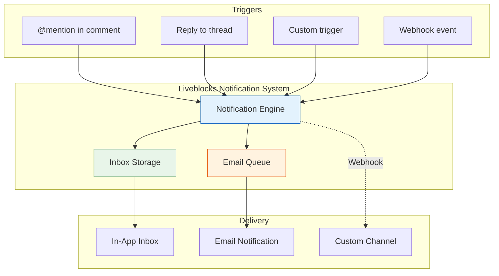
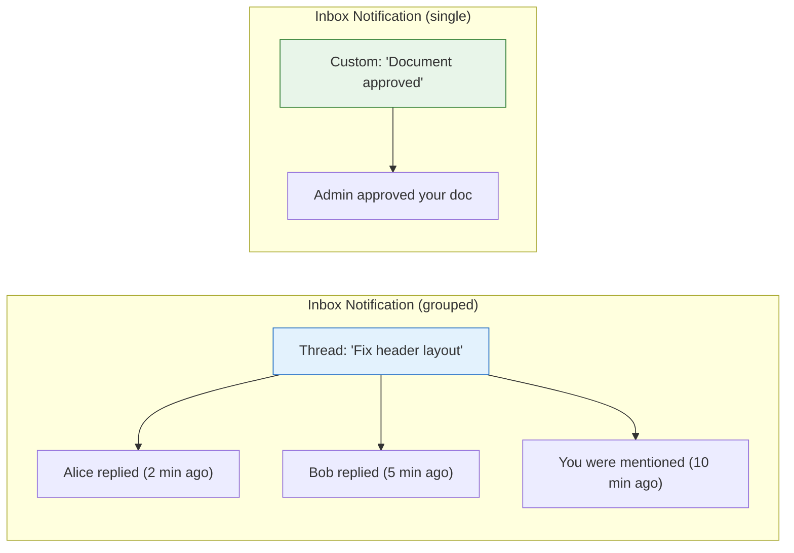
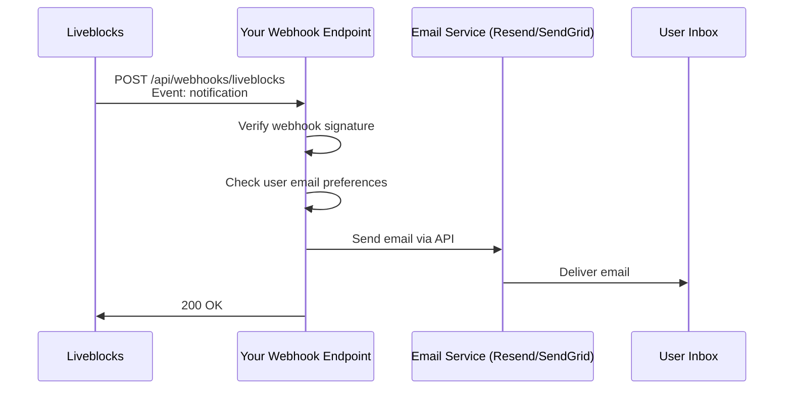
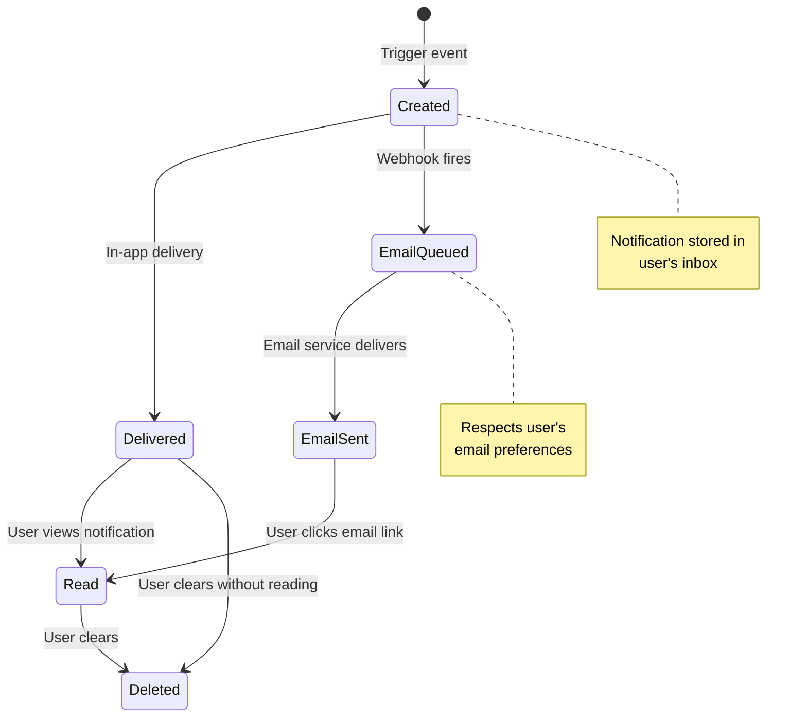

# Chapter 5: Notifications

## Introduction

Collaboration does not happen only when users are online at the same time. When someone mentions you in a comment, replies to your thread, or makes a change you care about, you need to know -- even if you are not looking at the app. Liveblocks provides a complete notification system that covers in-app inbox notifications, email delivery, and custom notification triggers.

This chapter covers how to build a notification inbox, configure email notifications, create custom notification triggers, and manage notification state.

## Notification Architecture



## Notification Types

Liveblocks supports several notification categories:

| Type | Trigger | Example |
|------|---------|---------|
| **Thread notification** | New comment in a thread you participate in | "Alice replied to your comment" |
| **Mention notification** | Someone @-mentions you | "Bob mentioned you in a comment" |
| **Custom notification** | Triggered via API | "Your document was approved" |
| **Text mention** | Mentioned in collaborative text | "Charlie mentioned you in the document" |

Each notification belongs to an **inbox notification**, which groups related activity. For example, multiple replies in the same thread are grouped into a single inbox notification that updates over time.



## Building an In-App Inbox

### Using Pre-Built Components

The fastest way to add a notification inbox is with `@liveblocks/react-ui`:

```tsx
import {
  InboxNotification,
  InboxNotificationList,
} from "@liveblocks/react-ui";
import { useInboxNotifications } from "../liveblocks.config";

function NotificationInbox() {
  const { inboxNotifications, isLoading } = useInboxNotifications();

  if (isLoading) {
    return <div>Loading notifications...</div>;
  }

  if (inboxNotifications.length === 0) {
    return <div className="empty-inbox">No notifications yet</div>;
  }

  return (
    <InboxNotificationList>
      {inboxNotifications.map((notification) => (
        <InboxNotification
          key={notification.id}
          inboxNotification={notification}
        />
      ))}
    </InboxNotificationList>
  );
}
```

### Notification Bell with Badge

```tsx
import { useInboxNotifications } from "../liveblocks.config";
import { useState, useRef, useEffect } from "react";

function NotificationBell() {
  const { inboxNotifications } = useInboxNotifications();
  const [isOpen, setIsOpen] = useState(false);
  const panelRef = useRef<HTMLDivElement>(null);

  const unreadCount = inboxNotifications.filter(
    (n) => n.readAt === null
  ).length;

  // Close panel when clicking outside
  useEffect(() => {
    function handleClickOutside(event: MouseEvent) {
      if (
        panelRef.current &&
        !panelRef.current.contains(event.target as Node)
      ) {
        setIsOpen(false);
      }
    }
    document.addEventListener("mousedown", handleClickOutside);
    return () => document.removeEventListener("mousedown", handleClickOutside);
  }, []);

  return (
    <div ref={panelRef} style={{ position: "relative" }}>
      <button
        onClick={() => setIsOpen(!isOpen)}
        className="notification-bell"
        aria-label={`Notifications (${unreadCount} unread)`}
      >
        <BellIcon />
        {unreadCount > 0 && (
          <span className="badge">
            {unreadCount > 99 ? "99+" : unreadCount}
          </span>
        )}
      </button>

      {isOpen && (
        <div className="notification-panel">
          <div className="panel-header">
            <h3>Notifications</h3>
            <MarkAllAsReadButton />
          </div>
          <NotificationInbox />
        </div>
      )}
    </div>
  );
}

function BellIcon() {
  return (
    <svg width="20" height="20" viewBox="0 0 20 20" fill="currentColor">
      <path d="M10 2a6 6 0 00-6 6v3.586l-.707.707A1 1 0 004 14h12a1 1 0 00.707-1.707L16 11.586V8a6 6 0 00-6-6zM10 18a3 3 0 01-3-3h6a3 3 0 01-3 3z" />
    </svg>
  );
}
```

### Managing Notification State

```tsx
import {
  useMarkInboxNotificationAsRead,
  useMarkAllInboxNotificationsAsRead,
  useDeleteInboxNotification,
  useDeleteAllInboxNotifications,
} from "../liveblocks.config";

function NotificationActions({
  notificationId,
}: {
  notificationId: string;
}) {
  const markAsRead = useMarkInboxNotificationAsRead();
  const deleteNotification = useDeleteInboxNotification();

  return (
    <div className="notification-actions">
      <button onClick={() => markAsRead(notificationId)}>
        Mark as read
      </button>
      <button onClick={() => deleteNotification(notificationId)}>
        Delete
      </button>
    </div>
  );
}

function MarkAllAsReadButton() {
  const markAllAsRead = useMarkAllInboxNotificationsAsRead();

  return (
    <button onClick={markAllAsRead} className="mark-all-read">
      Mark all as read
    </button>
  );
}

function ClearAllButton() {
  const deleteAll = useDeleteAllInboxNotifications();

  return (
    <button onClick={deleteAll} className="clear-all">
      Clear all
    </button>
  );
}
```

## Custom Notifications

Beyond automatic thread/mention notifications, you can trigger custom notifications via the server-side API:

### Sending Custom Notifications

```typescript
// app/api/notify/route.ts
import { Liveblocks } from "@liveblocks/node";
import { NextRequest, NextResponse } from "next/server";

const liveblocks = new Liveblocks({
  secret: process.env.LIVEBLOCKS_SECRET_KEY!,
});

export async function POST(request: NextRequest) {
  const { userId, kind, roomId, data } = await request.json();

  await liveblocks.triggerInboxNotification({
    userId,
    kind: `$${kind}`, // Custom kinds start with $
    roomId,
    subjectId: data.subjectId, // Groups notifications with same subjectId
    activityData: {
      message: data.message,
      actionUrl: data.actionUrl,
      priority: data.priority ?? "normal",
    },
  });

  return NextResponse.json({ success: true });
}
```

### Common Custom Notification Patterns

```typescript
// Document approval notification
await liveblocks.triggerInboxNotification({
  userId: "user-alice",
  kind: "$documentApproved",
  roomId: "doc-123",
  subjectId: "approval-doc-123",
  activityData: {
    documentTitle: "Q4 Report",
    approvedBy: "Bob",
    approvedAt: new Date().toISOString(),
  },
});

// Task assignment notification
await liveblocks.triggerInboxNotification({
  userId: "user-charlie",
  kind: "$taskAssigned",
  roomId: "project-456",
  subjectId: "task-789",
  activityData: {
    taskTitle: "Review design mockups",
    assignedBy: "Alice",
    dueDate: "2025-02-15",
    priority: "high",
  },
});

// System alert notification
await liveblocks.triggerInboxNotification({
  userId: "user-admin",
  kind: "$systemAlert",
  roomId: "system",
  subjectId: `alert-${Date.now()}`,
  activityData: {
    alertType: "usage-limit",
    message: "Your workspace is approaching its storage limit",
    currentUsage: "85%",
  },
});
```

### Rendering Custom Notifications

```tsx
import { InboxNotification } from "@liveblocks/react-ui";
import { useInboxNotifications } from "../liveblocks.config";

function CustomNotificationInbox() {
  const { inboxNotifications } = useInboxNotifications();

  return (
    <div>
      {inboxNotifications.map((notification) => {
        // Custom notification rendering based on kind
        switch (notification.kind) {
          case "$documentApproved":
            return (
              <InboxNotification
                key={notification.id}
                inboxNotification={notification}
                kinds={{
                  $documentApproved: (props) => (
                    <InboxNotification.Custom
                      {...props}
                      title="Document Approved"
                      aside={
                        <span style={{ fontSize: 24 }}>&#9989;</span>
                      }
                    >
                      <strong>
                        {props.inboxNotification.activities[0]?.data
                          .documentTitle}
                      </strong>{" "}
                      was approved by{" "}
                      {props.inboxNotification.activities[0]?.data.approvedBy}
                    </InboxNotification.Custom>
                  ),
                }}
              />
            );

          case "$taskAssigned":
            return (
              <InboxNotification
                key={notification.id}
                inboxNotification={notification}
                kinds={{
                  $taskAssigned: (props) => (
                    <InboxNotification.Custom
                      {...props}
                      title="New Task Assigned"
                      aside={
                        <span style={{ fontSize: 24 }}>&#128203;</span>
                      }
                    >
                      You were assigned:{" "}
                      <strong>
                        {props.inboxNotification.activities[0]?.data.taskTitle}
                      </strong>
                    </InboxNotification.Custom>
                  ),
                }}
              />
            );

          default:
            return (
              <InboxNotification
                key={notification.id}
                inboxNotification={notification}
              />
            );
        }
      })}
    </div>
  );
}
```

## Email Notifications

Liveblocks can trigger email notifications through webhooks. You handle the email delivery with your preferred email provider.

### Webhook Setup for Email



### Implementing the Webhook Handler

```typescript
// app/api/webhooks/liveblocks/route.ts
import { WebhookHandler } from "@liveblocks/node";
import { NextRequest, NextResponse } from "next/server";
import { Resend } from "resend";

const webhookHandler = new WebhookHandler(
  process.env.LIVEBLOCKS_WEBHOOK_SECRET!
);

const resend = new Resend(process.env.RESEND_API_KEY!);

export async function POST(request: NextRequest) {
  const rawBody = await request.text();
  const headers = Object.fromEntries(request.headers.entries());

  let event;
  try {
    event = webhookHandler.verifyRequest({
      headers,
      rawBody,
    });
  } catch (error) {
    return NextResponse.json(
      { error: "Invalid webhook signature" },
      { status: 401 }
    );
  }

  switch (event.type) {
    case "notification": {
      const { userId, kind, roomId, inboxNotificationId } = event.data;

      // Fetch user's email and preferences
      const user = await db.users.findUnique({ where: { id: userId } });
      if (!user || !user.emailNotifications) {
        return NextResponse.json({ skipped: true });
      }

      // Fetch notification details
      const notification = await liveblocks.getInboxNotification({
        userId,
        inboxNotificationId,
      });

      // Build and send email
      await resend.emails.send({
        from: "notifications@yourapp.com",
        to: user.email,
        subject: getEmailSubject(kind, notification),
        html: buildEmailHTML(kind, notification, roomId),
      });

      break;
    }
  }

  return NextResponse.json({ received: true });
}

function getEmailSubject(
  kind: string,
  notification: any
): string {
  switch (kind) {
    case "thread":
      return "New comment on your thread";
    case "textMention":
      return "You were mentioned in a document";
    case "$documentApproved":
      return "Your document was approved";
    default:
      return "You have a new notification";
  }
}

function buildEmailHTML(
  kind: string,
  notification: any,
  roomId: string
): string {
  const appUrl = process.env.NEXT_PUBLIC_APP_URL;
  const link = `${appUrl}/rooms/${roomId}`;

  return `
    <div style="font-family: sans-serif; max-width: 600px; margin: 0 auto;">
      <h2>New Activity in Your Workspace</h2>
      <p>${getEmailBody(kind, notification)}</p>
      <a href="${link}"
         style="display: inline-block; background: #3b82f6; color: white;
                padding: 12px 24px; border-radius: 6px; text-decoration: none;">
        View in App
      </a>
      <hr style="margin-top: 32px; border: none; border-top: 1px solid #e5e7eb;" />
      <p style="color: #6b7280; font-size: 12px;">
        You can manage your notification preferences in
        <a href="${appUrl}/settings/notifications">settings</a>.
      </p>
    </div>
  `;
}

function getEmailBody(kind: string, notification: any): string {
  switch (kind) {
    case "thread":
      return "Someone replied to a thread you're participating in.";
    case "textMention":
      return "You were mentioned in a document.";
    default:
      return "You have new activity in your workspace.";
  }
}
```

### Email Notification Preferences

Allow users to control their notification preferences:

```typescript
// User preferences schema
type NotificationPreferences = {
  email: {
    threadReplies: boolean;
    mentions: boolean;
    customNotifications: boolean;
    digestFrequency: "instant" | "hourly" | "daily" | "never";
  };
  inApp: {
    threadReplies: boolean;
    mentions: boolean;
    customNotifications: boolean;
  };
};

// Settings component
function NotificationSettings() {
  const [prefs, setPrefs] = useState<NotificationPreferences>({
    email: {
      threadReplies: true,
      mentions: true,
      customNotifications: true,
      digestFrequency: "instant",
    },
    inApp: {
      threadReplies: true,
      mentions: true,
      customNotifications: true,
    },
  });

  const savePreferences = async () => {
    await fetch("/api/notification-preferences", {
      method: "PUT",
      body: JSON.stringify(prefs),
    });
  };

  return (
    <div className="settings-panel">
      <h2>Notification Preferences</h2>

      <section>
        <h3>In-App Notifications</h3>
        <label>
          <input
            type="checkbox"
            checked={prefs.inApp.threadReplies}
            onChange={(e) =>
              setPrefs({
                ...prefs,
                inApp: { ...prefs.inApp, threadReplies: e.target.checked },
              })
            }
          />
          Thread replies
        </label>
        <label>
          <input
            type="checkbox"
            checked={prefs.inApp.mentions}
            onChange={(e) =>
              setPrefs({
                ...prefs,
                inApp: { ...prefs.inApp, mentions: e.target.checked },
              })
            }
          />
          Mentions
        </label>
      </section>

      <section>
        <h3>Email Notifications</h3>
        <label>
          <input
            type="checkbox"
            checked={prefs.email.threadReplies}
            onChange={(e) =>
              setPrefs({
                ...prefs,
                email: { ...prefs.email, threadReplies: e.target.checked },
              })
            }
          />
          Thread replies
        </label>
        <label>
          Email frequency:
          <select
            value={prefs.email.digestFrequency}
            onChange={(e) =>
              setPrefs({
                ...prefs,
                email: {
                  ...prefs.email,
                  digestFrequency: e.target.value as any,
                },
              })
            }
          >
            <option value="instant">Instant</option>
            <option value="hourly">Hourly digest</option>
            <option value="daily">Daily digest</option>
            <option value="never">Never</option>
          </select>
        </label>
      </section>

      <button onClick={savePreferences}>Save Preferences</button>
    </div>
  );
}
```

## Notification Lifecycle



## Unread Indicators Across the App

Show unread notification counts beyond just the bell icon:

```tsx
import { useUnreadInboxNotificationsCount } from "@liveblocks/react";

function SidebarItem({ roomId, label }: { roomId: string; label: string }) {
  return (
    <a href={`/rooms/${roomId}`} className="sidebar-item">
      <span>{label}</span>
      <RoomUnreadBadge roomId={roomId} />
    </a>
  );
}

function RoomUnreadBadge({ roomId }: { roomId: string }) {
  // Filter unread notifications for this room
  const { inboxNotifications } = useInboxNotifications();
  const unreadForRoom = inboxNotifications.filter(
    (n) => n.roomId === roomId && n.readAt === null
  ).length;

  if (unreadForRoom === 0) return null;

  return <span className="unread-badge">{unreadForRoom}</span>;
}

function GlobalUnreadCount() {
  const { count, isLoading } = useUnreadInboxNotificationsCount();

  if (isLoading || count === 0) return null;

  // Update the browser tab title
  useEffect(() => {
    document.title = count > 0
      ? `(${count}) Your App`
      : "Your App";
  }, [count]);

  return <span className="global-badge">{count}</span>;
}
```

## Server-Side Notification Management

```typescript
import { Liveblocks } from "@liveblocks/node";

const liveblocks = new Liveblocks({
  secret: process.env.LIVEBLOCKS_SECRET_KEY!,
});

// Get all inbox notifications for a user
const { data: notifications } =
  await liveblocks.getInboxNotifications({
    userId: "user-alice",
  });

// Get unread count
const unreadNotifications = notifications.filter(
  (n) => n.readAt === null
);

// Mark notification as read
await liveblocks.markInboxNotificationAsRead({
  userId: "user-alice",
  inboxNotificationId: "in_xxx",
});

// Mark all as read
await liveblocks.markAllInboxNotificationsAsRead({
  userId: "user-alice",
});

// Delete a notification
await liveblocks.deleteInboxNotification({
  userId: "user-alice",
  inboxNotificationId: "in_xxx",
});

// Delete all notifications
await liveblocks.deleteAllInboxNotifications({
  userId: "user-alice",
});
```

## Summary

In this chapter you learned:

- **Notification types**: thread replies, mentions, custom notifications, and text mentions
- **In-app inbox**: using pre-built `InboxNotification` components or building custom UIs
- **Custom notifications**: triggering notifications via the server-side API for any business logic
- **Email notifications**: handling webhook events to send emails through your provider
- **Notification state**: marking as read, deleting, and tracking unread counts
- **User preferences**: allowing users to control their notification channels and frequency

## Key Takeaways

1. **Inbox notifications group related activity** -- multiple replies to the same thread appear as a single notification that updates.
2. **Custom notifications** let you extend beyond comments -- use them for approvals, assignments, alerts, and any business logic.
3. **Email notifications are webhook-driven** -- Liveblocks fires a webhook, and you handle email delivery with your preferred provider.
4. **Unread counts** can be displayed anywhere in your app using the notification hooks.
5. **Server-side management** enables batch operations, cleanup jobs, and integration with external systems.
6. **User preferences** are your responsibility to implement -- check preferences before sending emails.

## Next Steps

With presence, storage, comments, and notifications covered, it is time to see how everything fits together in React. In **[Chapter 6: React Integration](./06-react-integration.md)**, we will explore the full set of hooks, Suspense patterns, and best practices for building performant collaborative React apps.

---
*Built with insights from the [Liveblocks](https://liveblocks.io) platform.*
