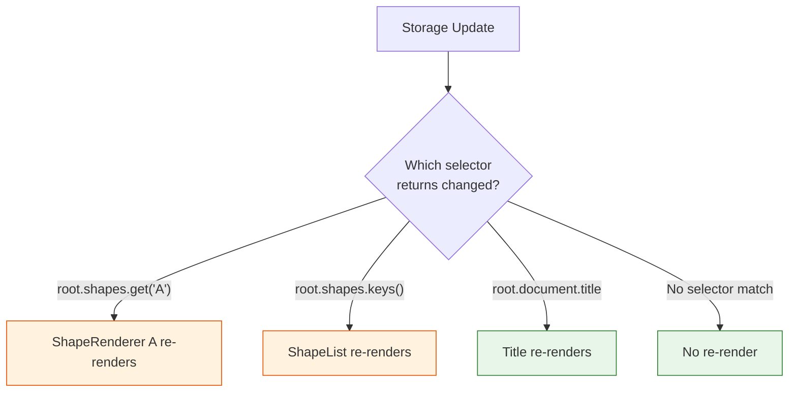

# Chapter 6: React Integration

Welcome to **Chapter 6: React Integration**. In this part of **Liveblocks - Real-Time Collaboration Deep Dive**, you will build an intuitive mental model first, then move into concrete implementation details and practical production tradeoffs.


## Introduction

Liveblocks was designed with React as a first-class citizen. Its hook-based API aligns naturally with React's component model, and its Suspense support enables clean loading states without manual state management. This chapter provides a comprehensive guide to every major React hook, demonstrates Suspense integration patterns, and covers performance optimization techniques for building collaborative React applications at scale.

## Hook Architecture Overview

```mermaid
graph TD
    subgraph "Provider Layer"
        RP[RoomProvider]
        LBP[LiveblocksProvider]
    end

    subgraph "Presence Hooks"
        UMP[useMyPresence]
        US[useSelf]
        UO[useOthers]
        UOM[useOthersMapped]
        UOCI[useOthersConnectionIds]
        UOI[useOther]
    end

    subgraph "Storage Hooks"
        UST[useStorage]
        UM[useMutation]
        UB[useBatch]
    end

    subgraph "History Hooks"
        UH[useHistory]
        UU[useUndo]
        UR[useRedo]
        UCU[useCanUndo]
        UCR[useCanRedo]
    end

    subgraph "Communication Hooks"
        UBE[useBroadcastEvent]
        UEL[useEventListener]
    end

    subgraph "Comment & Notification Hooks"
        UTH[useThreads]
        UCT[useCreateThread]
        UCC[useCreateComment]
        UIN[useInboxNotifications]
    end

    subgraph "Status Hooks"
        USTAT[useStatus]
        UROOM[useRoom]
    end

    RP --> UMP
    RP --> US
    RP --> UO
    RP --> UST
    RP --> UH
    RP --> UBE
    RP --> UTH
    RP --> USTAT
    LBP --> UIN

    style RP fill:#e3f2fd,stroke:#1565c0
    style LBP fill:#e8f5e9,stroke:#2e7d32
```



## Suspense Integration

Liveblocks exports two versions of every hook: a standard version and a Suspense-compatible version. The Suspense versions throw promises during loading, letting React's `<Suspense>` boundaries handle loading states.

### Setting Up Suspense Hooks

```typescript
// liveblocks.config.ts
import { createClient } from "@liveblocks/client";
import { createRoomContext } from "@liveblocks/react";

const client = createClient({
  publicApiKey: process.env.NEXT_PUBLIC_LIVEBLOCKS_PUBLIC_KEY!,
});

// Export both standard and suspense versions
export const {
  // Standard hooks (return loading states)
  useMyPresence,
  useOthers,
  useStorage,

  // Suspense hooks (throw promises, use with <Suspense>)
  suspense: {
    useMyPresence: useMyPresenceSuspense,
    useOthers: useOthersSuspense,
    useStorage: useStorageSuspense,
    useSelf: useSelfSuspense,
    useThreads: useThreadsSuspense,
  },
} = createRoomContext<Presence, Storage, UserMeta, RoomEvent>(client);
```

### Using Suspense in Your App

```tsx
import { Suspense } from "react";
import { RoomProvider } from "../liveblocks.config";
import { ClientSideSuspense } from "@liveblocks/react";

function CollaborativePage({ roomId }: { roomId: string }) {
  return (
    <RoomProvider
      id={roomId}
      initialPresence={{ cursor: null, name: "User" }}
      initialStorage={{ document: new LiveObject({ title: "Untitled" }) }}
    >
      <Suspense fallback={<FullPageLoader />}>
        <Header />
        <div className="main-layout">
          <Suspense fallback={<CanvasSkeleton />}>
            <Canvas />
          </Suspense>
          <Suspense fallback={<SidebarSkeleton />}>
            <CommentsSidebar />
          </Suspense>
        </div>
      </Suspense>
    </RoomProvider>
  );
}

function FullPageLoader() {
  return (
    <div className="loading-container">
      <div className="spinner" />
      <p>Connecting to collaboration session...</p>
    </div>
  );
}
```

### Standard vs Suspense Hook Comparison

| Aspect | Standard Hook | Suspense Hook |
|--------|--------------|---------------|
| **Loading** | Returns `null` or `isLoading` | Throws promise (Suspense catches) |
| **Error** | Returns `error` object | Throws error (ErrorBoundary catches) |
| **Usage** | Manual loading/error checks | Automatic via React boundaries |
| **Data** | Possibly `null` | Always defined (after Suspense resolves) |
| **Best for** | Gradual adoption, fine control | Clean code, full React 18+ patterns |

```tsx
// Standard approach: manual loading handling
function DocumentTitle() {
  const title = useStorage((root) => root.document?.title);

  if (title === null) return <Skeleton />;
  return <h1>{title}</h1>;
}

// Suspense approach: clean, guaranteed data
function DocumentTitleSuspense() {
  const title = useStorageSuspense((root) => root.document.title);
  // title is always defined here
  return <h1>{title}</h1>;
}
```

## Presence Hooks Deep Dive

### useMyPresence

Read and write your own presence:

```tsx
function PresenceDemo() {
  const [myPresence, updateMyPresence] = useMyPresence();

  return (
    <div>
      <p>Current state: {JSON.stringify(myPresence)}</p>

      {/* Update individual fields */}
      <input
        value={myPresence.name}
        onChange={(e) => updateMyPresence({ name: e.target.value })}
        placeholder="Your name"
      />

      {/* Toggle a boolean */}
      <button
        onClick={() =>
          updateMyPresence({ isTyping: !myPresence.isTyping })
        }
      >
        {myPresence.isTyping ? "Stop typing" : "Start typing"}
      </button>
    </div>
  );
}
```

### useSelf with Selectors

`useSelf` returns your full user object. Use selectors to prevent unnecessary re-renders:

```tsx
// Full object (re-renders on ANY presence change)
function FullSelf() {
  const me = useSelf();
  return <span>{me?.info?.name}</span>;
}

// Selector (re-renders only when name changes)
function SelectedSelf() {
  const name = useSelf((me) => me.info?.name);
  return <span>{name}</span>;
}

// Multiple selectors in separate hooks
function UserInfo() {
  const name = useSelf((me) => me.info?.name);
  const connectionId = useSelf((me) => me.connectionId);
  const cursor = useSelf((me) => me.presence.cursor);

  return (
    <div>
      <p>Name: {name}</p>
      <p>Connection: #{connectionId}</p>
      <p>Cursor: {cursor ? `${cursor.x}, ${cursor.y}` : "Outside"}</p>
    </div>
  );
}
```

### useOthers with Transformation

```tsx
// Count online users efficiently
function OnlineCount() {
  const count = useOthers((others) => others.length);
  return <span>{count + 1} online</span>; // +1 for yourself
}

// Get only users who have a cursor
function ActiveCursors() {
  const activeCursors = useOthers((others) =>
    others
      .filter((user) => user.presence.cursor !== null)
      .map((user) => ({
        connectionId: user.connectionId,
        cursor: user.presence.cursor!,
        color: user.info?.color ?? "#000",
        name: user.info?.name ?? "Anonymous",
      }))
  );

  return (
    <>
      {activeCursors.map(({ connectionId, cursor, color, name }) => (
        <CursorDisplay
          key={connectionId}
          x={cursor.x}
          y={cursor.y}
          color={color}
          name={name}
        />
      ))}
    </>
  );
}

// Get unique selected elements
function SelectedElements() {
  const selectedIds = useOthers((others) => {
    const ids = new Set<string>();
    others.forEach((user) => {
      if (user.presence.selectedId) {
        ids.add(user.presence.selectedId);
      }
    });
    return Array.from(ids);
  });

  return (
    <div>
      <p>Elements being edited: {selectedIds.join(", ")}</p>
    </div>
  );
}
```

## Storage Hooks Deep Dive

### useStorage Selector Patterns

The `useStorage` hook accepts a selector function. The component re-renders only when the selector's return value changes (using shallow comparison):

```tsx
// Select a single value
function Title() {
  const title = useStorage((root) => root.document.title);
  return <h1>{title}</h1>;
}

// Select a computed value
function TaskStats() {
  const stats = useStorage((root) => {
    const todos = root.todos.toImmutable();
    return {
      total: todos.length,
      completed: todos.filter((t) => t.completed).length,
      pending: todos.filter((t) => !t.completed).length,
    };
  });

  return (
    <div className="stats">
      <span>Total: {stats.total}</span>
      <span>Done: {stats.completed}</span>
      <span>Pending: {stats.pending}</span>
    </div>
  );
}

// Select a specific item from a map
function ShapeProperties({ shapeId }: { shapeId: string }) {
  const shape = useStorage((root) =>
    root.shapes.get(shapeId)?.toImmutable()
  );

  if (!shape) return <p>Shape not found</p>;

  return (
    <div className="properties-panel">
      <label>X: <input value={shape.x} readOnly /></label>
      <label>Y: <input value={shape.y} readOnly /></label>
      <label>Width: <input value={shape.width} readOnly /></label>
      <label>Height: <input value={shape.height} readOnly /></label>
      <label>Fill: <input type="color" value={shape.fill} readOnly /></label>
    </div>
  );
}
```

### useMutation Patterns

`useMutation` provides write access to storage. The callback receives a context object with `storage`, `self`, `others`, and `setMyPresence`:

```tsx
import { useMutation } from "../liveblocks.config";
import { LiveObject } from "@liveblocks/client";
import { nanoid } from "nanoid";

function CanvasToolbar() {
  // Create a new shape
  const addShape = useMutation(
    ({ storage, self }, type: "rectangle" | "ellipse" | "text") => {
      const shapes = storage.get("shapes");
      const layers = storage.get("layers");
      const id = nanoid();

      shapes.set(
        id,
        new LiveObject({
          type,
          x: 100,
          y: 100,
          width: 100,
          height: 100,
          fill: self.info?.color ?? "#3b82f6",
          content: type === "text" ? "Double-click to edit" : undefined,
        })
      );
      layers.push(id);
    },
    []
  );

  // Update shape position with presence tracking
  const moveShape = useMutation(
    ({ storage, setMyPresence }, id: string, x: number, y: number) => {
      const shape = storage.get("shapes").get(id);
      if (shape) {
        shape.update({ x, y });
        setMyPresence({ selectedId: id });
      }
    },
    []
  );

  // Delete selected shape
  const deleteSelected = useMutation(({ storage, self }) => {
    const selectedId = self.presence.selectedId;
    if (!selectedId) return;

    const shapes = storage.get("shapes");
    const layers = storage.get("layers");

    shapes.delete(selectedId);

    const layerIndex = layers
      .toImmutable()
      .findIndex((id) => id === selectedId);
    if (layerIndex !== -1) {
      layers.delete(layerIndex);
    }
  }, []);

  // Reorder layers
  const bringToFront = useMutation(({ storage, self }) => {
    const selectedId = self.presence.selectedId;
    if (!selectedId) return;

    const layers = storage.get("layers");
    const currentIndex = layers
      .toImmutable()
      .findIndex((id) => id === selectedId);

    if (currentIndex !== -1 && currentIndex < layers.length - 1) {
      layers.move(currentIndex, layers.length - 1);
    }
  }, []);

  return (
    <div className="toolbar">
      <button onClick={() => addShape("rectangle")}>Rectangle</button>
      <button onClick={() => addShape("ellipse")}>Ellipse</button>
      <button onClick={() => addShape("text")}>Text</button>
      <button onClick={deleteSelected}>Delete</button>
      <button onClick={bringToFront}>Bring to Front</button>
    </div>
  );
}
```

### useMutation with External Dependencies

When your mutation depends on React state or props, include them in the dependency array:

```tsx
function ColorPicker({ shapeId }: { shapeId: string }) {
  const [selectedColor, setSelectedColor] = useState("#3b82f6");

  // shapeId is a dependency -- mutation updates when it changes
  const applyColor = useMutation(
    ({ storage }) => {
      const shape = storage.get("shapes").get(shapeId);
      if (shape) {
        shape.set("fill", selectedColor);
      }
    },
    [shapeId, selectedColor] // Dependencies!
  );

  return (
    <div>
      <input
        type="color"
        value={selectedColor}
        onChange={(e) => setSelectedColor(e.target.value)}
      />
      <button onClick={applyColor}>Apply Color</button>
    </div>
  );
}
```

## Error Boundaries

Pair Suspense with Error Boundaries for robust error handling:

```tsx
import { Component, ReactNode, Suspense } from "react";

class CollaborationErrorBoundary extends Component<
  { children: ReactNode; fallback?: ReactNode },
  { error: Error | null }
> {
  state = { error: null as Error | null };

  static getDerivedStateFromError(error: Error) {
    return { error };
  }

  render() {
    if (this.state.error) {
      return (
        this.props.fallback ?? (
          <div className="error-container">
            <h2>Connection Error</h2>
            <p>{this.state.error.message}</p>
            <button onClick={() => this.setState({ error: null })}>
              Retry
            </button>
          </div>
        )
      );
    }
    return this.props.children;
  }
}

// Usage
function App() {
  return (
    <RoomProvider id="my-room" initialPresence={{ cursor: null }}>
      <CollaborationErrorBoundary>
        <Suspense fallback={<Loading />}>
          <CollaborativeEditor />
        </Suspense>
      </CollaborationErrorBoundary>
    </RoomProvider>
  );
}
```

## Performance Optimization Patterns

### Selector Memoization

```tsx
import { useCallback } from "react";

function OptimizedShapeList() {
  // Memoize the selector to prevent unnecessary recalculations
  const shapeIds = useStorage(
    useCallback(
      (root) => Array.from(root.shapes.keys()),
      []
    )
  );

  return (
    <div>
      {shapeIds?.map((id) => (
        <ShapeRenderer key={id} shapeId={id} />
      ))}
    </div>
  );
}

// Each shape reads only its own data
function ShapeRenderer({ shapeId }: { shapeId: string }) {
  const shape = useStorage(
    useCallback(
      (root) => root.shapes.get(shapeId)?.toImmutable(),
      [shapeId]
    )
  );

  if (!shape) return null;

  return (
    <div
      style={{
        position: "absolute",
        left: shape.x,
        top: shape.y,
        width: shape.width,
        height: shape.height,
        backgroundColor: shape.fill,
        borderRadius: shape.type === "ellipse" ? "50%" : 0,
      }}
    />
  );
}
```

### Re-render Analysis



### Component Architecture Best Practices

```tsx
// BAD: One component reads everything
function MonolithicCanvas() {
  const shapes = useStorage((root) => root.shapes);       // Re-renders on any shape change
  const layers = useStorage((root) => root.layers);        // Re-renders on layer change
  const document = useStorage((root) => root.document);    // Re-renders on document change
  const others = useOthers();                              // Re-renders on any presence change

  // This component re-renders on EVERY change from ANYONE
  return <div>{/* render everything */}</div>;
}

// GOOD: Split into focused components
function OptimizedCanvas() {
  return (
    <div className="canvas">
      <ShapeLayer />      {/* Only re-renders on shape changes */}
      <CursorLayer />     {/* Only re-renders on cursor changes */}
      <SelectionLayer />  {/* Only re-renders on selection changes */}
      <UIOverlay />       {/* Only re-renders on document metadata */}
    </div>
  );
}

function ShapeLayer() {
  const shapeIds = useStorage((root) =>
    root.layers.toImmutable()
  );

  return (
    <>
      {shapeIds?.map((id) => (
        <MemoizedShape key={id} id={id} />
      ))}
    </>
  );
}

const MemoizedShape = memo(function Shape({ id }: { id: string }) {
  const shape = useStorage((root) =>
    root.shapes.get(id)?.toImmutable()
  );
  if (!shape) return null;
  return <ShapeRenderer shape={shape} />;
});

function CursorLayer() {
  const connectionIds = useOthersConnectionIds();
  return (
    <>
      {connectionIds.map((id) => (
        <RemoteCursor key={id} connectionId={id} />
      ))}
    </>
  );
}

const RemoteCursor = memo(function RemoteCursor({
  connectionId,
}: {
  connectionId: number;
}) {
  const cursor = useOther(connectionId, (u) => u.presence.cursor);
  const info = useOther(connectionId, (u) => u.info);

  if (!cursor) return null;
  return <CursorDisplay x={cursor.x} y={cursor.y} info={info} />;
});
```

## Nested RoomProviders

You can nest `RoomProvider` instances for apps that need multiple simultaneous rooms:

```tsx
function MultiRoomApp() {
  return (
    <div className="split-view">
      {/* Left panel: document editing */}
      <RoomProvider
        id="document-main"
        initialPresence={{ cursor: null }}
        initialStorage={{ content: new LiveObject({ text: "" }) }}
      >
        <Suspense fallback={<EditorSkeleton />}>
          <DocumentEditor />
        </Suspense>
      </RoomProvider>

      {/* Right panel: shared whiteboard */}
      <RoomProvider
        id="whiteboard-main"
        initialPresence={{ cursor: null }}
        initialStorage={{ shapes: new LiveMap() }}
      >
        <Suspense fallback={<WhiteboardSkeleton />}>
          <Whiteboard />
        </Suspense>
      </RoomProvider>
    </div>
  );
}
```

## Testing Collaborative Components

```tsx
// test/CollaborativeEditor.test.tsx
import { render, screen, act } from "@testing-library/react";
import { RoomProvider } from "../liveblocks.config";
import { LiveList, LiveObject } from "@liveblocks/client";
import { CollaborativeEditor } from "./CollaborativeEditor";

// Mock the Liveblocks client for testing
jest.mock("../liveblocks.config", () => ({
  RoomProvider: ({ children }: { children: React.ReactNode }) => (
    <div>{children}</div>
  ),
  useMyPresence: () => [
    { cursor: null, name: "Test User" },
    jest.fn(),
  ],
  useOthers: () => [],
  useStorage: (selector: any) =>
    selector({
      document: { title: "Test Document" },
      todos: [
        { id: "1", text: "Test todo", completed: false },
      ],
    }),
  useMutation: (fn: any) => fn,
}));

describe("CollaborativeEditor", () => {
  it("renders the document title", () => {
    render(<CollaborativeEditor />);
    expect(screen.getByText("Test Document")).toBeInTheDocument();
  });

  it("shows the current user name", () => {
    render(<CollaborativeEditor />);
    expect(screen.getByText("Test User")).toBeInTheDocument();
  });
});
```

## Summary

In this chapter you learned:

- **Hook taxonomy**: presence hooks, storage hooks, history hooks, communication hooks, and status hooks
- **Suspense integration**: using Suspense-compatible hooks for clean loading states
- **Selector patterns**: reading specific slices of data to minimize re-renders
- **useMutation**: writing to storage with full access to the collaboration context
- **Performance optimization**: component splitting, memoization, and per-connection rendering
- **Error boundaries**: handling connection and data errors gracefully
- **Testing**: mocking Liveblocks hooks for unit tests

## Key Takeaways

1. **Use Suspense hooks** for cleaner code -- they guarantee data is available and eliminate null checks.
2. **Selectors are your primary performance lever** -- narrow selectors mean fewer re-renders.
3. **Split components by data dependency** -- each component should subscribe to only the data it needs.
4. **useMutation callbacks are batched** -- multiple operations inside a single callback are sent as one network message.
5. **useOthersConnectionIds + useOther** is the fastest pattern for rendering per-user UI like cursors.
6. **Error boundaries** are essential -- network issues are inevitable and your app should handle them gracefully.

## Next Steps

Now that you have mastered the React integration, let us explore advanced patterns. In **[Chapter 7: Advanced Patterns](./07-advanced-patterns.md)**, we will cover undo/redo, offline support, permissions, and Yjs integration for rich text editing.

---
*Built with insights from the [Liveblocks](https://liveblocks.io) platform.*

## What Problem Does This Solve?

Most teams struggle here because the hard part is not writing more code, but deciding clear boundaries for `shape`, `root`, `cursor` so behavior stays predictable as complexity grows.

In practical terms, this chapter helps you avoid three common failures:

- coupling core logic too tightly to one implementation path
- missing the handoff boundaries between setup, execution, and validation
- shipping changes without clear rollback or observability strategy

After working through this chapter, you should be able to reason about `Chapter 6: React Integration` as an operating subsystem inside **Liveblocks - Real-Time Collaboration Deep Dive**, with explicit contracts for inputs, state transitions, and outputs.

Use the implementation notes around `name`, `Suspense`, `shapes` as your checklist when adapting these patterns to your own repository.

## How it Works Under the Hood

Under the hood, `Chapter 6: React Integration` usually follows a repeatable control path:

1. **Context bootstrap**: initialize runtime config and prerequisites for `shape`.
2. **Input normalization**: shape incoming data so `root` receives stable contracts.
3. **Core execution**: run the main logic branch and propagate intermediate state through `cursor`.
4. **Policy and safety checks**: enforce limits, auth scopes, and failure boundaries.
5. **Output composition**: return canonical result payloads for downstream consumers.
6. **Operational telemetry**: emit logs/metrics needed for debugging and performance tuning.

When debugging, walk this sequence in order and confirm each stage has explicit success/failure conditions.

## Source Walkthrough

Use the following upstream sources to verify implementation details while reading this chapter:

- [Liveblocks GitHub Repository](https://github.com/liveblocks/liveblocks)
  Why it matters: authoritative reference on `Liveblocks GitHub Repository` (github.com).
- [Liveblocks Product Site](https://liveblocks.io)
  Why it matters: authoritative reference on `Liveblocks Product Site` (liveblocks.io).
- [Liveblocks Documentation](https://liveblocks.io/docs)
  Why it matters: authoritative reference on `Liveblocks Documentation` (liveblocks.io).

Suggested trace strategy:
- search upstream code for `shape` and `root` to map concrete implementation paths
- compare docs claims against actual runtime/config code before reusing patterns in production

## Chapter Connections

- [Tutorial Index](index.md)
- [Previous Chapter: Chapter 5: Notifications](05-notifications.md)
- [Next Chapter: Chapter 7: Advanced Patterns](07-advanced-patterns.md)
- [Main Catalog](../../README.md#-tutorial-catalog)
- [A-Z Tutorial Directory](../../discoverability/tutorial-directory.md)
