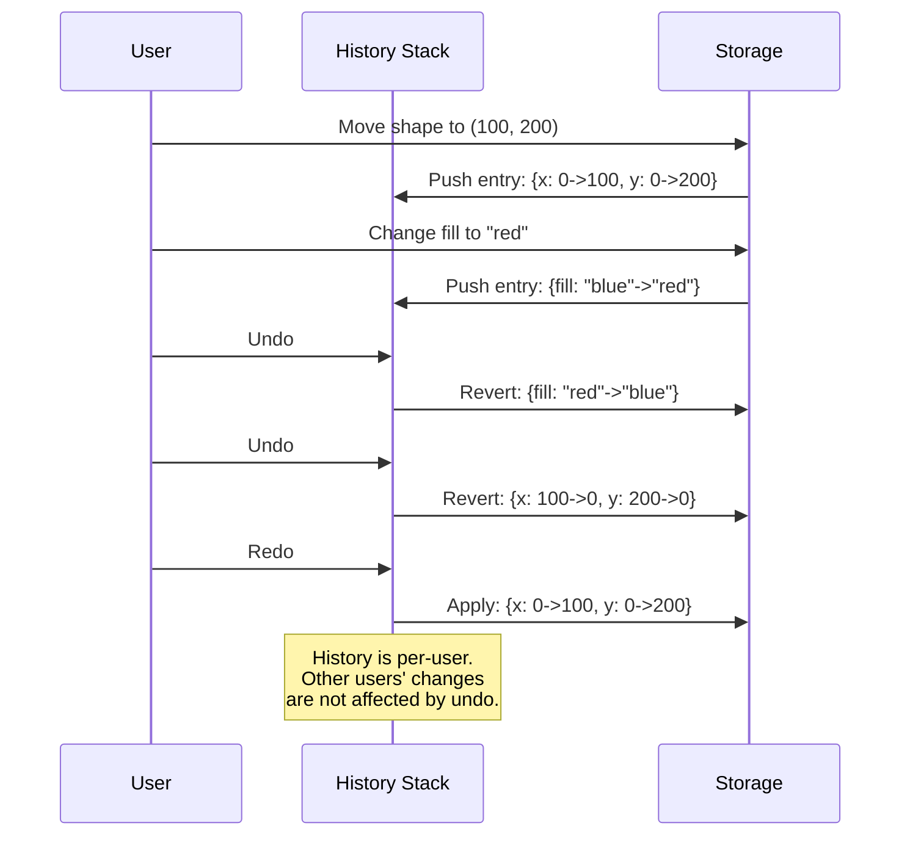
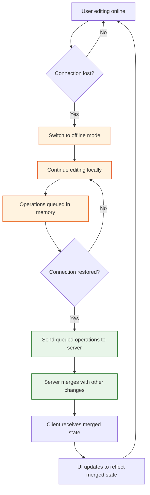
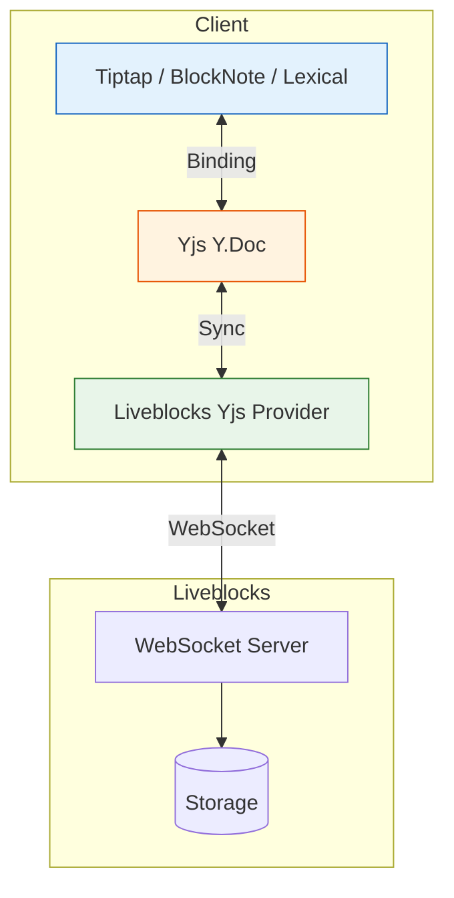

# Chapter 7: Advanced Patterns

## Introduction

Once you have the basics of presence, storage, and comments working, real-world applications demand more sophisticated capabilities. Users expect to undo and redo changes. Apps need to work when the network drops. Access control must ensure users can only see and modify data they are authorized to access. And for rich text collaboration, Yjs integration unlocks Google-Docs-style co-editing.

This chapter covers these advanced patterns: undo/redo with history management, offline resilience, fine-grained permissions, and integrating Yjs for collaborative text editing.

## Undo / Redo

Liveblocks provides built-in undo/redo that works across all storage operations. Every `useMutation` call automatically creates a history entry that can be undone.

### Basic Undo/Redo

```tsx
import { useUndo, useRedo, useCanUndo, useCanRedo } from "../liveblocks.config";

function UndoRedoButtons() {
  const undo = useUndo();
  const redo = useRedo();
  const canUndo = useCanUndo();
  const canRedo = useCanRedo();

  return (
    <div className="history-controls">
      <button onClick={undo} disabled={!canUndo} title="Undo (Ctrl+Z)">
        Undo
      </button>
      <button onClick={redo} disabled={!canRedo} title="Redo (Ctrl+Shift+Z)">
        Redo
      </button>
    </div>
  );
}
```

### Keyboard Shortcuts

```tsx
import { useUndo, useRedo } from "../liveblocks.config";
import { useEffect } from "react";

function useUndoRedoShortcuts() {
  const undo = useUndo();
  const redo = useRedo();

  useEffect(() => {
    function handleKeyDown(e: KeyboardEvent) {
      if ((e.metaKey || e.ctrlKey) && e.key === "z") {
        e.preventDefault();
        if (e.shiftKey) {
          redo();
        } else {
          undo();
        }
      }
      // Also support Ctrl+Y for redo
      if ((e.metaKey || e.ctrlKey) && e.key === "y") {
        e.preventDefault();
        redo();
      }
    }

    document.addEventListener("keydown", handleKeyDown);
    return () => document.removeEventListener("keydown", handleKeyDown);
  }, [undo, redo]);
}
```

### History Pausing and Batching

Sometimes you want multiple operations to count as a single undo step. For example, dragging a shape should be undone in one step, not frame-by-frame:

```tsx
import { useHistory, useMutation } from "../liveblocks.config";

function DraggableShape({ shapeId }: { shapeId: string }) {
  const history = useHistory();

  const updatePosition = useMutation(
    ({ storage }, x: number, y: number) => {
      const shape = storage.get("shapes").get(shapeId);
      if (shape) {
        shape.update({ x, y });
      }
    },
    [shapeId]
  );

  const handleDragStart = () => {
    // Pause history -- all updates during drag become one undo step
    history.pause();
  };

  const handleDrag = (e: React.PointerEvent) => {
    const rect = e.currentTarget.parentElement!.getBoundingClientRect();
    updatePosition(e.clientX - rect.left, e.clientY - rect.top);
  };

  const handleDragEnd = () => {
    // Resume history -- creates a single undo entry for the entire drag
    history.resume();
  };

  return (
    <div
      onPointerDown={handleDragStart}
      onPointerMove={handleDrag}
      onPointerUp={handleDragEnd}
      className="draggable-shape"
    />
  );
}
```

### How History Works



**Important**: Undo/redo is **per-user**. Undoing your changes does not affect other users' edits. This matches the behavior users expect from tools like Figma and Google Docs.

### History with Batched Operations

```tsx
import { useMutation } from "../liveblocks.config";
import { LiveObject } from "@liveblocks/client";
import { nanoid } from "nanoid";

function CanvasActions() {
  // Duplicate shape: creates two operations (add to map + add to layers)
  // Both are undone together because they're in the same useMutation
  const duplicateShape = useMutation(({ storage }, sourceId: string) => {
    const shapes = storage.get("shapes");
    const layers = storage.get("layers");
    const source = shapes.get(sourceId);

    if (!source) return;

    const newId = nanoid();
    shapes.set(
      newId,
      new LiveObject({
        ...source.toImmutable(),
        x: source.get("x") + 20,
        y: source.get("y") + 20,
      })
    );
    layers.push(newId);

    // Single undo reverses BOTH operations
  }, []);

  // Group multiple shapes: all changes undo together
  const groupShapes = useMutation(
    ({ storage }, shapeIds: string[]) => {
      const shapes = storage.get("shapes");
      const groupId = nanoid();

      shapeIds.forEach((id) => {
        const shape = shapes.get(id);
        if (shape) {
          shape.set("groupId", groupId);
        }
      });

      // All property updates undo as one step
    },
    []
  );

  return (
    <div>
      <button onClick={() => duplicateShape("selected-shape")}>
        Duplicate
      </button>
    </div>
  );
}
```

## Offline Support

Liveblocks handles temporary disconnections gracefully. When a user goes offline, they can continue editing locally. Changes are queued and synchronized when connectivity resumes.

### Connection Status Monitoring

```tsx
import { useStatus } from "../liveblocks.config";

function OfflineIndicator() {
  const status = useStatus();

  if (status === "connected") return null;

  return (
    <div className={`offline-banner ${status}`}>
      {status === "reconnecting" && (
        <>
          <span className="spinner-small" />
          Reconnecting... Your changes are saved locally.
        </>
      )}
      {status === "disconnected" && (
        <>
          You are offline. Changes will sync when you reconnect.
        </>
      )}
    </div>
  );
}
```

### Offline Behavior Details



| Scenario | Behavior |
|----------|----------|
| Brief disconnect (<30s) | Transparent to user; ops queue and replay |
| Medium disconnect (30s-5min) | Reconnection banner shown; ops still queued |
| Long disconnect (>5min) | Full re-sync triggered; local state reconciled |
| Tab backgrounded | WebSocket kept alive; presence may be paused |
| Device sleep/wake | Reconnection triggered on wake; state re-synced |

### Optimistic Updates

All Liveblocks mutations are **optimistic** -- the local state updates immediately, and the server confirms asynchronously:

```tsx
function OptimisticTodoList() {
  const todos = useStorage((root) => root.todos.toImmutable());

  const addTodo = useMutation(({ storage }, text: string) => {
    storage.get("todos").push(
      new LiveObject({
        id: nanoid(),
        text,
        completed: false,
      })
    );
    // UI updates INSTANTLY -- no loading spinner needed
    // Server confirmation happens in the background
  }, []);

  const toggleTodo = useMutation(({ storage }, index: number) => {
    const todo = storage.get("todos").get(index);
    if (todo) {
      todo.set("completed", !todo.get("completed"));
      // Checkbox flips immediately
    }
  }, []);

  return (
    <ul>
      {todos?.map((todo, i) => (
        <li key={todo.id}>
          <input
            type="checkbox"
            checked={todo.completed}
            onChange={() => toggleTodo(i)}
          />
          {todo.text}
        </li>
      ))}
    </ul>
  );
}
```

## Permissions and Access Control

Liveblocks supports fine-grained permissions through its authentication system. Permissions are enforced at the room level.

### Permission Levels

| Level | Can Read | Can Write Storage | Can Comment | Can Edit Others' Comments |
|-------|----------|-------------------|-------------|---------------------------|
| `room:read` | Yes | No | No | No |
| `room:write` | Yes | Yes | Yes | No |
| Full Access | Yes | Yes | Yes | Yes |

### Implementing Permissions in Auth

```typescript
// app/api/liveblocks-auth/route.ts
import { Liveblocks } from "@liveblocks/node";

const liveblocks = new Liveblocks({
  secret: process.env.LIVEBLOCKS_SECRET_KEY!,
});

export async function POST(request: Request) {
  const user = await getUserFromSession(request);
  if (!user) {
    return new Response("Unauthorized", { status: 401 });
  }

  const session = liveblocks.prepareSession(user.id, {
    userInfo: {
      name: user.name,
      avatar: user.avatarUrl,
      color: user.color,
    },
  });

  // Role-based access
  if (user.role === "admin") {
    // Admins get full access to all rooms
    session.allow("*", session.FULL_ACCESS);
  } else if (user.role === "editor") {
    // Editors can write to their org's rooms
    session.allow(`org:${user.orgId}:*`, session.FULL_ACCESS);
    // Read-only access to shared rooms
    session.allow("shared:*", session.READ_ACCESS);
  } else if (user.role === "viewer") {
    // Viewers can only read
    session.allow(`org:${user.orgId}:*`, session.READ_ACCESS);
  }

  // Document-specific permissions
  const docPermissions = await getDocPermissions(user.id);
  for (const perm of docPermissions) {
    if (perm.level === "write") {
      session.allow(`doc:${perm.docId}`, session.FULL_ACCESS);
    } else {
      session.allow(`doc:${perm.docId}`, session.READ_ACCESS);
    }
  }

  const { status, body } = await session.authorize();
  return new Response(body, { status });
}
```

### Read-Only Mode in UI

```tsx
import { useRoom } from "../liveblocks.config";
import { useMemo } from "react";

function useIsReadOnly(): boolean {
  const room = useRoom();
  // Check if the user has write permissions
  // This is determined by the auth endpoint
  const self = useSelf();
  return self?.canWrite === false;
}

function Editor() {
  const isReadOnly = useIsReadOnly();
  const title = useStorage((root) => root.document.title);

  const updateTitle = useMutation(({ storage }, newTitle: string) => {
    storage.get("document").set("title", newTitle);
  }, []);

  return (
    <div>
      <input
        value={title ?? ""}
        onChange={(e) => updateTitle(e.target.value)}
        disabled={isReadOnly}
        className={isReadOnly ? "read-only" : ""}
      />
      {isReadOnly && (
        <span className="read-only-badge">View only</span>
      )}
    </div>
  );
}
```

### ID Token Authentication

For public pages or simple authentication, use ID tokens:

```typescript
// app/api/liveblocks-auth/route.ts (ID token approach)
import { Liveblocks } from "@liveblocks/node";

const liveblocks = new Liveblocks({
  secret: process.env.LIVEBLOCKS_SECRET_KEY!,
});

export async function POST(request: Request) {
  const user = await getUserFromSession(request);

  // ID tokens are simpler: the user gets access to rooms
  // based on the permissions set in the Liveblocks dashboard
  // or via the REST API
  const { body, status } = await liveblocks.identifyUser(
    {
      userId: user.id,
      groupIds: [user.orgId, ...user.teamIds],
    },
    {
      userInfo: {
        name: user.name,
        avatar: user.avatarUrl,
      },
    }
  );

  return new Response(body, { status });
}
```

## Yjs Integration for Rich Text

For collaborative text editing (Google Docs-style), Liveblocks integrates with [Yjs](https://yjs.dev/), the industry-standard CRDT framework for text. This enables character-level conflict resolution that LiveObject/LiveList cannot provide.

### Architecture with Yjs



### Setting Up Tiptap with Liveblocks

```bash
npm install @liveblocks/yjs @tiptap/react @tiptap/starter-kit \
  @tiptap/extension-collaboration @tiptap/extension-collaboration-cursor \
  yjs
```

```tsx
import { useRoom } from "../liveblocks.config";
import { useEditor, EditorContent } from "@tiptap/react";
import StarterKit from "@tiptap/starter-kit";
import Collaboration from "@tiptap/extension-collaboration";
import CollaborationCursor from "@tiptap/extension-collaboration-cursor";
import { LiveblocksYjsProvider } from "@liveblocks/yjs";
import { useEffect, useMemo, useState } from "react";
import * as Y from "yjs";

function CollaborativeTextEditor() {
  const room = useRoom();
  const [provider, setProvider] = useState<LiveblocksYjsProvider | null>(null);

  // Create Yjs document and Liveblocks provider
  const yDoc = useMemo(() => new Y.Doc(), []);

  useEffect(() => {
    const yProvider = new LiveblocksYjsProvider(room, yDoc);
    setProvider(yProvider);

    return () => {
      yDoc.destroy();
      yProvider.destroy();
    };
  }, [room, yDoc]);

  if (!provider) return <div>Connecting...</div>;

  return <TiptapEditor yDoc={yDoc} provider={provider} />;
}

function TiptapEditor({
  yDoc,
  provider,
}: {
  yDoc: Y.Doc;
  provider: LiveblocksYjsProvider;
}) {
  const editor = useEditor({
    extensions: [
      StarterKit.configure({
        // Disable default history (Yjs handles it)
        history: false,
      }),
      Collaboration.configure({
        document: yDoc,
      }),
      CollaborationCursor.configure({
        provider,
        user: {
          name: "Current User",
          color: "#3b82f6",
        },
      }),
    ],
  });

  return (
    <div className="editor-container">
      <Toolbar editor={editor} />
      <EditorContent editor={editor} className="prose" />
    </div>
  );
}

function Toolbar({ editor }: { editor: any }) {
  if (!editor) return null;

  return (
    <div className="toolbar">
      <button
        onClick={() => editor.chain().focus().toggleBold().run()}
        className={editor.isActive("bold") ? "active" : ""}
      >
        Bold
      </button>
      <button
        onClick={() => editor.chain().focus().toggleItalic().run()}
        className={editor.isActive("italic") ? "active" : ""}
      >
        Italic
      </button>
      <button
        onClick={() => editor.chain().focus().toggleHeading({ level: 2 }).run()}
        className={editor.isActive("heading", { level: 2 }) ? "active" : ""}
      >
        H2
      </button>
      <button
        onClick={() => editor.chain().focus().toggleBulletList().run()}
        className={editor.isActive("bulletList") ? "active" : ""}
      >
        Bullet List
      </button>
    </div>
  );
}
```

### BlockNote Integration

[BlockNote](https://blocknotejs.org/) is a Notion-like block editor that also supports Liveblocks:

```tsx
import { useRoom } from "../liveblocks.config";
import { useCreateBlockNote } from "@blocknote/react";
import { BlockNoteView } from "@blocknote/mantine";
import { LiveblocksYjsProvider } from "@liveblocks/yjs";
import * as Y from "yjs";
import { useEffect, useMemo, useState } from "react";

function BlockNoteEditor() {
  const room = useRoom();
  const yDoc = useMemo(() => new Y.Doc(), []);
  const [provider, setProvider] = useState<LiveblocksYjsProvider | null>(null);

  useEffect(() => {
    const yProvider = new LiveblocksYjsProvider(room, yDoc);
    setProvider(yProvider);
    return () => {
      yDoc.destroy();
      yProvider.destroy();
    };
  }, [room, yDoc]);

  const editor = useCreateBlockNote({
    collaboration: provider
      ? {
          provider,
          fragment: yDoc.getXmlFragment("document"),
          user: {
            name: "Current User",
            color: "#3b82f6",
          },
        }
      : undefined,
  });

  if (!provider) return <div>Loading editor...</div>;

  return <BlockNoteView editor={editor} theme="light" />;
}
```

### Yjs vs Liveblocks Storage

| Feature | Liveblocks Storage | Yjs via Liveblocks |
|---------|-------------------|--------------------|
| **Data Model** | LiveObject, LiveList, LiveMap | Y.Doc, Y.Map, Y.Array, Y.Text |
| **Best For** | Structured data (shapes, settings) | Rich text, block editors |
| **Conflict Resolution** | Property-level CRDT | Character-level CRDT |
| **Undo/Redo** | Built-in via `useHistory` | Yjs UndoManager |
| **React Hooks** | `useStorage`, `useMutation` | Editor-specific hooks |
| **Can Combine?** | Yes | Yes |

You can use both in the same room -- Liveblocks Storage for structured data and Yjs for text content:

```tsx
function HybridEditor() {
  return (
    <RoomProvider id="hybrid-room" initialPresence={{ cursor: null }}
      initialStorage={{ metadata: new LiveObject({ title: "Untitled" }) }}
    >
      {/* Liveblocks Storage for metadata */}
      <DocumentMetadata />

      {/* Yjs for rich text content */}
      <CollaborativeTextEditor />

      {/* Liveblocks comments for discussion */}
      <CommentsSidebar />
    </RoomProvider>
  );
}
```

## Room Initialization Patterns

### Lazy Room Creation

Rooms are created automatically when the first user connects. But you can also pre-create rooms via the API:

```typescript
import { Liveblocks } from "@liveblocks/node";

const liveblocks = new Liveblocks({
  secret: process.env.LIVEBLOCKS_SECRET_KEY!,
});

// Pre-create a room with specific settings
await liveblocks.createRoom("project-123", {
  defaultAccesses: [],
  usersAccesses: {
    "user-alice": ["room:write"],
    "user-bob": ["room:read"],
  },
  groupsAccesses: {
    "team-engineering": ["room:write"],
  },
  metadata: {
    projectName: "My Project",
    createdAt: new Date().toISOString(),
  },
});
```

### Room Metadata

Attach metadata to rooms for organization and querying:

```typescript
// Create room with metadata
await liveblocks.createRoom("doc-456", {
  metadata: {
    type: "document",
    owner: "user-alice",
    department: "engineering",
    created: new Date().toISOString(),
  },
});

// Query rooms by metadata
const { data: rooms } = await liveblocks.getRooms({
  metadata: {
    type: "document",
    department: "engineering",
  },
});
```

## Summary

In this chapter you learned:

- **Undo/redo**: built-in history management with pause/resume for drag operations
- **Offline support**: optimistic updates, operation queuing, and automatic re-sync
- **Permissions**: role-based and document-level access control via the auth endpoint
- **Yjs integration**: character-level collaborative text editing with Tiptap and BlockNote
- **Hybrid architecture**: combining Liveblocks Storage and Yjs in the same room
- **Room management**: lazy creation, pre-creation, and metadata

## Key Takeaways

1. **Undo/redo is per-user** -- undoing your changes never affects other users' edits.
2. **Pause history during drags** -- use `history.pause()` and `history.resume()` to group continuous operations.
3. **Offline is automatic** -- Liveblocks queues operations and replays them on reconnection. No extra code needed.
4. **Permissions are enforced server-side** -- never trust the client; always validate access in your auth endpoint.
5. **Use Yjs for text** -- Liveblocks Storage is great for structured data, but rich text needs character-level CRDTs.
6. **You can combine Storage and Yjs** in the same room for the best of both worlds.

## Next Steps

Your collaborative app is feature-complete. Now it needs to be production-ready. In **[Chapter 8: Production Deployment](./08-production-deployment.html)**, we will cover scaling, webhooks, authentication hardening, monitoring, and security best practices.

---
*Built with insights from the [Liveblocks](https://liveblocks.io) platform.*
