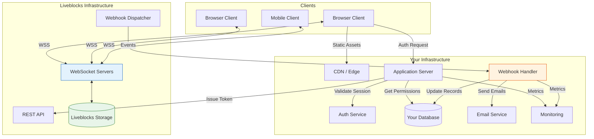
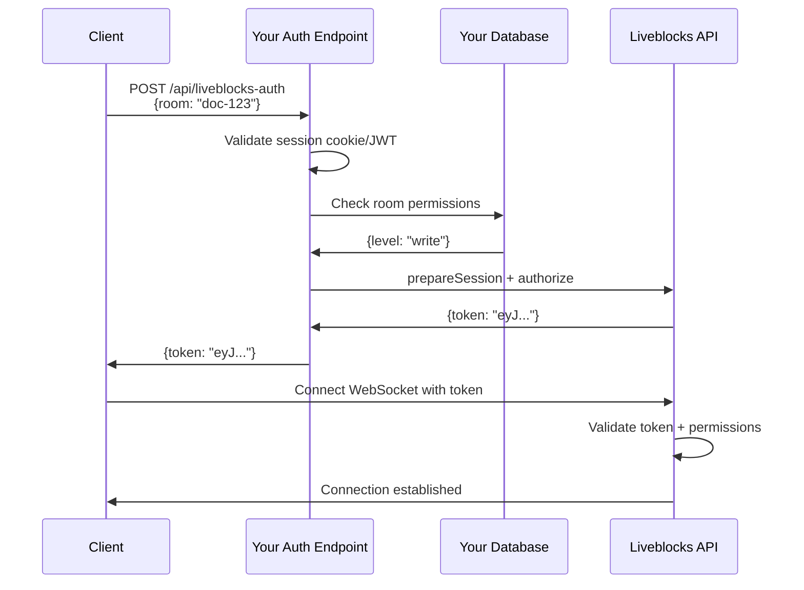
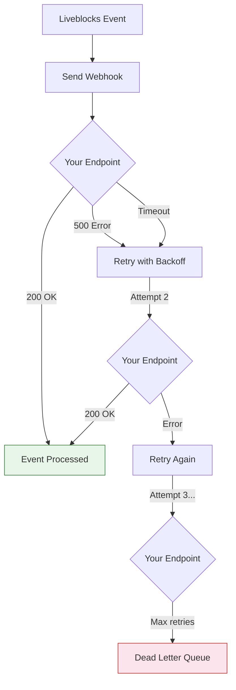
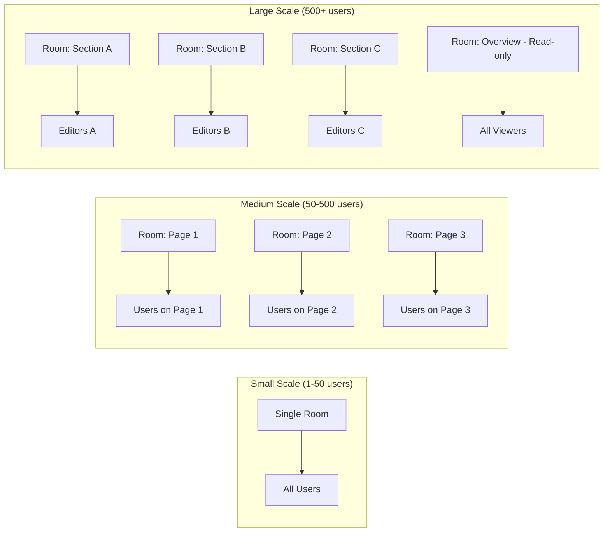

# Chapter 8: Production Deployment

Welcome to **Chapter 8: Production Deployment**. In this part of **Liveblocks - Real-Time Collaboration Deep Dive**, you will build an intuitive mental model first, then move into concrete implementation details and practical production tradeoffs.


## Introduction

Building a collaborative app in development is one thing. Running it in production with real users, at scale, with security and observability, is another challenge entirely. Liveblocks handles the hard infrastructure problems -- WebSocket scaling, CRDT resolution, data persistence -- but you still need to configure authentication properly, handle webhooks reliably, monitor your integration, and follow security best practices.

This chapter covers everything you need to go from a working prototype to a production-grade collaborative application.

## Production Architecture



## Authentication Hardening

### Token-Based Authentication (Required for Production)

Never use public API keys in production. Always use token-based authentication:

```typescript
// app/api/liveblocks-auth/route.ts
import { Liveblocks } from "@liveblocks/node";
import { NextRequest, NextResponse } from "next/server";
import { getServerSession } from "next-auth";
import { authOptions } from "../auth/[...nextauth]/route";

const liveblocks = new Liveblocks({
  secret: process.env.LIVEBLOCKS_SECRET_KEY!,
});

export async function POST(request: NextRequest) {
  // 1. Verify the user's session
  const session = await getServerSession(authOptions);
  if (!session?.user) {
    return NextResponse.json(
      { error: "Unauthorized" },
      { status: 401 }
    );
  }

  // 2. Parse the requested room from the body
  const { room } = await request.json();

  // 3. Check permissions in your database
  const permissions = await db.roomPermissions.findFirst({
    where: {
      userId: session.user.id,
      roomId: room,
    },
  });

  if (!permissions) {
    return NextResponse.json(
      { error: "Forbidden" },
      { status: 403 }
    );
  }

  // 4. Create a scoped session
  const liveblocksSession = liveblocks.prepareSession(
    session.user.id,
    {
      userInfo: {
        name: session.user.name!,
        avatar: session.user.image!,
        color: session.user.color ?? "#3b82f6",
      },
    }
  );

  // 5. Grant access based on permissions
  if (permissions.level === "admin" || permissions.level === "write") {
    liveblocksSession.allow(room, liveblocksSession.FULL_ACCESS);
  } else {
    liveblocksSession.allow(room, liveblocksSession.READ_ACCESS);
  }

  // 6. Authorize and return
  const { status, body } = await liveblocksSession.authorize();
  return new Response(body, { status });
}
```

### Authentication Flow



### Security Checklist

| Item | Status | Description |
|------|--------|-------------|
| Token-based auth | Required | Never expose secret keys to clients |
| Session validation | Required | Verify user identity before issuing tokens |
| Room-level permissions | Required | Check user has access to requested room |
| Rate limiting | Recommended | Prevent auth endpoint abuse |
| CORS configuration | Recommended | Restrict auth to your domains |
| Token expiry | Automatic | Liveblocks tokens expire; SDK handles refresh |
| Secret key rotation | Periodic | Rotate keys in Liveblocks dashboard |
| Webhook signature verification | Required | Verify webhook payloads are from Liveblocks |

## Webhooks

Webhooks let your server react to events that happen inside Liveblocks rooms. They are essential for synchronizing state with your database, sending notifications, and triggering workflows.

### Available Webhook Events

| Event | Triggered When |
|-------|---------------|
| `storageUpdated` | Room storage is modified |
| `userEntered` | A user connects to a room |
| `userLeft` | A user disconnects from a room |
| `roomCreated` | A new room is created |
| `roomDeleted` | A room is deleted |
| `threadCreated` | A new comment thread is created |
| `threadMetadataUpdated` | Thread metadata is modified |
| `commentCreated` | A new comment is posted |
| `commentEdited` | A comment is edited |
| `commentDeleted` | A comment is deleted |
| `notification` | A notification is triggered |

### Webhook Handler Implementation

```typescript
// app/api/webhooks/liveblocks/route.ts
import { WebhookHandler } from "@liveblocks/node";
import { NextRequest, NextResponse } from "next/server";
import { headers } from "next/headers";

const webhookHandler = new WebhookHandler(
  process.env.LIVEBLOCKS_WEBHOOK_SECRET!
);

export async function POST(request: NextRequest) {
  const rawBody = await request.text();
  const headersList = Object.fromEntries(request.headers.entries());

  // 1. Verify webhook signature
  let event;
  try {
    event = webhookHandler.verifyRequest({
      headers: headersList,
      rawBody,
    });
  } catch (error) {
    console.error("Webhook verification failed:", error);
    return NextResponse.json(
      { error: "Invalid signature" },
      { status: 401 }
    );
  }

  // 2. Handle events
  try {
    switch (event.type) {
      case "storageUpdated": {
        await handleStorageUpdated(event.data);
        break;
      }

      case "userEntered": {
        await handleUserEntered(event.data);
        break;
      }

      case "userLeft": {
        await handleUserLeft(event.data);
        break;
      }

      case "threadCreated": {
        await handleThreadCreated(event.data);
        break;
      }

      case "commentCreated": {
        await handleCommentCreated(event.data);
        break;
      }

      case "notification": {
        await handleNotification(event.data);
        break;
      }

      default:
        console.log(`Unhandled webhook event: ${event.type}`);
    }
  } catch (error) {
    console.error(`Error handling ${event.type}:`, error);
    // Return 500 so Liveblocks retries
    return NextResponse.json(
      { error: "Internal error" },
      { status: 500 }
    );
  }

  return NextResponse.json({ received: true });
}

async function handleStorageUpdated(data: any) {
  const { roomId } = data;

  // Sync room state to your database
  const liveblocks = new Liveblocks({
    secret: process.env.LIVEBLOCKS_SECRET_KEY!,
  });

  const storage = await liveblocks.getStorageDocument(roomId);

  await db.documents.upsert({
    where: { roomId },
    update: {
      title: storage.data.document?.data?.title,
      lastModified: new Date(),
    },
    create: {
      roomId,
      title: storage.data.document?.data?.title ?? "Untitled",
    },
  });
}

async function handleUserEntered(data: any) {
  const { roomId, userId } = data;

  // Track active sessions
  await db.activeSessions.create({
    data: {
      roomId,
      userId,
      joinedAt: new Date(),
    },
  });

  // Log analytics
  await analytics.track("room_joined", {
    roomId,
    userId,
    timestamp: new Date(),
  });
}

async function handleUserLeft(data: any) {
  const { roomId, userId } = data;

  await db.activeSessions.deleteMany({
    where: { roomId, userId },
  });
}

async function handleThreadCreated(data: any) {
  const { roomId, threadId } = data;

  // Index thread for search
  await searchIndex.addDocument({
    id: threadId,
    roomId,
    type: "thread",
    createdAt: new Date(),
  });
}

async function handleCommentCreated(data: any) {
  const { roomId, threadId, commentId } = data;

  // Increment comment count
  await db.documents.update({
    where: { roomId },
    data: {
      commentCount: { increment: 1 },
    },
  });
}

async function handleNotification(data: any) {
  const { userId, kind, roomId } = data;

  // Send email notification
  const user = await db.users.findUnique({ where: { id: userId } });
  if (user?.emailNotifications) {
    await emailService.send({
      to: user.email,
      template: "notification",
      data: { kind, roomId },
    });
  }
}
```

### Webhook Reliability



Best practices for webhook handlers:

1. **Return 200 quickly** -- process heavy work asynchronously (use a job queue)
2. **Handle idempotency** -- the same event may be delivered multiple times
3. **Verify signatures** -- always validate the webhook signature
4. **Log everything** -- webhook debugging is hard without logs
5. **Set up alerting** -- monitor webhook failure rates

### Idempotent Webhook Processing

```typescript
async function handleStorageUpdated(data: any) {
  const { roomId } = data;
  const eventId = data.eventId; // Unique event identifier

  // Check if we already processed this event
  const existing = await db.processedEvents.findUnique({
    where: { eventId },
  });

  if (existing) {
    console.log(`Event ${eventId} already processed, skipping`);
    return;
  }

  // Process the event
  await db.$transaction([
    // Record that we processed this event
    db.processedEvents.create({
      data: { eventId, processedAt: new Date() },
    }),
    // Perform the actual update
    db.documents.upsert({
      where: { roomId },
      update: { lastModified: new Date() },
      create: { roomId, title: "Untitled" },
    }),
  ]);
}
```

## Scaling Considerations

### Liveblocks Scaling Model

Liveblocks is a managed service. You do not manage WebSocket servers or CRDT resolution. However, understanding the scaling model helps you design your application:

| Dimension | Default Limit | Can Increase |
|-----------|--------------|--------------|
| Connections per room | 500 | Yes (contact sales) |
| Rooms per project | Unlimited | N/A |
| Storage per room | 10 MB | Yes |
| Presence update rate | ~20/sec per user | Throttled automatically |
| Webhook delivery | Real-time | Retry with backoff |
| API rate limit | 1000 req/min | Yes (plan-dependent) |

### Designing for Scale



**Room Partitioning Strategies**:

```typescript
// Strategy 1: Room per document section
function getDocumentRoomIds(docId: string): string[] {
  return [
    `doc:${docId}:header`,
    `doc:${docId}:body`,
    `doc:${docId}:comments`,
  ];
}

// Strategy 2: Room per page/view
function getPageRoomId(projectId: string, pageId: string): string {
  return `project:${projectId}:page:${pageId}`;
}

// Strategy 3: Shared cursor room + per-section editing rooms
function getRoomIds(docId: string) {
  return {
    presence: `doc:${docId}:presence`, // All users, presence only
    sections: [
      `doc:${docId}:section:intro`,    // Section editors
      `doc:${docId}:section:main`,
      `doc:${docId}:section:appendix`,
    ],
    comments: `doc:${docId}:comments`,
  };
}
```

### Optimizing Storage Size

Large storage documents slow down initial load. Keep storage lean:

```typescript
// Monitor storage size
const liveblocks = new Liveblocks({
  secret: process.env.LIVEBLOCKS_SECRET_KEY!,
});

async function checkStorageSize(roomId: string) {
  const storage = await liveblocks.getStorageDocument(roomId);
  const sizeBytes = JSON.stringify(storage).length;
  const sizeMB = sizeBytes / (1024 * 1024);

  if (sizeMB > 5) {
    console.warn(`Room ${roomId} storage is ${sizeMB.toFixed(2)} MB`);
    // Consider archiving old data
  }

  return { roomId, sizeBytes, sizeMB };
}

// Archive old data to your database
async function archiveOldMessages(roomId: string, keepLast: number = 100) {
  const storage = await liveblocks.getStorageDocument(roomId);
  const messages = storage.data.messages?.data ?? [];

  if (messages.length <= keepLast) return;

  // Archive to your DB
  const toArchive = messages.slice(0, messages.length - keepLast);
  await db.archivedMessages.createMany({
    data: toArchive.map((msg: any) => ({
      roomId,
      ...msg.data,
    })),
  });

  // Note: Updating storage from server requires the REST API
  // This is a design consideration -- you may want to implement
  // client-side cleanup instead
}
```

## Monitoring and Observability

### Application-Level Monitoring

```typescript
// lib/liveblocks-monitoring.ts
import { useStatus } from "../liveblocks.config";
import { useEffect, useRef } from "react";

function useConnectionMonitoring(roomId: string) {
  const status = useStatus();
  const lastStatusRef = useRef(status);
  const disconnectTimeRef = useRef<number | null>(null);

  useEffect(() => {
    const prevStatus = lastStatusRef.current;
    lastStatusRef.current = status;

    // Track status transitions
    if (prevStatus !== status) {
      analytics.track("liveblocks_status_change", {
        roomId,
        from: prevStatus,
        to: status,
        timestamp: Date.now(),
      });
    }

    // Track disconnection duration
    if (status === "reconnecting" && !disconnectTimeRef.current) {
      disconnectTimeRef.current = Date.now();
    }

    if (status === "connected" && disconnectTimeRef.current) {
      const duration = Date.now() - disconnectTimeRef.current;
      analytics.track("liveblocks_reconnection", {
        roomId,
        durationMs: duration,
        timestamp: Date.now(),
      });
      disconnectTimeRef.current = null;
    }

    if (status === "disconnected") {
      analytics.track("liveblocks_disconnected", {
        roomId,
        timestamp: Date.now(),
      });
    }
  }, [status, roomId]);

  return status;
}
```

### Dashboard Metrics

Track key metrics to understand your collaboration usage:

```typescript
// Webhook-based analytics
async function trackRoomAnalytics(event: any) {
  switch (event.type) {
    case "userEntered":
      await metrics.increment("liveblocks.users.entered", {
        roomId: event.data.roomId,
      });
      break;

    case "userLeft":
      await metrics.increment("liveblocks.users.left", {
        roomId: event.data.roomId,
      });
      break;

    case "storageUpdated":
      await metrics.increment("liveblocks.storage.updates", {
        roomId: event.data.roomId,
      });
      break;

    case "commentCreated":
      await metrics.increment("liveblocks.comments.created", {
        roomId: event.data.roomId,
      });
      break;
  }
}
```

| Metric | What to Monitor | Alert Threshold |
|--------|----------------|-----------------|
| Reconnection rate | % of sessions with reconnections | > 5% |
| Reconnection duration | Average time to reconnect | > 10 seconds |
| Storage size | Per-room storage in MB | > 5 MB |
| Active rooms | Concurrent room count | Plan-dependent |
| Webhook failures | Failed webhook deliveries | > 1% |
| Auth endpoint latency | Time to issue tokens | > 500ms |

## Security Best Practices

### Environment Variable Management

```bash
# .env.local (NEVER commit this file)
LIVEBLOCKS_SECRET_KEY=sk_live_xxxxxxxxxxxx
LIVEBLOCKS_WEBHOOK_SECRET=whsec_xxxxxxxxxxxx
NEXT_PUBLIC_LIVEBLOCKS_PUBLIC_KEY=pk_live_xxxxxxxxxxxx

# .env.example (commit this as documentation)
LIVEBLOCKS_SECRET_KEY=sk_live_your_secret_key
LIVEBLOCKS_WEBHOOK_SECRET=whsec_your_webhook_secret
NEXT_PUBLIC_LIVEBLOCKS_PUBLIC_KEY=pk_live_your_public_key
```

### Input Validation

Always validate data flowing through Liveblocks:

```typescript
import { z } from "zod";

// Validate comment content before processing
const commentBodySchema = z.object({
  version: z.literal(1),
  content: z.array(
    z.object({
      type: z.enum(["paragraph", "heading"]),
      children: z.array(z.any()),
    })
  ),
});

// Validate presence data
const presenceSchema = z.object({
  cursor: z
    .object({
      x: z.number().min(-10000).max(10000),
      y: z.number().min(-10000).max(10000),
    })
    .nullable(),
  name: z.string().max(100),
  selectedId: z.string().max(50).nullable(),
});

// Validate storage mutations
const shapeSchema = z.object({
  x: z.number().min(-10000).max(10000),
  y: z.number().min(-10000).max(10000),
  width: z.number().min(1).max(10000),
  height: z.number().min(1).max(10000),
  fill: z.string().regex(/^#[0-9a-fA-F]{6}$/),
  type: z.enum(["rectangle", "ellipse", "text"]),
});
```

### Content Security Policy

```typescript
// next.config.js
const securityHeaders = [
  {
    key: "Content-Security-Policy",
    value: [
      "default-src 'self'",
      // Allow WebSocket connections to Liveblocks
      "connect-src 'self' wss://*.liveblocks.io https://*.liveblocks.io",
      // Allow Liveblocks styles
      "style-src 'self' 'unsafe-inline'",
      "img-src 'self' data: https:",
    ].join("; "),
  },
];

module.exports = {
  async headers() {
    return [
      {
        source: "/(.*)",
        headers: securityHeaders,
      },
    ];
  },
};
```

## Deployment Checklist

### Pre-Launch

| Step | Description | Done |
|------|-------------|------|
| Switch to production keys | Replace `_dev_` keys with `_live_` keys | |
| Implement token auth | Remove public key auth, use auth endpoint | |
| Configure room permissions | Set up proper access control per room | |
| Set up webhooks | Configure webhook URL in dashboard | |
| Verify webhook signatures | Validate all incoming webhook payloads | |
| Test offline behavior | Verify app handles disconnections gracefully | |
| Load test | Simulate expected concurrent users | |
| Set up monitoring | Connection metrics, error tracking | |
| Configure error boundaries | Graceful error UI for collaboration failures | |
| Review storage schema | Ensure efficient data structure | |

### Post-Launch

| Step | Description | Frequency |
|------|-------------|-----------|
| Monitor connection quality | Check reconnection rates and duration | Daily |
| Review storage sizes | Watch for rooms growing too large | Weekly |
| Audit permissions | Verify access control is working correctly | Monthly |
| Rotate secret keys | Generate new secret keys | Quarterly |
| Review webhook failures | Investigate failed webhook deliveries | Daily |
| Update SDK | Keep Liveblocks packages up to date | Monthly |

## Migration Guide

### Migrating from Development to Production

```typescript
// Step 1: Update client configuration
const client = createClient({
  // Remove public key
  // publicApiKey: "pk_dev_xxx", // DELETE THIS

  // Add auth endpoint
  authEndpoint: "/api/liveblocks-auth",

  // Optional: configure throttle for production
  throttle: 100, // ms between presence updates
});

// Step 2: Update environment variables
// .env.production
// LIVEBLOCKS_SECRET_KEY=sk_live_production_key
// NEXT_PUBLIC_LIVEBLOCKS_PUBLIC_KEY=pk_live_production_key

// Step 3: Set up room access control
// In your auth endpoint, validate permissions for every room
```

### Migrating Room Data

```typescript
import { Liveblocks } from "@liveblocks/node";

async function migrateRoomData(
  sourceSecret: string,
  targetSecret: string,
  roomId: string
) {
  const source = new Liveblocks({ secret: sourceSecret });
  const target = new Liveblocks({ secret: targetSecret });

  // 1. Get storage from source
  const storage = await source.getStorageDocument(roomId);

  // 2. Create room in target
  await target.createRoom(roomId, {
    defaultAccesses: [],
  });

  // 3. Initialize storage in target
  await target.initializeStorageDocument(roomId, storage);

  // 4. Migrate threads
  const { data: threads } = await source.getThreads({ roomId });
  for (const thread of threads) {
    // Re-create threads in target
    // Note: Thread IDs will differ
    await target.createThread({
      roomId,
      data: {
        body: thread.comments[0].body,
        metadata: thread.metadata,
      },
    });
  }

  console.log(`Migrated room ${roomId} successfully`);
}
```

## Summary

In this chapter you learned:

- **Authentication**: implementing token-based auth with room-level permissions
- **Webhooks**: handling events for state sync, notifications, and analytics
- **Scaling**: room partitioning strategies and storage optimization
- **Monitoring**: tracking connection quality, storage size, and usage metrics
- **Security**: CSP headers, input validation, key rotation, and webhook signature verification
- **Deployment**: checklists for pre-launch and post-launch operations
- **Migration**: moving from development to production environments

## Key Takeaways

1. **Token auth is non-negotiable** for production. Public keys should only be used during development.
2. **Webhooks are your integration backbone** -- use them for database sync, email notifications, and analytics.
3. **Make webhooks idempotent** -- the same event may be delivered more than once.
4. **Partition rooms strategically** -- do not put hundreds of users in a single room; split by page, section, or feature.
5. **Monitor connection quality** -- reconnection rates and duration are your key health indicators.
6. **Keep storage lean** -- archive old data and compute derived values client-side instead of storing them.
7. **Rotate secrets regularly** and never commit them to version control.

## What You Have Built

Over these eight chapters, you have learned how to build a complete collaborative application:

1. **Getting Started** -- Project setup and room fundamentals
2. **Presence & Awareness** -- Live cursors, avatars, and user awareness
3. **Storage & Conflict Resolution** -- Shared data with CRDT-based conflict handling
4. **Comments & Threads** -- Contextual discussions with mentions
5. **Notifications** -- In-app inbox and email notifications
6. **React Integration** -- Hooks, Suspense, and performance optimization
7. **Advanced Patterns** -- Undo/redo, offline support, Yjs for text
8. **Production Deployment** -- Auth, webhooks, scaling, and security

You now have the knowledge to build collaborative applications that rival the best in the industry. The key is to start simple -- presence and basic storage -- and layer on features as your product matures.

---
*Built with insights from the [Liveblocks](https://liveblocks.io) platform.*

## What Problem Does This Solve?

Most teams struggle here because the hard part is not writing more code, but deciding clear boundaries for `roomId`, `liveblocks`, `event` so behavior stays predictable as complexity grows.

In practical terms, this chapter helps you avoid three common failures:

- coupling core logic too tightly to one implementation path
- missing the handoff boundaries between setup, execution, and validation
- shipping changes without clear rollback or observability strategy

After working through this chapter, you should be able to reason about `Chapter 8: Production Deployment` as an operating subsystem inside **Liveblocks - Real-Time Collaboration Deep Dive**, with explicit contracts for inputs, state transitions, and outputs.

Use the implementation notes around `status`, `storage`, `Liveblocks` as your checklist when adapting these patterns to your own repository.

## How it Works Under the Hood

Under the hood, `Chapter 8: Production Deployment` usually follows a repeatable control path:

1. **Context bootstrap**: initialize runtime config and prerequisites for `roomId`.
2. **Input normalization**: shape incoming data so `liveblocks` receives stable contracts.
3. **Core execution**: run the main logic branch and propagate intermediate state through `event`.
4. **Policy and safety checks**: enforce limits, auth scopes, and failure boundaries.
5. **Output composition**: return canonical result payloads for downstream consumers.
6. **Operational telemetry**: emit logs/metrics needed for debugging and performance tuning.

When debugging, walk this sequence in order and confirm each stage has explicit success/failure conditions.

## Source Walkthrough

Use the following upstream sources to verify implementation details while reading this chapter:

- [Liveblocks GitHub Repository](https://github.com/liveblocks/liveblocks)
  Why it matters: authoritative reference on `Liveblocks GitHub Repository` (github.com).
- [Liveblocks Product Site](https://liveblocks.io)
  Why it matters: authoritative reference on `Liveblocks Product Site` (liveblocks.io).
- [Liveblocks Documentation](https://liveblocks.io/docs)
  Why it matters: authoritative reference on `Liveblocks Documentation` (liveblocks.io).

Suggested trace strategy:
- search upstream code for `roomId` and `liveblocks` to map concrete implementation paths
- compare docs claims against actual runtime/config code before reusing patterns in production

## Chapter Connections

- [Tutorial Index](index.md)
- [Previous Chapter: Chapter 7: Advanced Patterns](07-advanced-patterns.md)
- [Main Catalog](../../README.md#-tutorial-catalog)
- [A-Z Tutorial Directory](../../discoverability/tutorial-directory.md)
