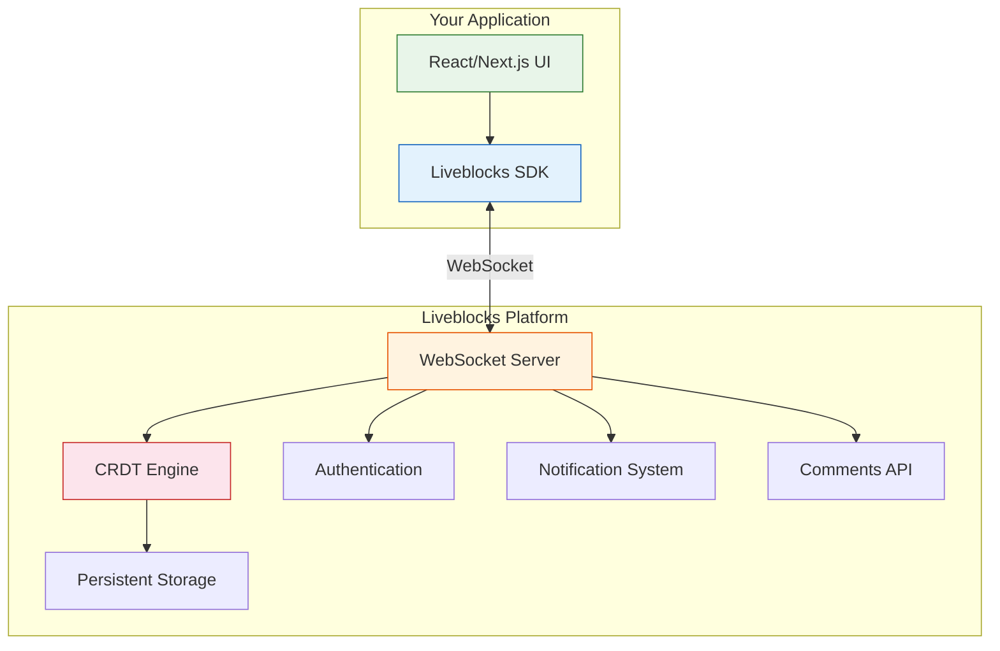
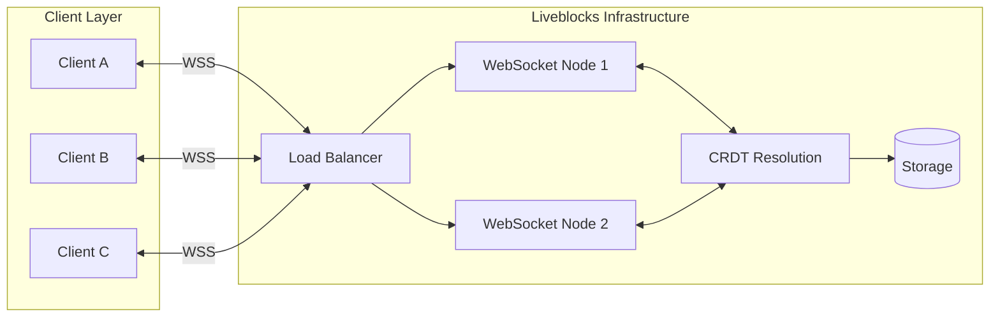

# Liveblocks - Real-Time Collaboration Deep Dive

[](https://github.com/liveblocks/liveblocks)
[](https://opensource.org/licenses/Apache-2.0)
[](https://github.com/liveblocks/liveblocks)


A comprehensive guide to building collaborative applications with Liveblocks, the real-time collaboration infrastructure used by companies building the next generation of multiplayer experiences.

## What is Liveblocks?

Liveblocks is a platform for adding real-time collaboration features to any application. It provides the infrastructure and APIs needed to build experiences like those found in Figma, Notion, Google Docs, and other collaborative tools. Rather than building complex real-time systems from scratch, Liveblocks gives you production-ready primitives for presence, storage, comments, and notifications.



## Core Capabilities

| Feature | Description | Use Case |
|---------|-------------|----------|
| **Presence** | Real-time user awareness and cursor tracking | "Who's online" indicators, live cursors |
| **Storage** | Conflict-free replicated data (CRDTs) | Collaborative editing, shared state |
| **Comments** | Thread-based commenting system | Document annotations, feedback |
| **Notifications** | In-app and email notification infrastructure | Activity feeds, mentions |
| **Text Editor** | Collaborative text editing (Yjs/Tiptap) | Rich text documents, notes |
| **AI** | AI-powered collaboration features | Copilots within collaborative contexts |

## Tutorial Structure

This tutorial is organized into eight chapters that progressively build your understanding of Liveblocks:

### Foundation
1. **[Getting Started](./01-getting-started.html)** - Installation, room setup, and connecting your first collaborative app
2. **[Presence & Awareness](./02-presence-awareness.html)** - User cursors, avatars, "who's online", and broadcasting events

### Core Features
3. **[Storage & Conflict Resolution](./03-storage-conflict-resolution.html)** - LiveObject, LiveList, LiveMap, and CRDT-based conflict resolution
4. **[Comments & Threads](./04-comments-threads.html)** - Thread-based commenting, inline annotations, and mentions
5. **[Notifications](./05-notifications.html)** - Inbox notifications, email notifications, and custom triggers

### Integration & Production
6. **[React Integration](./06-react-integration.html)** - useSelf, useOthers, useStorage hooks, and Suspense patterns
7. **[Advanced Patterns](./07-advanced-patterns.html)** - Undo/redo, offline support, permissions, and Yjs integration
8. **[Production Deployment](./08-production-deployment.html)** - Scaling, webhooks, authentication, monitoring, and security

## Who Is This For?

This tutorial is designed for:

- **Frontend engineers** looking to add real-time collaboration to existing apps
- **Full-stack developers** building multiplayer experiences from scratch
- **Technical leads** evaluating collaboration infrastructure options
- **Product teams** exploring what collaborative features are possible

## Prerequisites

Before starting, you should be comfortable with:

- **TypeScript** and modern JavaScript (ES2020+)
- **React** (hooks, context, components)
- **Next.js** basics (recommended but not required)
- **REST APIs** and WebSocket concepts

## Architecture Overview



Liveblocks handles all the complexity of real-time synchronization, conflict resolution, and state persistence. You focus on building your product while Liveblocks ensures every user sees a consistent, up-to-date view of shared data.

## Quick Example

Here is a taste of what building with Liveblocks looks like:

```typescript
// liveblocks.config.ts
import { createClient } from "@liveblocks/client";
import { createRoomContext } from "@liveblocks/react";

const client = createClient({
  publicApiKey: "pk_live_xxx",
});

type Presence = {
  cursor: { x: number; y: number } | null;
  name: string;
};

type Storage = {
  todos: LiveList<{ text: string; completed: boolean }>;
};

export const {
  RoomProvider,
  useMyPresence,
  useOthers,
  useStorage,
  useMutation,
} = createRoomContext<Presence, Storage>(client);
```

```tsx
// CollaborativeApp.tsx
function App() {
  return (
    <RoomProvider
      id="my-room"
      initialPresence={{ cursor: null, name: "Anonymous" }}
      initialStorage={{ todos: new LiveList([]) }}
    >
      <CollaborativeCanvas />
    </RoomProvider>
  );
}
```

Ready to get started? Head to **[Chapter 1: Getting Started](./01-getting-started.html)** to set up your first Liveblocks project.

---
*Built with insights from the [Liveblocks](https://liveblocks.io) platform.*
