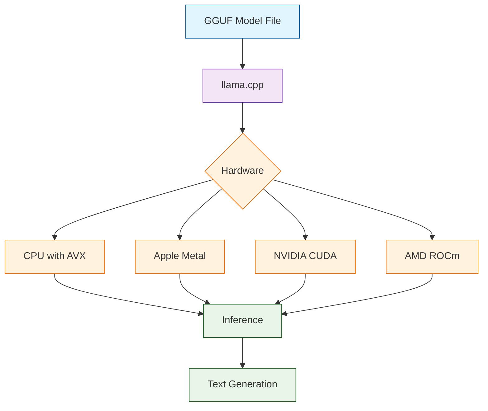

# llama.cpp Tutorial: Local LLM Inference

> Run large language models efficiently on your local machine with pure C/C++.

<div align="center">

**🦙 Fast, Portable LLM Inference**

[](https://github.com/ggerganov/llama.cpp)

</div>

---

## 🎯 What is llama.cpp?

**llama.cpp**<sup>[View Repo](https://github.com/ggerganov/llama.cpp)</sup> is a pure C/C++ implementation for running LLMs locally. It supports a wide range of models and hardware, from MacBooks to servers, with impressive performance through quantization and optimization.

### Key Features

| Feature | Description |
|:--------|:------------|
| **Pure C/C++** | No Python dependencies, fast startup |
| **Quantization** | 2-8 bit quantization for memory efficiency |
| **Apple Silicon** | Native Metal support for M1/M2/M3 |
| **CUDA Support** | GPU acceleration on NVIDIA cards |
| **CPU Optimized** | AVX, AVX2, AVX-512 acceleration |
| **Model Support** | LLaMA, Mistral, Phi, Qwen, and more |



## Tutorial Chapters

1. **[Chapter 1: Getting Started](01-getting-started.md)** - Building llama.cpp and running your first model
2. **[Chapter 2: Model Formats](02-model-formats.md)** - Understanding GGUF and quantization
3. **[Chapter 3: CLI Usage](03-cli-usage.md)** - Command-line interface and options
4. **[Chapter 4: Server Mode](04-server.md)** - Running an OpenAI-compatible API server
5. **[Chapter 5: GPU Acceleration](05-gpu.md)** - Metal, CUDA, and ROCm setup
6. **[Chapter 6: Quantization](06-quantization.md)** - Converting and quantizing models
7. **[Chapter 7: Advanced Features](07-advanced.md)** - Grammar, embedding, and multimodal
8. **[Chapter 8: Integration](08-integration.md)** - Python bindings and production use

## What You'll Learn

- **Build llama.cpp** for your platform
- **Run Models Locally** without cloud dependencies
- **Quantize Models** for memory efficiency
- **Use GPU Acceleration** for faster inference
- **Serve APIs** with OpenAI compatibility
- **Integrate with Apps** via bindings and APIs
- **Optimize Performance** for your hardware

## Prerequisites

- C/C++ compiler (gcc, clang, or MSVC)
- CMake 3.14+
- Git
- (Optional) CUDA toolkit for NVIDIA GPUs
- (Optional) Xcode for Apple Metal

## Quick Start

### Build from Source

```bash
# Clone the repository
git clone https://github.com/ggerganov/llama.cpp
cd llama.cpp

# Build with CMake
cmake -B build
cmake --build build --config Release

# Or use make on Linux/macOS
make -j$(nproc)
```

### Download a Model

```bash
# Download a GGUF model (example: Llama 3.1 8B)
# From Hugging Face
wget https://huggingface.co/bartowski/Meta-Llama-3.1-8B-Instruct-GGUF/resolve/main/Meta-Llama-3.1-8B-Instruct-Q4_K_M.gguf
```

### Run Inference

```bash
# Basic text generation
./build/bin/llama-cli \
    -m Meta-Llama-3.1-8B-Instruct-Q4_K_M.gguf \
    -p "Explain quantum computing in simple terms:" \
    -n 256

# Interactive chat mode
./build/bin/llama-cli \
    -m Meta-Llama-3.1-8B-Instruct-Q4_K_M.gguf \
    --interactive \
    --color
```

## Server Mode

```bash
# Start OpenAI-compatible server
./build/bin/llama-server \
    -m Meta-Llama-3.1-8B-Instruct-Q4_K_M.gguf \
    --host 0.0.0.0 \
    --port 8080

# Use with curl
curl http://localhost:8080/v1/chat/completions \
    -H "Content-Type: application/json" \
    -d '{
        "model": "llama3",
        "messages": [{"role": "user", "content": "Hello!"}]
    }'
```

## GPU Acceleration

### Apple Metal (M1/M2/M3)
```bash
# Metal is enabled by default on macOS
cmake -B build -DLLAMA_METAL=ON
cmake --build build --config Release
```

### NVIDIA CUDA
```bash
cmake -B build -DLLAMA_CUDA=ON
cmake --build build --config Release

# Run with GPU layers
./build/bin/llama-cli -m model.gguf -ngl 35
```

## Quantization Levels

| Quantization | Bits | Size (7B) | Quality | Speed |
|:-------------|:----:|:---------:|:-------:|:-----:|
| F16 | 16 | 14GB | Best | Slow |
| Q8_0 | 8 | 7GB | Excellent | Good |
| Q5_K_M | 5 | 4.5GB | Great | Fast |
| Q4_K_M | 4 | 4GB | Good | Faster |
| Q3_K_M | 3 | 3GB | Decent | Fastest |
| Q2_K | 2 | 2.5GB | Usable | Fastest |

## Supported Models

| Model Family | Architectures |
|:-------------|:--------------|
| **Meta** | LLaMA 2, LLaMA 3, LLaMA 3.1 |
| **Mistral** | Mistral 7B, Mixtral 8x7B |
| **Microsoft** | Phi-2, Phi-3 |
| **Alibaba** | Qwen, Qwen2 |
| **Google** | Gemma, Gemma 2 |
| **Stability** | StableLM |

## Python Bindings

```python
from llama_cpp import Llama

# Load model
llm = Llama(
    model_path="Meta-Llama-3.1-8B-Instruct-Q4_K_M.gguf",
    n_ctx=4096,
    n_gpu_layers=35  # Offload to GPU
)

# Generate text
output = llm(
    "Explain machine learning:",
    max_tokens=256,
    temperature=0.7,
    stop=["\\n\\n"]
)

print(output["choices"][0]["text"])
```

## Learning Path

### 🟢 Beginner Track
1. Chapters 1-3: Build, model basics, and CLI
2. Run models on your local machine

### 🟡 Intermediate Track
1. Chapters 4-6: Server, GPU, and quantization
2. Optimize for your hardware

### 🔴 Advanced Track
1. Chapters 7-8: Advanced features and integration
2. Build production applications

---

**Ready to run LLMs locally? Let's begin with [Chapter 1: Getting Started](01-getting-started.md)!**

*Generated for [Awesome Code Docs](https://github.com/johnxie/awesome-code-docs)*

## Navigation & Backlinks

- [Start Here: Chapter 1: Getting Started with llama.cpp](01-getting-started.md)
- [Back to Main Catalog](../../README.md#-tutorial-catalog)
- [Browse A-Z Tutorial Directory](../../discoverability/tutorial-directory.md)
- [Search by Intent](../../discoverability/query-hub.md)
- [Explore Category Hubs](../../README.md#category-hubs)

## Full Chapter Map

1. [Chapter 1: Getting Started with llama.cpp](01-getting-started.md)
2. [Chapter 2: Model Formats and GGUF](02-model-formats.md)
3. [Chapter 3: Command Line Interface](03-cli-usage.md)
4. [Chapter 4: Server Mode](04-server.md)
5. [Chapter 5: GPU Acceleration](05-gpu.md)
6. [Chapter 6: Quantization](06-quantization.md)
7. [Chapter 7: Advanced Features](07-advanced.md)
8. [Chapter 8: Integration](08-integration.md)

## Source References

- [View Repo](https://github.com/ggerganov/llama.cpp)
- [Awesome Code Docs](https://github.com/johnxie/awesome-code-docs)

*Generated by [AI Codebase Knowledge Builder](https://github.com/The-Pocket/Tutorial-Codebase-Knowledge)*
