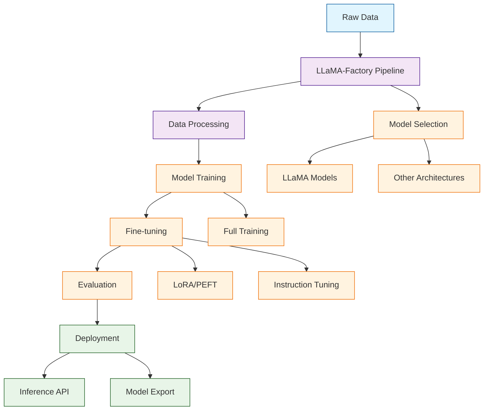

# LLaMA-Factory Tutorial: Unified Framework for LLM Training and Fine-tuning

> A deep technical walkthrough of LLaMA-Factory covering Unified Framework for LLM Training and Fine-tuning.

LLaMA-Factory[View Repo](https://github.com/hiyouga/LLaMA-Factory) is a unified framework designed to streamline the entire lifecycle of large language model (LLM) development. It provides an easy-to-use interface for training, fine-tuning, evaluation, and deployment of LLMs, supporting multiple model architectures and training methodologies.

LLaMA-Factory democratizes access to advanced LLM capabilities by providing a unified, user-friendly interface that works across different model architectures and training scenarios.

## Mental Model

## Why This Track Matters

LLaMA-Factory is increasingly relevant for developers working with modern AI/ML infrastructure. A deep technical walkthrough of LLaMA-Factory covering Unified Framework for LLM Training and Fine-tuning, and this track helps you understand the architecture, key patterns, and production considerations.

This track focuses on:

- understanding getting started with llama-factory
- understanding data preparation
- understanding model configuration
- understanding training pipeline

## Chapter Guide

Welcome to your journey through unified LLM training! This tutorial explores how to master LLaMA-Factory for building and fine-tuning large language models.

1. **[Chapter 1: Getting Started with LLaMA-Factory](01-getting-started.md)** - Installation, setup, and basic model training
2. **[Chapter 2: Data Preparation & Processing](02-data-preparation.md)** - Dataset formatting and preprocessing
3. **[Chapter 3: Model Configuration](03-model-configuration.md)** - Configuring LoRA, full fine-tuning, and training parameters
4. **[Chapter 4: Training Pipeline](04-training-pipeline.md)** - End-to-end training workflows and execution
5. **[Chapter 5: Model Evaluation & Testing](05-model-evaluation.md)** - Performance assessment and benchmarking
6. **[Chapter 6: Deployment](06-deployment.md)** - Model deployment and serving patterns
7. **[Chapter 7: Advanced Techniques](07-advanced-techniques.md)** - Multi-GPU training and optimization
8. **[Chapter 8: Production Case Studies](08-production-case-studies.md)** - Scaling and automation patterns

## Current Snapshot (auto-updated)

- repository: [`hiyouga/LLaMA-Factory`](https://github.com/hiyouga/LLaMA-Factory)
- stars: about **70.4k**
- latest release: [`v0.9.4`](https://github.com/hiyouga/LLaMA-Factory/releases/tag/v0.9.4) (published 2025-12-31)

## What You Will Learn

By the end of this tutorial, you'll be able to:

- **Set up LLaMA-Factory** for LLM training and fine-tuning
- **Prepare datasets** for various training scenarios
- **Fine-tune models** using LoRA and other efficient methods
- **Train instruction-tuned models** for conversational AI
- **Optimize training performance** with advanced techniques
- **Evaluate model performance** and iterate on improvements
- **Deploy trained models** for production use
- **Scale training workflows** for enterprise applications

## Prerequisites

- Python 3.8+
- PyTorch and CUDA (for GPU training)
- Basic understanding of machine learning concepts
- Familiarity with command-line interfaces

## What's New in LLaMA-Factory v0.9 (December 2025)

> **Major Release**: Enhanced vision-language capabilities, memory-efficient training, and 270% faster inference mark v0.9 as a breakthrough in LLM fine-tuning.

**🎨 Vision-Language Revolution:**
- 🖼️ **Qwen2-VL Fine-tuning**: Full support for multi-image and video dataset training
- 🎬 **Video Dataset Support**: Fine-tune VL models on temporal visual data
- 🏆 **Advanced VL Techniques**: RLHF, DPO, ORPO, SimPO for vision-language alignment

**🚀 Performance Breakthroughs:**
- ⚡ **270% Faster Inference**: vLLM 0.6.0 integration (`--infer_backend vllm`)
- 🧠 **Memory-Efficient Training**: GaLore enables 7B model full-parameter learning in <24GB VRAM
- 🔄 **FSDP+QLoRA**: Fine-tune 70B models on just 2x24GB GPUs
- 🎯 **Liger-Kernel**: Time and memory-efficient training (`enable_liger_kernel`)
- 📈 **Adam-Mini Optimizer**: Memory-efficient optimization (`use_adam_mini`)

**🔄 Advanced Training Features:**
- 📤 **Asynchronous Offloading**: Unsloth's activation offloading for better memory management
- 🎭 **Expanded Model Support**: OLMo (1B/7B), StarCoder2 (3B/7B/15B), Yi-9B, OLMo-7B-Instruct
- 📚 **New Datasets**: Cosmopedia (English), Orca DPO for preference learning
- 🛠️ **Unsloth Integration**: Advanced memory management techniques

## Learning Path

### 🟢 Beginner Track
Perfect for developers new to LLM training:
1. Chapters 1-2: Setup and basic data preparation
2. Focus on understanding the LLaMA-Factory workflow

### 🟡 Intermediate Track
For developers fine-tuning models:
1. Chapters 3-5: Fine-tuning, instruction tuning, and optimization
2. Learn advanced training techniques

### 🔴 Advanced Track
For production LLM development:
1. Chapters 6-8: Evaluation, deployment, and scaling
2. Master enterprise-grade LLM workflows

---

**Ready to master LLM training with LLaMA-Factory? Let's begin with [Chapter 1: Getting Started](01-getting-started.md)!**

## Related Tutorials

- [Botpress Tutorial](../botpress-tutorial/)
- [Claude Task Master Tutorial](../claude-task-master-tutorial/)
- [Deer Flow Tutorial](../deer-flow-tutorial/)
- [DSPy Tutorial](../dspy-tutorial/)
- [Fabric Tutorial](../fabric-tutorial/)
## Navigation & Backlinks

- [Start Here: Chapter 1: Getting Started with LLaMA-Factory](01-getting-started.md)
- [Back to Main Catalog](../../README.md#-tutorial-catalog)
- [Browse A-Z Tutorial Directory](../../discoverability/tutorial-directory.md)
- [Search by Intent](../../discoverability/query-hub.md)
- [Explore Category Hubs](../../README.md#category-hubs)

*Generated by [AI Codebase Knowledge Builder](https://github.com/The-Pocket/Tutorial-Codebase-Knowledge)*

## Full Chapter Map

1. [Chapter 1: Getting Started with LLaMA-Factory](01-getting-started.md)
2. [Chapter 2: Data Preparation](02-data-preparation.md)
3. [Chapter 3: Model Configuration](03-model-configuration.md)
4. [Chapter 4: Training Pipeline](04-training-pipeline.md)
5. [Chapter 5: Model Evaluation](05-model-evaluation.md)
6. [Chapter 6: Deployment](06-deployment.md)
7. [Chapter 7: Advanced Techniques](07-advanced-techniques.md)
8. [Chapter 8: Production Case Studies](08-production-case-studies.md)

## Source References

- [View Repo](https://github.com/hiyouga/LLaMA-Factory)

