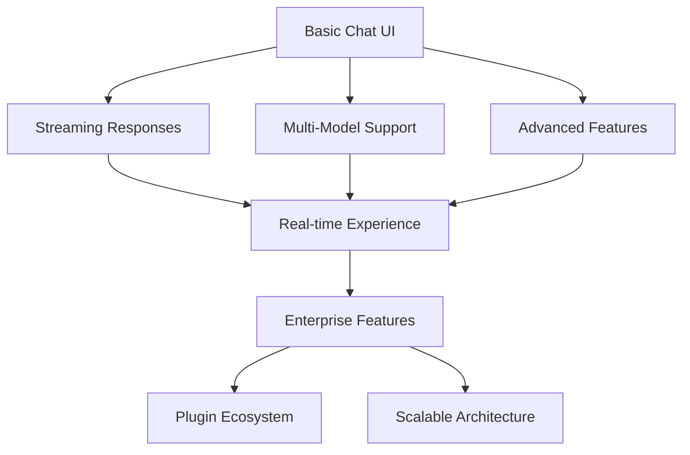
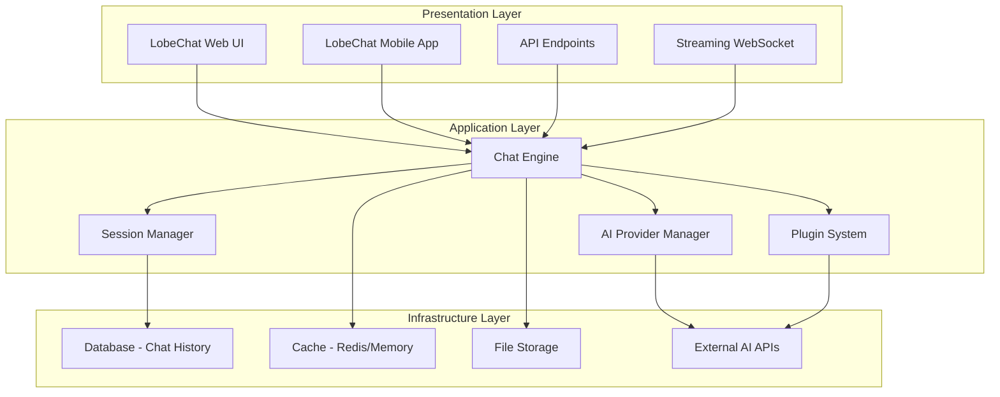
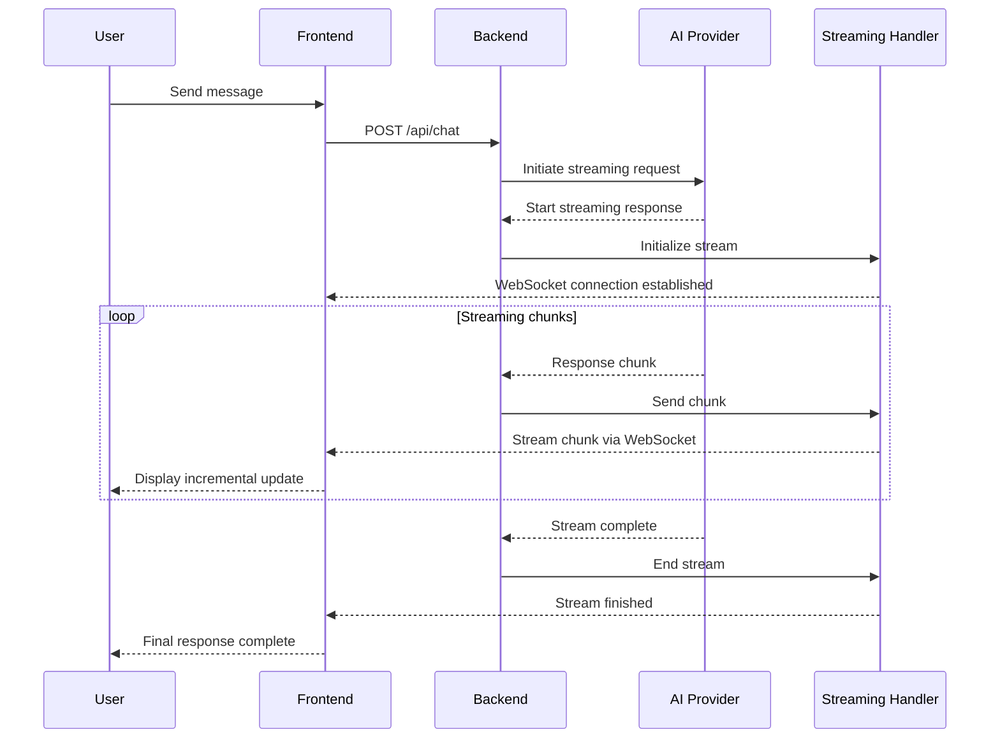

# Chapter 1: LobeChat System Overview

Welcome to **Chapter 1: LobeChat System Overview**. In this part of **LobeChat AI Platform: Deep Dive Tutorial**, you will build an intuitive mental model first, then move into concrete implementation details and practical production tradeoffs.


> Understanding LobeChat's modern AI chat platform architecture

## 🎯 Learning Objectives

By the end of this chapter, you'll understand:
- LobeChat's role in the AI chat ecosystem
- Core architectural components and design principles
- The streaming chat paradigm and real-time communication
- Key features that differentiate LobeChat from other chat platforms

## 💬 The AI Chat Platform Landscape

### **Evolution of AI Chat Interfaces**

The AI chat platform landscape has evolved significantly:



**Key Challenges in Modern AI Chat Platforms:**
- **Real-time Streaming**: Handling incremental AI responses smoothly
- **Multi-Model Orchestration**: Supporting various AI providers seamlessly
- **State Management**: Maintaining conversation context and history
- **Performance**: Handling high-throughput conversations efficiently
- **Extensibility**: Allowing custom plugins and integrations
- **User Experience**: Creating engaging, responsive interfaces

### **LobeChat's Unique Position**

LobeChat distinguishes itself through:

- **🎨 Modern UI/UX**: Beautiful, responsive interface inspired by modern chat applications
- **⚡ Real-time Streaming**: Smooth, incremental response display
- **🔄 Multi-Provider Support**: Unified interface for different AI models
- **🛠️ Developer-Friendly**: Open source with extensive customization options
- **📱 Cross-Platform**: Works on web, mobile, and desktop
- **🔌 Plugin Architecture**: Extensible system for custom functionality

## 🏗️ LobeChat Architecture Overview

### **Three-Layer Architecture**



### **Core Components**

1. **Chat Engine**: Core conversation processing and orchestration
2. **AI Provider Manager**: Handles multiple AI service integrations
3. **Plugin System**: Extensible architecture for custom features
4. **Session Manager**: Manages conversation state and persistence
5. **Streaming Handler**: Real-time response processing and display

## 📡 Real-Time Communication Architecture

### **Streaming Response Flow**

LobeChat's streaming architecture enables smooth, real-time conversations:



### **State Management**

LobeChat maintains complex state across conversations:

```typescript
// Conversation state structure
interface ConversationState {
  id: string;
  messages: Message[];
  metadata: ConversationMetadata;
  plugins: ActivePlugin[];
  aiSettings: AISettings;
  uiState: UIState;
}

interface Message {
  id: string;
  role: 'user' | 'assistant' | 'system';
  content: string;
  timestamp: Date;
  metadata: MessageMetadata;
  streaming?: boolean;
  chunks?: string[];
}

interface ConversationMetadata {
  title: string;
  createdAt: Date;
  updatedAt: Date;
  model: string;
  provider: string;
  totalTokens: number;
  pluginsUsed: string[];
  tags: string[];
}

interface MessageMetadata {
  tokens: number;
  processingTime: number;
  model: string;
  finishReason: string;
  pluginCalls?: PluginCall[];
}
```

## 🤖 AI Provider Integration

### **Unified Provider Interface**

LobeChat abstracts different AI providers behind a consistent interface:

```typescript
// AI Provider abstraction
interface AIProvider {
  id: string;
  name: string;
  models: AIModel[];

  // Core methods
  chat(request: ChatRequest): Promise<ChatResponse>;
  chatStream(request: ChatRequest): AsyncIterable<ChatChunk>;

  // Model management
  listModels(): Promise<AIModel[]>;
  validateApiKey(apiKey: string): Promise<boolean>;

  // Capabilities
  supportsStreaming(): boolean;
  supportsFunctionCalling(): boolean;
  supportsVision(): boolean;
  getMaxTokens(): number;
}

// Chat request/response types
interface ChatRequest {
  messages: Message[];
  model: string;
  temperature?: number;
  maxTokens?: number;
  stream?: boolean;
  functions?: FunctionDefinition[];
  metadata?: Record<string, any>;
}

interface ChatResponse {
  message: Message;
  usage: TokenUsage;
  finishReason: string;
  metadata: Record<string, any>;
}

interface ChatChunk {
  content: string;
  done: boolean;
  metadata?: Record<string, any>;
}
```

### **Supported Providers**

LobeChat supports a wide range of AI providers:

| Provider | Models | Streaming | Function Calling | Vision |
|:---------|:-------|:----------|:-----------------|:-------|
| **OpenAI** | GPT-4, GPT-3.5, DALL-E | ✅ | ✅ | ✅ |
| **Anthropic** | Claude 3, Claude 2 | ✅ | ✅ | ✅ |
| **Google** | Gemini, PaLM | ✅ | ✅ | ✅ |
| **Azure** | GPT-4, GPT-3.5 | ✅ | ✅ | ✅ |
| **Local** | Ollama, LM Studio | ✅ | ❌ | ❌ |
| **Hugging Face** | Various open models | ❌ | ❌ | ✅ |

## 🔌 Plugin Architecture

### **Plugin System Design**

LobeChat's plugin system enables extensibility:

```typescript
// Plugin interface
interface LobeChatPlugin {
  id: string;
  name: string;
  version: string;
  description: string;
  author: string;

  // Lifecycle methods
  onLoad(): Promise<void>;
  onUnload(): Promise<void>;

  // Functionality
  getTools(): Tool[];
  getSettings(): Setting[];

  // UI components
  getChatInputEnhancements(): ChatInputEnhancement[];
  getMessageRenderers(): MessageRenderer[];
  getSidebarComponents(): SidebarComponent[];
}

// Tool definition
interface Tool {
  id: string;
  name: string;
  description: string;
  parameters: ToolParameter[];
  execute: (params: any) => Promise<ToolResult>;
}

interface ToolParameter {
  name: string;
  type: 'string' | 'number' | 'boolean' | 'object';
  description: string;
  required?: boolean;
  default?: any;
}
```

### **Plugin Categories**

1. **AI Tools**: Custom AI-powered functions
2. **Data Sources**: Integration with external data
3. **UI Enhancements**: Custom interface components
4. **Workflow Automation**: Automated conversation flows
5. **Analytics**: Usage tracking and insights

## 🎨 User Interface Architecture

### **Modern Chat Interface**

LobeChat's UI is built with modern web technologies:

```typescript
// Main chat interface structure
const ChatInterface = () => {
  const [messages, setMessages] = useState<Message[]>([]);
  const [input, setInput] = useState('');
  const [isStreaming, setIsStreaming] = useState(false);
  const messagesEndRef = useRef<HTMLDivElement>(null);

  const sendMessage = async () => {
    if (!input.trim()) return;

    const userMessage: Message = {
      id: generateId(),
      role: 'user',
      content: input,
      timestamp: new Date()
    };

    setMessages(prev => [...prev, userMessage]);
    setInput('');
    setIsStreaming(true);

    try {
      // Start streaming response
      const stream = await chatAPI.streamChat([
        ...messages,
        userMessage
      ]);

      const assistantMessage: Message = {
        id: generateId(),
        role: 'assistant',
        content: '',
        timestamp: new Date(),
        streaming: true
      };

      setMessages(prev => [...prev, assistantMessage]);

      // Process streaming chunks
      for await (const chunk of stream) {
        setMessages(prev => prev.map(msg =>
          msg.id === assistantMessage.id
            ? { ...msg, content: msg.content + chunk.content }
            : msg
        ));
      }

      // Mark as complete
      setMessages(prev => prev.map(msg =>
        msg.id === assistantMessage.id
          ? { ...msg, streaming: false }
          : msg
      ));

    } catch (error) {
      console.error('Chat error:', error);
      // Handle error appropriately
    } finally {
      setIsStreaming(false);
    }
  };

  // Auto-scroll to bottom
  useEffect(() => {
    messagesEndRef.current?.scrollIntoView({ behavior: 'smooth' });
  }, [messages]);

  return (
    <div className="chat-container">
      <MessageList messages={messages} />
      <ChatInput
        value={input}
        onChange={setInput}
        onSend={sendMessage}
        disabled={isStreaming}
      />
      <div ref={messagesEndRef} />
    </div>
  );
};
```

### **Responsive Design System**

LobeChat uses a comprehensive design system:

```scss
// Design tokens
:root {
  // Colors
  --primary-color: #007acc;
  --secondary-color: #6c757d;
  --success-color: #28a745;
  --warning-color: #ffc107;
  --error-color: #dc3545;

  // Typography
  --font-family: 'Inter', -apple-system, BlinkMacSystemFont, sans-serif;
  --font-size-base: 14px;
  --line-height-base: 1.5;

  // Spacing
  --spacing-xs: 4px;
  --spacing-sm: 8px;
  --spacing-md: 16px;
  --spacing-lg: 24px;
  --spacing-xl: 32px;

  // Border radius
  --radius-sm: 4px;
  --radius-md: 8px;
  --radius-lg: 12px;

  // Shadows
  --shadow-sm: 0 1px 3px rgba(0, 0, 0, 0.12);
  --shadow-md: 0 4px 6px rgba(0, 0, 0, 0.16);
  --shadow-lg: 0 10px 25px rgba(0, 0, 0, 0.2);
}

// Component styles
.chat-message {
  padding: var(--spacing-md);
  margin-bottom: var(--spacing-sm);
  border-radius: var(--radius-md);
  box-shadow: var(--shadow-sm);
  transition: all 0.2s ease;

  &.user-message {
    background: var(--primary-color);
    color: white;
    margin-left: var(--spacing-xl);
  }

  &.assistant-message {
    background: white;
    border: 1px solid #e1e5e9;
    margin-right: var(--spacing-xl);
  }

  &.streaming {
    animation: pulse 1.5s ease-in-out infinite;
  }
}

@keyframes pulse {
  0%, 100% { opacity: 1; }
  50% { opacity: 0.7; }
}
```

## 🚀 Getting Started with LobeChat

### **Quick Start Options**

#### **Option 1: LobeChat Cloud (Recommended for Beginners)**
```bash
# Visit https://chat.lobehub.com and create a free account
# Start chatting with AI immediately
```

#### **Option 2: Local Development**
```bash
# Clone the repository
git clone https://github.com/lobehub/lobe-chat.git
cd lobe-chat

# Install dependencies
npm install

# Set up environment
cp .env.example .env.local
# Edit .env.local with your API keys

# Start development server
npm run dev

# Access at http://localhost:3000
```

#### **Option 3: Docker Deployment**
```bash
# Run with Docker
docker run -d -p 3210:3210 \
  -e OPENAI_API_KEY=your-key \
  -e NEXTAUTH_SECRET=your-secret \
  lobehub/lobe-chat

# Access at http://localhost:3210
```

#### **Option 4: Enterprise Deployment**
```bash
# For production deployments
npm run build
npm run start

# With custom configuration
export OPENAI_API_KEY=your-key
export ANTHROPIC_API_KEY=your-key
export NEXTAUTH_URL=https://your-domain.com
export DATABASE_URL=your-db-url
```

## 📈 Key Differentiators

### **Streaming Experience**

LobeChat's streaming implementation provides:

- **Incremental Display**: Text appears word-by-word as generated
- **Smooth Animation**: No jarring jumps or layout shifts
- **Cancellation Support**: Stop generation mid-stream
- **Error Recovery**: Graceful handling of streaming failures

### **Multi-Modal Conversations**

Beyond text, LobeChat supports:

- **File Uploads**: Documents, images, and data files
- **Code Execution**: Interactive coding and debugging
- **Tool Integration**: External API calls and data sources
- **Rich Media**: Images, charts, and interactive elements

### **Advanced Features**

- **Conversation Branching**: Explore different conversation paths
- **Message Search**: Full-text search across chat history
- **Export Options**: Save conversations in multiple formats
- **Theme Customization**: Extensive personalization options
- **Keyboard Shortcuts**: Power user productivity features

## 🎯 Learning Path Forward

This chapter provided the foundation for understanding LobeChat's architecture. In the following chapters, we'll dive deeper into:

- **[Chapter 2: Chat Interface Implementation](02-chat-interface.md)** - Building the core conversation UI
- **[Chapter 3: Streaming Architecture](03-streaming-architecture.md)** - Real-time response handling
- **[Chapter 4: AI Integration Patterns](04-ai-integration.md)** - Multi-provider AI orchestration

## 💡 Key Takeaways

1. **Modern Chat Architecture**: Streaming responses, real-time updates, and responsive design
2. **Provider Abstraction**: Unified interface for multiple AI services
3. **Extensible Plugin System**: Customizable functionality and integrations
4. **State Management**: Complex conversation state handling
5. **Performance Focus**: Optimized for high-throughput chat applications

## 🧪 Hands-On Exercise

**Estimated Time: 30 minutes**

1. **Set Up LobeChat**: Choose one of the deployment options above and get LobeChat running
2. **Explore the Interface**: Familiarize yourself with the chat interface and settings
3. **Test Multiple Providers**: Configure different AI providers and compare responses
4. **Try Streaming**: Send a message and observe the streaming response behavior
5. **Customize Settings**: Explore theme options, model settings, and interface preferences

---

**Ready to build chat interfaces?** Continue to [Chapter 2: Chat Interface Implementation](02-chat-interface.md)

## What Problem Does This Solve?

Most teams struggle here because the hard part is not writing more code, but deciding clear boundaries for `interface`, `chat`, `spacing` so behavior stays predictable as complexity grows.

In practical terms, this chapter helps you avoid three common failures:

- coupling core logic too tightly to one implementation path
- missing the handoff boundaries between setup, execution, and validation
- shipping changes without clear rollback or observability strategy

After working through this chapter, you should be able to reason about `Chapter 1: LobeChat System Overview` as an operating subsystem inside **LobeChat AI Platform: Deep Dive Tutorial**, with explicit contracts for inputs, state transitions, and outputs.

Use the implementation notes around `streaming`, `prev`, `messages` as your checklist when adapting these patterns to your own repository.

## How it Works Under the Hood

Under the hood, `Chapter 1: LobeChat System Overview` usually follows a repeatable control path:

1. **Context bootstrap**: initialize runtime config and prerequisites for `interface`.
2. **Input normalization**: shape incoming data so `chat` receives stable contracts.
3. **Core execution**: run the main logic branch and propagate intermediate state through `spacing`.
4. **Policy and safety checks**: enforce limits, auth scopes, and failure boundaries.
5. **Output composition**: return canonical result payloads for downstream consumers.
6. **Operational telemetry**: emit logs/metrics needed for debugging and performance tuning.

When debugging, walk this sequence in order and confirm each stage has explicit success/failure conditions.

## Source Walkthrough

Use the following upstream sources to verify implementation details while reading this chapter:

- [LobeChat](https://github.com/lobehub/lobe-chat)
  Why it matters: authoritative reference on `LobeChat` (github.com).

Suggested trace strategy:
- search upstream code for `interface` and `chat` to map concrete implementation paths
- compare docs claims against actual runtime/config code before reusing patterns in production

## Chapter Connections

- [Tutorial Index](index.md)
- [Next Chapter: Chapter 2: Chat Interface Implementation](02-chat-interface.md)
- [Main Catalog](../../README.md#-tutorial-catalog)
- [A-Z Tutorial Directory](../../discoverability/tutorial-directory.md)
