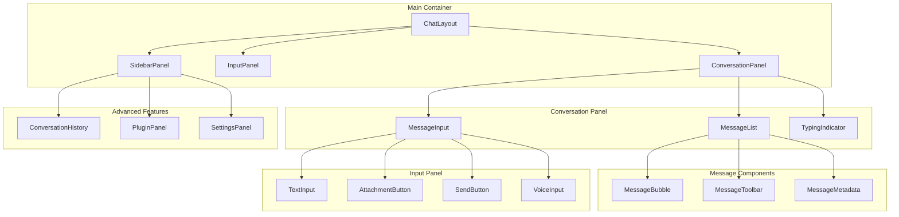

# Chapter 2: Chat Interface Implementation

> Building responsive, modern chat interfaces with advanced interaction patterns

## 🎯 Learning Objectives

By the end of this chapter, you'll understand:
- Modern chat UI component architecture
- Message rendering and conversation flow
- Input handling and user interaction patterns
- Responsive design and accessibility considerations
- Performance optimization for large conversation histories

## 💬 Chat Interface Architecture

### **Component Hierarchy**

LobeChat's chat interface follows a modular component architecture:



### **Core Components**

```typescript
// Main chat layout component
const ChatLayout: React.FC<ChatLayoutProps> = ({
  conversation,
  onSendMessage,
  onEditMessage,
  onDeleteMessage,
  plugins,
  settings
}) => {
  const [sidebarOpen, setSidebarOpen] = useState(false);
  const [inputValue, setInputValue] = useState('');
  const [isTyping, setIsTyping] = useState(false);

  return (
    <div className="chat-layout">
      <SidebarPanel
        isOpen={sidebarOpen}
        conversation={conversation}
        plugins={plugins}
        settings={settings}
        onClose={() => setSidebarOpen(false)}
      />

      <div className="chat-main">
        <ConversationPanel
          conversation={conversation}
          onEditMessage={onEditMessage}
          onDeleteMessage={onDeleteMessage}
          isTyping={isTyping}
        />

        <InputPanel
          value={inputValue}
          onChange={setInputValue}
          onSend={(message) => {
            onSendMessage(message);
            setInputValue('');
          }}
          onToggleSidebar={() => setSidebarOpen(!sidebarOpen)}
          disabled={isTyping}
        />
      </div>
    </div>
  );
};
```

## 💭 Message Rendering System

### **Message Component Architecture**

```typescript
// Message bubble component
interface MessageBubbleProps {
  message: Message;
  isStreaming?: boolean;
  onEdit?: (messageId: string, newContent: string) => void;
  onDelete?: (messageId: string) => void;
  onCopy?: (content: string) => void;
  onRegenerate?: (messageId: string) => void;
}

const MessageBubble: React.FC<MessageBubbleProps> = ({
  message,
  isStreaming = false,
  onEdit,
  onDelete,
  onCopy,
  onRegenerate
}) => {
  const [isEditing, setIsEditing] = useState(false);
  const [editContent, setEditContent] = useState(message.content);
  const [showToolbar, setShowToolbar] = useState(false);

  const isUser = message.role === 'user';
  const isAssistant = message.role === 'assistant';

  const handleEdit = () => {
    if (onEdit) {
      onEdit(message.id, editContent);
    }
    setIsEditing(false);
  };

  const handleCopy = () => {
    navigator.clipboard.writeText(message.content);
    if (onCopy) onCopy(message.content);
  };

  return (
    <div
      className={`message-bubble ${isUser ? 'user' : 'assistant'} ${isStreaming ? 'streaming' : ''}`}
      onMouseEnter={() => setShowToolbar(true)}
      onMouseLeave={() => setShowToolbar(false)}
    >
      <div className="message-header">
        <span className="message-role">
          {isUser ? 'You' : 'Assistant'}
        </span>
        <span className="message-timestamp">
          {formatTimestamp(message.timestamp)}
        </span>
      </div>

      <div className="message-content">
        {isEditing ? (
          <MessageEditor
            content={editContent}
            onChange={setEditContent}
            onSave={handleEdit}
            onCancel={() => {
              setEditContent(message.content);
              setIsEditing(false);
            }}
          />
        ) : (
          <MessageContentRenderer
            content={message.content}
            isStreaming={isStreaming}
            metadata={message.metadata}
          />
        )}
      </div>

      {showToolbar && (
        <MessageToolbar
          message={message}
          onEdit={() => setIsEditing(true)}
          onDelete={() => onDelete?.(message.id)}
          onCopy={handleCopy}
          onRegenerate={() => onRegenerate?.(message.id)}
          canEdit={isUser}
          canRegenerate={isAssistant}
        />
      )}

      <MessageMetadata
        message={message}
        isVisible={showToolbar}
      />
    </div>
  );
};
```

### **Advanced Message Rendering**

```typescript
// Rich message content renderer
interface MessageContentRendererProps {
  content: string;
  isStreaming?: boolean;
  metadata?: MessageMetadata;
}

const MessageContentRenderer: React.FC<MessageContentRendererProps> = ({
  content,
  isStreaming = false,
  metadata
}) => {
  const [displayedContent, setDisplayedContent] = useState(
    isStreaming ? '' : content
  );

  // Handle streaming content
  useEffect(() => {
    if (isStreaming && content !== displayedContent) {
      const timer = setTimeout(() => {
        setDisplayedContent(content);
      }, 10); // Small delay for smooth streaming

      return () => clearTimeout(timer);
    }
  }, [content, displayedContent, isStreaming]);

  // Process content for rendering
  const processedContent = useMemo(() => {
    return processMessageContent(displayedContent, metadata);
  }, [displayedContent, metadata]);

  return (
    <div className="message-content-renderer">
      {processedContent.map((block, index) => (
        <MessageBlockRenderer
          key={index}
          block={block}
          isStreaming={isStreaming && index === processedContent.length - 1}
        />
      ))}

      {isStreaming && <StreamingCursor />}
    </div>
  );
};

// Process message content into renderable blocks
function processMessageContent(content: string, metadata?: MessageMetadata): MessageBlock[] {
  const blocks: MessageBlock[] = [];

  // Split by code blocks, links, etc.
  const parts = parseContentParts(content);

  for (const part of parts) {
    switch (part.type) {
      case 'text':
        blocks.push({
          type: 'text',
          content: part.content,
          formatting: detectTextFormatting(part.content)
        });
        break;

      case 'code':
        blocks.push({
          type: 'code',
          content: part.content,
          language: part.language,
          highlighted: highlightCode(part.content, part.language)
        });
        break;

      case 'link':
        blocks.push({
          type: 'link',
          url: part.url,
          text: part.text
        });
        break;

      case 'image':
        blocks.push({
          type: 'image',
          url: part.url,
          alt: part.alt,
          caption: part.caption
        });
        break;

      case 'table':
        blocks.push({
          type: 'table',
          data: parseTableData(part.content)
        });
        break;
    }
  }

  return blocks;
}
```

## ⌨️ Input Handling System

### **Advanced Input Component**

```typescript
// Enhanced chat input component
interface ChatInputProps {
  value: string;
  onChange: (value: string) => void;
  onSend: (message: string) => void;
  onAttachment?: (files: File[]) => void;
  placeholder?: string;
  disabled?: boolean;
  maxLength?: number;
  autoResize?: boolean;
}

const ChatInput: React.FC<ChatInputProps> = ({
  value,
  onChange,
  onSend,
  onAttachment,
  placeholder = "Type a message...",
  disabled = false,
  maxLength = 4000,
  autoResize = true
}) => {
  const textareaRef = useRef<HTMLTextAreaElement>(null);
  const [isComposing, setIsComposing] = useState(false);
  const [attachments, setAttachments] = useState<File[]>([]);

  // Auto-resize textarea
  useEffect(() => {
    if (autoResize && textareaRef.current) {
      textareaRef.current.style.height = 'auto';
      textareaRef.current.style.height = `${textareaRef.current.scrollHeight}px`;
    }
  }, [value, autoResize]);

  // Keyboard shortcuts
  const handleKeyDown = (e: KeyboardEvent<HTMLTextAreaElement>) => {
    if (e.key === 'Enter') {
      if (e.shiftKey) {
        // Shift+Enter for new line
        return;
      } else if (!e.ctrlKey && !e.metaKey) {
        // Enter to send
        e.preventDefault();
        handleSend();
      }
    }

    // Ctrl/Cmd + Enter to send
    if ((e.ctrlKey || e.metaKey) && e.key === 'Enter') {
      e.preventDefault();
      handleSend();
    }
  };

  const handleSend = () => {
    if (disabled || isComposing) return;

    const message = value.trim();
    if (!message && attachments.length === 0) return;

    onSend(message);

    // Reset input
    onChange('');
    setAttachments([]);

    // Reset textarea height
    if (textareaRef.current) {
      textareaRef.current.style.height = 'auto';
    }
  };

  const handleAttachment = (files: File[]) => {
    setAttachments(prev => [...prev, ...files]);
    if (onAttachment) {
      onAttachment(files);
    }
  };

  const handlePaste = (e: ClipboardEvent<HTMLTextAreaElement>) => {
    const items = e.clipboardData?.items;
    if (!items) return;

    const files: File[] = [];
    for (let i = 0; i < items.length; i++) {
      const item = items[i];
      if (item.kind === 'file') {
        const file = item.getAsFile();
        if (file) files.push(file);
      }
    }

    if (files.length > 0) {
      e.preventDefault();
      handleAttachment(files);
    }
  };

  return (
    <div className="chat-input-container">
      {/* Attachment preview */}
      {attachments.length > 0 && (
        <AttachmentPreview
          files={attachments}
          onRemove={(index) => {
            setAttachments(prev => prev.filter((_, i) => i !== index));
          }}
        />
      )}

      <div className="input-wrapper">
        <textarea
          ref={textareaRef}
          value={value}
          onChange={(e) => onChange(e.target.value)}
          onKeyDown={handleKeyDown}
          onPaste={handlePaste}
          onCompositionStart={() => setIsComposing(true)}
          onCompositionEnd={() => setIsComposing(false)}
          placeholder={placeholder}
          disabled={disabled}
          maxLength={maxLength}
          rows={1}
          className="chat-textarea"
        />

        <div className="input-actions">
          {/* Attachment button */}
          <AttachmentButton
            onSelect={handleAttachment}
            disabled={disabled}
          />

          {/* Send button */}
          <SendButton
            onClick={handleSend}
            disabled={disabled || (!value.trim() && attachments.length === 0)}
          />
        </div>
      </div>

      {/* Character counter */}
      {value.length > maxLength * 0.8 && (
        <div className="character-counter">
          {value.length}/{maxLength}
        </div>
      )}
    </div>
  );
};
```

### **Attachment Handling**

```typescript
// File attachment component
interface AttachmentButtonProps {
  onSelect: (files: File[]) => void;
  disabled?: boolean;
  accept?: string;
  maxFiles?: number;
  maxSize?: number; // in MB
}

const AttachmentButton: React.FC<AttachmentButtonProps> = ({
  onSelect,
  disabled = false,
  accept = "image/*,text/*,.pdf,.doc,.docx",
  maxFiles = 5,
  maxSize = 10
}) => {
  const fileInputRef = useRef<HTMLInputElement>(null);

  const handleClick = () => {
    fileInputRef.current?.click();
  };

  const handleFileSelect = (e: ChangeEvent<HTMLInputElement>) => {
    const files = Array.from(e.target.files || []);

    // Validate file count
    if (files.length > maxFiles) {
      alert(`Maximum ${maxFiles} files allowed`);
      return;
    }

    // Validate file sizes
    const oversizedFiles = files.filter(file => file.size > maxSize * 1024 * 1024);
    if (oversizedFiles.length > 0) {
      alert(`Files must be smaller than ${maxSize}MB`);
      return;
    }

    onSelect(files);

    // Reset input
    if (fileInputRef.current) {
      fileInputRef.current.value = '';
    }
  };

  return (
    <>
      <button
        type="button"
        onClick={handleClick}
        disabled={disabled}
        className="attachment-button"
        title="Attach files"
      >
        <PaperclipIcon />
      </button>

      <input
        ref={fileInputRef}
        type="file"
        multiple
        accept={accept}
        onChange={handleFileSelect}
        style={{ display: 'none' }}
      />
    </>
  );
};

// Attachment preview component
interface AttachmentPreviewProps {
  files: File[];
  onRemove: (index: number) => void;
}

const AttachmentPreview: React.FC<AttachmentPreviewProps> = ({
  files,
  onRemove
}) => {
  return (
    <div className="attachment-preview">
      {files.map((file, index) => (
        <div key={index} className="attachment-item">
          <div className="attachment-info">
            <FileIcon type={file.type} />
            <span className="filename">{file.name}</span>
            <span className="filesize">
              ({formatFileSize(file.size)})
            </span>
          </div>

          <button
            type="button"
            onClick={() => onRemove(index)}
            className="remove-attachment"
          >
            <XIcon />
          </button>
        </div>
      ))}
    </div>
  );
};
```

## 🎨 Responsive Design and Accessibility

### **Responsive Layout System**

```scss
// Responsive chat layout
.chat-layout {
  display: flex;
  height: 100vh;
  background: var(--bg-color);

  @media (max-width: 768px) {
    flex-direction: column;
  }
}

.chat-sidebar {
  width: 300px;
  border-right: 1px solid var(--border-color);
  background: var(--sidebar-bg);

  @media (max-width: 768px) {
    width: 100%;
    height: auto;
    max-height: 200px;
    border-right: none;
    border-bottom: 1px solid var(--border-color);
  }
}

.chat-main {
  flex: 1;
  display: flex;
  flex-direction: column;
  min-width: 0; // Prevent flex item from overflowing
}

.conversation-panel {
  flex: 1;
  overflow-y: auto;
  padding: 1rem;

  // Smooth scrolling
  scroll-behavior: smooth;

  // Hide scrollbar on webkit browsers
  &::-webkit-scrollbar {
    width: 6px;
  }

  &::-webkit-scrollbar-track {
    background: transparent;
  }

  &::-webkit-scrollbar-thumb {
    background: var(--scrollbar-color);
    border-radius: 3px;
  }
}

.input-panel {
  border-top: 1px solid var(--border-color);
  background: var(--input-bg);
  padding: 1rem;

  .input-wrapper {
    display: flex;
    align-items: flex-end;
    gap: 0.5rem;
  }

  .chat-textarea {
    flex: 1;
    min-height: 44px;
    max-height: 200px;
    padding: 0.75rem;
    border: 1px solid var(--input-border);
    border-radius: 8px;
    resize: none;
    font-family: inherit;
    font-size: 14px;
    line-height: 1.4;

    &:focus {
      outline: none;
      border-color: var(--primary-color);
      box-shadow: 0 0 0 2px rgba(var(--primary-rgb), 0.2);
    }

    &::placeholder {
      color: var(--text-muted);
    }

    &:disabled {
      background: var(--input-disabled-bg);
      cursor: not-allowed;
    }
  }

  .input-actions {
    display: flex;
    align-items: center;
    gap: 0.25rem;
  }
}

// Mobile-specific styles
@media (max-width: 768px) {
  .conversation-panel {
    padding: 0.75rem;
  }

  .input-panel {
    padding: 0.75rem;

    .chat-textarea {
      font-size: 16px; // Prevent zoom on iOS
    }
  }

  .message-bubble {
    margin-bottom: 0.75rem;

    &.user-message {
      margin-left: 1rem;
    }

    &.assistant-message {
      margin-right: 1rem;
    }
  }
}
```

### **Accessibility Features**

```typescript
// Accessibility enhancements
const ChatAccessibility = {
  // Focus management
  manageFocus: (element: HTMLElement) => {
    element.focus();
    element.setAttribute('tabindex', '-1');
  },

  // Screen reader announcements
  announceMessage: (message: Message) => {
    const announcement = `${message.role === 'user' ? 'You' : 'Assistant'} said: ${message.content}`;
    const ariaLive = document.getElementById('aria-live-region');

    if (ariaLive) {
      ariaLive.textContent = announcement;
    }
  },

  // Keyboard navigation
  keyboardNavigation: (messages: Message[], currentIndex: number, direction: 'up' | 'down') => {
    const newIndex = direction === 'up'
      ? Math.max(0, currentIndex - 1)
      : Math.min(messages.length - 1, currentIndex + 1);

    return newIndex;
  },

  // High contrast mode detection
  isHighContrast: () => {
    return window.matchMedia('(prefers-contrast: high)').matches;
  },

  // Reduced motion preference
  prefersReducedMotion: () => {
    return window.matchMedia('(prefers-reduced-motion: reduced)').matches;
  }
};

// Accessible message component
const AccessibleMessageBubble: React.FC<MessageBubbleProps> = (props) => {
  const messageRef = useRef<HTMLDivElement>(null);

  useEffect(() => {
    // Announce new messages for screen readers
    if (props.message.role === 'assistant') {
      ChatAccessibility.announceMessage(props.message);
    }
  }, [props.message]);

  const handleKeyDown = (e: KeyboardEvent) => {
    if (e.key === 'ArrowUp' || e.key === 'ArrowDown') {
      e.preventDefault();
      // Handle message navigation
      const direction = e.key === 'ArrowUp' ? 'up' : 'down';
      // Implement navigation logic
    }

    if (e.key === 'Enter' || e.key === ' ') {
      e.preventDefault();
      // Handle message selection/action
    }
  };

  return (
    <div
      ref={messageRef}
      className="message-bubble"
      role="article"
      aria-label={`Message from ${props.message.role}`}
      tabIndex={0}
      onKeyDown={handleKeyDown}
    >
      {/* Message content */}
      <MessageContentRenderer {...props} />

      {/* Screen reader only metadata */}
      <div className="sr-only">
        Sent at {props.message.timestamp.toLocaleTimeString()}
        {props.message.metadata?.tokens && `, ${props.message.metadata.tokens} tokens`}
      </div>
    </div>
  );
};
```

## ⚡ Performance Optimization

### **Virtual Scrolling for Large Conversations**

```typescript
// Virtual scrolling implementation
interface VirtualScrollProps {
  items: Message[];
  itemHeight: number;
  containerHeight: number;
  renderItem: (item: Message, index: number) => React.ReactNode;
  overscan?: number;
}

const VirtualScroll: React.FC<VirtualScrollProps> = ({
  items,
  itemHeight,
  containerHeight,
  renderItem,
  overscan = 5
}) => {
  const [scrollTop, setScrollTop] = useState(0);
  const scrollElementRef = useRef<HTMLDivElement>(null);

  const totalHeight = items.length * itemHeight;
  const visibleRange = useMemo(() => {
    const start = Math.floor(scrollTop / itemHeight);
    const end = Math.min(
      items.length - 1,
      Math.ceil((scrollTop + containerHeight) / itemHeight)
    );

    return {
      start: Math.max(0, start - overscan),
      end: Math.min(items.length - 1, end + overscan)
    };
  }, [scrollTop, itemHeight, containerHeight, items.length, overscan]);

  const visibleItems = useMemo(() => {
    return items.slice(visibleRange.start, visibleRange.end + 1);
  }, [items, visibleRange]);

  const offsetY = visibleRange.start * itemHeight;

  const handleScroll = (e: React.UIEvent<HTMLDivElement>) => {
    setScrollTop(e.currentTarget.scrollTop);
  };

  return (
    <div
      ref={scrollElementRef}
      style={{ height: containerHeight, overflow: 'auto' }}
      onScroll={handleScroll}
    >
      <div style={{ height: totalHeight, position: 'relative' }}>
        <div style={{ transform: `translateY(${offsetY}px)` }}>
          {visibleItems.map((item, index) => (
            <div key={item.id} style={{ height: itemHeight }}>
              {renderItem(item, visibleRange.start + index)}
            </div>
          ))}
        </div>
      </div>
    </div>
  );
};
```

### **Message Caching and Memoization**

```typescript
// Message rendering optimization
const MemoizedMessageBubble = React.memo(MessageBubble, (prevProps, nextProps) => {
  // Custom comparison function
  return (
    prevProps.message.id === nextProps.message.id &&
    prevProps.message.content === nextProps.message.content &&
    prevProps.isStreaming === nextProps.isStreaming &&
    prevProps.message.timestamp.getTime() === nextProps.message.timestamp.getTime()
  );
});

// Content processing memoization
const useProcessedContent = (content: string, metadata?: MessageMetadata) => {
  return useMemo(() => {
    return processMessageContent(content, metadata);
  }, [content, metadata]);
};

// Component with optimized re-rendering
const OptimizedMessageList: React.FC<MessageListProps> = ({ messages, ...props }) => {
  const containerRef = useRef<HTMLDivElement>(null);
  const [visibleRange, setVisibleRange] = useState({ start: 0, end: 50 });

  // Calculate visible range based on scroll position
  const updateVisibleRange = useCallback(() => {
    if (!containerRef.current) return;

    const container = containerRef.current;
    const scrollTop = container.scrollTop;
    const containerHeight = container.clientHeight;
    const itemHeight = 100; // Approximate message height

    const start = Math.floor(scrollTop / itemHeight);
    const end = Math.ceil((scrollTop + containerHeight) / itemHeight);

    setVisibleRange({ start: Math.max(0, start - 5), end: end + 5 });
  }, []);

  useEffect(() => {
    const container = containerRef.current;
    if (container) {
      container.addEventListener('scroll', updateVisibleRange);
      updateVisibleRange(); // Initial calculation

      return () => container.removeEventListener('scroll', updateVisibleRange);
    }
  }, [updateVisibleRange]);

  const visibleMessages = useMemo(() => {
    return messages.slice(visibleRange.start, visibleRange.end + 1);
  }, [messages, visibleRange]);

  return (
    <div ref={containerRef} className="message-list">
      {visibleMessages.map((message, index) => (
        <MemoizedMessageBubble
          key={message.id}
          message={message}
          style={{
            position: 'absolute',
            top: (visibleRange.start + index) * 100,
            width: '100%'
          }}
          {...props}
        />
      ))}
    </div>
  );
};
```

## 🧪 Hands-On Exercise

**Estimated Time: 60 minutes**

1. **Build a Message Component**: Create a complete message bubble with toolbar and metadata
2. **Implement Chat Input**: Build an input component with attachments, keyboard shortcuts, and validation
3. **Add Virtual Scrolling**: Implement efficient rendering for large message lists
4. **Accessibility Features**: Add ARIA labels, keyboard navigation, and screen reader support
5. **Performance Testing**: Compare rendering performance with and without optimizations

---

**Ready for streaming architecture?** Continue to [Chapter 3: Streaming Architecture](03-streaming-architecture.md)