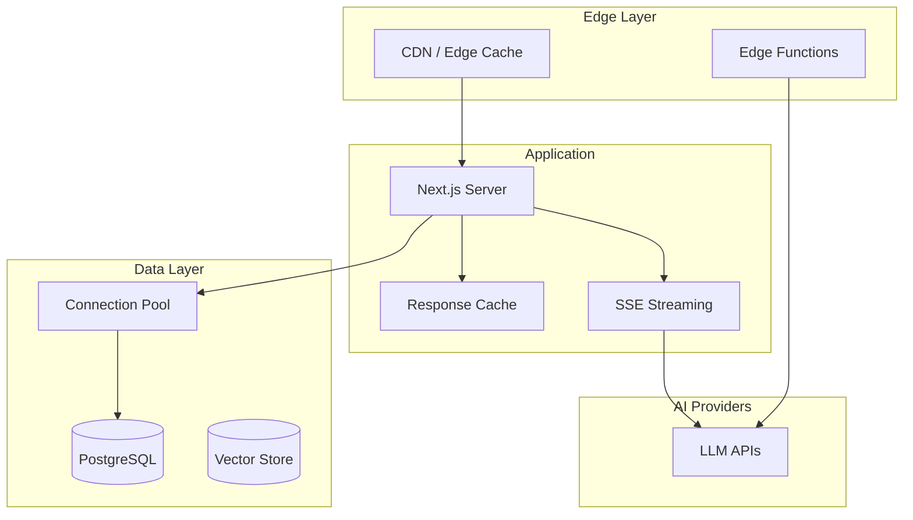

# Chapter 8: Scaling & Performance

> Optimizing LobeChat for production with caching, database tuning, edge deployment, and load testing

## 🎯 Learning Objectives

By the end of this chapter, you'll understand:
- Next.js performance optimization strategies
- Database tuning with Drizzle ORM
- Edge and serverless deployment patterns
- Caching strategies for AI responses
- Load testing and capacity planning
- CDN and asset optimization

## Performance Architecture



## Next.js Optimization

### Static and Dynamic Rendering

```typescript
// Static page (cached at build time)
// app/page.tsx
export const revalidate = 3600; // Revalidate every hour

export default async function HomePage() {
  const agents = await getPublicAgents();
  return <AgentGallery agents={agents} />;
}

// Dynamic API route (no caching)
// app/api/chat/route.ts
export const dynamic = "force-dynamic";

export async function POST(req: Request) {
  // Streaming response — can't be cached
  return streamingChatResponse(req);
}
```

### Bundle Optimization

```typescript
// next.config.js
const nextConfig = {
  // Enable output file tracing for smaller Docker images
  output: "standalone",

  // Optimize imports
  modularizeImports: {
    "@lobehub/ui": {
      transform: "@lobehub/ui/es/{{member}}",
    },
    "lodash-es": {
      transform: "lodash-es/{{member}}",
    },
  },

  // Image optimization
  images: {
    formats: ["image/avif", "image/webp"],
    minimumCacheTTL: 86400,
  },

  // Webpack optimization
  webpack: (config) => {
    config.optimization = {
      ...config.optimization,
      splitChunks: {
        chunks: "all",
        cacheGroups: {
          vendor: {
            test: /[\\/]node_modules[\\/]/,
            name: "vendors",
            chunks: "all",
          },
        },
      },
    };
    return config;
  },
};
```

### React Performance Patterns

```typescript
// Memoize expensive components
const MessageList = memo<{ messages: ChatMessage[] }>(({ messages }) => {
  return (
    <VirtualList
      data={messages}
      itemHeight={80}
      renderItem={(message) => (
        <ChatBubble key={message.id} message={message} />
      )}
    />
  );
});

// Use React.lazy for code splitting
const PluginPanel = lazy(() => import("./PluginPanel"));
const SettingsModal = lazy(() => import("./SettingsModal"));
const KnowledgeBase = lazy(() => import("./KnowledgeBase"));

// Virtualized lists for long conversations
import { Virtuoso } from "react-virtuoso";

const ConversationView: React.FC = () => {
  const messages = useChatStore((s) => s.messages);

  return (
    <Virtuoso
      data={messages}
      itemContent={(index, message) => (
        <ChatBubble message={message} />
      )}
      followOutput="smooth"
      initialTopMostItemIndex={messages.length - 1}
    />
  );
};
```

## Database Tuning

### Drizzle ORM Configuration

```typescript
// drizzle.config.ts
import { defineConfig } from "drizzle-kit";

export default defineConfig({
  schema: "./src/database/schema.ts",
  driver: "pg",
  dbCredentials: {
    connectionString: process.env.DATABASE_URL!,
  },
});
```

### Connection Pooling

```typescript
import { drizzle } from "drizzle-orm/node-postgres";
import { Pool } from "pg";

const pool = new Pool({
  connectionString: process.env.DATABASE_URL,
  max: 20,                // Maximum connections
  idleTimeoutMillis: 30000,
  connectionTimeoutMillis: 5000,
});

export const db = drizzle(pool);
```

### Query Optimization

```typescript
// Efficient message retrieval with pagination
async function getMessages(
  sessionId: string,
  cursor?: string,
  limit = 50
) {
  const query = db
    .select()
    .from(messages)
    .where(eq(messages.sessionId, sessionId))
    .orderBy(desc(messages.createdAt))
    .limit(limit);

  if (cursor) {
    query.where(lt(messages.createdAt, new Date(cursor)));
  }

  return query;
}

// Batch insert for knowledge base ingestion
async function batchInsertKnowledge(
  chunks: KnowledgeChunk[]
) {
  const batchSize = 100;

  for (let i = 0; i < chunks.length; i += batchSize) {
    const batch = chunks.slice(i, i + batchSize);
    await db.insert(knowledge).values(batch);
  }
}

// Indexes for common queries
// In migration:
await db.execute(sql`
  CREATE INDEX idx_messages_session_time
    ON messages (session_id, created_at DESC);

  CREATE INDEX idx_knowledge_embedding
    ON knowledge USING ivfflat (embedding vector_cosine_ops)
    WITH (lists = 100);
`);
```

## Caching Strategies

### Response Caching

```typescript
// Cache AI responses for identical prompts
class ResponseCache {
  private cache: Map<string, CachedResponse> = new Map();
  private maxSize: number;
  private ttlMs: number;

  constructor(maxSize = 1000, ttlMs = 3600000) {
    this.maxSize = maxSize;
    this.ttlMs = ttlMs;
  }

  get(key: string): string | null {
    const entry = this.cache.get(key);
    if (!entry) return null;
    if (Date.now() > entry.expiresAt) {
      this.cache.delete(key);
      return null;
    }
    return entry.response;
  }

  set(key: string, response: string) {
    // Evict oldest if at capacity
    if (this.cache.size >= this.maxSize) {
      const oldest = this.cache.keys().next().value;
      this.cache.delete(oldest);
    }

    this.cache.set(key, {
      response,
      expiresAt: Date.now() + this.ttlMs,
    });
  }

  generateKey(messages: ChatMessage[], model: string): string {
    const content = messages.map(m => m.content).join("|");
    return createHash("sha256")
      .update(`${model}:${content}`)
      .digest("hex");
  }
}
```

### Static Asset Caching

```typescript
// next.config.js — Cache headers
const nextConfig = {
  async headers() {
    return [
      {
        source: "/_next/static/:path*",
        headers: [
          {
            key: "Cache-Control",
            value: "public, max-age=31536000, immutable",
          },
        ],
      },
      {
        source: "/api/:path*",
        headers: [
          {
            key: "Cache-Control",
            value: "no-store, must-revalidate",
          },
        ],
      },
    ];
  },
};
```

## Edge Deployment

### Vercel Edge Functions

```typescript
// app/api/chat/route.ts
export const runtime = "edge";

export async function POST(req: Request) {
  const { messages, model } = await req.json();

  // Edge function — runs close to the user
  const response = await fetch("https://api.openai.com/v1/chat/completions", {
    method: "POST",
    headers: {
      "Authorization": `Bearer ${process.env.OPENAI_API_KEY}`,
      "Content-Type": "application/json",
    },
    body: JSON.stringify({
      model,
      messages,
      stream: true,
    }),
  });

  // Stream the response directly from the edge
  return new Response(response.body, {
    headers: {
      "Content-Type": "text/event-stream",
      "Cache-Control": "no-cache",
    },
  });
}
```

### Multi-Region Docker Deployment

```yaml
# docker-compose.prod.yml
version: "3.8"

services:
  app:
    image: lobechat:latest
    deploy:
      replicas: 3
      resources:
        limits:
          memory: 2G
          cpus: "1.0"
    environment:
      - DATABASE_URL=${DATABASE_URL}
      - NODE_ENV=production
    healthcheck:
      test: ["CMD", "curl", "-f", "http://localhost:3000/api/health"]
      interval: 30s
      timeout: 10s
      retries: 3

  nginx:
    image: nginx:alpine
    ports:
      - "443:443"
    volumes:
      - ./nginx.conf:/etc/nginx/nginx.conf:ro
    depends_on:
      - app
```

### Nginx Load Balancer Configuration

```nginx
upstream lobechat {
    least_conn;
    server app:3000;
}

server {
    listen 443 ssl http2;
    server_name chat.example.com;

    ssl_certificate /etc/nginx/ssl/cert.pem;
    ssl_certificate_key /etc/nginx/ssl/key.pem;

    # Gzip compression
    gzip on;
    gzip_types text/plain application/json text/css application/javascript;
    gzip_min_length 1000;

    # Static assets
    location /_next/static {
        proxy_pass http://lobechat;
        add_header Cache-Control "public, max-age=31536000, immutable";
    }

    # SSE streaming — disable buffering
    location /api/chat {
        proxy_pass http://lobechat;
        proxy_http_version 1.1;
        proxy_set_header Connection "";
        proxy_buffering off;
        proxy_cache off;
    }

    # All other requests
    location / {
        proxy_pass http://lobechat;
        proxy_set_header Host $host;
        proxy_set_header X-Real-IP $remote_addr;
    }
}
```

## Load Testing

### k6 Load Test Script

```javascript
// loadtest.js
import http from "k6/http";
import { check, sleep } from "k6";

export const options = {
  stages: [
    { duration: "1m", target: 10 },   // Ramp up
    { duration: "5m", target: 50 },   // Sustained load
    { duration: "1m", target: 100 },  // Peak
    { duration: "2m", target: 0 },    // Ramp down
  ],
  thresholds: {
    http_req_duration: ["p(95)<3000"],  // 95th percentile < 3s
    http_req_failed: ["rate<0.01"],      // Error rate < 1%
  },
};

export default function () {
  // Test chat completion endpoint
  const payload = JSON.stringify({
    messages: [{ role: "user", content: "Hello, how are you?" }],
    model: "gpt-4o-mini",
    stream: false,
  });

  const res = http.post("https://chat.example.com/api/chat", payload, {
    headers: { "Content-Type": "application/json" },
  });

  check(res, {
    "status is 200": (r) => r.status === 200,
    "response time < 3s": (r) => r.timings.duration < 3000,
  });

  sleep(1);
}
```

```bash
# Run load test
k6 run loadtest.js
```

## Monitoring

### Application Metrics

```typescript
// Middleware for request metrics
export function metricsMiddleware(req: Request, next: () => Response) {
  const start = performance.now();

  const response = next();

  const duration = performance.now() - start;
  const path = new URL(req.url).pathname;

  // Track metrics
  metrics.histogram("http_request_duration_ms", duration, { path });
  metrics.counter("http_requests_total", 1, {
    path,
    status: response.status.toString(),
  });

  return response;
}
```

## Capacity Planning

| Users | Concurrent Chats | Server | Database | Estimated Cost |
|-------|-------------------|--------|----------|----------------|
| 1-10 | 5 | Vercel Hobby | PGLite (embedded) | Free |
| 10-100 | 25 | Vercel Pro | Supabase Free | $20/mo |
| 100-1K | 100 | 2 vCPU / 4GB | PostgreSQL 2GB | $50-100/mo |
| 1K-10K | 500 | 4 vCPU / 8GB | PostgreSQL 8GB | $200-500/mo |
| 10K+ | 2000+ | Load balanced | PostgreSQL cluster | $1000+/mo |

## Summary

| Concept | Key Takeaway |
|---------|-------------|
| **Next.js Optimization** | Static rendering, bundle splitting, modularized imports |
| **React Performance** | Memoization, virtualized lists, lazy loading |
| **Database** | Connection pooling, query indexes, batch operations |
| **Caching** | Response cache for identical prompts; CDN for static assets |
| **Edge Deployment** | Vercel Edge Functions for low-latency streaming |
| **Load Balancing** | Nginx upstream with SSE proxy buffering disabled |
| **Load Testing** | k6 scripts with p95 latency and error rate thresholds |
| **Monitoring** | Request duration histograms and counter metrics |

---

This concludes the LobeChat AI Platform Deep Dive tutorial. You now have a comprehensive understanding of the framework — from system architecture and chat interface through streaming, AI integration, plugins, customization, and production scaling.

---

*Built with insights from the [LobeChat repository](https://github.com/lobehub/lobe-chat) and community documentation.*
