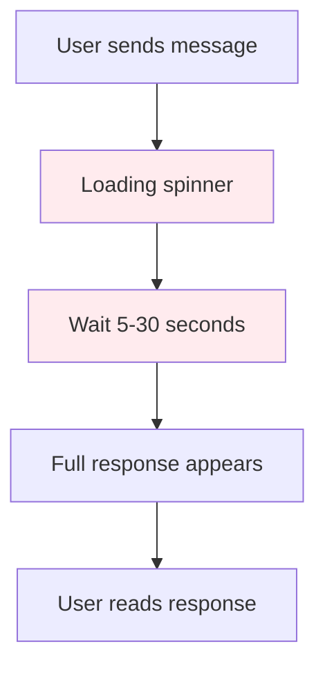
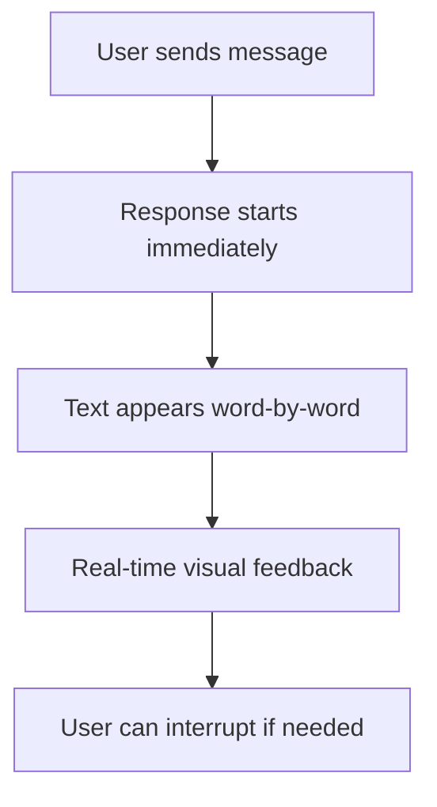

# Chapter 3: Streaming Architecture

> Real-time AI response processing and display systems

## 🎯 Learning Objectives

By the end of this chapter, you'll understand:
- Streaming response architecture and protocols
- Real-time data handling and state management
- Connection management and error recovery
- Performance optimization for streaming interfaces
- Cross-platform streaming implementation

## 🌊 Streaming Fundamentals

### **Why Streaming Matters**

Traditional request-response patterns create poor user experiences for AI chat:



**Streaming dramatically improves the experience:**



### **Streaming Protocols**

LobeChat supports multiple streaming protocols:

```typescript
// Streaming protocol abstraction
interface StreamingProtocol {
  name: string;
  supportsServerSentEvents: boolean;
  supportsWebSockets: boolean;
  supportsHTTPStreaming: boolean;

  createConnection(config: ConnectionConfig): StreamingConnection;
}

interface StreamingConnection {
  connect(): Promise<void>;
  disconnect(): Promise<void>;
  send(data: any): Promise<void>;
  onMessage(callback: (data: StreamingChunk) => void): void;
  onError(callback: (error: Error) => void): void;
  onClose(callback: () => void): void;
}

// Server-Sent Events (SSE) implementation
class SSEConnection implements StreamingConnection {
  private eventSource: EventSource | null = null;
  private messageCallback?: (data: StreamingChunk) => void;
  private errorCallback?: (error: Error) => void;
  private closeCallback?: () => void;

  async connect(): Promise<void> {
    return new Promise((resolve, reject) => {
      try {
        this.eventSource = new EventSource('/api/chat/stream');

        this.eventSource.onopen = () => resolve();
        this.eventSource.onerror = (error) => reject(error);

        this.eventSource.onmessage = (event) => {
          const data = JSON.parse(event.data);
          if (this.messageCallback) {
            this.messageCallback(data);
          }
        };

      } catch (error) {
        reject(error);
      }
    });
  }

  async disconnect(): Promise<void> {
    if (this.eventSource) {
      this.eventSource.close();
      this.eventSource = null;
    }
  }

  async send(data: any): Promise<void> {
    // SSE is receive-only, send via separate HTTP request
    await fetch('/api/chat/start', {
      method: 'POST',
      headers: { 'Content-Type': 'application/json' },
      body: JSON.stringify(data)
    });
  }

  onMessage(callback: (data: StreamingChunk) => void): void {
    this.messageCallback = callback;
  }

  onError(callback: (error: Error) => void): void {
    this.errorCallback = callback;
    if (this.eventSource) {
      this.eventSource.onerror = (event) => {
        if (this.errorCallback) {
          this.errorCallback(new Error('SSE connection error'));
        }
      };
    }
  }

  onClose(callback: () => void): void {
    this.closeCallback = callback;
  }
}
```

## ⚡ Real-Time State Management

### **Streaming Message State**

```typescript
// Streaming message state management
interface StreamingMessage {
  id: string;
  role: 'user' | 'assistant';
  content: string;
  chunks: StreamingChunk[];
  isStreaming: boolean;
  isComplete: boolean;
  startedAt: Date;
  completedAt?: Date;
  metadata: MessageMetadata;
}

interface StreamingChunk {
  id: string;
  content: string;
  timestamp: Date;
  isFirst: boolean;
  isLast: boolean;
  metadata?: {
    tokens?: number;
    finishReason?: string;
    model?: string;
  };
}

// Streaming state manager
class StreamingStateManager {
  private messages: Map<string, StreamingMessage> = new Map();
  private activeStreams: Set<string> = new Set();

  createStreamingMessage(
    id: string,
    role: 'user' | 'assistant',
    initialContent: string = ''
  ): StreamingMessage {
    const message: StreamingMessage = {
      id,
      role,
      content: initialContent,
      chunks: [],
      isStreaming: false,
      isComplete: false,
      startedAt: new Date(),
      metadata: {}
    };

    this.messages.set(id, message);
    return message;
  }

  startStreaming(messageId: string): void {
    const message = this.messages.get(messageId);
    if (message) {
      message.isStreaming = true;
      this.activeStreams.add(messageId);
    }
  }

  addChunk(messageId: string, chunk: StreamingChunk): void {
    const message = this.messages.get(messageId);
    if (!message || !message.isStreaming) return;

    // Add chunk to message
    message.chunks.push(chunk);
    message.content += chunk.content;

    // Update metadata
    if (chunk.metadata) {
      message.metadata = { ...message.metadata, ...chunk.metadata };
    }

    // Check if streaming is complete
    if (chunk.isLast) {
      this.completeStreaming(messageId);
    }
  }

  completeStreaming(messageId: string): void {
    const message = this.messages.get(messageId);
    if (!message) return;

    message.isStreaming = false;
    message.isComplete = true;
    message.completedAt = new Date();
    this.activeStreams.delete(messageId);
  }

  cancelStreaming(messageId: string): void {
    const message = this.messages.get(messageId);
    if (!message || !message.isStreaming) return;

    message.isStreaming = false;
    message.metadata.cancelled = true;
    this.activeStreams.delete(messageId);
  }

  getMessage(messageId: string): StreamingMessage | null {
    return this.messages.get(messageId) || null;
  }

  getActiveStreams(): StreamingMessage[] {
    return Array.from(this.activeStreams)
      .map(id => this.messages.get(id))
      .filter(msg => msg !== undefined) as StreamingMessage[];
  }

  cleanupOldMessages(maxAge: number = 24 * 60 * 60 * 1000): void {
    const cutoff = new Date(Date.now() - maxAge);

    for (const [id, message] of this.messages) {
      if (message.completedAt && message.completedAt < cutoff) {
        this.messages.delete(id);
      }
    }
  }
}
```

### **Incremental UI Updates**

```typescript
// React component for streaming messages
interface StreamingMessageDisplayProps {
  message: StreamingMessage;
  onCancel?: () => void;
}

const StreamingMessageDisplay: React.FC<StreamingMessageDisplayProps> = ({
  message,
  onCancel
}) => {
  const [displayedContent, setDisplayedContent] = useState(message.content);
  const [isTyping, setIsTyping] = useState(message.isStreaming);

  // Update displayed content when message changes
  useEffect(() => {
    if (message.content !== displayedContent) {
      // Smooth streaming effect
      const timer = setTimeout(() => {
        setDisplayedContent(message.content);
      }, 10); // Small delay for visual smoothness

      return () => clearTimeout(timer);
    }
  }, [message.content, displayedContent]);

  // Update typing indicator
  useEffect(() => {
    setIsTyping(message.isStreaming);
  }, [message.isStreaming]);

  return (
    <div className="streaming-message">
      <div className="message-content">
        <MessageContentRenderer
          content={displayedContent}
          isStreaming={isTyping}
        />

        {isTyping && <StreamingCursor />}
      </div>

      {message.isStreaming && onCancel && (
        <button
          className="cancel-streaming"
          onClick={onCancel}
          title="Stop generating"
        >
          <StopIcon />
        </button>
      )}

      <MessageMetadata
        message={message}
        showTokens={true}
        showTiming={true}
      />
    </div>
  );
};

// Streaming cursor component
const StreamingCursor: React.FC = () => {
  const [visible, setVisible] = useState(true);

  useEffect(() => {
    const interval = setInterval(() => {
      setVisible(prev => !prev);
    }, 500); // Blink every 500ms

    return () => clearInterval(interval);
  }, []);

  return (
    <span
      className={`streaming-cursor ${visible ? 'visible' : 'hidden'}`}
      aria-hidden="true"
    >
      |
    </span>
  );
};
```

## 🔌 Connection Management

### **Robust Connection Handling**

```typescript
// Connection manager with automatic reconnection
class StreamingConnectionManager {
  private connections: Map<string, StreamingConnection> = new Map();
  private reconnectTimers: Map<string, NodeJS.Timeout> = new Map();
  private maxRetries: number = 5;
  private baseDelay: number = 1000; // 1 second

  async createConnection(
    connectionId: string,
    protocol: StreamingProtocol,
    config: ConnectionConfig
  ): Promise<StreamingConnection> {
    const connection = protocol.createConnection(config);

    // Set up event handlers
    connection.onError((error) => {
      console.error(`Connection ${connectionId} error:`, error);
      this.handleConnectionError(connectionId, connection, error);
    });

    connection.onClose(() => {
      console.log(`Connection ${connectionId} closed`);
      this.handleConnectionClose(connectionId);
    });

    // Attempt initial connection
    await this.connectWithRetry(connectionId, connection);

    this.connections.set(connectionId, connection);
    return connection;
  }

  private async connectWithRetry(
    connectionId: string,
    connection: StreamingConnection,
    retryCount: number = 0
  ): Promise<void> {
    try {
      await connection.connect();
      console.log(`Connection ${connectionId} established`);
    } catch (error) {
      if (retryCount < this.maxRetries) {
        const delay = this.baseDelay * Math.pow(2, retryCount); // Exponential backoff
        console.log(`Retrying connection ${connectionId} in ${delay}ms (attempt ${retryCount + 1})`);

        await new Promise(resolve => setTimeout(resolve, delay));
        await this.connectWithRetry(connectionId, connection, retryCount + 1);
      } else {
        throw new Error(`Failed to establish connection ${connectionId} after ${this.maxRetries} attempts`);
      }
    }
  }

  private handleConnectionError(
    connectionId: string,
    connection: StreamingConnection,
    error: Error
  ): void {
    // Cancel any existing reconnect timer
    const existingTimer = this.reconnectTimers.get(connectionId);
    if (existingTimer) {
      clearTimeout(existingTimer);
    }

    // Schedule reconnection
    const reconnectTimer = setTimeout(async () => {
      console.log(`Attempting to reconnect ${connectionId}`);
      try {
        await connection.connect();
        console.log(`Reconnected ${connectionId} successfully`);
      } catch (reconnectError) {
        console.error(`Reconnection failed for ${connectionId}:`, reconnectError);
        // Will be handled by onError again if still failing
      }
    }, this.baseDelay);

    this.reconnectTimers.set(connectionId, reconnectTimer);
  }

  private handleConnectionClose(connectionId: string): void {
    // Clean up connection
    this.connections.delete(connectionId);

    // Cancel reconnect timer
    const timer = this.reconnectTimers.get(connectionId);
    if (timer) {
      clearTimeout(timer);
      this.reconnectTimers.delete(connectionId);
    }
  }

  async closeConnection(connectionId: string): Promise<void> {
    const connection = this.connections.get(connectionId);
    if (connection) {
      await connection.disconnect();
      this.connections.delete(connectionId);
    }
  }

  async closeAllConnections(): Promise<void> {
    const closePromises = Array.from(this.connections.keys())
      .map(id => this.closeConnection(id));

    await Promise.all(closePromises);
  }

  getConnectionStats(): ConnectionStats {
    return {
      activeConnections: this.connections.size,
      pendingReconnects: this.reconnectTimers.size,
      connectionIds: Array.from(this.connections.keys())
    };
  }
}

interface ConnectionStats {
  activeConnections: number;
  pendingReconnects: number;
  connectionIds: string[];
}
```

### **Load Balancing and Failover**

```typescript
// Load balancer for streaming connections
class StreamingLoadBalancer {
  private providers: StreamingProvider[] = [];
  private healthChecks: Map<string, HealthStatus> = new Map();

  constructor(providers: StreamingProvider[]) {
    this.providers = providers;
    this.startHealthChecks();
  }

  async getHealthyProvider(): Promise<StreamingProvider> {
    const healthyProviders = this.providers.filter(provider =>
      this.isHealthy(provider.id)
    );

    if (healthyProviders.length === 0) {
      throw new Error('No healthy streaming providers available');
    }

    // Simple round-robin selection
    const selectedIndex = this.getNextProviderIndex();
    return healthyProviders[selectedIndex % healthyProviders.length];
  }

  private isHealthy(providerId: string): boolean {
    const status = this.healthChecks.get(providerId);
    return status ? status.healthy : false;
  }

  private startHealthChecks(): void {
    setInterval(async () => {
      for (const provider of this.providers) {
        try {
          const isHealthy = await this.checkProviderHealth(provider);
          this.healthChecks.set(provider.id, {
            healthy: isHealthy,
            lastChecked: new Date(),
            consecutiveFailures: isHealthy ? 0 : (this.healthChecks.get(provider.id)?.consecutiveFailures || 0) + 1
          });
        } catch (error) {
          const currentStatus = this.healthChecks.get(provider.id);
          const consecutiveFailures = (currentStatus?.consecutiveFailures || 0) + 1;

          this.healthChecks.set(provider.id, {
            healthy: false,
            lastChecked: new Date(),
            consecutiveFailures,
            lastError: error.message
          });
        }
      }
    }, 30000); // Check every 30 seconds
  }

  private async checkProviderHealth(provider: StreamingProvider): Promise<boolean> {
    try {
      // Quick health check - attempt a simple connection
      const connection = provider.createConnection({
        timeout: 5000 // 5 second timeout
      });

      await connection.connect();
      await connection.disconnect();
      return true;
    } catch (error) {
      return false;
    }
  }

  private getNextProviderIndex(): number {
    // Round-robin counter (in a real implementation, this would be atomic)
    const current = this.currentIndex || 0;
    this.currentIndex = (current + 1) % this.providers.length;
    return current;
  }

  getHealthStatus(): ProviderHealthStatus[] {
    return this.providers.map(provider => {
      const status = this.healthChecks.get(provider.id);
      return {
        providerId: provider.id,
        name: provider.name,
        healthy: status?.healthy || false,
        lastChecked: status?.lastChecked,
        consecutiveFailures: status?.consecutiveFailures || 0,
        lastError: status?.lastError
      };
    });
  }
}

interface HealthStatus {
  healthy: boolean;
  lastChecked: Date;
  consecutiveFailures: number;
  lastError?: string;
}

interface ProviderHealthStatus {
  providerId: string;
  name: string;
  healthy: boolean;
  lastChecked?: Date;
  consecutiveFailures: number;
  lastError?: string;
}
```

## 📊 Performance Optimization

### **Streaming Buffer Management**

```typescript
// Streaming buffer for smooth rendering
class StreamingBuffer {
  private chunks: StreamingChunk[] = [];
  private maxBufferSize: number = 100;
  private renderInterval: number = 50; // 50ms
  private onChunkReady?: (content: string) => void;

  constructor(options: StreamingBufferOptions = {}) {
    this.maxBufferSize = options.maxBufferSize || 100;
    this.renderInterval = options.renderInterval || 50;
  }

  addChunk(chunk: StreamingChunk): void {
    this.chunks.push(chunk);

    // Trigger rendering if we have accumulated content
    if (this.chunks.length >= 3 || chunk.isLast) {
      this.flushBuffer();
    }
  }

  setOnChunkReady(callback: (content: string) => void): void {
    this.onChunkReady = callback;
  }

  private flushBuffer(): void {
    if (this.chunks.length === 0 || !this.onChunkReady) return;

    const content = this.chunks.map(chunk => chunk.content).join('');
    this.onChunkReady(content);

    // Keep some chunks for context (last few)
    if (this.chunks.length > this.maxBufferSize) {
      this.chunks = this.chunks.slice(-10); // Keep last 10 chunks
    }
  }

  getBufferedContent(): string {
    return this.chunks.map(chunk => chunk.content).join('');
  }

  clear(): void {
    this.chunks = [];
  }

  isComplete(): boolean {
    return this.chunks.length > 0 && this.chunks[this.chunks.length - 1].isLast;
  }
}

interface StreamingBufferOptions {
  maxBufferSize?: number;
  renderInterval?: number;
}

// React hook for streaming content
function useStreamingContent(messageId: string) {
  const [content, setContent] = useState('');
  const [isComplete, setIsComplete] = useState(false);
  const bufferRef = useRef<StreamingBuffer>();

  useEffect(() => {
    const buffer = new StreamingBuffer();
    bufferRef.current = buffer;

    buffer.setOnChunkReady((newContent) => {
      setContent(prev => prev + newContent);
    });

    // Subscribe to streaming events for this message
    const unsubscribe = subscribeToStreaming(messageId, (chunk) => {
      buffer.addChunk(chunk);

      if (chunk.isLast) {
        setIsComplete(true);
      }
    });

    return () => {
      unsubscribe();
      buffer.clear();
    };
  }, [messageId]);

  return { content, isComplete };
}
```

### **Memory Management for Long Streams**

```typescript
// Memory-efficient streaming for long conversations
class StreamingMemoryManager {
  private activeStreams: Map<string, StreamMemory> = new Map();
  private maxMemoryPerStream: number = 50 * 1024 * 1024; // 50MB
  private globalMemoryLimit: number = 500 * 1024 * 1024; // 500MB

  allocateStream(streamId: string): StreamMemory {
    this.checkGlobalMemoryLimit();

    const streamMemory: StreamMemory = {
      id: streamId,
      chunks: [],
      totalSize: 0,
      createdAt: new Date(),
      lastAccessed: new Date()
    };

    this.activeStreams.set(streamId, streamMemory);
    return streamMemory;
  }

  addChunkToStream(streamId: string, chunk: StreamingChunk): void {
    const stream = this.activeStreams.get(streamId);
    if (!stream) return;

    // Estimate chunk size
    const chunkSize = this.estimateChunkSize(chunk);

    // Check stream memory limit
    if (stream.totalSize + chunkSize > this.maxMemoryPerStream) {
      this.compressStreamMemory(stream);
    }

    // Add chunk
    stream.chunks.push(chunk);
    stream.totalSize += chunkSize;
    stream.lastAccessed = new Date();

    // Periodic cleanup of old chunks
    if (stream.chunks.length % 100 === 0) {
      this.cleanupOldChunks(stream);
    }
  }

  getStreamContent(streamId: string): string {
    const stream = this.activeStreams.get(streamId);
    if (!stream) return '';

    stream.lastAccessed = new Date();
    return stream.chunks.map(chunk => chunk.content).join('');
  }

  releaseStream(streamId: string): void {
    this.activeStreams.delete(streamId);
  }

  private checkGlobalMemoryLimit(): void {
    const totalMemory = Array.from(this.activeStreams.values())
      .reduce((sum, stream) => sum + stream.totalSize, 0);

    if (totalMemory > this.globalMemoryLimit) {
      // Evict least recently used streams
      this.evictLRUStreams();
    }
  }

  private evictLRUStreams(): void {
    const sortedStreams = Array.from(this.activeStreams.entries())
      .sort(([, a], [, b]) => a.lastAccessed.getTime() - b.lastAccessed.getTime());

    let freedMemory = 0;
    const targetFreeMemory = this.globalMemoryLimit * 0.2; // Free 20%

    for (const [streamId] of sortedStreams) {
      if (freedMemory >= targetFreeMemory) break;

      const stream = this.activeStreams.get(streamId);
      if (stream) {
        freedMemory += stream.totalSize;
        this.activeStreams.delete(streamId);
      }
    }
  }

  private compressStreamMemory(stream: StreamMemory): void {
    // Compress older chunks to reduce memory usage
    const keepRecent = Math.max(10, Math.floor(stream.chunks.length * 0.8));

    // Combine older chunks into larger chunks
    const oldChunks = stream.chunks.slice(0, -keepRecent);
    const recentChunks = stream.chunks.slice(-keepRecent);

    if (oldChunks.length > 1) {
      const compressedContent = oldChunks.map(c => c.content).join('');
      const compressedChunk: StreamingChunk = {
        id: `compressed-${Date.now()}`,
        content: compressedContent,
        timestamp: oldChunks[0].timestamp,
        isFirst: oldChunks[0].isFirst,
        isLast: false
      };

      stream.chunks = [compressedChunk, ...recentChunks];
    }
  }

  private cleanupOldChunks(stream: StreamMemory): void {
    // Remove chunks that are too old (e.g., more than 1 hour)
    const oneHourAgo = new Date(Date.now() - 60 * 60 * 1000);

    stream.chunks = stream.chunks.filter(chunk =>
      chunk.timestamp > oneHourAgo
    );
  }

  private estimateChunkSize(chunk: StreamingChunk): number {
    // Rough estimation: content + metadata
    return chunk.content.length * 2 + JSON.stringify(chunk.metadata || {}).length;
  }

  getMemoryStats(): MemoryStats {
    const streams = Array.from(this.activeStreams.values());

    return {
      activeStreams: streams.length,
      totalMemoryUsage: streams.reduce((sum, s) => sum + s.totalSize, 0),
      averageMemoryPerStream: streams.length > 0
        ? streams.reduce((sum, s) => sum + s.totalSize, 0) / streams.length
        : 0,
      oldestStream: streams.length > 0
        ? streams.reduce((oldest, current) =>
            current.createdAt < oldest.createdAt ? current : oldest
          ).createdAt
        : null
    };
  }
}

interface StreamMemory {
  id: string;
  chunks: StreamingChunk[];
  totalSize: number;
  createdAt: Date;
  lastAccessed: Date;
}

interface MemoryStats {
  activeStreams: number;
  totalMemoryUsage: number;
  averageMemoryPerStream: number;
  oldestStream: Date | null;
}
```

## 🧪 Hands-On Exercise

**Estimated Time: 60 minutes**

1. **Implement Streaming Connection**: Create a WebSocket-based streaming connection with automatic reconnection
2. **Build Streaming UI**: Implement incremental message display with typing indicators and cancellation
3. **Connection Management**: Add connection pooling and health monitoring for multiple streaming endpoints
4. **Performance Testing**: Compare streaming vs non-streaming response times and memory usage
5. **Error Handling**: Implement fallback mechanisms for streaming failures and network issues

---

**Ready for AI integration?** Continue to [Chapter 4: AI Integration Patterns](04-ai-integration.md)