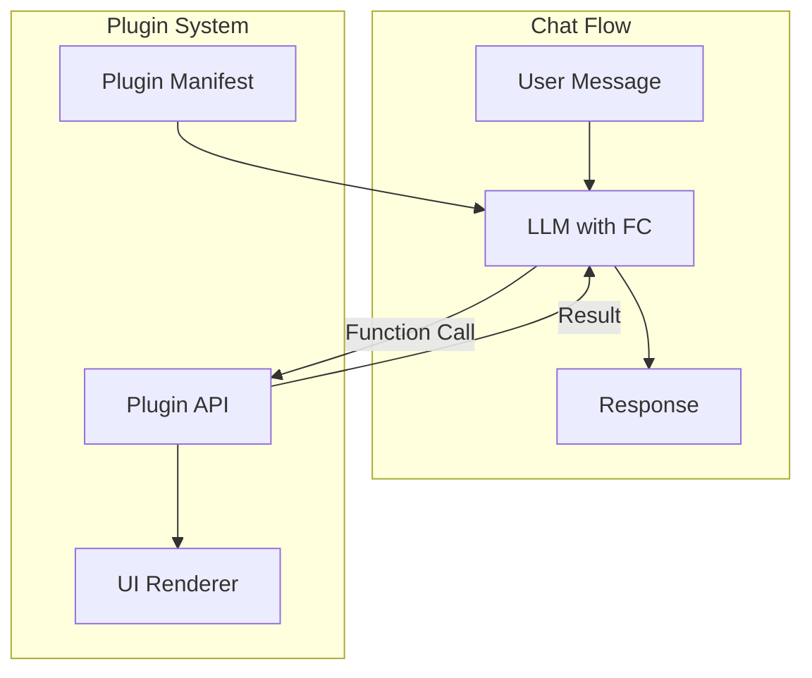

# Chapter 6: Plugin Development

> Building custom plugins to extend LobeChat's capabilities with Function Calling

## 🎯 Learning Objectives

By the end of this chapter, you'll understand:
- LobeChat's plugin architecture and SDK
- Building plugins with Function Calling
- Plugin manifest structure and API design
- Testing and publishing custom plugins
- Integration with external services

## Plugin Architecture Overview

LobeChat uses a Function Calling-based plugin system. Plugins expose API endpoints that the LLM can invoke during conversation, enabling real-time data access and external service integration.



## Plugin Manifest

Every plugin defines a manifest describing its capabilities:

```json
{
  "identifier": "weather-plugin",
  "name": "Weather",
  "description": "Get current weather and forecasts for any location",
  "author": "your-name",
  "version": "1.0.0",
  "homepage": "https://github.com/your-name/weather-plugin",
  "openapi": "https://your-plugin.vercel.app/openapi.json",
  "api": [
    {
      "name": "getWeather",
      "description": "Get current weather for a location",
      "parameters": {
        "type": "object",
        "properties": {
          "location": {
            "type": "string",
            "description": "City name or coordinates"
          },
          "units": {
            "type": "string",
            "enum": ["metric", "imperial"],
            "default": "metric"
          }
        },
        "required": ["location"]
      }
    },
    {
      "name": "getForecast",
      "description": "Get weather forecast for the next 5 days",
      "parameters": {
        "type": "object",
        "properties": {
          "location": {
            "type": "string",
            "description": "City name or coordinates"
          },
          "days": {
            "type": "number",
            "default": 5,
            "maximum": 10
          }
        },
        "required": ["location"]
      }
    }
  ],
  "ui": {
    "url": "https://your-plugin.vercel.app",
    "height": 400
  },
  "settings": {
    "type": "object",
    "properties": {
      "apiKey": {
        "type": "string",
        "title": "API Key",
        "description": "Your weather API key"
      }
    }
  }
}
```

## Building a Plugin

### Project Setup

```bash
# Use the LobeChat plugin template
npx create-lobe-plugin my-plugin
cd my-plugin

# Or scaffold manually
mkdir my-plugin && cd my-plugin
npm init -y
npm install @lobehub/chat-plugin-sdk
```

### Plugin Structure

```
my-plugin/
├── src/
│   ├── api/               # API route handlers
│   │   ├── getWeather.ts
│   │   └── getForecast.ts
│   ├── components/        # UI components (optional)
│   │   └── WeatherCard.tsx
│   └── index.ts           # Plugin entry
├── public/
│   ├── manifest.json      # Plugin manifest
│   └── openapi.json       # OpenAPI specification
├── package.json
└── vercel.json            # Deployment config
```

### API Implementation

```typescript
// src/api/getWeather.ts
import { PluginServerConfig } from "@lobehub/chat-plugin-sdk";

export const config: PluginServerConfig = {
  runtime: "edge",
};

interface WeatherParams {
  location: string;
  units?: "metric" | "imperial";
}

export default async function handler(req: Request) {
  const params: WeatherParams = await req.json();

  // Fetch weather data from external API
  const response = await fetch(
    `https://api.openweathermap.org/data/2.5/weather?` +
    `q=${encodeURIComponent(params.location)}` +
    `&units=${params.units || "metric"}` +
    `&appid=${process.env.WEATHER_API_KEY}`
  );

  const data = await response.json();

  // Return structured data for the LLM
  return Response.json({
    location: data.name,
    country: data.sys?.country,
    temperature: data.main?.temp,
    feels_like: data.main?.feels_like,
    humidity: data.main?.humidity,
    description: data.weather?.[0]?.description,
    wind_speed: data.wind?.speed,
    icon: data.weather?.[0]?.icon,
  });
}
```

### Custom UI Rendering

Plugins can render custom UI in the chat:

```typescript
// src/components/WeatherCard.tsx
import { memo } from "react";

interface WeatherData {
  location: string;
  temperature: number;
  description: string;
  humidity: number;
  icon: string;
}

const WeatherCard = memo<{ data: WeatherData }>(({ data }) => {
  return (
    <div style={{
      padding: "16px",
      borderRadius: "12px",
      background: "linear-gradient(135deg, #667eea 0%, #764ba2 100%)",
      color: "white",
      fontFamily: "system-ui",
    }}>
      <div style={{ fontSize: "18px", fontWeight: 600 }}>
        📍 {data.location}
      </div>
      <div style={{ fontSize: "48px", fontWeight: 700, margin: "8px 0" }}>
        {Math.round(data.temperature)}°
      </div>
      <div style={{ fontSize: "14px", opacity: 0.9 }}>
        {data.description} • Humidity: {data.humidity}%
      </div>
    </div>
  );
});

export default WeatherCard;
```

## Function Calling Integration

LobeChat uses the LLM's Function Calling capability to invoke plugins:

```typescript
// How LobeChat processes plugin calls internally
class PluginExecutor {
  async execute(
    functionCall: FunctionCall,
    pluginManifest: PluginManifest
  ): Promise<FunctionResult> {
    const api = pluginManifest.api.find(
      a => a.name === functionCall.name
    );

    if (!api) {
      throw new Error(`API not found: ${functionCall.name}`);
    }

    // Call the plugin's API endpoint
    const response = await fetch(pluginManifest.openapi, {
      method: "POST",
      headers: { "Content-Type": "application/json" },
      body: JSON.stringify({
        apiName: functionCall.name,
        arguments: JSON.parse(functionCall.arguments),
      }),
    });

    const result = await response.json();

    return {
      name: functionCall.name,
      content: JSON.stringify(result),
    };
  }
}
```

## OpenAPI Specification

Plugins expose an OpenAPI schema for discovery:

```json
{
  "openapi": "3.0.0",
  "info": {
    "title": "Weather Plugin",
    "version": "1.0.0"
  },
  "servers": [
    { "url": "https://your-plugin.vercel.app" }
  ],
  "paths": {
    "/api/getWeather": {
      "post": {
        "operationId": "getWeather",
        "summary": "Get current weather for a location",
        "requestBody": {
          "content": {
            "application/json": {
              "schema": {
                "type": "object",
                "properties": {
                  "location": { "type": "string" },
                  "units": { "type": "string" }
                },
                "required": ["location"]
              }
            }
          }
        },
        "responses": {
          "200": {
            "description": "Weather data",
            "content": {
              "application/json": {
                "schema": {
                  "type": "object",
                  "properties": {
                    "location": { "type": "string" },
                    "temperature": { "type": "number" },
                    "description": { "type": "string" }
                  }
                }
              }
            }
          }
        }
      }
    }
  }
}
```

## Plugin SDK Features

The `@lobehub/chat-plugin-sdk` provides utilities:

```typescript
import {
  createHeadersWithPluginSettings,
  getPluginSettingsFromRequest,
  PluginErrorType,
  createErrorResponse,
} from "@lobehub/chat-plugin-sdk";

// Access plugin settings (API keys, etc.)
export default async function handler(req: Request) {
  const settings = getPluginSettingsFromRequest(req);
  const apiKey = settings?.apiKey;

  if (!apiKey) {
    return createErrorResponse(
      PluginErrorType.PluginSettingsInvalid,
      "API key is required"
    );
  }

  // Use the API key for external service calls
  const result = await fetchExternalService(apiKey);
  return Response.json(result);
}
```

## Testing Plugins

```typescript
// __tests__/getWeather.test.ts
import handler from "../src/api/getWeather";

describe("getWeather", () => {
  it("returns weather data for a valid location", async () => {
    const req = new Request("http://localhost/api/getWeather", {
      method: "POST",
      body: JSON.stringify({ location: "New York" }),
    });

    const response = await handler(req);
    const data = await response.json();

    expect(data).toHaveProperty("location");
    expect(data).toHaveProperty("temperature");
    expect(typeof data.temperature).toBe("number");
  });
});
```

## Deploying Plugins

### Vercel (Recommended)

```json
// vercel.json
{
  "rewrites": [
    { "source": "/api/:path*", "destination": "/api/:path*" }
  ],
  "headers": [
    {
      "source": "/(.*)",
      "headers": [
        { "key": "Access-Control-Allow-Origin", "value": "*" },
        { "key": "Access-Control-Allow-Methods", "value": "GET,POST" }
      ]
    }
  ]
}
```

```bash
# Deploy to Vercel
vercel --prod
```

### Docker

```dockerfile
FROM node:22-alpine
WORKDIR /app
COPY package*.json ./
RUN npm ci --production
COPY . .
RUN npm run build
EXPOSE 3000
CMD ["npm", "start"]
```

## Publishing to the Plugin Index

Submit your plugin to the LobeChat Plugin Index:

```bash
# Fork https://github.com/lobehub/lobe-chat-plugins
# Add your plugin manifest to plugins/your-plugin/manifest.json
# Submit a pull request
```

## Summary

| Concept | Key Takeaway |
|---------|-------------|
| **Plugin Manifest** | JSON definition of capabilities, API endpoints, and UI |
| **Function Calling** | LLM invokes plugin APIs during conversation via FC |
| **API Routes** | Edge-compatible serverless functions for plugin logic |
| **Custom UI** | React components rendered inline in chat messages |
| **OpenAPI** | Standard schema for plugin discovery and validation |
| **SDK** | `@lobehub/chat-plugin-sdk` for settings, errors, headers |
| **Deployment** | Vercel or Docker; plugins are standalone services |

---

**Next Steps**: [Chapter 7: Advanced Customization](07-advanced-customization.md) — Explore LobeChat's theme engine, i18n system, monorepo architecture, and component customization.

---

*Built with insights from the [LobeChat repository](https://github.com/lobehub/lobe-chat) and community documentation.*
