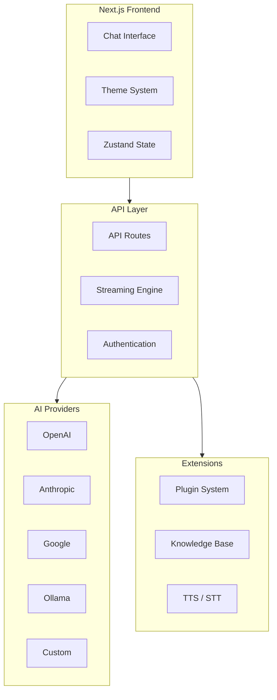

# LobeChat AI Platform: Deep Dive Tutorial

> **Project**: [LobeChat](https://github.com/lobehub/lobe-chat) — An open-source, modern-design AI chat framework for building private LLM applications.

## What Is LobeChat?

LobeChat is an open-source AI chat framework that enables you to build and deploy private LLM applications with multi-agent collaboration, plugin extensibility, and a modern UI. It supports dozens of model providers and offers one-click deployment via Vercel or Docker.

| Feature | Description |
|---------|-------------|
| **Multi-Model** | OpenAI, Claude, Gemini, Ollama, Qwen, Azure, Bedrock, and more |
| **Plugin System** | Function Calling-based plugin architecture for extensibility |
| **Knowledge Base** | File upload, RAG, and knowledge management |
| **Multimodal** | Vision, text-to-speech, speech-to-text support |
| **Themes** | Modern, customizable UI with extensive theming |
| **Deployment** | One-click Vercel, Docker, and cloud-native deployment |

## Architecture Overview

## Tutorial Structure

| Chapter | Topic | What You'll Learn |
|---------|-------|-------------------|
| [1. System Overview](docs/01-system-overview.md) | Architecture | Next.js structure, data flow, core components |
| [2. Chat Interface](docs/02-chat-interface.md) | Frontend | Message rendering, input handling, conversation management |
| [3. Streaming Architecture](docs/03-streaming-architecture.md) | Real-Time | SSE streams, token handling, multi-model streaming |
| [4. AI Integration](docs/04-ai-integration.md) | Providers | Model configuration, provider abstraction, Function Calling |
| [5. Production Deployment](docs/05-production-deployment.md) | Operations | Docker, Vercel, monitoring, CI/CD, security |
| [6. Plugin Development](docs/06-plugin-development.md) | Extensibility | Plugin SDK, Function Calling extensions, custom tools |
| [7. Advanced Customization](docs/07-advanced-customization.md) | Deep Dive | Theme engine, i18n, monorepo architecture, component system |
| [8. Scaling & Performance](docs/08-scaling-performance.md) | Optimization | Caching, database tuning, edge deployment, load testing |

## Tech Stack

| Component | Technology |
|-----------|-----------|
| **Framework** | Next.js (App Router) |
| **Language** | TypeScript |
| **State** | Zustand |
| **Styling** | Ant Design, Tailwind CSS |
| **Database** | Drizzle ORM (PostgreSQL, SQLite) |
| **Auth** | NextAuth.js |
| **Deployment** | Vercel, Docker |

---

Ready to begin? Start with [Chapter 1: System Overview](docs/01-system-overview.md).

---

*Built with insights from the [LobeChat repository](https://github.com/lobehub/lobe-chat) and community documentation.*
