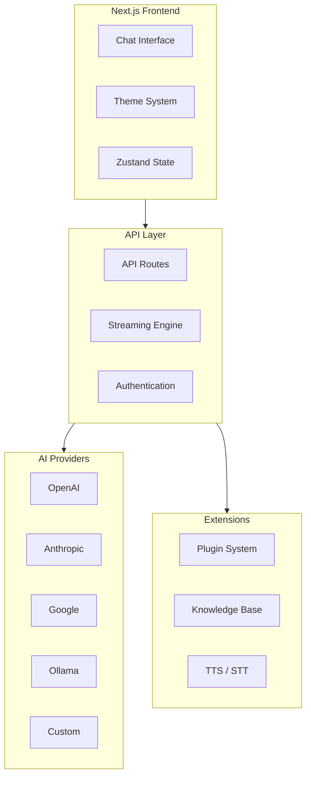

# LobeChat AI Platform: Deep Dive Tutorial

> **Project**: [LobeChat](https://github.com/lobehub/lobe-chat) — An open-source, modern-design AI chat framework for building private LLM applications.

## Why This Track Matters

LobeChat AI Platform is increasingly relevant for developers working with modern AI/ML infrastructure. **Project**: [LobeChat](https://github.com/lobehub/lobe-chat) — An open-source, modern-design AI chat framework for building private LLM applications, and this track helps you understand the architecture, key patterns, and production considerations.

This track focuses on:

- understanding lobechat system overview
- understanding chat interface implementation
- understanding streaming architecture
- understanding ai integration patterns

## What Is LobeChat?

LobeChat is an open-source AI chat framework that enables you to build and deploy private LLM applications with multi-agent collaboration, plugin extensibility, and a modern UI. It supports dozens of model providers and offers one-click deployment via Vercel or Docker.

| Feature | Description |
|---------|-------------|
| **Multi-Model** | OpenAI, Claude, Gemini, Ollama, Qwen, Azure, Bedrock, and more |
| **Plugin System** | Function Calling-based plugin architecture for extensibility |
| **Knowledge Base** | File upload, RAG, and knowledge management |
| **Multimodal** | Vision, text-to-speech, speech-to-text support |
| **Themes** | Modern, customizable UI with extensive theming |
| **Deployment** | One-click Vercel, Docker, and cloud-native deployment |

## Current Snapshot (auto-updated)

- repository: [`lobehub/lobe-chat`](https://github.com/lobehub/lobe-chat)
- stars: about **75.4k**
- latest release: [`v2.1.52`](https://github.com/lobehub/lobe-chat/releases/tag/v2.1.52) (published 2026-04-20)

## Mental Model

## Chapter Guide

| Chapter | Topic | What You'll Learn |
|---------|-------|-------------------|
| [1. System Overview](01-system-overview.md) | Architecture | Next.js structure, data flow, core components |
| [2. Chat Interface](02-chat-interface.md) | Frontend | Message rendering, input handling, conversation management |
| [3. Streaming Architecture](03-streaming-architecture.md) | Real-Time | SSE streams, token handling, multi-model streaming |
| [4. AI Integration](04-ai-integration.md) | Providers | Model configuration, provider abstraction, Function Calling |
| [5. Production Deployment](05-production-deployment.md) | Operations | Docker, Vercel, monitoring, CI/CD, security |
| [6. Plugin Development](06-plugin-development.md) | Extensibility | Plugin SDK, Function Calling extensions, custom tools |
| [7. Advanced Customization](07-advanced-customization.md) | Deep Dive | Theme engine, i18n, monorepo architecture, component system |
| [8. Scaling & Performance](08-scaling-performance.md) | Optimization | Caching, database tuning, edge deployment, load testing |

## Tech Stack

| Component | Technology |
|-----------|-----------|
| **Framework** | Next.js (App Router) |
| **Language** | TypeScript |
| **State** | Zustand |
| **Styling** | Ant Design, Tailwind CSS |
| **Database** | Drizzle ORM (PostgreSQL, SQLite) |
| **Auth** | NextAuth.js |
| **Deployment** | Vercel, Docker |

---

Ready to begin? Start with [Chapter 1: System Overview](01-system-overview.md).

---

*Built with insights from the [LobeChat repository](https://github.com/lobehub/lobe-chat) and community documentation.*

## What You Will Learn

- Core architecture and key abstractions
- Practical patterns for production use
- Integration and extensibility approaches

## Related Tutorials

- [Activepieces Tutorial](../activepieces-tutorial/)
- [BentoML Tutorial](../bentoml-tutorial/)
- [Chatbox Tutorial](../chatbox-tutorial/)
- [ComfyUI Tutorial](../comfyui-tutorial/)
- [CopilotKit Tutorial](../copilotkit-tutorial/)
## Navigation & Backlinks

- [Start Here: Chapter 1: LobeChat System Overview](01-system-overview.md)
- [Back to Main Catalog](../../README.md#-tutorial-catalog)
- [Browse A-Z Tutorial Directory](../../discoverability/tutorial-directory.md)
- [Search by Intent](../../discoverability/query-hub.md)
- [Explore Category Hubs](../../README.md#category-hubs)

## Full Chapter Map

1. [Chapter 1: LobeChat System Overview](01-system-overview.md)
2. [Chapter 2: Chat Interface Implementation](02-chat-interface.md)
3. [Chapter 3: Streaming Architecture](03-streaming-architecture.md)
4. [Chapter 4: AI Integration Patterns](04-ai-integration.md)
5. [Chapter 5: Production Deployment](05-production-deployment.md)
6. [Chapter 6: Plugin Development](06-plugin-development.md)
7. [Chapter 7: Advanced Customization](07-advanced-customization.md)
8. [Chapter 8: Scaling & Performance](08-scaling-performance.md)

## Source References

- [LobeChat](https://github.com/lobehub/lobe-chat)

*Generated by [AI Codebase Knowledge Builder](https://github.com/The-Pocket/Tutorial-Codebase-Knowledge)*
