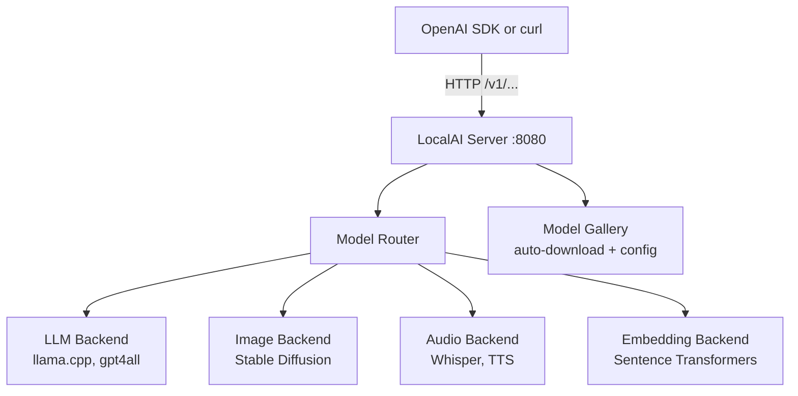

# Chapter 1: Getting Started with LocalAI

Welcome to **Chapter 1: Getting Started with LocalAI**. In this part of **LocalAI Tutorial: Self-Hosted OpenAI Alternative**, you will build an intuitive mental model first, then move into concrete implementation details and practical production tradeoffs.


> Install LocalAI, run your first model, and make your initial API call to the OpenAI-compatible endpoint.

## LocalAI System Architecture



## Overview

LocalAI provides a drop-in replacement for OpenAI's API that runs entirely on your local machine. This chapter covers installation, basic setup, and your first local AI inference.

## Prerequisites

### Hardware Requirements

- **RAM**: Minimum 4GB, recommended 8GB+
- **Storage**: 2GB free space for models
- **CPU**: x64 architecture (ARM64 supported)
- **GPU**: Optional, NVIDIA/AMD GPUs supported

### Software Requirements

- **Docker**: Recommended installation method
- **curl**: For API testing
- **Python**: Optional, for SDK usage

## Installation Methods

### Method 1: Docker (Recommended)

#### CPU Version

```bash
# Pull and run LocalAI CPU image
docker run -p 8080:8080 \
  -v localai-models:/models \
  -e DEBUG=true \
  localai/localai:latest-cpu

# Access at http://localhost:8080
```

#### NVIDIA GPU Version

```bash
# Ensure NVIDIA drivers are installed
nvidia-smi

# Run with GPU support
docker run -p 8080:8080 \
  --gpus all \
  -v localai-models:/models \
  -e DEBUG=true \
  localai/localai:latest-gpu-nvidia-cuda-12
```

#### AMD GPU Version

```bash
# For AMD GPUs
docker run -p 8080:8080 \
  --device /dev/kfd --device /dev/dri \
  -v localai-models:/models \
  localai/localai:latest-gpu-amd-hip
```

### Method 2: Docker Compose

Create `docker-compose.yml`:

```yaml
version: '3.8'
services:
  localai:
    image: localai/localai:latest-cpu  # or gpu version
    ports:
      - "8080:8080"
    volumes:
      - ./models:/models:cached  # Mount local models directory
      - ./config:/config         # Optional config directory
    environment:
      - DEBUG=true
      - THREADS=4                # CPU threads
      - MODELS_PATH=/models      # Models directory
      - GALLERY_MODELS_PATH=/models/gallery
    restart: unless-stopped
    healthcheck:
      test: ["CMD", "curl", "-f", "http://localhost:8080/readyz"]
      interval: 30s
      timeout: 10s
      retries: 3
```

Run with:

```bash
docker-compose up -d
```

### Method 3: From Source (Advanced)

```bash
# Clone repository
git clone https://github.com/mudler/LocalAI
cd LocalAI

# Build with Go
go build -o localai .

# Create models directory
mkdir models

# Run server
./localai --models-path ./models --debug
```

## Health Check

Verify LocalAI is running:

```bash
# Check if service is responding
curl http://localhost:8080/readyz

# Should return: {"status":"ready"}
```

## Installing Your First Model

LocalAI can automatically download models from HuggingFace or use local files.

### Option 1: Using the Model Gallery (Easiest)

```bash
# Install a small, fast model for testing
curl -X POST http://localhost:8080/models/apply \
  -H "Content-Type: application/json" \
  -d '{
    "id": "phi-2",
    "name": "phi-2"
  }'

# Check installation status
curl http://localhost:8080/models/jobs/phi-2
```

### Option 2: Manual Model Download

```bash
# Create models directory
mkdir -p models

# Download a GGUF model (example: Phi-2)
cd models
wget https://huggingface.co/microsoft/phi-2/resolve/main/model-00001-of-00002.safetensors
wget https://huggingface.co/microsoft/phi-2/resolve/main/model-00002-of-00002.safetensors
wget https://huggingface.co/microsoft/phi-2/resolve/main/tokenizer.json
wget https://huggingface.co/microsoft/phi-2/resolve/main/tokenizer_config.json

# Or download a GGUF version
wget https://huggingface.co/TheBloke/phi-2-GGUF/resolve/main/phi-2.Q4_K_M.gguf
```

### Option 3: Using Local Models

If you have existing GGUF models:

```bash
# Copy to models directory
cp /path/to/your/model.gguf ./models/

# Create model configuration
cat > ./models/phi-2.yaml << EOF
name: phi-2
backend: llama
parameters:
  model: phi-2.Q4_K_M.gguf
  temperature: 0.7
  top_p: 0.9
  top_k: 40
EOF
```

## Your First API Call

### Using curl

```bash
# Test chat completion
curl -X POST http://localhost:8080/v1/chat/completions \
  -H "Content-Type: application/json" \
  -d '{
    "model": "phi-2",
    "messages": [
      {
        "role": "user",
        "content": "Hello! Can you tell me a joke?"
      }
    ],
    "temperature": 0.7,
    "max_tokens": 150
  }'
```

### Using Python OpenAI SDK

```python
from openai import OpenAI

# Initialize client pointing to LocalAI
client = OpenAI(
    base_url="http://localhost:8080/v1",
    api_key="not-needed"  # LocalAI doesn't require authentication
)

# Make a chat completion
response = client.chat.completions.create(
    model="phi-2",
    messages=[
        {"role": "system", "content": "You are a helpful AI assistant."},
        {"role": "user", "content": "What is the capital of France?"}
    ],
    temperature=0.7,
    max_tokens=100
)

print("Assistant:", response.choices[0].message.content)
```

### Using JavaScript/Node.js

```javascript
const OpenAI = require('openai');

const client = new OpenAI({
  baseURL: 'http://localhost:8080/v1',
  apiKey: 'not-needed'
});

async function chat() {
  const response = await client.chat.completions.create({
    model: 'phi-2',
    messages: [
      { role: 'user', content: 'Explain quantum computing simply' }
    ],
    temperature: 0.7
  });

  console.log(response.choices[0].message.content);
}

chat();
```

## Testing Different Models

Try various models available in the gallery:

```bash
# Small and fast models
curl -X POST http://localhost:8080/models/apply \
  -H "Content-Type: application/json" \
  -d '{"id": "tinyllama"}'

# Larger models (requires more RAM)
curl -X POST http://localhost:8080/models/apply \
  -H "Content-Type: application/json" \
  -d '{"id": "mistral-7b-instruct"}'
```

## Troubleshooting Common Issues

### Connection Issues

```bash
# Check if LocalAI is running
curl http://localhost:8080/readyz

# Check Docker logs
docker logs localai-container

# Test basic connectivity
curl http://localhost:8080/v1/models
```

### Model Loading Issues

```bash
# Check model directory permissions
ls -la models/

# Check available disk space
df -h

# Verify model file integrity
file models/your-model.gguf

# Check LocalAI logs for errors
docker logs localai-container 2>&1 | grep -i error
```

### Performance Issues

```bash
# Check system resources
top  # CPU usage
free -h  # Memory usage
nvidia-smi  # GPU usage (if applicable)

# Adjust thread count
curl -X POST http://localhost:8080/models/apply \
  -H "Content-Type: application/json" \
  -d '{
    "id": "phi-2",
    "parameters": {
      "threads": 4
    }
  }'
```

### Out of Memory Errors

```bash
# Use smaller models
curl -X POST http://localhost:8080/models/apply \
  -H "Content-Type: application/json" \
  -d '{"id": "phi-2"}'  # Smaller than 7B models

# Reduce context size
curl -X POST http://localhost:8080/v1/chat/completions \
  -H "Content-Type: application/json" \
  -d '{
    "model": "phi-2",
    "messages": [{"role": "user", "content": "Hello"}],
    "max_tokens": 50,
    "context_window": 512
  }'
```

## Monitoring and Logs

### Viewing Logs

```bash
# Docker logs
docker logs -f localai-container

# Follow logs in real-time
docker logs -f localai-container 2>&1 | grep -E "(INFO|ERROR|WARN)"
```

### Performance Monitoring

```bash
# Get system metrics
curl http://localhost:8080/metrics

# Check model status
curl http://localhost:8080/v1/models

# Monitor resource usage
watch -n 1 'ps aux | grep localai'
```

## Configuration File

Create a LocalAI configuration file for advanced settings:

```yaml
# config.yaml
debug: true
threads: 4
models_path: /models
context_size: 2048
f16: false  # Use f32 for compatibility

model_library:
  - url: "https://raw.githubusercontent.com/mudler/LocalAI/master/gallery/index.yaml"
    name: "model-gallery"

preload_models:
  - name: phi-2
    parameters:
      model: phi-2.Q4_K_M.gguf
      temperature: 0.7
      top_p: 0.9
      top_k: 40
```

## Next Steps

Now that you have LocalAI running with your first model, let's explore the model gallery and installation options in the next chapter.

## Example Applications

### Simple Chat Bot

```python
from openai import OpenAI

client = OpenAI(base_url="http://localhost:8080/v1", api_key="dummy")

def chat_with_ai():
    messages = [{"role": "system", "content": "You are a helpful assistant."}]

    while True:
        user_input = input("You: ")
        if user_input.lower() in ['quit', 'exit']:
            break

        messages.append({"role": "user", "content": user_input})

        response = client.chat.completions.create(
            model="phi-2",
            messages=messages,
            max_tokens=150
        )

        ai_response = response.choices[0].message.content
        print(f"AI: {ai_response}")

        messages.append({"role": "assistant", "content": ai_response})

if __name__ == "__main__":
    chat_with_ai()
```

This setup gives you a fully functional local AI server that can replace OpenAI API calls in your applications. The next chapter will show you how to install more models and manage your model collection.

## What Problem Does This Solve?

Most teams struggle here because the hard part is not writing more code, but deciding clear boundaries for `models`, `localai`, `http` so behavior stays predictable as complexity grows.

In practical terms, this chapter helps you avoid three common failures:

- coupling core logic too tightly to one implementation path
- missing the handoff boundaries between setup, execution, and validation
- shipping changes without clear rollback or observability strategy

After working through this chapter, you should be able to reason about `Chapter 1: Getting Started with LocalAI` as an operating subsystem inside **LocalAI Tutorial: Self-Hosted OpenAI Alternative**, with explicit contracts for inputs, state transitions, and outputs.

Use the implementation notes around `localhost`, `model`, `curl` as your checklist when adapting these patterns to your own repository.

## How it Works Under the Hood

Under the hood, `Chapter 1: Getting Started with LocalAI` usually follows a repeatable control path:

1. **Context bootstrap**: initialize runtime config and prerequisites for `models`.
2. **Input normalization**: shape incoming data so `localai` receives stable contracts.
3. **Core execution**: run the main logic branch and propagate intermediate state through `http`.
4. **Policy and safety checks**: enforce limits, auth scopes, and failure boundaries.
5. **Output composition**: return canonical result payloads for downstream consumers.
6. **Operational telemetry**: emit logs/metrics needed for debugging and performance tuning.

When debugging, walk this sequence in order and confirm each stage has explicit success/failure conditions.

## Source Walkthrough

Use the following upstream sources to verify implementation details while reading this chapter:

- [`core/http/app.go`](https://github.com/mudler/LocalAI/blob/master/core/http/app.go)
  Entry point for the LocalAI HTTP server built on Go Fiber. Registers all API routes including `/v1/chat/completions`, `/v1/completions`, `/v1/images/generations`, and health endpoints. This is where OpenAI compatibility is wired in.

- [`core/config/application_config.go`](https://github.com/mudler/LocalAI/blob/master/core/config/application_config.go)
  `ApplicationConfig` struct holding runtime configuration: model directory, address/port, backend concurrency limits, gallery URLs, and feature flags. This is what `--models-path`, `--address`, and environment variables map to.

- [`core/startup/startup.go`](https://github.com/mudler/LocalAI/blob/master/core/startup/startup.go)
  Server initialization sequence: loads application config, initializes backend pools, discovers model files, loads gallery index, and starts the HTTP server. Tracing this file gives a complete picture of the startup process.

- [`Makefile`](https://github.com/mudler/LocalAI/blob/master/Makefile)
  Build targets including `make build`, `make docker`, and backend-specific targets. Shows which C/C++ backends (llama.cpp, whisper, stable-diffusion) are compiled in and what GPU acceleration flags are used.

Suggested trace strategy:
- Start at `core/startup/startup.go` to trace initialization sequence from config loading to HTTP server ready
- Check `core/http/app.go` route registration to confirm which OpenAI API endpoints are supported
- Review `core/config/application_config.go` fields to understand all available environment variable overrides

## Chapter Connections

- [Tutorial Index](README.md)
- [Next Chapter: Chapter 2: Model Gallery and Management](02-models.md)
- [Main Catalog](../../README.md#-tutorial-catalog)
- [A-Z Tutorial Directory](../../discoverability/tutorial-directory.md)
