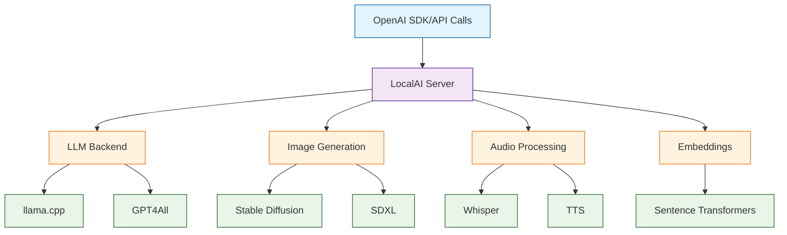

# LocalAI Tutorial: Self-Hosted OpenAI Alternative

> Run LLMs, image generation, and audio models locally with an OpenAI-compatible API.

<div align="center">

**🏠 Your Own AI Infrastructure**

[](https://github.com/mudler/LocalAI)

</div>

---

## 🎯 What is LocalAI?

**LocalAI**<sup>[View Repo](https://github.com/mudler/LocalAI)</sup> is a free, open-source alternative to OpenAI that runs locally. It provides an OpenAI-compatible API for LLMs, image generation, audio transcription, and text-to-speech—all running on consumer hardware.

### Key Features

| Feature | Description |
|:--------|:------------|
| **OpenAI Compatible** | Drop-in replacement for OpenAI API |
| **Multi-Modal** | Text, images, audio, embeddings |
| **No GPU Required** | Runs on CPU (GPU optional) |
| **Model Gallery** | Easy model installation |
| **Docker Ready** | Simple deployment |
| **Privacy** | 100% local, no data leaves |



## Tutorial Chapters

1. **[Chapter 1: Getting Started](01-getting-started.md)** - Installation and first model
2. **[Chapter 2: Model Gallery](02-models.md)** - Installing and managing models
3. **[Chapter 3: Text Generation](03-text-generation.md)** - Chat and completions
4. **[Chapter 4: Image Generation](04-image-generation.md)** - Stable Diffusion locally
5. **[Chapter 5: Audio](05-audio.md)** - Whisper transcription and TTS
6. **[Chapter 6: Embeddings](06-embeddings.md)** - Vector embeddings for RAG
7. **[Chapter 7: Configuration](07-configuration.md)** - Advanced settings and tuning
8. **[Chapter 8: Integrations](08-integration.md)** - Production integrations and optimization

## What You'll Learn

- **Deploy LocalAI** with Docker or from source
- **Install Models** from the gallery
- **Use OpenAI SDK** with local models
- **Generate Images** with Stable Diffusion
- **Transcribe Audio** with Whisper
- **Create Embeddings** for RAG applications
- **Scale for Production** use

## Prerequisites

- Docker (recommended)
- 8GB+ RAM (more for larger models)
- Optional: NVIDIA GPU with CUDA

## Quick Start

### Docker (CPU)

```bash
# Run LocalAI
docker run -p 8080:8080 \
  -v localai-models:/models \
  localai/localai:latest-cpu

# Open http://localhost:8080
```

### Docker (NVIDIA GPU)

```bash
docker run -p 8080:8080 \
  --gpus all \
  -v localai-models:/models \
  localai/localai:latest-gpu-nvidia-cuda-12
```

### Docker Compose

```yaml
version: '3.8'
services:
  localai:
    image: localai/localai:latest-cpu
    ports:
      - "8080:8080"
    volumes:
      - ./models:/models
    environment:
      - DEBUG=true
      - THREADS=4
```

## Install a Model

```bash
# Via API
curl http://localhost:8080/models/apply \
  -H "Content-Type: application/json" \
  -d '{"id": "phi-2"}'

# List available models
curl http://localhost:8080/models/available
```

## Use with OpenAI SDK

```python
from openai import OpenAI

# Point to LocalAI
client = OpenAI(
    base_url="http://localhost:8080/v1",
    api_key="not-needed"  # LocalAI doesn't require API key
)

# Chat completion (same as OpenAI!)
response = client.chat.completions.create(
    model="phi-2",
    messages=[
        {"role": "user", "content": "Hello!"}
    ]
)

print(response.choices[0].message.content)
```

## Image Generation

```python
# Generate image with Stable Diffusion
response = client.images.generate(
    model="stablediffusion",
    prompt="A beautiful sunset over mountains",
    size="512x512"
)

# Save image
import base64
image_data = base64.b64decode(response.data[0].b64_json)
with open("sunset.png", "wb") as f:
    f.write(image_data)
```

## Audio Transcription

```python
# Transcribe with Whisper
with open("audio.mp3", "rb") as f:
    transcript = client.audio.transcriptions.create(
        model="whisper-1",
        file=f
    )

print(transcript.text)
```

## Text-to-Speech

```python
# Generate speech
response = client.audio.speech.create(
    model="tts-1",
    voice="alloy",
    input="Hello, this is LocalAI speaking!"
)

# Save audio
with open("speech.mp3", "wb") as f:
    f.write(response.content)
```

## Embeddings

```python
# Generate embeddings for RAG
response = client.embeddings.create(
    model="text-embedding-ada-002",
    input="Hello, world!"
)

embedding = response.data[0].embedding
print(f"Embedding dimension: {len(embedding)}")
```

## Model Gallery

| Category | Models |
|:---------|:-------|
| **LLM** | Phi-2, LLaMA, Mistral, GPT4All |
| **Image** | Stable Diffusion, SDXL |
| **Audio** | Whisper (all sizes) |
| **TTS** | Piper, Coqui |
| **Embedding** | all-MiniLM, BGE |

## Hardware Requirements

| Model Size | RAM (CPU) | VRAM (GPU) |
|:-----------|:----------|:-----------|
| 3B | 4GB | 4GB |
| 7B | 8GB | 6GB |
| 13B | 16GB | 10GB |
| 70B | 64GB+ | 40GB+ |

## Learning Path

### 🟢 Beginner Track
1. Chapters 1-3: Setup and text generation
2. Run your first local LLM

### 🟡 Intermediate Track
1. Chapters 4-6: Images, audio, and embeddings
2. Build multi-modal applications

### 🔴 Advanced Track
1. Chapters 7-8: Configuration and production
2. Scale local AI infrastructure

---

**Ready to run AI locally? Let's begin with [Chapter 1: Getting Started](01-getting-started.md)!**

*Generated for [Awesome Code Docs](https://github.com/johnxie/awesome-code-docs)*
