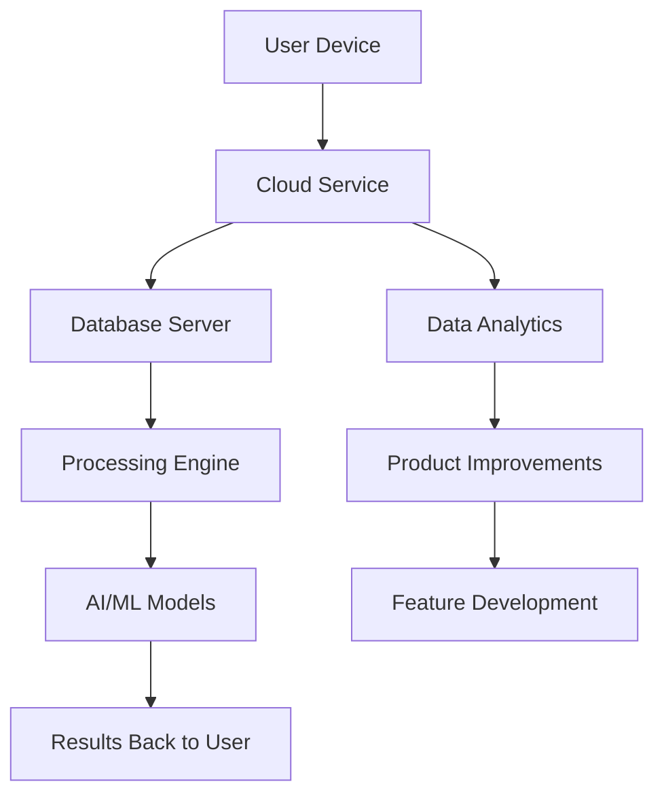
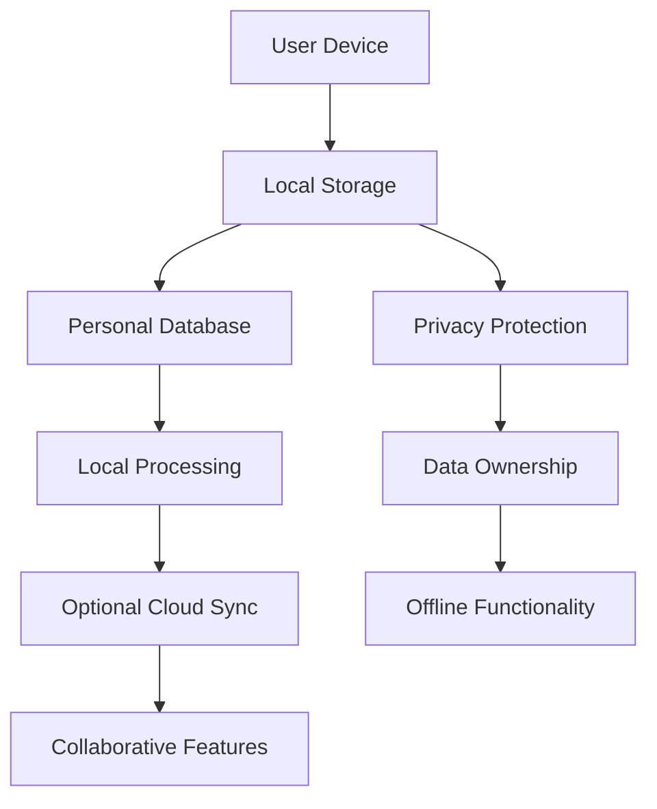

# Chapter 1: Knowledge Management Philosophy

Welcome to **Chapter 1: Knowledge Management Philosophy**. In this part of **Logseq: Deep Dive Tutorial**, you will build an intuitive mental model first, then move into concrete implementation details and practical production tradeoffs.


> Understanding the foundational principles behind Logseq's local-first, privacy-preserving approach to knowledge management

## 🎯 Learning Objectives

By the end of this chapter, you'll understand:
- The core philosophy behind local-first knowledge management
- Key differences between cloud-first and local-first paradigms
- Privacy and data ownership implications
- How Logseq's approach enables better knowledge work

## 🏠 Local-First vs Cloud-First Paradigms

### **The Cloud-First Paradigm**

Most modern knowledge management tools follow a cloud-first approach:



**Cloud-First Characteristics:**
- **Centralized Storage**: Data lives on company servers
- **Always-Connected**: Requires internet for core functionality
- **Vendor Lock-in**: Data format and access controlled by provider
- **Privacy Trade-offs**: User data used for product improvement
- **Scalability Focus**: Designed for millions of users

**Problems with Cloud-First:**
1. **Data Ownership**: Your knowledge belongs to the service provider
2. **Connectivity Dependence**: No internet = no access to your notes
3. **Privacy Erosion**: Knowledge data becomes product training data
4. **Vendor Risk**: Service shutdown or policy changes affect your data
5. **Cost Scaling**: Monthly fees that increase with usage

### **The Local-First Paradigm**

Logseq embraces a fundamentally different approach:



**Local-First Characteristics:**
- **Personal Ownership**: Data stored on user's device
- **Offline-First**: Core functionality works without internet
- **Privacy-by-Design**: No mandatory data sharing
- **User Control**: Complete control over data and features
- **Sustainable**: No vendor dependency for core functionality

## 🔒 Privacy-Preserving Knowledge Management

### **Data Ownership Principles**

```clojure
;; Logseq's data ownership philosophy
(def data-ownership-principles
  {:personal-sovereignty
   "Your knowledge belongs to you, not a corporation"

   :local-storage
   "Data lives on your device, not in the cloud"

   :export-anytime
   "You can always export your data in open formats"

   :no-vendor-lock-in
   "Your data works with any tool, not just ours"

   :privacy-by-default
   "No data collection unless explicitly opted into"})
```

### **Privacy vs Convenience Trade-offs**

| Aspect | Cloud-First | Local-First | Logseq Approach |
|:-------|:------------|:------------|:----------------|
| **Data Access** | Instant from anywhere | Device-dependent | Git sync optional |
| **Collaboration** | Real-time, seamless | Manual sync | Git-based async |
| **Backup** | Automatic | Manual | Git repositories |
| **Privacy** | Company controls data | User controls data | User controls data |
| **Cost** | Subscription | One-time or free | Free core, optional sync |
| **Features** | Rich, AI-powered | Basic, extensible | Core + plugins |

### **Real-World Privacy Implications**

```clojure
;; Privacy comparison scenarios

;; Cloud-first scenario
(defn cloud-scenario []
  {:user-knowledge
   {:personal-notes "Stored on company servers"
    :private-thoughts "Analyzed for product improvement"
    :sensitive-info "Accessible to legal requests"
    :future-access "Depends on company survival"}

   :company-benefits
   {:training-data "User knowledge improves AI"
    :usage-insights "Behavior patterns for features"
    :market-research "Content analysis for products"}})

;; Local-first scenario
(defn local-scenario []
  {:user-knowledge
   {:personal-notes "Stored on personal device"
    :private-thoughts "Never leave user's control"
    :sensitive-info "Protected by user security"
    :future-access "Always accessible"}

   :system-benefits
   {:no-data-collection "Respect user privacy"
    :open-source "Community-driven improvements"
    :extensibility "User controls feature development"}})
```

## 🌳 Block-Based Knowledge Architecture

### **Why Blocks Matter**

Traditional note-taking organizes by pages:

```
📄 Journal Entry - January 1st
├── Line 1: Woke up early
├── Line 2: Had coffee
├── Line 3: Started working on project
└── Line 4: Met with team
```

Logseq organizes by blocks - atomic units of thought:

```clojure
;; Block-based structure
[{:block/uuid #uuid "block-1"
  :block/content "Woke up early"
  :block/page "journal/january-1st"
  :block/order 0}

 {:block/uuid #uuid "block-2"
  :block/content "Had coffee"
  :block/page "journal/january-1st"
  :block/order 1}

 {:block/uuid #uuid "block-3"
  :block/content "Started working on project"
  :block/page "journal/january-1st"
  :block/order 2
  :block/children [#uuid "block-3a" #uuid "block-3b"]}

 {:block/uuid #uuid "block-3a"
  :block/content "Reviewed requirements"
  :block/parent #uuid "block-3"
  :block/order 0}

 {:block/uuid #uuid "block-3b"
  :block/content "Set up development environment"
  :block/parent #uuid "block-3"
  :block/order 1}]
```

### **Block-Level Advantages**

1. **Granular Linking**: Reference any thought, not just pages
2. **Flexible Hierarchy**: Rearrange thoughts without losing connections
3. **Atomic Operations**: Move, copy, or reference individual ideas
4. **Emergent Structure**: Knowledge structures emerge from connections
5. **Context Preservation**: Each block maintains its relationship context

### **Bi-Directional Linking**

Traditional linking is one-way:

```
Page A → Page B (A references B)
```

Block-based linking enables true knowledge graphs:

```
Block X ↔ Block Y ↔ Block Z
Block X → Page M
Block Y → Block X (backlink)
```

## 🔄 Git-Based Synchronization

### **Knowledge as Code**

Logseq treats knowledge management like software development:

```bash
# Knowledge repository structure
my-knowledge/
├── pages/
│   ├── projects/
│   │   ├── project-alpha.md
│   │   └── project-beta.md
│   ├── journal/
│   │   ├── 2024-01-01.md
│   │   └── 2024-01-02.md
│   └── concepts/
│       ├── knowledge-management.md
│       └── productivity.md
├── assets/
│   └── images/
│       └── diagram.png
├── .git/
└── .logseq/
    └── config.edn
```

### **Version Control Benefits**

```clojure
;; Git-based knowledge management advantages
(def git-knowledge-benefits
  {:version-history
   "Every change tracked and revertible"

   :branching
   "Experiment with knowledge structures without risk"

   :merging
   "Combine insights from different thinking sessions"

   :collaboration
   "Share knowledge with proper attribution"

   :backup
   "Distributed backup across multiple locations"

   :portability
   "Works with any Git hosting service"})
```

### **Conflict Resolution**

When knowledge conflicts occur, Git provides structured resolution:

```clojure
;; Conflict resolution example
;; Original content
{:block/uuid #uuid "block-1"
 :block/content "Meeting with team at 3 PM"}

;; Branch A changes
{:block/uuid #uuid "block-1"
 :block/content "Meeting with team at 3 PM - confirmed"}

;; Branch B changes
{:block/uuid #uuid "block-1"
 :block/content "Meeting with team at 3 PM - location: conference room"}

;; Git conflict markers
;; <<<<<<< HEAD
;; Meeting with team at 3 PM - confirmed
;; =======
;; Meeting with team at 3 PM - location: conference room
;; >>>>>>> branch-b

;; Resolved version
{:block/uuid #uuid "block-1"
 :block/content "Meeting with team at 3 PM - confirmed, location: conference room"}
```

## 🎨 User Experience Philosophy

### **Minimalist Interface Design**

Logseq follows a "less is more" approach:

```clojure
;; UI philosophy principles
(def ui-principles
  {:distraction-free
   "Clean interface focused on content creation"

   :keyboard-centric
   "Power users can work entirely from keyboard"

   :progressive-disclosure
   "Advanced features revealed as needed"

   :consistent-patterns
   "Predictable interactions across all features"

   :fast-by-default
   "Instant response for common operations"})
```

### **Progressive Enhancement**

Features are layered by complexity:

```clojure
;; Feature layers
(def feature-layers
  {:core-writing
   {:features ["Block editing" "Page creation" "Basic linking"]
    :audience "All users"
    :complexity "Low"}

   :knowledge-organization
   {:features ["Tags" "Namespaces" "Queries" "Templates"]
    :audience "Regular users"
    :complexity "Medium"}

   :advanced-features
   {:features ["Plugins" "Custom queries" "Graph view" "Whiteboard"]
    :audience "Power users"
    :complexity "High"}

   :developer-features
   {:features ["Custom CSS" "JavaScript plugins" "Database access"]
    :audience "Developers"
    :complexity "Very High"}})
```

## 🌐 Ecosystem and Extensibility

### **Plugin Architecture Philosophy**

```clojure
;; Plugin system principles
(def plugin-principles
  {:user-control
   "Users decide what plugins to install"

   :security-first
   "Plugins run in sandboxed environments"

   :open-ecosystem
   "Anyone can create and share plugins"

   :backward-compatibility
   "Plugins work across Logseq versions"

   :performance-conscious
   "Plugins don't impact core functionality"})
```

### **Community-Driven Development**

Logseq's ecosystem is built by its community:

```clojure
;; Community ecosystem
(def ecosystem-components
  {:core-team
   {:role "Maintain core functionality"
    :contribution "Architecture and critical features"}

   :plugin-developers
   {:role "Extend functionality"
    :contribution "Custom plugins and integrations"}

   :theme-creators
   {:role "Customize appearance"
    :contribution "CSS themes and UI customizations"}

   :template-authors
   {:role "Accelerate workflows"
    :contribution "Reusable templates and workflows"}

   :documentation-contributors
   {:role "Help users learn"
    :contribution "Tutorials, guides, and examples"}})
```

## 🔄 Migration and Adoption

### **Gradual Adoption Strategy**

Logseq enables smooth migration from other tools:

```clojure
;; Migration pathways
(def migration-paths
  {:from-notion
   {:export "Export Notion pages as Markdown"
    :transform "Convert to Logseq format"
    :import "Import into Logseq vault"}

   :from-roam
   {:export "Roam JSON export"
    :transform "Convert block structure"
    :import "Import with block relationships"}

   :from-evernote
   {:export "ENEX format export"
    :transform "Convert to Markdown"
    :import "Import with metadata"}

   :from-obsidian
   {:copy "Copy vault directly"
    :transform "Minimal format changes"
    :import "Immediate compatibility"}})
```

### **Incremental Learning**

Users can start simple and grow complexity:

```clojure
;; Learning progression
(def learning-progression
  {:beginner
   {:focus "Basic writing and linking"
    :features ["Block editing" "Page creation" "[[links]]"]
    :goal "Daily note-taking"}

   :intermediate
   {:focus "Knowledge organization"
    :features ["Tags" "#hashtags" "Queries" "Templates"]
    :goal "Personal knowledge management"}

   :advanced
   {:focus "Knowledge synthesis"
    :features ["Graph view" "Advanced queries" "Whiteboard"]
    :goal "Complex project management"}

   :expert
   {:focus "System customization"
    :features ["Plugins" "Custom CSS" "Database queries"]
    :goal "Tailored knowledge workflow"}})
```

## 🎯 Key Takeaways

1. **Local-First Philosophy**: Data ownership and privacy as fundamental rights
2. **Block-Based Architecture**: Granular knowledge units enable flexible organization
3. **Git-Powered Sync**: Version control principles applied to knowledge management
4. **Privacy-by-Design**: No mandatory data sharing or surveillance
5. **Progressive Enhancement**: Simple core with extensible advanced features
6. **Community Ecosystem**: User-driven development and plugin ecosystem

## 🧪 Hands-On Exercise

**Estimated Time: 45 minutes**

1. **Install Logseq**: Download and set up Logseq on your system
2. **Create First Blocks**: Write some notes using block-based editing
3. **Experiment with Links**: Create `[[page links]]` and see bi-directional references
4. **Explore Graph View**: Visualize your knowledge connections
5. **Try Git Sync**: Set up a Git repository for your knowledge base

---

**Ready to dive into system architecture?** Continue to Chapter 2: System Architecture (planned).

## What Problem Does This Solve?

Most teams struggle here because the hard part is not writing more code, but deciding clear boundaries for `block`, `uuid`, `features` so behavior stays predictable as complexity grows.

In practical terms, this chapter helps you avoid three common failures:

- coupling core logic too tightly to one implementation path
- missing the handoff boundaries between setup, execution, and validation
- shipping changes without clear rollback or observability strategy

After working through this chapter, you should be able to reason about `Chapter 1: Knowledge Management Philosophy` as an operating subsystem inside **Logseq: Deep Dive Tutorial**, with explicit contracts for inputs, state transitions, and outputs.

Use the implementation notes around `knowledge`, `content`, `Block` as your checklist when adapting these patterns to your own repository.

## How it Works Under the Hood

Under the hood, `Chapter 1: Knowledge Management Philosophy` usually follows a repeatable control path:

1. **Context bootstrap**: initialize runtime config and prerequisites for `block`.
2. **Input normalization**: shape incoming data so `uuid` receives stable contracts.
3. **Core execution**: run the main logic branch and propagate intermediate state through `features`.
4. **Policy and safety checks**: enforce limits, auth scopes, and failure boundaries.
5. **Output composition**: return canonical result payloads for downstream consumers.
6. **Operational telemetry**: emit logs/metrics needed for debugging and performance tuning.

When debugging, walk this sequence in order and confirm each stage has explicit success/failure conditions.

## Source Walkthrough

Use the following upstream sources to verify implementation details while reading this chapter:

- [Logseq](https://github.com/logseq/logseq)
  Why it matters: authoritative reference on `Logseq` (github.com).

Suggested trace strategy:
- search upstream code for `block` and `uuid` to map concrete implementation paths
- compare docs claims against actual runtime/config code before reusing patterns in production

## Chapter Connections

- [Tutorial Index](index.md)
- [Next Chapter: Chapter 2: System Architecture](02-system-architecture.md)
- [Main Catalog](../../README.md#-tutorial-catalog)
- [A-Z Tutorial Directory](../../discoverability/tutorial-directory.md)
