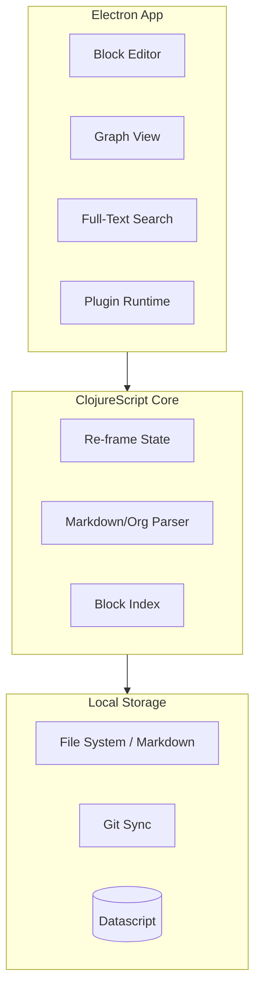

# Logseq: Deep Dive Tutorial

> **Project**: [Logseq](https://github.com/logseq/logseq) — A privacy-first, local-first knowledge management platform with block-based editing and graph visualization.

## What Is Logseq?

Logseq is a local-first, privacy-preserving knowledge management platform built with ClojureScript and Electron. It stores notes as plain Markdown/Org-mode files on your filesystem, provides block-based editing with bi-directional linking, and visualizes your knowledge as an interactive graph.

| Feature | Description |
|---------|-------------|
| **Local-First** | Files stored as plain Markdown on your filesystem |
| **Block-Based** | Atomic content units with outliner-style editing |
| **Bi-Directional Links** | Automatic backlinks and page references |
| **Knowledge Graph** | Interactive D3.js visualization of note connections |
| **Plugin System** | JavaScript plugin API with sandboxed execution |
| **Git Sync** | Built-in Git-based synchronization across devices |

## Architecture Overview

## Tutorial Structure

| Chapter | Topic | What You'll Learn |
|---------|-------|-------------------|
| [1. Knowledge Management Principles](01-knowledge-management-principles.md) | Philosophy | Local-first paradigms, block-based thinking |
| [2. System Architecture](02-system-architecture.md) | Architecture | Desktop/runtime boundaries and data flow |
| [3. Local-First Data](03-local-first-data.md) | Data Model | Filesystem-first storage, indexing, and sync tradeoffs |
| [4. Development Setup](04-development-setup.md) | Setup | ClojureScript + Electron development stack |
| [5. Block Data Model](05-block-data-model.md) | Block Graph | Block identity, hierarchy, and constraints |
| [6. Block Editor](06-block-editor.md) | Editing UX | Command handling and structural edits |
| [7. Bi-Directional Links](07-bidirectional-links.md) | Graph Edges | Reference lifecycle and backlink generation |
| [8. Graph Visualization](08-graph-visualization.md) | Visualization | Graph rendering and large-graph performance |

## Tech Stack

| Component | Technology |
|-----------|-----------|
| **Language** | ClojureScript |
| **UI Framework** | Reagent (React wrapper) |
| **State** | Re-frame |
| **Database** | Datascript (in-memory) |
| **Desktop** | Electron |
| **Graph Viz** | D3.js |
| **File Format** | Markdown, Org-mode |

---

Ready to begin? Start with [Chapter 1: Knowledge Management Principles](01-knowledge-management-principles.md).

---

*Built with insights from the [Logseq repository](https://github.com/logseq/logseq) and community documentation.*

## Navigation & Backlinks

- [Start Here: Chapter 1: Knowledge Management Philosophy](01-knowledge-management-principles.md)
- [Back to Main Catalog](../../README.md#-tutorial-catalog)
- [Browse A-Z Tutorial Directory](../../discoverability/tutorial-directory.md)
- [Search by Intent](../../discoverability/query-hub.md)
- [Explore Category Hubs](../../README.md#category-hubs)

## Full Chapter Map

1. [Chapter 1: Knowledge Management Philosophy](01-knowledge-management-principles.md)
2. [Chapter 2: System Architecture](02-system-architecture.md)
3. [Chapter 3: Local-First Data](03-local-first-data.md)
4. [Logseq Development Environment Setup](04-development-setup.md)
5. [Chapter 5: Block Data Model](05-block-data-model.md)
6. [Chapter 6: Block Editor](06-block-editor.md)
7. [Chapter 7: Bi-Directional Links](07-bidirectional-links.md)
8. [Chapter 8: Graph Visualization](08-graph-visualization.md)

## Source References

- [Logseq](https://github.com/logseq/logseq)

*Generated by [AI Codebase Knowledge Builder](https://github.com/The-Pocket/Tutorial-Codebase-Knowledge)*
