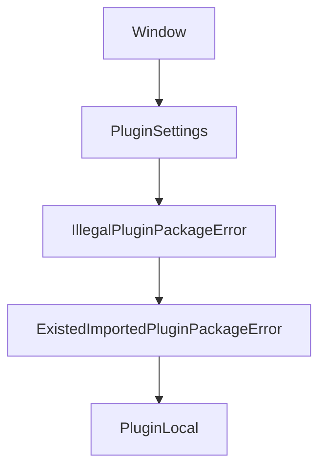

# Chapter 2: System Architecture

Welcome to **Chapter 2: System Architecture**. In this part of **Logseq: Deep Dive Tutorial**, you will build an intuitive mental model first, then move into concrete implementation details and practical production tradeoffs.


This chapter maps Logseq's architecture from desktop runtime to graph-level services.

## Core Architecture Layers

- **Desktop shell**: Electron runtime and native integration boundary
- **Application core**: ClojureScript state, commands, and domain logic
- **Persistence/index**: plain-text files plus in-memory/query index
- **UI layer**: block editor, page views, graph view, search surfaces

## Data Flow Model

```text
user action -> command/event -> state transition -> file sync/index update -> UI re-render
```

## Module Responsibilities

| Module | Responsibility |
|:-------|:---------------|
| parser | convert markdown/org into block structures |
| block graph manager | maintain parent/child and reference edges |
| query engine | execute page/block graph queries |
| plugin bridge | expose extension hooks safely |

## Architectural Tradeoffs

- local-first responsiveness vs cross-device consistency complexity
- plain-text durability vs richer schema constraints
- extensibility power vs plugin isolation/security overhead

## Summary

You can now reason about where Logseq behavior originates and where to debug architectural issues.

Next: [Chapter 3: Local-First Data](03-local-first-data.md)

## What Problem Does This Solve?

Most teams struggle here because the hard part is not writing more code, but deciding clear boundaries for `user`, `action`, `command` so behavior stays predictable as complexity grows.

In practical terms, this chapter helps you avoid three common failures:

- coupling core logic too tightly to one implementation path
- missing the handoff boundaries between setup, execution, and validation
- shipping changes without clear rollback or observability strategy

After working through this chapter, you should be able to reason about `Chapter 2: System Architecture` as an operating subsystem inside **Logseq: Deep Dive Tutorial**, with explicit contracts for inputs, state transitions, and outputs.

Use the implementation notes around `event`, `state`, `transition` as your checklist when adapting these patterns to your own repository.

## How it Works Under the Hood

Under the hood, `Chapter 2: System Architecture` usually follows a repeatable control path:

1. **Context bootstrap**: initialize runtime config and prerequisites for `user`.
2. **Input normalization**: shape incoming data so `action` receives stable contracts.
3. **Core execution**: run the main logic branch and propagate intermediate state through `command`.
4. **Policy and safety checks**: enforce limits, auth scopes, and failure boundaries.
5. **Output composition**: return canonical result payloads for downstream consumers.
6. **Operational telemetry**: emit logs/metrics needed for debugging and performance tuning.

When debugging, walk this sequence in order and confirm each stage has explicit success/failure conditions.

## Source Walkthrough

Use the following upstream sources to verify implementation details while reading this chapter:

- [Logseq](https://github.com/logseq/logseq)
  Why it matters: authoritative reference on `Logseq` (github.com).

Suggested trace strategy:
- search upstream code for `user` and `action` to map concrete implementation paths
- compare docs claims against actual runtime/config code before reusing patterns in production

## Chapter Connections

- [Tutorial Index](README.md)
- [Previous Chapter: Chapter 1: Knowledge Management Philosophy](01-knowledge-management-principles.md)
- [Next Chapter: Chapter 3: Local-First Data](03-local-first-data.md)
- [Main Catalog](../../README.md#-tutorial-catalog)
- [A-Z Tutorial Directory](../../discoverability/tutorial-directory.md)

## Depth Expansion Playbook

## Source Code Walkthrough

### `libs/src/LSPlugin.user.ts`

The `Window` interface in [`libs/src/LSPlugin.user.ts`](https://github.com/logseq/logseq/blob/HEAD/libs/src/LSPlugin.user.ts) handles a key part of this chapter's functionality:

```ts

declare global {
  interface Window {
    __LSP__HOST__: boolean
    logseq: LSPluginUser
  }
}

type callableMethods = keyof typeof callableAPIs | string // host exported SDK apis & host platform related apis

const PROXY_CONTINUE = Symbol.for('proxy-continue')
const debug = Debug('LSPlugin:user')
const logger = new PluginLogger('', { console: true })

/**
 * @param type (key of group commands)
 * @param opts
 * @param action
 */
function registerSimpleCommand(
  this: LSPluginUser,
  type: string,
  opts: {
    key: string
    label: string
    desc?: string
    palette?: boolean
    keybinding?: SimpleCommandKeybinding
    extras?: Record<string, any>
  },
  action: SimpleCommandCallback
) {
```

This interface is important because it defines how Logseq: Deep Dive Tutorial implements the patterns covered in this chapter.

### `libs/src/LSPlugin.core.ts`

The `PluginSettings` class in [`libs/src/LSPlugin.core.ts`](https://github.com/logseq/logseq/blob/HEAD/libs/src/LSPlugin.core.ts) handles a key part of this chapter's functionality:

```ts
 * User settings
 */
class PluginSettings extends EventEmitter<'change' | 'reset'> {
  private _settings: Record<string, any> = {
    disabled: false,
  }

  constructor(
    private readonly _userPluginSettings: any,
    private _schema?: SettingSchemaDesc[]
  ) {
    super()

    Object.assign(this._settings, _userPluginSettings)
  }

  get<T = any>(k: string): T {
    return this._settings[k]
  }

  set(k: string | Record<string, any>, v?: any) {
    const o = deepMerge({}, this._settings)

    if (typeof k === 'string') {
      if (this._settings[k] == v) return
      this._settings[k] = v
    } else if (isObject(k)) {
      this._settings = deepMerge(this._settings, k)
    } else {
      return
    }

```

This class is important because it defines how Logseq: Deep Dive Tutorial implements the patterns covered in this chapter.

### `libs/src/LSPlugin.core.ts`

The `IllegalPluginPackageError` class in [`libs/src/LSPlugin.core.ts`](https://github.com/logseq/logseq/blob/HEAD/libs/src/LSPlugin.core.ts) handles a key part of this chapter's functionality:

```ts
}

class IllegalPluginPackageError extends Error {
  constructor(message: string) {
    super(message)
    this.name = 'IllegalPluginPackageError'
  }
}

class ExistedImportedPluginPackageError extends Error {
  constructor(message: string) {
    super(message)
    this.name = 'ExistedImportedPluginPackageError'
  }
}

/**
 * Host plugin for local
 */
class PluginLocal extends EventEmitter<
  'loaded' | 'unloaded' | 'beforeunload' | 'error' | string
> {
  private _sdk: Partial<PluginLocalSDKMetadata> = {}
  private _disposes: Array<() => Promise<any>> = []
  private _id: PluginLocalIdentity
  private _status: PluginLocalLoadStatus = PluginLocalLoadStatus.UNLOADED
  private _loadErr?: Error
  private _localRoot?: string
  private _dotSettingsFile?: string
  private _caller?: LSPluginCaller
  private _logger?: PluginLogger = new PluginLogger('PluginLocal')

```

This class is important because it defines how Logseq: Deep Dive Tutorial implements the patterns covered in this chapter.

### `libs/src/LSPlugin.core.ts`

The `ExistedImportedPluginPackageError` class in [`libs/src/LSPlugin.core.ts`](https://github.com/logseq/logseq/blob/HEAD/libs/src/LSPlugin.core.ts) handles a key part of this chapter's functionality:

```ts
}

class ExistedImportedPluginPackageError extends Error {
  constructor(message: string) {
    super(message)
    this.name = 'ExistedImportedPluginPackageError'
  }
}

/**
 * Host plugin for local
 */
class PluginLocal extends EventEmitter<
  'loaded' | 'unloaded' | 'beforeunload' | 'error' | string
> {
  private _sdk: Partial<PluginLocalSDKMetadata> = {}
  private _disposes: Array<() => Promise<any>> = []
  private _id: PluginLocalIdentity
  private _status: PluginLocalLoadStatus = PluginLocalLoadStatus.UNLOADED
  private _loadErr?: Error
  private _localRoot?: string
  private _dotSettingsFile?: string
  private _caller?: LSPluginCaller
  private _logger?: PluginLogger = new PluginLogger('PluginLocal')

  /**
   * @param _options
   * @param _themeMgr
   * @param _ctx
   */
  constructor(
    private _options: PluginLocalOptions,
```

This class is important because it defines how Logseq: Deep Dive Tutorial implements the patterns covered in this chapter.


## How These Components Connect


