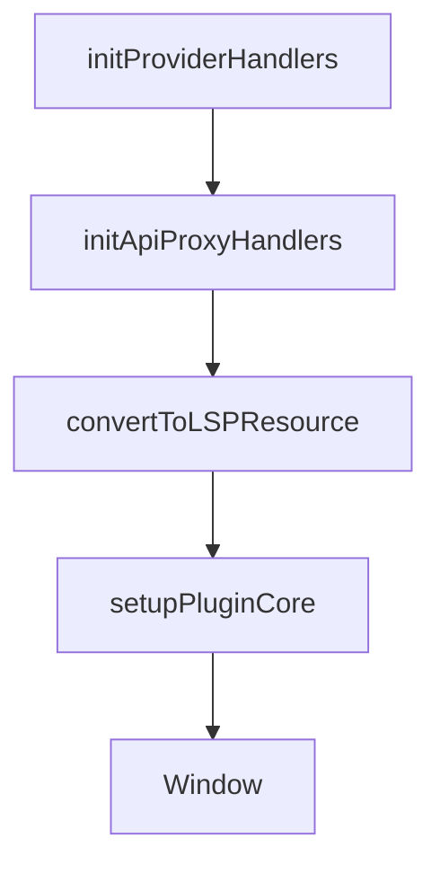

# Chapter 3: Local-First Data

Welcome to **Chapter 3: Local-First Data**. In this part of **Logseq: Deep Dive Tutorial**, you will build an intuitive mental model first, then move into concrete implementation details and practical production tradeoffs.


Logseq's local-first model centers on user-owned files with graph indexing layered on top.

## Storage Principles

- markdown/org files are canonical source of truth
- index/cache layers accelerate queries and backlinks
- core workflows remain usable offline

## Consistency Model

In practice, systems must reconcile:

1. file-system truth
2. in-memory graph state
3. rendered UI state

Robust implementations include deterministic reload/index rebuild paths when state diverges.

## Durability and Recovery

- atomic file writes where possible
- deterministic block IDs for stable references
- index rebuild tools for corruption scenarios
- clear conflict resolution strategy for sync setups

## Local-First Benefits

- data portability and longevity
- lower dependence on hosted services
- predictable offline behavior

## Summary

You can now evaluate local-first tradeoffs and design recovery pathways that protect data integrity.

Next: [Chapter 4: Development Setup](04-development-setup.md)

## What Problem Does This Solve?

Most teams struggle here because the hard part is not writing more code, but deciding clear boundaries for core abstractions in this chapter so behavior stays predictable as complexity grows.

In practical terms, this chapter helps you avoid three common failures:

- coupling core logic too tightly to one implementation path
- missing the handoff boundaries between setup, execution, and validation
- shipping changes without clear rollback or observability strategy

After working through this chapter, you should be able to reason about `Chapter 3: Local-First Data` as an operating subsystem inside **Logseq: Deep Dive Tutorial**, with explicit contracts for inputs, state transitions, and outputs.

Use the implementation notes around execution and reliability details as your checklist when adapting these patterns to your own repository.

## How it Works Under the Hood

Under the hood, `Chapter 3: Local-First Data` usually follows a repeatable control path:

1. **Context bootstrap**: initialize runtime config and prerequisites for `core component`.
2. **Input normalization**: shape incoming data so `execution layer` receives stable contracts.
3. **Core execution**: run the main logic branch and propagate intermediate state through `state model`.
4. **Policy and safety checks**: enforce limits, auth scopes, and failure boundaries.
5. **Output composition**: return canonical result payloads for downstream consumers.
6. **Operational telemetry**: emit logs/metrics needed for debugging and performance tuning.

When debugging, walk this sequence in order and confirm each stage has explicit success/failure conditions.

## Source Walkthrough

Use the following upstream sources to verify implementation details while reading this chapter:

- [Logseq](https://github.com/logseq/logseq)
  Why it matters: authoritative reference on `Logseq` (github.com).

Suggested trace strategy:
- search upstream code for `Local-First` and `Local-First` to map concrete implementation paths
- compare docs claims against actual runtime/config code before reusing patterns in production

## Chapter Connections

- [Tutorial Index](README.md)
- [Previous Chapter: Chapter 2: System Architecture](02-system-architecture.md)
- [Next Chapter: Logseq Development Environment Setup](04-development-setup.md)
- [Main Catalog](../../README.md#-tutorial-catalog)
- [A-Z Tutorial Directory](../../discoverability/tutorial-directory.md)

## Depth Expansion Playbook

## Source Code Walkthrough

### `libs/src/LSPlugin.core.ts`

The `initProviderHandlers` function in [`libs/src/LSPlugin.core.ts`](https://github.com/logseq/logseq/blob/HEAD/libs/src/LSPlugin.core.ts) handles a key part of this chapter's functionality:

```ts
}

function initProviderHandlers(pluginLocal: PluginLocal) {
  const _ = (label: string): any => `provider:${label}`
  let themed = false

  // provider:theme
  pluginLocal.on(_('theme'), (theme: Theme) => {
    pluginLocal.themeMgr.registerTheme(pluginLocal.id, theme)

    if (!themed) {
      pluginLocal._dispose(() => {
        pluginLocal.themeMgr.unregisterTheme(pluginLocal.id)
      })

      themed = true
    }
  })

  // provider:style
  pluginLocal.on(_('style'), (style: StyleString | StyleOptions) => {
    let key: string | undefined

    if (typeof style !== 'string') {
      key = style.key
      style = style.style
    }

    if (!style || !style.trim()) return

    pluginLocal._dispose(
      setupInjectedStyle(style, {
```

This function is important because it defines how Logseq: Deep Dive Tutorial implements the patterns covered in this chapter.

### `libs/src/LSPlugin.core.ts`

The `initApiProxyHandlers` function in [`libs/src/LSPlugin.core.ts`](https://github.com/logseq/logseq/blob/HEAD/libs/src/LSPlugin.core.ts) handles a key part of this chapter's functionality:

```ts
}

function initApiProxyHandlers(pluginLocal: PluginLocal) {
  const _ = (label: string): any => `api:${label}`

  pluginLocal.on(_('call'), async (payload) => {
    let ret: any

    try {
      window.$$callerPluginID = pluginLocal.id
      ret = await invokeHostExportedApi.apply(pluginLocal, [
        payload.method,
        ...payload.args,
      ])
    } catch (e) {
      ret = {
        [LSPMSG_ERROR_TAG]: e,
      }
    } finally {
      window.$$callerPluginID = undefined
    }

    if (pluginLocal.shadow) {
      if (payload.actor) {
        payload.actor.resolve(ret)
      }
      return
    }

    const { _sync } = payload

    if (_sync != null) {
```

This function is important because it defines how Logseq: Deep Dive Tutorial implements the patterns covered in this chapter.

### `libs/src/LSPlugin.core.ts`

The `convertToLSPResource` function in [`libs/src/LSPlugin.core.ts`](https://github.com/logseq/logseq/blob/HEAD/libs/src/LSPlugin.core.ts) handles a key part of this chapter's functionality:

```ts
}

function convertToLSPResource(fullUrl: string, dotPluginRoot: string) {
  if (dotPluginRoot && fullUrl.startsWith(PROTOCOL_FILE + dotPluginRoot)) {
    fullUrl = safetyPathJoin(
      URL_LSP,
      fullUrl.substr(PROTOCOL_FILE.length + dotPluginRoot.length)
    )
  }
  return fullUrl
}

class IllegalPluginPackageError extends Error {
  constructor(message: string) {
    super(message)
    this.name = 'IllegalPluginPackageError'
  }
}

class ExistedImportedPluginPackageError extends Error {
  constructor(message: string) {
    super(message)
    this.name = 'ExistedImportedPluginPackageError'
  }
}

/**
 * Host plugin for local
 */
class PluginLocal extends EventEmitter<
  'loaded' | 'unloaded' | 'beforeunload' | 'error' | string
> {
```

This function is important because it defines how Logseq: Deep Dive Tutorial implements the patterns covered in this chapter.

### `libs/src/LSPlugin.core.ts`

The `setupPluginCore` function in [`libs/src/LSPlugin.core.ts`](https://github.com/logseq/logseq/blob/HEAD/libs/src/LSPlugin.core.ts) handles a key part of this chapter's functionality:

```ts
}

function setupPluginCore(options: any) {
  const pluginCore = new LSPluginCore(options)

  debug('=== 🔗 Setup Logseq Plugin System 🔗 ===')

  window.LSPluginCore = pluginCore
  window.DOMPurify = DOMPurify
}

export { PluginLocal, pluginHelpers, setupPluginCore }

```

This function is important because it defines how Logseq: Deep Dive Tutorial implements the patterns covered in this chapter.


## How These Components Connect


