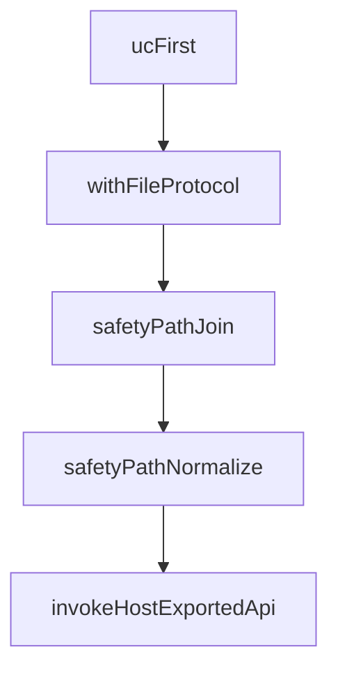

# Chapter 5: Block Data Model

Welcome to **Chapter 5: Block Data Model**. In this part of **Logseq: Deep Dive Tutorial**, you will build an intuitive mental model first, then move into concrete implementation details and practical production tradeoffs.


Blocks are the atomic units of content and graph connectivity in Logseq.

## Block Structure

A robust block model typically includes:

- stable UUID/ID
- textual content
- parent-child ordering metadata
- page association
- references/tags/properties
- creation/update metadata

## Invariants

- hierarchy must remain acyclic
- sibling order must be deterministic
- references should survive text edits and reformatting
- deleted/moved blocks should not leave dangling graph edges

## Mutation Types

1. content edit
2. reorder/reparent
3. reference/property change
4. delete/restore

Each mutation should update both hierarchy and graph indexes consistently.

## Validation Practices

- schema validation before persisting
- invariant checks in development/test mode
- repair routines for broken references

## Summary

You can now map user operations to block-level graph mutations and identify where consistency bugs emerge.

Next: [Chapter 6: Block Editor](06-block-editor.md)

## What Problem Does This Solve?

Most teams struggle here because the hard part is not writing more code, but deciding clear boundaries for core abstractions in this chapter so behavior stays predictable as complexity grows.

In practical terms, this chapter helps you avoid three common failures:

- coupling core logic too tightly to one implementation path
- missing the handoff boundaries between setup, execution, and validation
- shipping changes without clear rollback or observability strategy

After working through this chapter, you should be able to reason about `Chapter 5: Block Data Model` as an operating subsystem inside **Logseq: Deep Dive Tutorial**, with explicit contracts for inputs, state transitions, and outputs.

Use the implementation notes around execution and reliability details as your checklist when adapting these patterns to your own repository.

## How it Works Under the Hood

Under the hood, `Chapter 5: Block Data Model` usually follows a repeatable control path:

1. **Context bootstrap**: initialize runtime config and prerequisites for `core component`.
2. **Input normalization**: shape incoming data so `execution layer` receives stable contracts.
3. **Core execution**: run the main logic branch and propagate intermediate state through `state model`.
4. **Policy and safety checks**: enforce limits, auth scopes, and failure boundaries.
5. **Output composition**: return canonical result payloads for downstream consumers.
6. **Operational telemetry**: emit logs/metrics needed for debugging and performance tuning.

When debugging, walk this sequence in order and confirm each stage has explicit success/failure conditions.

## Source Walkthrough

Use the following upstream sources to verify implementation details while reading this chapter:

- [Logseq](https://github.com/logseq/logseq)
  Why it matters: authoritative reference on `Logseq` (github.com).

Suggested trace strategy:
- search upstream code for `Block` and `Model` to map concrete implementation paths
- compare docs claims against actual runtime/config code before reusing patterns in production

## Chapter Connections

- [Tutorial Index](README.md)
- [Previous Chapter: Logseq Development Environment Setup](04-development-setup.md)
- [Next Chapter: Chapter 6: Block Editor](06-block-editor.md)
- [Main Catalog](../../README.md#-tutorial-catalog)
- [A-Z Tutorial Directory](../../discoverability/tutorial-directory.md)

## Depth Expansion Playbook

## Source Code Walkthrough

### `libs/src/helpers.ts`

The `ucFirst` function in [`libs/src/helpers.ts`](https://github.com/logseq/logseq/blob/HEAD/libs/src/helpers.ts) handles a key part of this chapter's functionality:

```ts
}

export function ucFirst(str: string) {
  return str.charAt(0).toUpperCase() + str.slice(1)
}

export function withFileProtocol(path: string) {
  if (!path) return ''
  const reg = /^(http|file|lsp)/

  if (!reg.test(path)) {
    path = PROTOCOL_FILE + path
  }

  return path
}

export function safetyPathJoin(basePath: string, ...parts: Array<string>) {
  try {
    const url = new URL(basePath)
    if (!url.origin) throw new Error(null)
    const fullPath = path.join(basePath.substr(url.origin.length), ...parts)
    return url.origin + fullPath
  } catch (e) {
    return path.join(basePath, ...parts)
  }
}

export function safetyPathNormalize(basePath: string) {
  if (!basePath?.match(/^(http?|lsp|assets):/)) {
    basePath = path.normalize(basePath)
  }
```

This function is important because it defines how Logseq: Deep Dive Tutorial implements the patterns covered in this chapter.

### `libs/src/helpers.ts`

The `withFileProtocol` function in [`libs/src/helpers.ts`](https://github.com/logseq/logseq/blob/HEAD/libs/src/helpers.ts) handles a key part of this chapter's functionality:

```ts
}

export function withFileProtocol(path: string) {
  if (!path) return ''
  const reg = /^(http|file|lsp)/

  if (!reg.test(path)) {
    path = PROTOCOL_FILE + path
  }

  return path
}

export function safetyPathJoin(basePath: string, ...parts: Array<string>) {
  try {
    const url = new URL(basePath)
    if (!url.origin) throw new Error(null)
    const fullPath = path.join(basePath.substr(url.origin.length), ...parts)
    return url.origin + fullPath
  } catch (e) {
    return path.join(basePath, ...parts)
  }
}

export function safetyPathNormalize(basePath: string) {
  if (!basePath?.match(/^(http?|lsp|assets):/)) {
    basePath = path.normalize(basePath)
  }
  return basePath
}

/**
```

This function is important because it defines how Logseq: Deep Dive Tutorial implements the patterns covered in this chapter.

### `libs/src/helpers.ts`

The `safetyPathJoin` function in [`libs/src/helpers.ts`](https://github.com/logseq/logseq/blob/HEAD/libs/src/helpers.ts) handles a key part of this chapter's functionality:

```ts
  const appPathRoot = await getAppPathRoot()

  return safetyPathJoin(appPathRoot, 'js')
}

export function isObject(item: any) {
  return item === Object(item) && !Array.isArray(item)
}

export function deepMerge<T>(a: Partial<T>, b: Partial<T>): T {
  const overwriteArrayMerge = (destinationArray, sourceArray) => sourceArray
  return merge(a, b, { arrayMerge: overwriteArrayMerge })
}

export class PluginLogger extends EventEmitter<'change'> {
  private _logs: Array<[type: string, payload: any]> = []

  constructor(
    private _tag?: string,
    private _opts?: {
      console: boolean
    }
  ) {
    super()
  }

  write(type: string, payload: any[], inConsole?: boolean) {
    if (payload?.length && true === payload[payload.length - 1]) {
      inConsole = true
      payload.pop()
    }

```

This function is important because it defines how Logseq: Deep Dive Tutorial implements the patterns covered in this chapter.

### `libs/src/helpers.ts`

The `safetyPathNormalize` function in [`libs/src/helpers.ts`](https://github.com/logseq/logseq/blob/HEAD/libs/src/helpers.ts) handles a key part of this chapter's functionality:

```ts
}

export function safetyPathNormalize(basePath: string) {
  if (!basePath?.match(/^(http?|lsp|assets):/)) {
    basePath = path.normalize(basePath)
  }
  return basePath
}

/**
 * @param timeout milliseconds
 * @param tag string
 */
export function deferred<T = any>(timeout?: number, tag?: string) {
  let resolve: any, reject: any
  let settled = false
  const timeFn = (r: Function) => {
    return (v: T) => {
      timeout && clearTimeout(timeout)
      r(v)
      settled = true
    }
  }

  const promise = new Promise<T>((resolve1, reject1) => {
    resolve = timeFn(resolve1)
    reject = timeFn(reject1)

    if (timeout) {
      // @ts-ignore
      timeout = setTimeout(
        () => reject(new Error(`[deferred timeout] ${tag}`)),
```

This function is important because it defines how Logseq: Deep Dive Tutorial implements the patterns covered in this chapter.


## How These Components Connect


